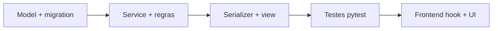

# Food Service — Implementar Sprint

## Antes de codar

1. Ler `docs/09-roadmap.md` — sprint atual e dependências
2. Ler checklist da fase: `12-checklist-mvp.md` (MVP), `13-*`, `14-*`
3. Conferir `docs/00-portas-locais.md` para dev local
4. Seguir `docs/10-padroes-de-codigo.md`

## Mapa de documentos por tarefa

| Tarefa | Documentos |
|--------|------------|
| Model / migration | `03-modelagem-do-banco.md` |
| Service / regra | `08-regras-de-negocio.md`, `06-backend.md` §12 |
| Endpoint | `07-api.md` |
| Tela / fluxo | `11-guia-ui-ux.md`, `04-design-system.md` |
| Frontend feature | `05-frontend.md` |
| Escopo fechado | `12-checklist-mvp.md` (marcar item ao concluir) |

## Ordem de implementação (padrão)

## Regras inegociáveis

- **Multi-tenant:** toda query com `tenant_id`; testar isolamento
- **Dinheiro/status:** validar no **service**, não só no serializer
- **Escopo:** se não está no checklist da fase, não implementar
- **Diff mínimo:** reutilizar `core/`, `shared/`, convenções existentes
- **Portas dev:** API `8001`, storefront `5174`, backoffice `5175`
- **Layout mobile:** checklist em `.cursor/rules/foodservice-frontend-ux.mdc` — obrigatório em layouts e páginas novas
- **Tema por tenant:** cores customizáveis só Sprint 8 (Settings); até lá usar `--primary` — `.cursor/rules/foodservice-theme-by-tenant.mdc`

## Sprint 1 — escopo esperado

Ref: `09-roadmap.md` §6 Sprint 1

**Backend:**
- App `companies`: Company, CompanySettings, BusinessHours
- TenantMiddleware resolvendo subdomínio
- OnboardingService + seed `demo`
- Testes de tenant isolation

**Não incluir ainda:** auth JWT (Sprint 2), catálogo (Sprint 3)

## Definition of Done (sprint item)

- [ ] Código em `10-padroes-de-codigo.md`
- [ ] Regras de `08-regras-de-negocio.md` no service
- [ ] Testes críticos passando (`DJANGO_ENV=test pytest`)
- [ ] Item do checklist marcado
- [ ] Sem regressão em health check e sprints anteriores

## Commits

Formato: `tipo(escopo): descrição` — ver `10-padroes-de-codigo.md` §3

Exemplos Sprint 1:
- `feat(companies): add Company and BusinessHours models`
- `feat(tenancy): resolve tenant from subdomain`

**Não commitar** sem pedido explícito do usuário.
