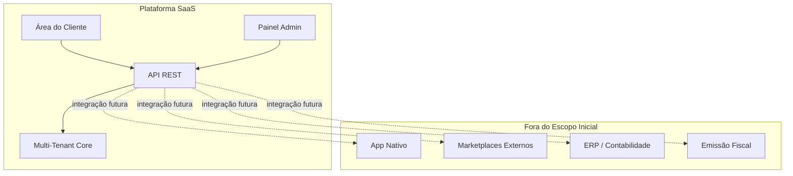
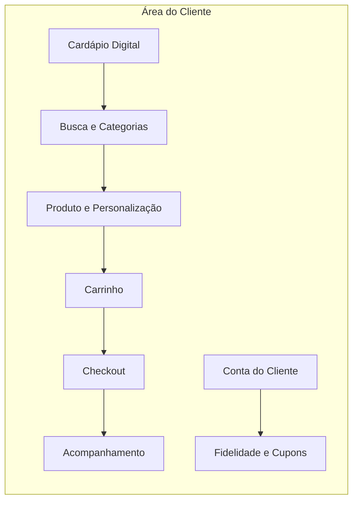
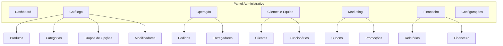
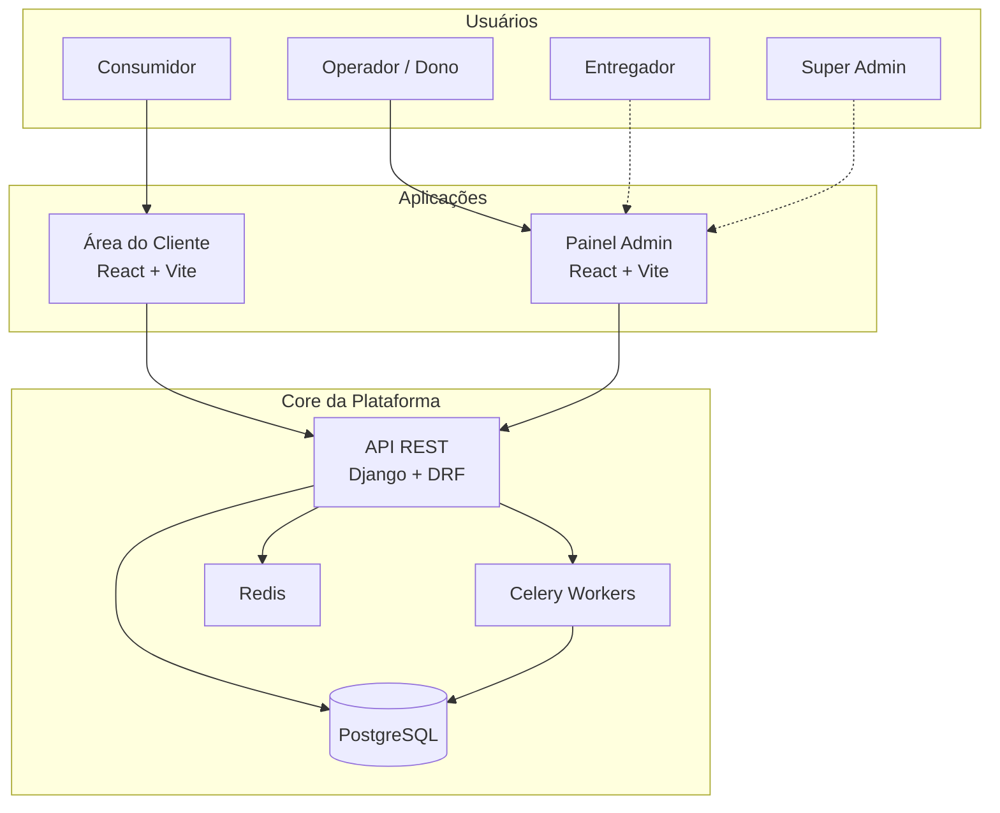
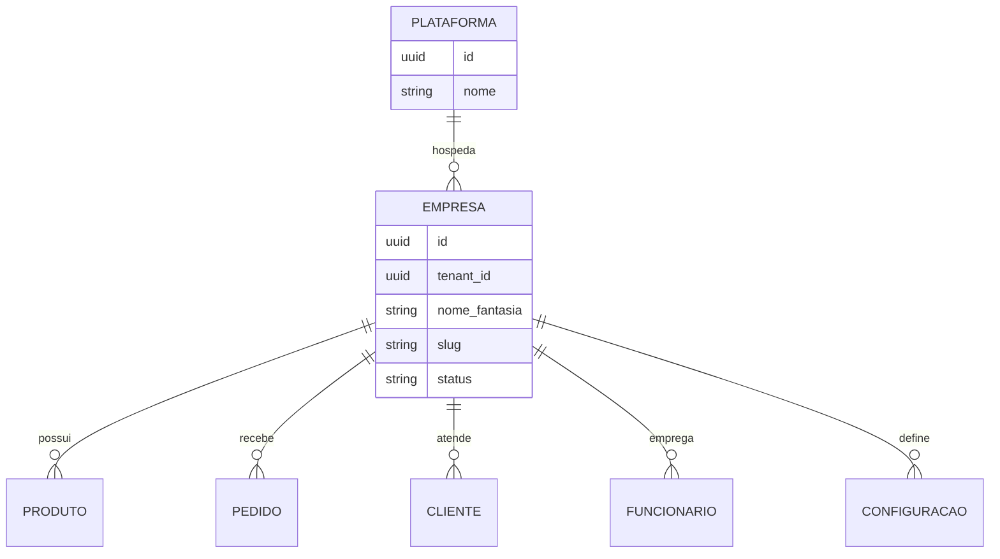
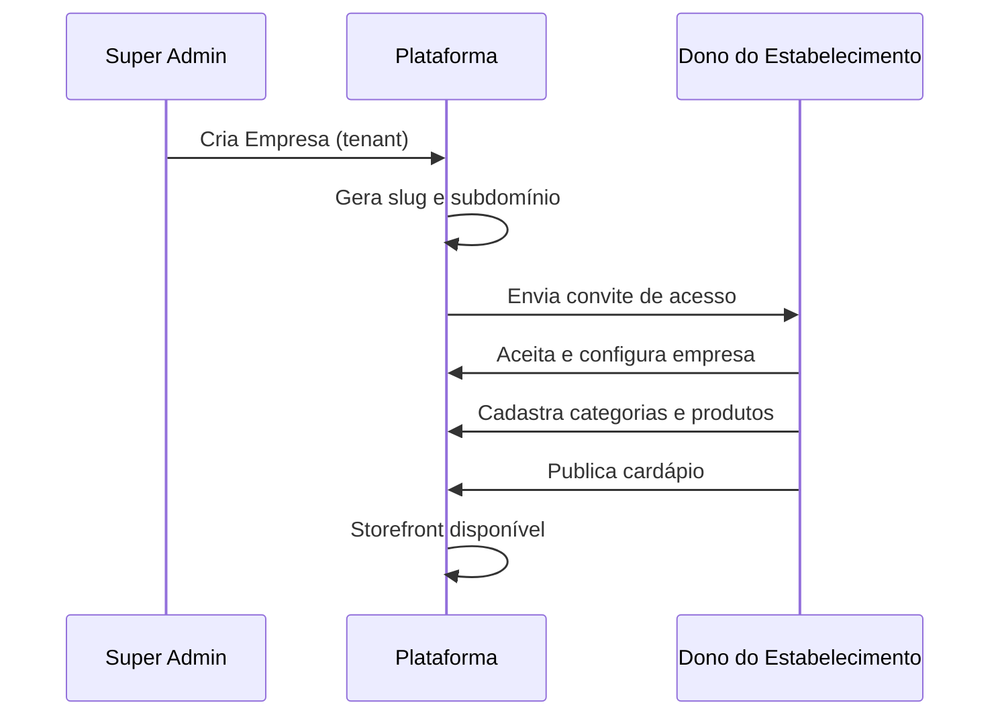

# 01 — Visão do Produto

> **Documento:** Visão do Produto  
> **Produto:** Food Service *(nome comercial provisório)*  
> **Versão:** 1.1  
> **Status:** Aprovado  
> **Última atualização:** Julho/2026  
> **Escopo:** SaaS multi-tenant para estabelecimentos de Food Service

---

## Sumário

1. [Resumo Executivo](#1-resumo-executivo)
2. [Problema e Oportunidade](#2-problema-e-oportunidade)
3. [Visão e Missão](#3-visão-e-missão)
4. [Princípios do Produto](#4-princípios-do-produto)
5. [Público-Alvo e Segmentos](#5-público-alvo-e-segmentos)
6. [Personas](#6-personas)
7. [Proposta de Valor](#7-proposta-de-valor)
8. [Escopo do Produto](#8-escopo-do-produto)
9. [Áreas da Plataforma](#9-áreas-da-plataforma)
10. [Modelo de Negócio SaaS](#10-modelo-de-negócio-saas)
11. [Diferenciais Competitivos](#11-diferenciais-competitivos)
12. [Filosofia de Modelagem Genérica](#12-filosofia-de-modelagem-genérica)
13. [Experiência Premium](#13-experiência-premium)
14. [Métricas de Sucesso](#14-métricas-de-sucesso)
15. [Riscos e Premissas](#15-riscos-e-premissas)
16. [Glossário](#16-glossário)
17. [Próximos Documentos](#17-próximos-documentos)

---

## 1. Resumo Executivo

**Food Service** é um **SaaS (Software as a Service) multi-tenant** voltado para estabelecimentos que vendem alimentos e bebidas — pizzarias, hamburguerias, restaurantes, açaiterias, cafeterias, sorveterias, marmitarias, padarias, confeitarias, lanchonetes, casas de sushi, esfiharias e qualquer outro negócio do segmento de Food Service.

O produto **não é um sistema para um único cliente**. É uma plataforma projetada desde o primeiro dia para atender **centenas ou milhares de estabelecimentos**, cada um com dados, configurações, cardápio, equipe e operação completamente isolados.

O primeiro cliente real será uma pizzaria familiar, utilizada como **laboratório de validação** — mas toda decisão de produto, arquitetura e modelagem deve ser **genérica e reutilizável**, nunca específica para pizzas ou para um único tipo de estabelecimento.

A plataforma cobre dois mundos principais:

| Área | Público | Propósito |
|------|---------|-----------|
| **Área do Cliente** | Consumidor final | Descobrir, personalizar, pedir e acompanhar alimentos e bebidas |
| **Painel Administrativo** | Dono, gerente, equipe | Operar o negócio: cardápio, pedidos, clientes, promoções e relatórios |

O objetivo de longo prazo é construir uma das **maiores plataformas SaaS de Food Service do mercado brasileiro** — com experiência premium, arquitetura sólida e capacidade de escalar sem reescrever o sistema a cada novo cliente ou segmento.

---

## 2. Problema e Oportunidade

### 2.1 Problema

Estabelecimentos de Food Service enfrentam desafios recorrentes:

**Para o estabelecimento (B2B):**

- Dependência de marketplaces (iFood, Rappi) com taxas elevadas e perda de relacionamento direto com o cliente
- Sistemas legados ou genéricos que não atendem a complexidade de personalização de produtos (tamanhos, sabores, adicionais, combos)
- Ferramentas fragmentadas: cardápio em um lugar, pedidos em outro, financeiro em planilha
- Dificuldade de escalar operação sem aumentar caos operacional
- Ausência de dados consolidados para tomada de decisão

**Para o consumidor final (B2C):**

- Experiências de pedido lentas, confusas ou visualmente datadas
- Dificuldade em personalizar produtos com muitas opções
- Falta de transparência no status do pedido
- Programas de fidelidade desconectados ou inexistentes em canais próprios do estabelecimento

### 2.2 Oportunidade

O mercado de delivery e pedidos digitais no Brasil continua em expansão. Estabelecimentos buscam **canais próprios de venda** para reduzir dependência de intermediários, mas precisam de ferramentas que rivalizem em qualidade com os grandes players.

Existe uma lacuna entre:

- **Soluções enterprise** (caras, complexas, demoradas para implementar)
- **Soluções artesanais** (feitas sob medida para um cliente, impossíveis de escalar)
- **Soluções de nicho** (só pizzaria, só hamburgueria)

A oportunidade está em uma plataforma **genérica, elegante e escalável** que qualquer estabelecimento alimentício possa adotar com configuração — não com customização de código.

### 2.3 Por que não construir "um sistema para pizzarias"

| Abordagem | Consequência |
|-----------|--------------|
| Modelar `Pizza`, `Sabor`, `Borda` | Cada novo segmento exige novas entidades e código |
| Hardcodar fluxos de pizzaria | Hamburgeria, açaiteria e restaurante ficam de fora ou viram gambiarra |
| Um banco por cliente | Operação e deploy inviáveis com centenas de clientes |
| Um deploy por cliente | Custo operacional explode; manutenção vira pesadelo |

A decisão correta é tratar **todo alimento como Produto** e toda variação como **configuração de Grupos de Opções e Modificadores** — um único mecanismo para todos os segmentos.

---

## 3. Visão e Missão

### 3.1 Visão

> Ser a plataforma de referência para estabelecimentos de Food Service que desejam vender online com autonomia, qualidade e escala — oferecendo ao consumidor uma experiência tão boa quanto os melhores apps do mercado, e ao estabelecimento uma operação tão simples quanto as melhores ferramentas SaaS do mundo.

### 3.2 Missão

> Empoderar estabelecimentos alimentícios de qualquer porte e segmento a digitalizar suas vendas com uma plataforma única, configurável e confiável — eliminando a necessidade de desenvolvimento sob medida e permitindo foco no que importa: comida, atendimento e crescimento.

### 3.3 Declaração de Posicionamento

**Para** donos e gestores de estabelecimentos de Food Service  
**Que** precisam de um canal digital próprio sem abrir mão de personalização e controle operacional  
**A plataforma** é um SaaS multi-tenant de pedidos e gestão  
**Que** oferece cardápio digital, checkout, painel administrativo e ferramentas de crescimento em uma experiência premium  
**Diferente de** marketplaces e sistemas de nicho  
**Nosso produto** é genérico por design, escalável por arquitetura e elegante por experiência.

---

## 4. Princípios do Produto

Estes princípios guiam **todas** as decisões — de produto, UX, arquitetura e código.

### 4.1 SaaS First

Cada funcionalidade deve funcionar para **qualquer tenant** sem alteração de código. Novos clientes são onboardados por **configuração e dados**, não por desenvolvimento.

### 4.2 Genérico por Design

Não existem entidades de domínio específicas de segmento (`Pizza`, `Açaí`, `Sushi`). Existem `Produto`, `Categoria`, `Grupo de Opções`, `Opção`, `Modificador`. A semântica de cada segmento emerge da **configuração do estabelecimento**.

### 4.3 Tenant Isolation

Dados, configurações, usuários, pedidos e relatórios são **estritamente isolados** por empresa (tenant). Um estabelecimento nunca acessa dados de outro.

### 4.4 Experiência Premium

A interface deve transmitir modernidade, velocidade, elegância, simplicidade e confiabilidade — inspirada nas melhores práticas de empresas como Apple, Stripe, Airbnb, Uber Eats, Linear, Notion e Vercel, **sem copiar layouts**.

### 4.5 Configuração sobre Customização

Preferir painéis de configuração a código customizado. O estabelecimento adapta o sistema; o sistema não se adapta a um estabelecimento via fork.

### 4.6 Progressive Disclosure

Mostrar ao usuário apenas o que é necessário no momento. Complexidade existe, mas fica oculta até ser relevante.

### 4.7 Mobile First (Área do Cliente)

A maioria dos pedidos virá de smartphones. A área do cliente é projetada primariamente para mobile, com excelência em desktop como complemento.

### 4.8 API First

Toda funcionalidade nasce na API REST. Frontend, futuros apps nativos, integrações e parceiros consomem a mesma camada.

### 4.9 Evolução Incremental

Entregar valor cedo (MVP), validar com cliente real, evoluir em sprints planejados até a plataforma completa. Não tentar construir tudo de uma vez.

### 4.10 Manutenibilidade de Longo Prazo

Código legível, baixo acoplamento, alta coesão, testes onde importam, documentação viva. O projeto será mantido por **anos**.

### 4.11 Hierarquia acima de quantidade

Cada tela deve possuir **apenas um protagonista**. Todo elemento secundário existe só para apoiar a ação principal. Se um componente não ajuda o usuário a concluir sua tarefa, ele deve ser **removido**, **simplificado** ou ter sua importância visual reduzida.

---

## 5. Público-Alvo e Segmentos

### 5.1 Estabelecimentos (B2B) — Clientes da Plataforma

| Segmento | Exemplos de necessidade configurável |
|----------|--------------------------------------|
| Pizzarias | Tamanho, massa, sabores múltiplos, borda |
| Hamburguerias | Pão, ponto da carne, molhos, adicionais |
| Açaiterias | Tamanho do copo, frutas, coberturas, cremes |
| Restaurantes | Pratos com acompanhamentos, observações |
| Cafeterias | Tamanho da bebida, tipo de leite, extras |
| Sorveterias | Casquinha/copo, sabores, coberturas |
| Marmitarias | Tamanho, proteína, acompanhamentos |
| Padarias / Confeitarias | Unidade, recheio, personalização |
| Lanchonetes | Combos, adicionais, bebidas |
| Sushi / Esfiharias | Variantes, quantidade, molhos |

**Perfil ideal do estabelecimento cliente:**

- De 1 a 50 funcionários na operação
- Vende delivery, retirada e/ou consumo no local
- Precisa de cardápio com personalização
- Quer canal próprio além (ou em vez de) marketplaces
- Disposto a configurar o sistema com suporte inicial

### 5.2 Consumidor Final (B2C) — Usuários da Área do Cliente

- Clientes recorrentes do estabelecimento
- Novos clientes descobrindo via link, QR Code ou busca
- Faixa etária ampla; interface deve ser intuitiva para todos os níveis de familiaridade tecnológica

### 5.3 Operadores Internos

- Donos e sócios
- Gerentes
- Atendentes / operadores de pedidos
- Entregadores (futuro)
- Funcionários de caixa / PDV (futuro)

---

## 6. Personas

### 6.1 Persona B2C — Camila, 28 anos

**Contexto:** Profissional que pede delivery 3–4x por semana. Usa apps de delivery e Instagram para descobrir lugares.

| Atributo | Detalhe |
|----------|---------|
| Objetivo | Pedir rápido, com personalização exata, e acompanhar entrega |
| Frustração | Apps lentos, cardápio confuso, opções escondidas |
| Comportamento | Mobile, pouca paciência, abandona carrinho se checkout falha |
| Expectativa | UX fluida, status em tempo real, histórico e favoritos |

**Jornada típica:** Recebe link da pizzaria → navega cardápio → personaliza produto → checkout → acompanha pedido → avalia.

### 6.2 Persona B2B — Ricardo, 42 anos — Dono

**Contexto:** Dono da pizzaria familiar (primeiro cliente da plataforma). Gerencia equipe pequena, acompanha financeiro de perto.

| Atributo | Detalhe |
|----------|---------|
| Objetivo | Aumentar pedidos pelo canal próprio, reduzir taxas de marketplace |
| Frustração | Planilhas, sistemas feios, dependência de terceiros para mudar cardápio |
| Comportamento | Usa celular e notebook; precisa de dashboards simples |
| Expectativa | Configurar cardápio sozinho, ver pedidos em tempo real, relatórios claros |

**Jornada típica:** Configura empresa → cadastra produtos e opções → divulga link → gerencia pedidos no painel → analisa relatório semanal.

### 6.3 Persona B2B — Fernanda, 26 anos — Atendente

**Contexto:** Recebe pedidos, confirma com cozinha, atualiza status.

| Atributo | Detalhe |
|----------|---------|
| Objetivo | Processar pedidos sem erro e sem atraso |
| Frustração | Interface lenta, informações incompletas no pedido |
| Comportamento | Usa painel o dia inteiro em tablet ou desktop |
| Expectativa | Lista de pedidos clara, alertas sonoros, mudança de status em 1 clique |

### 6.4 Persona B2B — Super Admin (Plataforma)

**Contexto:** Você, como operador da plataforma SaaS, gerencia tenants, planos e saúde do sistema.

| Atributo | Detalhe |
|----------|---------|
| Objetivo | Onboardar novos clientes, monitorar infraestrutura, suportar tenants |
| Expectativa | Visão global de tenants, métricas de uso, ferramentas de suporte |

> **Nota:** O Super Admin é escopo futuro (pós-V1). Documentado aqui para alinhar visão de longo prazo.

---

## 7. Proposta de Valor

### 7.1 Para o Estabelecimento

| Benefício | Descrição |
|-----------|-----------|
| **Canal próprio** | Venda direta sem intermediário obrigatório |
| **Cardápio flexível** | Qualquer produto, qualquer combinação de opções |
| **Operação centralizada** | Pedidos, clientes, promoções e relatórios em um lugar |
| **Escalabilidade** | Cresce com o negócio sem trocar de sistema |
| **Marca própria** | Experiência white-label (futuro): cores, logo, domínio |
| **Dados e insights** | Relatórios para decisões baseadas em dados |

### 7.2 Para o Consumidor

| Benefício | Descrição |
|-----------|-----------|
| **Experiência fluida** | Pedido rápido, bonito e confiável |
| **Personalização clara** | Opções organizadas, preço atualizado em tempo real |
| **Transparência** | Status do pedido, histórico, avaliações |
| **Benefícios** | Cupons, fidelidade, cashback (fases futuras) |

### 7.3 Para o Desenvolvedor / Operador da Plataforma

| Benefício | Descrição |
|-----------|-----------|
| **Um código, N clientes** | Multi-tenant desde o dia 1 |
| **Onboarding por configuração** | Novo cliente sem deploy customizado |
| **Stack moderna e produtiva** | React, Django, PostgreSQL, Docker |
| **Documentação como contrato** | Base sólida para anos de evolução |

---

## 8. Escopo do Produto

### 8.1 Dentro do Escopo

- Plataforma SaaS multi-tenant para Food Service
- Cardápio digital com personalização dinâmica
- Fluxo completo de pedido (carrinho → checkout → acompanhamento)
- Painel administrativo para gestão operacional
- Autenticação e autorização por perfil
- Isolamento total de dados por empresa
- API REST documentada
- Infraestrutura containerizada

### 8.2 Fora do Escopo (Inicial)

| Item | Motivo | Quando |
|------|--------|--------|
| App nativo iOS/Android | Web responsiva cobre MVP; API permite apps depois | V2+ |
| Integração com iFood/Rappi | Complexidade e contratos de parceiro | V2+ |
| PDV físico completo | Escopo operacional diferente | V2+ |
| Gestão de estoque avançada | Depende de maturidade operacional | V2+ |
| Emissão fiscal (NF-e) | Regulatório, integração específica | V2+ |
| Marketplace entre estabelecimentos | Modelo de negócio diferente | Futuro |
| Pagamento processado pelo sistema | Requer licenças e compliance; fora do escopo por decisão de produto | V2+ (avaliar) |

### 8.3 Fronteiras Claras



---

## 9. Áreas da Plataforma

### 9.1 Área do Cliente (Storefront)

Interface pública voltada ao consumidor final. Acessada via subdomínio, domínio customizado ou link direto.



| Módulo | Descrição | Fase |
|--------|-----------|------|
| Cardápio Digital | Listagem de categorias e produtos com imagens, preços e disponibilidade | MVP |
| Busca | Pesquisa por nome, descrição, tags | MVP |
| Categorias | Navegação hierárquica e filtros | MVP |
| Produtos | Página de detalhe com descrição, imagens e opções | MVP |
| Personalização Dinâmica | Grupos de opções, modificadores, regras de seleção | MVP |
| Carrinho | Adição, edição, remoção, cálculo de totais | MVP |
| Checkout | Endereço, forma de entrega, pagamento, observações | MVP |
| Login / Cadastro | Autenticação do consumidor | MVP |
| Endereços | CRUD de endereços de entrega | MVP |
| Histórico | Pedidos anteriores com detalhes | V1 |
| Cupons | Aplicação de códigos promocionais | V1 |
| Favoritos | Produtos salvos para recompra rápida | V1 |
| Avaliações | Nota e comentário pós-pedido | V1 |
| Programa de Fidelidade | Pontos por pedido, resgate | V2 |
| Cashback | Crédito automático em compras | V2 |
| Rastreamento de Pedidos | Status em tempo real, mapa (futuro) | V1 → V2 |

### 9.2 Painel Administrativo (Backoffice)

Interface interna para donos, gerentes e equipe do estabelecimento.



| Módulo | Descrição | Fase |
|--------|-----------|------|
| Dashboard | Visão geral: pedidos do dia, faturamento, métricas | MVP |
| Produtos | CRUD de produtos com imagens, preço, disponibilidade | MVP |
| Categorias | Organização do cardápio | MVP |
| Grupos de Opções | Definição de grupos (ex.: Tamanho, Massa, Sabores) | MVP |
| Modificadores | Opções dentro dos grupos com preço e regras | MVP |
| Pedidos | Listagem, detalhe, mudança de status, impressão | MVP |
| Clientes | Listagem e histórico de clientes do estabelecimento | V1 |
| Funcionários | Convite, perfis e permissões | V1 |
| Entregadores | Cadastro e atribuição de entregas | V2 |
| Cupons | Criação e gestão de cupons | V1 |
| Promoções | Regras promocionais (desconto em categoria, combo) | V1 |
| Financeiro | Resumo de receitas, taxas, repasses | V1 |
| Relatórios | Vendas por período, produto, canal | V1 |
| Estoque | Controle de insumos e baixa automática | V2 |
| Caixa | Abertura/fechamento, sangria | V2 |
| PDV | Ponto de venda para balcão | V2 |
| QR Code para Mesas | Pedido na mesa sem garçom | V2 |
| Configurações da Empresa | Dados, horários, taxa de entrega, branding | MVP |
| Multiempresa | Um usuário gerencia vários estabelecimentos | V2 |

### 9.3 Diagrama de Alto Nível



---

## 10. Modelo de Negócio SaaS

### 10.1 Estrutura Multi-Tenant

Cada **Empresa (Tenant)** representa um estabelecimento (ou rede de estabelecimentos no futuro). Todos compartilham a mesma aplicação e banco de dados, com **isolamento lógico** via `tenant_id` em todas as entidades de negócio.



### 10.2 Identificação do Tenant

| Estratégia | Exemplo | Fase |
|------------|---------|------|
| Subdomínio *(estratégia principal)* | `pizzaria-joao.foodservice.app` | MVP ✅ |
| Slug na URL | `foodservice.app/pizzaria-joao` | Alternativa MVP |
| Domínio customizado | `pedidos.pizzariajoao.com.br` | V2 (white-label) |
| Header / JWT | `X-Tenant-ID` ou claim no token | API interna |

> Detalhamento técnico completo no documento **02-arquitetura.md**.

### 10.3 Planos (Visão Futura)

| Plano | Público | Diferenciais |
|-------|---------|--------------|
| **Starter** | Pequenos estabelecimentos | Cardápio, pedidos, dashboard básico |
| **Professional** | Operação em crescimento | Cupons, relatórios, múltiplos funcionários |
| **Enterprise** | Redes e franquias | Multi-loja, API, domínio próprio, SLA |

> Planos e billing não são escopo do MVP. A arquitetura deve **permitir** limites por plano no futuro sem refatoração estrutural.

### 10.4 Onboarding de Novo Cliente



---

## 11. Diferenciais Competitivos

### 11.1 Comparativo Conceitual

| Critério | Marketplaces | Sistemas de Nicho | **Nossa Plataforma** |
|----------|-------------|-------------------|----------------------|
| Canal próprio | Não | Parcial | **Sim** |
| Multi-segmento | Sim | Não | **Sim** |
| Personalização profunda | Limitada | Alta (um nicho) | **Alta (genérica)** |
| Taxas por pedido | Altas | Variável | **Assinatura SaaS** |
| UX premium | Alta | Baixa/Média | **Alta** |
| Controle de dados | Baixo | Médio | **Alto** |
| Escalabilidade SaaS | N/A | Baixa | **Alta** |

### 11.2 Diferenciais Técnicos

1. **Motor de personalização único** — Grupos de Opções e Modificadores servem qualquer tipo de alimento
2. **API First** — Integrações e apps futuros sem reescrita
3. **Arquitetura limpa** — Domínio desacoplado de infraestrutura
4. **Stack moderna** — Produtividade de desenvolvimento e performance
5. **Documentação como ativo** — Reduz dependência de conhecimento tribal

### 11.3 Diferenciais de Experiência

1. **Velocidade percebida** — Skeleton, otimistic updates, lazy loading
2. **Clareza na personalização** — Preço atualiza em tempo real conforme opções
3. **Confiança** — Feedback visual constante, estados de erro humanizados
4. **Consistência** — Design System rigoroso em toda a plataforma
5. **Assistente conversacional de personalização** — O comerciante responde perguntas naturais (“Possui tamanhos?”, “Quais bordas?”); o sistema monta grupos/opções. Sem termos técnicos.
6. **Biblioteca da empresa** — Tamanhos, bordas, adicionais e ingredientes criados uma vez e reaproveitados em todo o cardápio
7. **Receitas da empresa (roadmap)** — Salvar um conjunto completo de personalizações (ex.: “Pizza Tradicional”) e aplicar em novos produtos com um toque

---

## 12. Filosofia de Modelagem Genérica

### 12.1 O Problema da Especificidade

```
❌ ERRADO                          ✅ CORRETO
─────────────                      ─────────
Pizza                              Produto (nome: "Pizza Calabresa")
├── Tamanho                        ├── Grupo de Opções: "Tamanho"
├── Massa                          │   ├── Opção: "Pequena" (+R$0)
├── Sabor                          │   ├── Opção: "Média" (+R$8)
└── Borda                          │   └── Opção: "Grande" (+R$15)
                                   ├── Grupo de Opções: "Massa"
Hamburguer                         │   ├── Opção: "Tradicional"
├── Pao                            │   └── Opção: "Integral"
├── Carne                          └── Grupo de Opções: "Borda"
└── Molho                              ├── Opção: "Catupiry"
                                       └── Opção: "Cheddar"
```

### 12.2 Mecanismo Unificado

Todo estabelecimento utiliza as mesmas entidades:

| Entidade | Responsabilidade |
|----------|------------------|
| **Produto** | Item vendável (comida, bebida, combo) |
| **Categoria** | Agrupamento no cardápio |
| **Grupo de Opções** | Conjunto de escolhas (Tamanho, Massa, Adicionais) |
| **Opção / Modificador** | Escolha individual dentro do grupo |
| **Regra do Grupo** | Mín/máx seleções, obrigatório, preço variável |

A **semântica** ("Tamanho" vs "Ponto da Carne" vs "Frutas") é definida pelo estabelecimento no painel — não pelo código.

### 12.3 Exemplos por Segmento

| Segmento | Produto | Grupos de Opções |
|----------|---------|------------------|
| Pizzaria | Pizza Calabresa | Tamanho, Massa, Borda, Adicionais |
| Hamburgueria | X-Bacon | Pão, Ponto da Carne, Molhos, Extras |
| Açaiteria | Açaí Tradicional | Tamanho, Frutas, Coberturas, Cremes |
| Cafeteria | Cappuccino | Tamanho, Tipo de Leite, Extras |
| Restaurante | Prato Feito | Proteína, Acompanhamentos, Observações |

> Modelagem completa de entidades e relacionamentos no documento **03-modelagem-do-banco.md**.

---

## 13. Experiência Premium

### 13.1 Pilares de UX

| Pilar | Significado | Aplicação |
|-------|-------------|-----------|
| **Modernidade** | Visual contemporâneo, espaçamento generoso, tipografia limpa | Design System com tokens consistentes |
| **Velocidade** | Respostas instantâneas, transições suaves | Skeleton, cache, otimistic UI |
| **Elegância** | Menos é mais; cada elemento tem propósito | Hierarquia visual clara |
| **Simplicidade** | Fluxos curtos, linguagem humana | Máximo 3–4 passos para pedir |
| **Confiabilidade** | Feedback constante, erros recuperáveis | Toasts, estados vazios, retry |

### 13.2 Referências de Inspiração (Práticas, Não Layouts)

| Empresa | O que absorver |
|---------|----------------|
| **Apple** | Clareza, hierarquia, atenção ao detalhe |
| **Stripe** | Formulários impecáveis, documentação visual |
| **Airbnb** | Confiança, fotos, filtros intuitivos |
| **Uber Eats** | Fluxo de pedido, acompanhamento |
| **Linear** | Velocidade, atalhos, densidade controlada |
| **Notion** | Organização, blocos modulares |
| **Vercel** | Dark mode, gradientes sutis, developer-friendly |

### 13.3 Anti-Padrões a Evitar

- Cardápio com 15 fontes e cores diferentes
- Popup de promoção bloqueando o pedido
- Checkout com 8 etapas
- Tabelas administrativas sem filtro, busca ou paginação
- Mensagens de erro técnicas ("Error 500", "NullPointerException")
- Loading infinito sem feedback
- Formulários que perdem dados ao trocar de aba

> Detalhamento completo no documento **11-guia-ui-ux.md** e **04-design-system.md**.

---

## 14. Métricas de Sucesso

### 14.1 Métricas de Produto (B2C)

| Métrica | Definição | Meta Inicial |
|---------|-----------|--------------|
| **Taxa de conversão** | Pedidos / Visitas ao cardápio | > 3% |
| **Taxa de abandono de carrinho** | Carrinhos não finalizados | < 60% |
| **Tempo médio de checkout** | Da abertura do carrinho à confirmação | < 3 min |
| **NPS do consumidor** | Satisfação geral | > 50 |
| **Taxa de recompra** | Clientes com 2+ pedidos em 30 dias | > 25% |

### 14.2 Métricas de Produto (B2B)

| Métrica | Definição | Meta Inicial |
|---------|-----------|--------------|
| **Time to First Order** | Do cadastro à primeira venda | < 48h |
| **Pedidos/dia por tenant** | Volume operacional | Crescimento mês a mês |
| **Retenção de tenants** | % ativos após 3 meses | > 90% |
| **Tempo de configuração de cardápio** | Primeiro cardápio publicado | < 2h com suporte |

### 14.3 Métricas Técnicas

| Métrica | Definição | Meta |
|---------|-----------|------|
| **Uptime** | Disponibilidade da plataforma | > 99.5% |
| **P95 de resposta da API** | 95% das requests | < 300ms |
| **LCP (Largest Contentful Paint)** | Performance frontend | < 2.5s |
| **Tempo de deploy** | CI/CD completo | < 10 min |

### 14.4 Métricas do MVP (Primeiro Cliente)

O sucesso do MVP com a pizzaria familiar será medido por:

1. ✅ Cardápio publicado e acessível via link
2. ✅ Pelo menos 10 pedidos reais completos
3. ✅ Personalização de produto funcionando (tamanho, opções)
4. ✅ Painel recebendo e processando pedidos em tempo real
5. ✅ Dono consegue alterar cardápio sem ajuda técnica
6. ✅ Zero downtime durante horário de pico

---

## 15. Riscos e Premissas

### 15.1 Premissas

| # | Premissa |
|---|----------|
| P1 | O primeiro cliente (pizzaria) aceita validar MVP com funcionalidades limitadas |
| P2 | PostgreSQL suporta escala de centenas de tenants sem sharding inicial |
| P3 | Consumidores aceitam pedir via web app (PWA) sem app nativo no MVP |
| P4 | Pagamento no MVP pode ser "na entrega" (dinheiro, PIX manual, cartão na entrega) |
| P5 | Um desenvolvedor (você) constrói MVP com apoio de Cursor e documentação |
| P6 | Infraestrutura inicial roda em um VPS ou cloud simples com Docker |

### 15.2 Riscos

| Risco | Impacto | Probabilidade | Mitigação |
|-------|---------|---------------|-----------|
| Escopo do MVP crescer demais | Atraso | Alta | Checklist rigoroso (doc 12) |
| Modelagem genérica ficar complexa demais | Confusão do usuário | Média | UX de personalização bem testada |
| Performance com muitos tenants | Lentidão | Baixa (início) | Índices, cache, paginação desde o MVP |
| Isolamento de tenant falhar | Segurança crítica | Baixa | Middleware + testes de isolamento |
| Concorrência de marketplaces | Adoção lenta | Média | Foco em canal próprio e taxa zero por pedido |
| Desenvolvedor único | Bus factor | Alta | Documentação extensa (este projeto) |

### 15.3 Decisões Conscientes para o MVP

| Decisão | Justificativa |
|---------|---------------|
| Pagamento manual na entrega (sem processamento pelo sistema) | Evita gateway no MVP; dinheiro, PIX e cartão na entrega são registrados apenas como forma de pagamento |
| Sem app nativo | Web responsiva + PWA futuro |
| Um tenant em produção | Valida fluxo completo antes de escalar |
| Sem multi-idioma | Mercado inicial Brasil, pt-BR |
| Sem white-label completo | Subdomínio é suficiente para MVP |

---

## 16. Glossário

| Termo | Definição |
|-------|-----------|
| **Tenant** | Empresa/estabelecimento isolado na plataforma multi-tenant |
| **Storefront** | Área do Cliente — interface pública de pedidos |
| **Backoffice** | Painel Administrativo — interface interna de gestão |
| **Produto** | Qualquer item vendável (comida, bebida, combo) |
| **Categoria** | Agrupamento de produtos no cardápio |
| **Grupo de Opções** | Conjunto de escolhas associado a um produto (ex.: Tamanho) |
| **Opção / Modificador** | Item selecionável dentro de um grupo (ex.: Grande, +R$15) |
| **Item do Pedido** | Linha de um pedido com produto, opções e quantidade |
| **Pedido** | Conjunto de itens solicitados por um cliente |
| **Checkout** | Fluxo de finalização: endereço, pagamento, confirmação |
| **SaaS** | Software as a Service — software por assinatura, multi-cliente |
| **Multi-Tenant** | Arquitetura onde uma instância serve múltiplos clientes isolados |
| **MVP** | Minimum Viable Product — versão mínima para validar hipótese |
| **White-Label** | Personalização de marca (logo, cores, domínio) por tenant |

---

## 17. Próximos Documentos

Este documento estabelece a **visão e o porquê** da plataforma. Os próximos documentos detalham o **como**:

| # | Documento | Conteúdo |
|---|-----------|----------|
| 00 | `00-product-philosophy.md` | **Filosofia fundadora** — Regra de Ouro, o que nunca/sempre fazer |
| 00 | `00-portas-locais.md` | Portas de dev local (projeto secundário) |
| 02 | `02-arquitetura.md` | Arquitetura técnica, multi-tenant, pastas, módulos |
| 03 | `03-modelagem-do-banco.md` | Entidades, relacionamentos, diagramas ER |
| 04 | `04-design-system.md` | Tokens, componentes, padrões visuais |
| 05 | `05-frontend.md` | Estrutura React, rotas, hooks, estado |
| 06 | `06-backend.md` | Estrutura Django, apps, services, Celery |
| 07 | `07-api.md` | Endpoints REST, contratos, versionamento |
| 08 | `08-regras-de-negocio.md` | Regras de domínio detalhadas |
| 09 | `09-roadmap.md` | Sprints, prioridades, estimativas |
| 10 | `10-padroes-de-codigo.md` | Convenções de código e Git |
| 11 | `11-guia-ui-ux.md` | Fluxos, wireframes conceituais, heurísticas |
| 12 | `12-checklist-mvp.md` | Escopo fechado do MVP |
| 13 | `13-checklist-v1.md` | Escopo da versão 1 |
| 14 | `14-checklist-v2.md` | Escopo da versão 2 |
| 15 | `15-futuras-funcionalidades.md` | Backlog de longo prazo |
| 16 | `16-product-builder-engine.md` | Motor de opções (runtime do cardápio) |
| 17 | `17-modelo-categoria-produto.md` | Receita da categoria → produto (autoria) |
| 18 | `18-domain-rules.md` | Regras de domínio do cardápio |
| 19 | `19-future-ideas.md` | Backlog de ideias fora do MVP |

---

## Decisões Aprovadas

| Decisão | Resolução |
|---------|-----------|
| Local da documentação | `vendas_frontend/docs/` |
| Nome do produto | **Food Service** (provisório, sem nome comercial definitivo) |
| Pagamento no MVP | Manual na entrega; **sem processamento de pagamento pelo sistema** |
| Identificação do tenant | **Subdomínio** como estratégia principal no MVP |
| Métrica de validação do MVP | **10 pedidos reais** completos |

---

## Histórico de Revisões

| Versão | Data | Autor | Alterações |
|--------|------|-------|------------|
| 1.0 | Jul/2026 | — | Versão inicial |
| 1.1 | Jul/2026 | — | Aprovação; nome Food Service; decisões registradas |

---

> **Documento aprovado.** Próximo: `02-arquitetura.md`.
