# 02 — Arquitetura

> **Documento:** Arquitetura Técnica  
> **Produto:** Food Service *(nome comercial provisório)*  
> **Versão:** 1.0  
> **Status:** Aprovado  
> **Última atualização:** Julho/2026  
> **Depende de:** `01-visao-do-produto.md` (aprovado)

---

## Sumário

1. [Visão Geral](#1-visão-geral)
2. [Princípios Arquiteturais](#2-princípios-arquiteturais)
3. [Arquitetura de Alto Nível](#3-arquitetura-de-alto-nível)
4. [Estratégia Multi-Tenant](#4-estratégia-multi-tenant)
5. [Repositórios e Organização do Monorepo Lógico](#5-repositórios-e-organização-do-monorepo-lógico)
6. [Estrutura de Pastas — Backend](#6-estrutura-de-pastas--backend)
7. [Estrutura de Pastas — Frontend](#7-estrutura-de-pastas--frontend)
8. [Clean Architecture e Camadas](#8-clean-architecture-e-camadas)
9. [Módulos de Domínio](#9-módulos-de-domínio)
10. [Autenticação e Autorização](#10-autenticação-e-autorização)
11. [Estratégia de Permissões](#11-estratégia-de-permissões)
12. [API REST e Contratos](#12-api-rest-e-contratos)
13. [Cache, Filas e Processamento Assíncrono](#13-cache-filas-e-processamento-assíncrono)
14. [Estratégia de Escalabilidade](#14-estratégia-de-escalabilidade)
15. [Infraestrutura e Deploy](#15-infraestrutura-e-deploy)
16. [Integrações Futuras](#16-integrações-futuras)
17. [Segurança](#17-segurança)
18. [Observabilidade](#18-observabilidade)
19. [Decisões Arquiteturais (ADRs)](#19-decisões-arquiteturais-adrs)
20. [Próximos Documentos](#20-próximos-documentos)

---

## 1. Visão Geral

O **Food Service** é uma plataforma SaaS composta por:

| Componente | Tecnologia | Responsabilidade |
|------------|------------|------------------|
| **Storefront** | React + Vite | Área do Cliente (pedidos) |
| **Backoffice** | React + Vite | Painel Administrativo |
| **API** | Django + DRF | Lógica de negócio, persistência, autenticação |
| **Workers** | Celery | Tarefas assíncronas (e-mail, notificações, relatórios) |
| **Banco** | PostgreSQL | Dados transacionais multi-tenant |
| **Cache/Fila** | Redis | Cache, sessões, broker Celery |
| **Proxy** | Nginx | TLS, roteamento, arquivos estáticos |
| **CI/CD** | GitHub Actions | Build, testes, deploy |

### 1.1 Diagrama de Contexto (C4 — Nível 1)

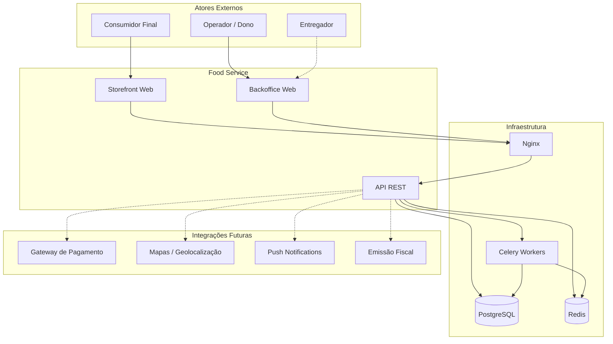

### 1.2 Fluxo de Request Típico

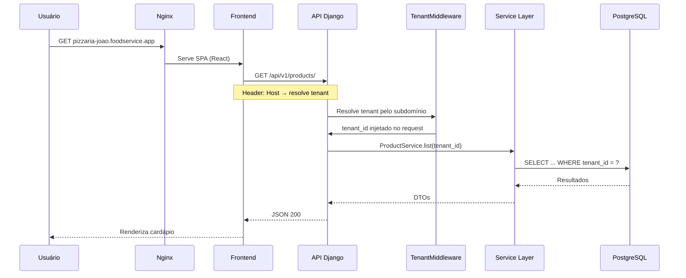

---

## 2. Princípios Arquiteturais

| Princípio | Descrição | Implicação prática |
|-----------|-----------|-------------------|
| **API First** | Toda funcionalidade nasce na API | Frontend é consumidor; apps futuros reutilizam a mesma API |
| **Tenant by Default** | Toda query de negócio filtra por `tenant_id` | Middleware + managers + testes de isolamento |
| **Thin Controllers, Fat Services** | Views/ViewSets delegam para services | Regras de negócio centralizadas e testáveis |
| **Domain Generic** | Sem entidades de segmento | Um motor de Produto + Opções para todos |
| **Separation of Concerns** | Domínio ≠ Infraestrutura ≠ Apresentação | Pastas e imports refletem camadas |
| **Convention over Configuration** | Padrões previsíveis | Onboarding de dev mais rápido |
| **Fail Secure** | Sem tenant = sem dados | 404 ou 403, nunca vazamento cross-tenant |
| **Optimistic for UX, Pessimistic for Money** | UI rápida; pedidos e totais validados no servidor | Nunca confiar em cálculos do frontend |
| **Evolutionary Architecture** | MVP simples, extensível | Não over-engineer; preparar extensão |

---

## 3. Arquitetura de Alto Nível

### 3.1 Estilo Arquitetural

**Modular Monolith** com separação clara de domínios — não microserviços no MVP.

| Abordagem | Vantagens | Desvantagens | Decisão |
|-----------|-----------|--------------|---------|
| **Monólito modular** | Deploy simples, transações ACID, debug fácil | Escala vertical inicial | ✅ MVP → V2 |
| **Microserviços** | Escala independente por serviço | Complexidade operacional alta | ❌ Prematuro |
| **Serverless** | Escala automática | Cold start, vendor lock-in | ❌ Não adequado |
| **BaaS (Supabase/Firebase)** | Rápido para protótipo | Menos controle, multi-tenant complexo | ❌ Não adequado |

**Justificativa:** Com um desenvolvedor e dezenas de tenants no início, um monólito Django bem modularizado oferece a melhor relação produtividade/manutenibilidade. A separação em apps Django e services permite extrair módulos para serviços independentes no futuro, se necessário.

### 3.2 Diagrama de Containers (C4 — Nível 2)

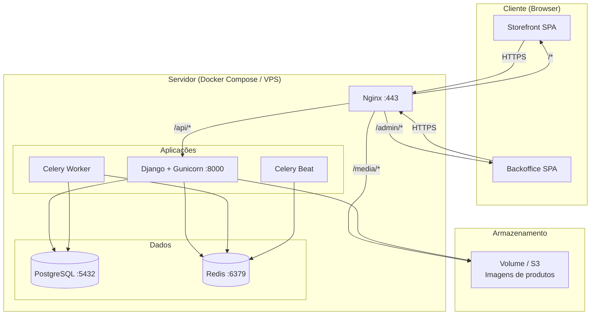

### 3.3 Roteamento Nginx (Conceitual)

| Host / Path | Destino | Aplicação |
|-------------|---------|-----------|
| `*.foodservice.app` | React SPA (Storefront) | Área do Cliente por subdomínio |
| `admin.foodservice.app` | React SPA (Backoffice) | Painel global de login |
| `*/api/v1/*` | Django Gunicorn | API REST |
| `*/media/*` | Volume / CDN | Imagens uploadadas |
| `*/static/*` | Volume coletado | Assets Django admin (se usado) |

> No MVP, Storefront e Backoffice podem ser **um único build React** com roteamento por path (`/` vs `/admin`) ou **dois builds** servidos pelo mesmo Nginx. Recomendação: **um repositório frontend, entrypoints separados** (ver seção 7).

---

## 4. Estratégia Multi-Tenant

### 4.1 Modelo Escolhido: Shared Database, Shared Schema

Todos os tenants compartilham o mesmo banco PostgreSQL e o mesmo schema. Isolamento via coluna `tenant_id` (FK para `companies`) em todas as tabelas de negócio.

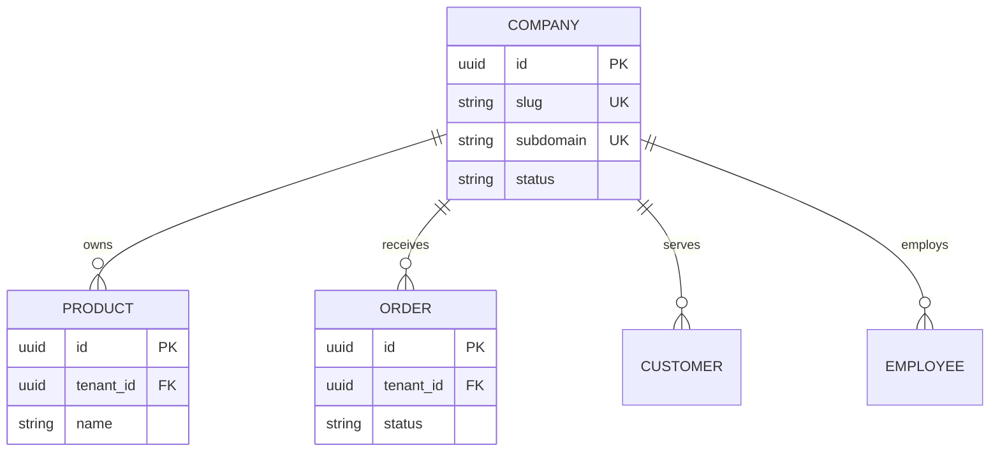

### 4.2 Comparação de Modelos Multi-Tenant

| Modelo | Isolamento | Custo | Complexidade | Escala |
|--------|------------|-------|--------------|--------|
| **DB por tenant** | Máximo | Alto | Migrations × N | Centenas de DBs = pesadelo |
| **Schema por tenant** | Alto | Médio | django-tenants | Bom até ~100 schemas |
| **Shared schema + tenant_id** | Lógico (com discipline) | Baixo | Baixa | Milhares de tenants |
| **Híbrido (shard por região)** | Variável | Médio-Alto | Alta | Enterprise |

**Decisão: Shared schema + `tenant_id`** ✅

**Vantagens:**
- Um deploy, uma migration, um backup
- Queries cross-tenant possíveis para Super Admin (futuro)
- Custo operacional mínimo para MVP
- Padrão maduro com Django ORM

**Desvantagens:**
- Risco de vazamento se query esquecer filtro (mitigado por managers e middleware)
- Tabelas grandes com muitos tenants (mitigado por índices compostos)
- Customização extrema por tenant é mais difícil (não é nosso caso)

**Alternativa considerada:** `django-tenants` (schema por tenant). Rejeitada para MVP por adicionar complexidade de migrations e connection routing sem benefício claro nas primeiras centenas de clientes.

### 4.3 Resolução do Tenant

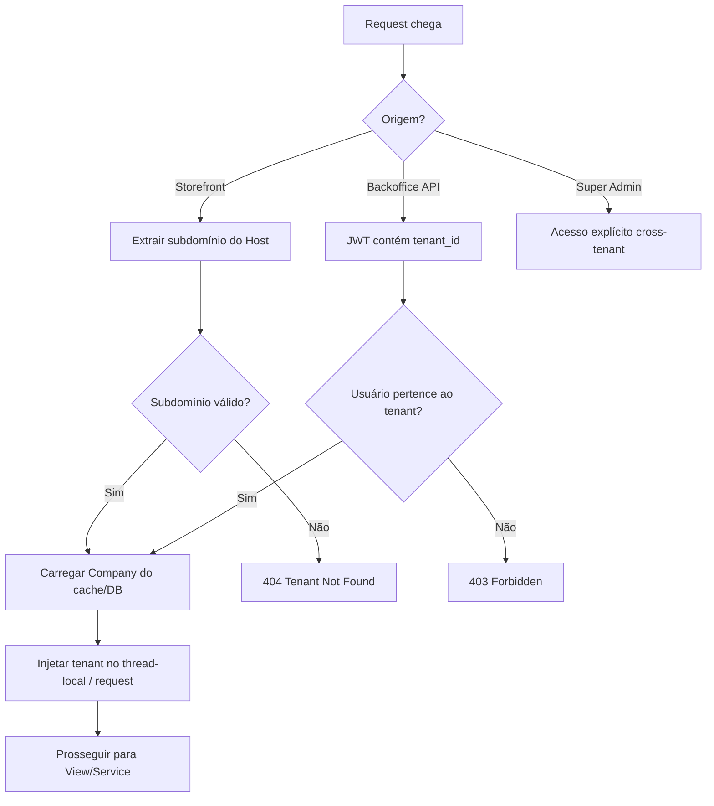

| Contexto | Mecanismo | Exemplo |
|----------|-----------|---------|
| **Storefront (público)** | Subdomínio HTTP `Host` | `pizzaria-joao.foodservice.app` → slug `pizzaria-joao` |
| **Backoffice (autenticado)** | Claim `tenant_id` no JWT | Usuário logado no tenant ativo |
| **API interna / workers** | Parâmetro explícito | `tenant_id` passado ao service |
| **Troca de tenant (futuro)** | Header `X-Tenant-ID` + permissão | Multiempresa |

### 4.4 Tenant Context (Backend)

O tenant ativo deve estar disponível em toda a request sem prop drilling:

```python
# Conceito — implementação futura
# core/tenancy/context.py

class TenantContext:
    """Thread-local ou contextvars para tenant atual."""
    _tenant: Company | None = None

    @classmethod
    def set(cls, tenant: Company) -> None: ...

    @classmethod
    def get(cls) -> Company: ...

    @classmethod
    def get_id(cls) -> UUID: ...
```

**Managers customizados** em models de negócio:

```python
# Conceito
class TenantQuerySet(models.QuerySet):
    def for_tenant(self, tenant_id):
        return self.filter(tenant_id=tenant_id)

class TenantManager(models.Manager):
    def get_queryset(self):
        tenant_id = TenantContext.get_id()
        return super().get_queryset().filter(tenant_id=tenant_id)
```

> Toda query de negócio **deve** passar pelo filtro de tenant. Testes automatizados verificam isolamento.

### 4.5 Cache por Tenant

Chaves Redis sempre prefixadas:

```
tenant:{tenant_id}:products:list
tenant:{tenant_id}:categories:tree
tenant:{tenant_id}:settings
```

Invalidação ao mutar dados do tenant. Nunca cachear sem prefixo de tenant.

---

## 5. Repositórios e Organização do Monorepo Lógico

### 5.1 Estrutura Atual

```
projetos/
├── vendas_frontend/     # React + Vite + docs/
└── vendas_backend/      # Django + DRF
```

Dois repositórios Git separados. Documentação vive em `vendas_frontend/docs/` como fonte canônica da plataforma.

### 5.2 Convenção de Nomes dos Repositórios

| Repositório | Nome atual | Nome sugerido (futuro) |
|-------------|------------|------------------------|
| Frontend | `vendas_frontend` | `foodservice-frontend` |
| Backend | `vendas_backend` | `foodservice-backend` |

Renomeação é cosmética; não bloqueia desenvolvimento.

### 5.3 Comunicação entre Repositórios

- Contrato via **API REST versionada** (`/api/v1/`)
- Tipos TypeScript gerados manualmente ou via OpenAPI (futuro)
- Nenhum import cross-repo
- Variáveis de ambiente definem `VITE_API_URL`

---

## 6. Estrutura de Pastas — Backend

```
vendas_backend/
├── config/                          # Projeto Django (settings, urls, wsgi)
│   ├── settings/
│   │   ├── base.py
│   │   ├── development.py
│   │   ├── production.py
│   │   └── test.py
│   ├── urls.py
│   ├── wsgi.py
│   ├── asgi.py
│   └── celery.py
│
├── core/                            # Infraestrutura compartilhada
│   ├── models/
│   │   ├── base.py                  # BaseModel (uuid, created_at, updated_at)
│   │   └── tenant_model.py          # TenantAwareModel (tenant_id FK)
│   ├── tenancy/
│   │   ├── context.py               # TenantContext (contextvars)
│   │   ├── middleware.py            # TenantResolutionMiddleware
│   │   └── managers.py              # TenantManager, TenantQuerySet
│   ├── permissions/
│   │   ├── base.py
│   │   └── roles.py
│   ├── exceptions/
│   │   ├── handlers.py              # DRF exception handler customizado
│   │   └── domain.py                # DomainException, NotFoundTenant, etc.
│   ├── pagination.py
│   ├── throttling.py
│   └── utils/
│
├── apps/                            # Módulos de domínio (Django apps)
│   ├── accounts/                    # Usuários, auth, perfis
│   │   ├── domain/
│   │   │   ├── entities.py          # Dataclasses / tipos de domínio
│   │   │   └── interfaces.py        # Ports (repositórios abstratos)
│   │   ├── services/
│   │   │   ├── auth_service.py
│   │   │   └── user_service.py
│   │   ├── models.py
│   │   ├── serializers/
│   │   ├── views/
│   │   ├── urls.py
│   │   ├── permissions.py
│   │   ├── selectors.py             # Queries de leitura complexas
│   │   └── tests/
│   │
│   ├── companies/                   # Tenant, configurações da empresa
│   ├── catalog/                     # Produtos, categorias, opções, modificadores
│   ├── orders/                      # Pedidos, itens, status
│   ├── customers/                   # Clientes finais (B2C)
│   ├── promotions/                  # Cupons, promoções (V1)
│   ├── delivery/                    # Entregas, entregadores (V2)
│   ├── notifications/               # E-mail, push (async)
│   └── reports/                     # Relatórios, agregações (V1)
│
├── media/                           # Upload local (dev)
├── static/
├── templates/                       # E-mails transacionais
├── locale/                          # i18n (futuro)
│
├── docker/
│   ├── Dockerfile
│   ├── Dockerfile.dev
│   └── entrypoint.sh
│
├── scripts/
│   ├── wait_for_db.sh
│   └── seed_dev.py
│
├── requirements/
│   ├── base.txt
│   ├── development.txt
│   └── production.txt
│
├── manage.py
├── pytest.ini
├── docker-compose.yml
├── docker-compose.dev.yml
├── .env.example
└── README.md
```

### 6.1 Organização Interna de um App Django

Cada app segue a mesma estrutura para previsibilidade:

```
apps/orders/
├── domain/
│   ├── entities.py          # OrderEntity, OrderItemEntity (dataclasses)
│   ├── enums.py             # OrderStatus, DeliveryType, PaymentMethod
│   ├── interfaces.py        # OrderRepository (ABC)
│   └── exceptions.py        # InvalidOrderTransition, EmptyCart
│
├── services/
│   ├── order_service.py     # create_order, update_status, calculate_totals
│   └── cart_service.py      # Validação de carrinho (stateless ou Redis)
│
├── selectors/
│   └── order_selectors.py   # Queries otimizadas de leitura (list, dashboard)
│
├── models.py                # Order, OrderItem (Django ORM)
├── serializers/
│   ├── order_serializers.py
│   └── cart_serializers.py
├── views/
│   ├── order_viewset.py
│   └── cart_views.py
├── urls.py
├── permissions.py
├── signals.py               # Side effects (notificação ao criar pedido)
├── tasks.py                 # Celery tasks do módulo
├── admin.py                 # Django admin (dev/suporte apenas)
└── tests/
    ├── test_services.py
    ├── test_views.py
    └── test_tenant_isolation.py
```

### 6.2 Responsabilidade por Camada (Backend)

| Camada | Onde | Responsabilidade | Pode importar |
|--------|------|------------------|---------------|
| **Domain** | `domain/` | Entidades, enums, exceções, interfaces | Nada externo |
| **Services** | `services/` | Regras de negócio, orquestração | Domain, models |
| **Selectors** | `selectors/` | Queries de leitura (CQRS leve) | Models |
| **Models** | `models.py` | Persistência ORM | Core base models |
| **Serializers** | `serializers/` | Validação I/O HTTP | Models, domain |
| **Views** | `views/` | HTTP handling, auth, status codes | Services, serializers |
| **Tasks** | `tasks.py` | Processamento async | Services |

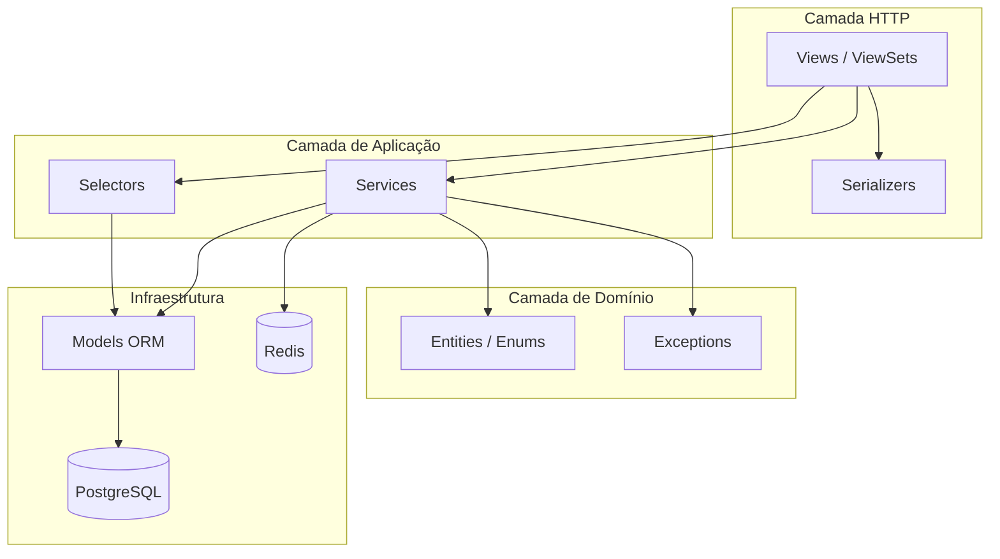

### 6.3 Onde Clean Architecture se Aplica

**Aplicar com rigor:**
- `orders` — máquina de estados, cálculos, validações
- `catalog` — motor de opções/modificadores, precificação
- `promotions` — regras de desconto

**Aplicar levemente (CRUD + services):**
- `companies` — configurações
- `customers` — cadastro

**Não over-engineer:**
- `notifications` — thin wrapper sobre Celery + templates
- `reports` — queries SQL/ORM agregadas

---

## 7. Estrutura de Pastas — Frontend

```
vendas_frontend/
├── docs/                            # Documentação da plataforma
│
├── public/
│   ├── favicon.ico
│   └── robots.txt
│
├── src/
│   ├── app/                         # Bootstrap da aplicação
│   │   ├── App.tsx
│   │   ├── providers.tsx            # QueryClient, Theme, Auth, Tenant
│   │   └── router.tsx               # Definição central de rotas
│   │
│   ├── apps/                        # Entrypoints por aplicação
│   │   ├── storefront/              # Área do Cliente
│   │   │   ├── main.tsx
│   │   │   ├── routes.tsx
│   │   │   └── layouts/
│   │   │       └── StorefrontLayout.tsx
│   │   └── backoffice/              # Painel Admin
│   │       ├── main.tsx
│   │       ├── routes.tsx
│   │       └── layouts/
│   │           ├── BackofficeLayout.tsx
│   │           └── AuthLayout.tsx
│   │
│   ├── features/                    # Módulos por domínio (feature-based)
│   │   ├── catalog/
│   │   │   ├── components/
│   │   │   │   ├── ProductCard.tsx
│   │   │   │   ├── ProductDetail.tsx
│   │   │   │   ├── OptionGroupSelector.tsx
│   │   │   │   └── CategoryNav.tsx
│   │   │   ├── hooks/
│   │   │   │   ├── useProducts.ts
│   │   │   │   ├── useCategories.ts
│   │   │   │   └── useProductOptions.ts
│   │   │   ├── api/
│   │   │   │   └── catalogApi.ts
│   │   │   ├── types/
│   │   │   │   └── catalog.types.ts
│   │   │   └── utils/
│   │   │       └── priceCalculator.ts
│   │   │
│   │   ├── cart/
│   │   ├── checkout/
│   │   ├── orders/
│   │   ├── auth/
│   │   ├── company/
│   │   ├── customers/
│   │   ├── promotions/
│   │   ├── dashboard/
│   │   └── settings/
│   │
│   ├── shared/                      # Código compartilhado entre apps
│   │   ├── components/
│   │   │   └── ui/                  # shadcn/ui (Button, Input, Dialog...)
│   │   ├── hooks/
│   │   │   ├── useDebounce.ts
│   │   │   ├── useMediaQuery.ts
│   │   │   └── useLocalStorage.ts
│   │   ├── lib/
│   │   │   ├── api-client.ts        # Axios/fetch configurado
│   │   │   ├── query-client.ts
│   │   │   └── utils.ts             # cn(), formatters
│   │   ├── types/
│   │   │   └── api.types.ts         # PaginatedResponse, ApiError
│   │   ├── constants/
│   │   └── config/
│   │       └── env.ts
│   │
│   ├── styles/
│   │   ├── globals.css
│   │   └── tokens.css               # CSS variables do design system
│   │
│   └── assets/
│       └── images/
│
├── index.html                       # Entry HTML (storefront)
├── index.admin.html                 # Entry HTML (backoffice) — opcional
├── vite.config.ts
├── vite.config.storefront.ts        # Build separado — opcional
├── vite.config.backoffice.ts
├── tailwind.config.ts
├── components.json                  # shadcn config
├── tsconfig.json
├── .env.example
└── package.json
```

### 7.1 Estratégia de Build: Um Repo, Dois Entrypoints

| Abordagem | Prós | Contras | Decisão |
|-----------|------|---------|---------|
| Um SPA com rotas `/` e `/admin` | Build único, simples | Bundle maior para consumidor | Aceitável no MVP |
| Dois builds Vite separados | Bundle otimizado por app | Dois deploys | ✅ Recomendado V1 |
| Dois repositórios frontend | Isolamento total | Duplicação de shared | ❌ |

**MVP:** Um SPA com code-splitting por rota (`React.lazy`).  
**V1:** Dois entrypoints Vite compartilhando `src/shared` e `src/features`.

### 7.2 Organização de Features (Frontend)

Cada feature é **autocontida**:

```
features/catalog/
├── components/     # UI específica do domínio
├── hooks/          # TanStack Query hooks
├── api/            # Funções que chamam a API
├── types/          # TypeScript interfaces
├── utils/          # Lógica pura (ex: cálculo de preço)
└── index.ts        # Public API da feature (barrel export)
```

**Regra:** Features importam de `shared/`, nunca de outras features diretamente. Comunicação cross-feature via router, context ou props do layout pai.

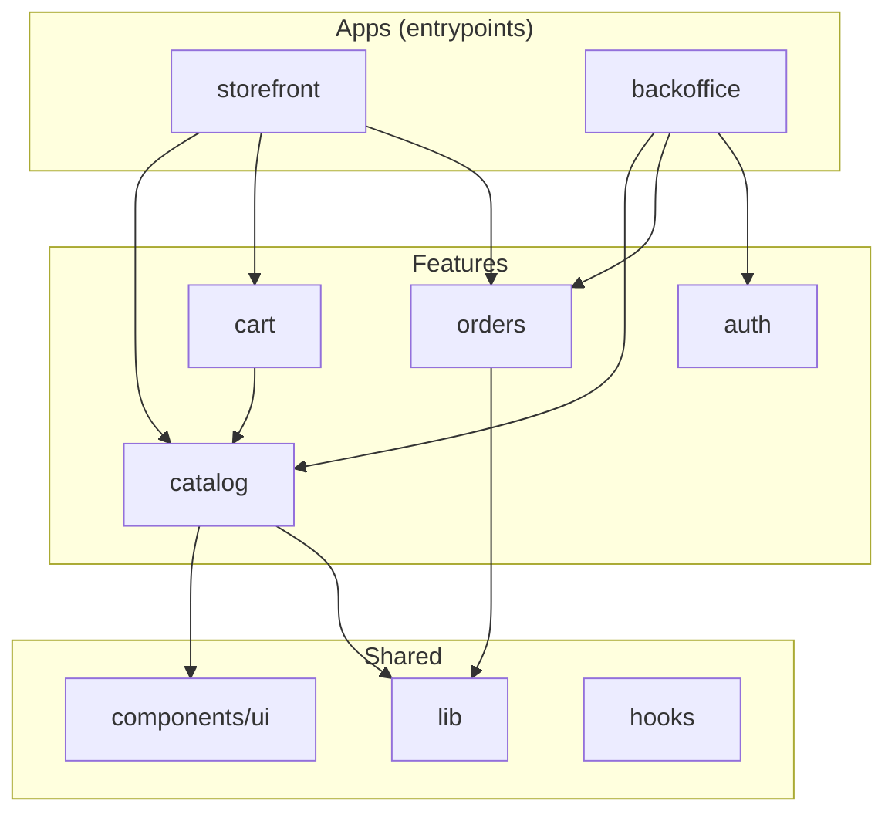

### 7.3 Organização de Hooks

| Tipo | Local | Exemplo | Responsabilidade |
|------|-------|---------|------------------|
| **Query hooks** | `features/*/hooks/` | `useProducts()` | TanStack Query: fetch, cache, invalidate |
| **Mutation hooks** | `features/*/hooks/` | `useCreateOrder()` | TanStack Query: POST/PUT/DELETE |
| **UI hooks** | `shared/hooks/` | `useDebounce()` | Sem side effect de API |
| **Auth hooks** | `features/auth/hooks/` | `useAuth()`, `usePermissions()` | Sessão, tenant ativo |
| **Form hooks** | Colocalizado | `useCheckoutForm()` | React Hook Form + Zod |

**Convenção de nomenclatura:**

```typescript
// Leitura
useProducts(filters?)       // lista
useProduct(id)              // detalhe
useCategories()             // lista

// Escrita
useCreateProduct()          // mutation
useUpdateOrderStatus()      // mutation

// UI
useCart()                   // estado local + sync (context ou zustand)
```

### 7.4 Organização de Serviços (API Client)

```
shared/lib/api-client.ts       # Instância base (baseURL, interceptors)
features/catalog/api/catalogApi.ts   # Endpoints do domínio
```

```typescript
// Conceito — catalogApi.ts
export const catalogApi = {
  getProducts: (params: ProductFilters) =>
    apiClient.get<PaginatedResponse<Product>>('/products/', { params }),

  getProduct: (id: string) =>
    apiClient.get<Product>(`/products/${id}/`),

  createProduct: (data: CreateProductDTO) =>
    apiClient.post<Product>('/products/', data),
};
```

**Interceptors do api-client:**
1. Injeta `Authorization: Bearer {token}`
2. Injeta `X-Tenant-ID` quando aplicável (backoffice)
3. Trata 401 → redirect login
4. Normaliza erros da API para `ApiError`

### 7.5 Organização de Rotas

**Storefront** (`apps/storefront/routes.tsx`):

| Rota | Página | Auth |
|------|--------|------|
| `/` | Home / Cardápio | Não |
| `/categoria/:slug` | Categoria | Não |
| `/produto/:slug` | Detalhe do produto | Não |
| `/carrinho` | Carrinho | Não |
| `/checkout` | Checkout | Opcional* |
| `/pedido/:id` | Acompanhamento | Opcional |
| `/login` | Login | Não |
| `/cadastro` | Registro | Não |
| `/conta` | Perfil | Sim |
| `/conta/pedidos` | Histórico | Sim |

*Checkout permite guest checkout no MVP; login opcional.

**Backoffice** (`apps/backoffice/routes.tsx`):

| Rota | Página | Permissão |
|------|--------|-----------|
| `/login` | Login | Público |
| `/` | Dashboard | `dashboard.view` |
| `/pedidos` | Lista de pedidos | `orders.view` |
| `/pedidos/:id` | Detalhe do pedido | `orders.view` |
| `/catalogo/produtos` | Produtos | `catalog.view` |
| `/catalogo/categorias` | Categorias | `catalog.view` |
| `/catalogo/opcoes` | Grupos de opções | `catalog.manage` |
| `/clientes` | Clientes | `customers.view` |
| `/configuracoes` | Empresa | `settings.manage` |

**Route guards:**

```typescript
// Conceito
<Route element={<RequireAuth />}>
  <Route element={<RequirePermission permission="orders.view" />}>
    <Route path="/pedidos" element={<OrdersPage />} />
  </Route>
</Route>
```

### 7.6 Gerenciamento de Estado

| Tipo de estado | Ferramenta | Exemplo |
|----------------|------------|---------|
| **Server state** | TanStack Query | Produtos, pedidos, categorias |
| **Auth / Session** | React Context | Usuário logado, tenant ativo |
| **Cart (cliente)** | Zustand ou Context + localStorage | Carrinho persistente |
| **UI local** | useState / useReducer | Modal aberto, step do checkout |
| **Formulários** | React Hook Form | Checkout, cadastro de produto |

**Não usar Redux** — TanStack Query + Context/Zustand cobrem todos os casos com menos boilerplate.

---

## 8. Clean Architecture e Camadas

### 8.1 Mapeamento Clean Architecture → Projeto

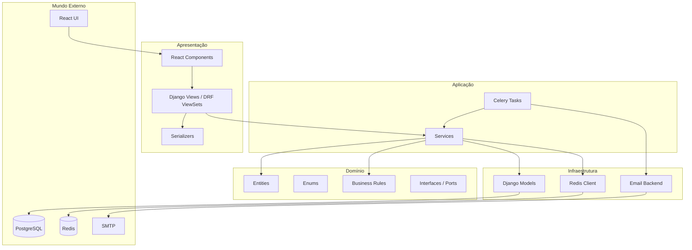

### 8.2 Regra de Dependência

```
Apresentação → Aplicação → Domínio ← Infraestrutura
```

- **Domínio** não importa Django, DRF, Redis
- **Services** orquestram domínio + infraestrutura
- **Views** nunca contêm regra de negócio
- **Serializers** validam formato, não regras complexas (delegam ao service)

### 8.3 Exemplo: Criar Pedido

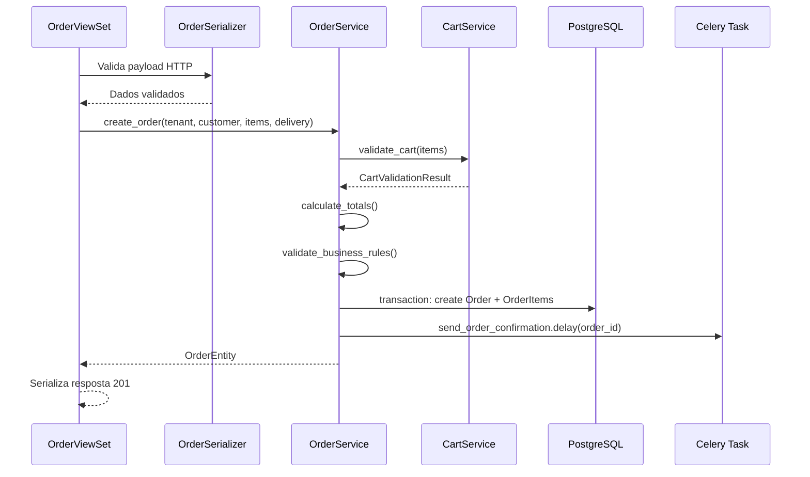

---

## 9. Módulos de Domínio

### 9.1 Mapa de Módulos

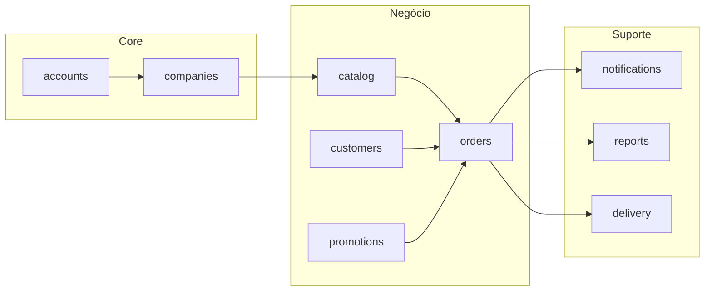

### 9.2 Responsabilidade por Módulo

| Módulo | Entidades principais | Responsabilidade |
|--------|---------------------|------------------|
| **accounts** | User, RefreshToken | Autenticação, perfis de sistema |
| **companies** | Company, CompanySettings, BusinessHours | Tenant, configurações, horários |
| **catalog** | Category, Product, OptionGroup, Option | Cardápio, personalização, preços |
| **orders** | Order, OrderItem, OrderItemOption | Pedidos, status, totais |
| **customers** | Customer, Address | Clientes finais, endereços |
| **promotions** | Coupon, Promotion | Descontos, regras promocionais |
| **delivery** | Delivery, Driver | Entregas, rastreamento (V2) |
| **notifications** | NotificationLog | E-mail, push, templates |
| **reports** | — (queries) | Agregações, dashboards |

### 9.3 Dependências entre Módulos

| Módulo | Pode depender de | Não pode depender de |
|--------|------------------|---------------------|
| catalog | companies, core | orders, promotions |
| orders | catalog, customers, companies | reports |
| promotions | catalog, orders | delivery |
| reports | orders, catalog, customers | — (somente leitura) |

**Comunicação entre módulos:** via **services públicos** do módulo, nunca importando models de outro app diretamente em views. Exceção pragmática: Foreign Keys no ORM (inevitável no Django).

---

## 10. Autenticação e Autorização

### 10.1 Estratégia de Autenticação

**JWT (JSON Web Tokens)** com refresh token rotation.

| Aspecto | Decisão |
|---------|---------|
| Access Token | Vida curta (15 min) |
| Refresh Token | Vida longa (7 dias), armazenado em httpOnly cookie ou localStorage |
| Algoritmo | HS256 (MVP) → RS256 (produção escalada) |
| Biblioteca backend | `djangorestframework-simplejwt` |
| Claims customizados | `tenant_id`, `role`, `permissions[]` |

### 10.2 Fluxos de Autenticação

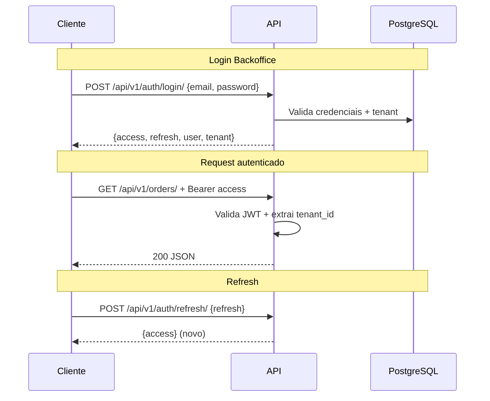

### 10.3 Dois Tipos de Usuário

| Tipo | Onde | Auth | Vinculação |
|------|------|------|------------|
| **Customer** | Storefront | JWT ou sessão guest | `customers` table, escopo ao tenant |
| **Employee** | Backoffice | JWT obrigatório | `employees` table, role + permissions |

**Tabelas separadas** (não um User genérico com `type`):

- `Customer` — consumidor final, pode existir em múltiplos tenants com contas distintas
- `Employee` — funcionário vinculado a um tenant, com role

**Alternativa considerada:** Single `User` model com `user_type`. Rejeitada porque Customer e Employee têm ciclos de vida, campos e permissões fundamentalmente diferentes.

### 10.4 Guest Checkout (MVP)

Consumidor pode pedir sem criar conta:
- Carrinho em localStorage
- Checkout com nome, telefone, endereço
- `Customer` criado implicitamente (ou registro opcional pós-pedido)
- Sem JWT até criar conta

### 10.5 Segurança dos Tokens

| Medida | Implementação |
|--------|---------------|
| HTTPS obrigatório | Nginx TLS |
| Refresh rotation | Cada refresh invalida o anterior |
| Blacklist de tokens | Redis (logout) |
| Rate limiting login | 5 tentativas / minuto por IP |
| CORS restrito | Origens do tenant + admin |

---

## 11. Estratégia de Permissões

### 11.1 Modelo RBAC (Role-Based Access Control)

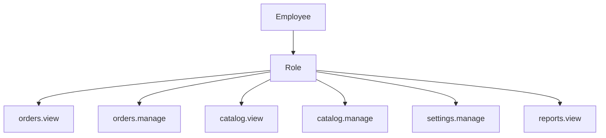

### 11.2 Roles Padrão

| Role | Descrição | Permissões |
|------|-----------|------------|
| **owner** | Dono do estabelecimento | Todas |
| **manager** | Gerente | Todas exceto `settings.manage` e billing |
| **operator** | Atendente | `orders.*`, `catalog.view` |
| **kitchen** | Cozinha | `orders.view`, `orders.update_status` |
| **driver** | Entregador | `orders.view`, `delivery.manage` (V2) |

### 11.3 Implementação

**Backend:**

```python
# Conceito
class HasPermission(BasePermission):
    def __init__(self, permission: str):
        self.permission = permission

    def has_permission(self, request, view):
        return request.user.employee.has_permission(self.permission)
```

**Frontend:**

```typescript
// Conceito
function usePermissions() {
  const { user } = useAuth();
  const can = (permission: string) => user?.permissions.includes(permission);
  return { can };
}

// Uso
{can('catalog.manage') && <Button>Novo Produto</Button>}
```

### 11.4 Matriz de Permissões (MVP)

| Permissão | owner | manager | operator | kitchen |
|-----------|-------|---------|----------|---------|
| `dashboard.view` | ✅ | ✅ | ✅ | ❌ |
| `orders.view` | ✅ | ✅ | ✅ | ✅ |
| `orders.manage` | ✅ | ✅ | ✅ | ❌ |
| `orders.update_status` | ✅ | ✅ | ✅ | ✅ |
| `catalog.view` | ✅ | ✅ | ✅ | ❌ |
| `catalog.manage` | ✅ | ✅ | ❌ | ❌ |
| `customers.view` | ✅ | ✅ | ✅ | ❌ |
| `settings.manage` | ✅ | ❌ | ❌ | ❌ |
| `employees.manage` | ✅ | ❌ | ❌ | ❌ |

---

## 12. API REST e Contratos

### 12.1 Convenções

| Aspecto | Padrão |
|---------|--------|
| Base URL | `/api/v1/` |
| Formato | JSON |
| IDs | UUID v4 |
| Datas | ISO 8601 UTC (`2026-07-06T17:30:00Z`) |
| Paginação | `?page=1&page_size=20` → `{count, next, previous, results}` |
| Filtros | `?status=pending&created_after=2026-01-01` |
| Ordenação | `?ordering=-created_at` |
| Erros | `{ "detail": "...", "code": "...", "fields": {...} }` |
| Versionamento | URL path (`/v1/`) |

### 12.2 Prefixos por Contexto

| Prefixo | Contexto | Auth |
|---------|----------|------|
| `/api/v1/public/` | Storefront (tenant via subdomínio) | Opcional |
| `/api/v1/admin/` | Backoffice | JWT obrigatório |
| `/api/v1/auth/` | Login, refresh, registro | Variável |

### 12.3 Documentação da API

- **MVP:** Documento `07-api.md` como contrato
- **V1:** OpenAPI 3.0 via `drf-spectacular` → Swagger UI em `/api/docs/`
- **Futuro:** Geração de tipos TypeScript a partir do schema

> Detalhamento completo de endpoints no documento **07-api.md**.

---

## 13. Cache, Filas e Processamento Assíncrono

### 13.1 Redis — Usos

| Uso | Padrão de chave | TTL |
|-----|-----------------|-----|
| Cache de cardápio | `tenant:{id}:catalog:*` | 5 min |
| Cache de settings | `tenant:{id}:settings` | 15 min |
| Sessão / blacklist JWT | `jwt:blacklist:{jti}` | = vida do token |
| Rate limiting | `ratelimit:{ip}:{endpoint}` | 1 min |
| Broker Celery | `celery:*` | — |
| Carrinho guest (opcional) | `cart:{session_id}` | 24h |

### 13.2 Celery — Tarefas

| Task | Trigger | Prioridade |
|------|---------|------------|
| `send_order_confirmation` | Pedido criado | Alta |
| `send_order_status_update` | Status alterado | Alta |
| `generate_report` | Solicitação manual | Baixa |
| `cleanup_expired_carts` | Celery Beat (diário) | Baixa |
| `send_employee_invite` | Convite criado | Média |

### 13.3 Diagrama Async

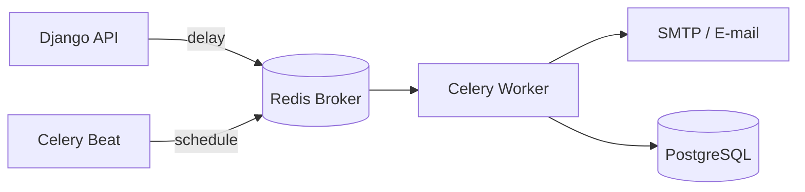

---

## 14. Estratégia de Escalabilidade

### 14.1 Fases de Escala

```mermaid
graph LR
    subgraph FASE1["Fase 1 — MVP"]
        direction TB
        F1A[1 VPS]
        F1B[1 Django]
        F1C[1 PostgreSQL]
        F1D[1 Redis]
    end

    subgraph FASE2["Fase 2 — 10-50 tenants"]
        direction TB
        F2A[1 VPS maior]
        F2B[2+ Gunicorn workers]
        F2C[PG tuning + índices]
        F2D[CDN para media]
    end

    subgraph FASE3["Fase 3 — 50-500 tenants"]
        direction TB
        F3A[API em container separado]
        F3B[Read replica PG]
        F3C[Redis Cluster]
        F3D[S3 para media]
        F3E[Horizontal workers]
    end

    subgraph FASE4["Fase 4 — 500+ tenants"]
        direction TB
        F4A[Kubernetes / ECS]
        F4B[PG sharding ou Citus]
        F4C[CDN global]
        F4D[Microserviços seletivos]
    end

    FASE1 --> FASE2 --> FASE3 --> FASE4
```

### 14.2 Otimizações desde o MVP

| Área | Estratégia |
|------|------------|
| **Banco** | Índices compostos `(tenant_id, ...)` em todas as tabelas de negócio |
| **API** | `select_related` / `prefetch_related` em toda listagem |
| **API** | Paginação obrigatória (max 100 items) |
| **Frontend** | Code splitting por rota (`React.lazy`) |
| **Frontend** | TanStack Query com `staleTime` agressivo para cardápio |
| **Frontend** | Imagens WebP, lazy loading, skeleton |
| **Cache** | Cardápio e categorias em Redis |
| **CDN** | Media servida via CDN (V1) |
| **Nginx** | Gzip/Brotli, cache de assets estáticos |

### 14.3 Índices Críticos (Conceito)

```sql
-- Toda tabela de negócio
CREATE INDEX idx_products_tenant ON products (tenant_id, is_active);
CREATE INDEX idx_orders_tenant_status ON orders (tenant_id, status, created_at DESC);
CREATE INDEX idx_orders_tenant_date ON orders (tenant_id, created_at DESC);
CREATE UNIQUE INDEX idx_companies_subdomain ON companies (subdomain);
CREATE UNIQUE INDEX idx_companies_slug ON companies (tenant_id, slug);
```

---

## 15. Infraestrutura e Deploy

### 15.1 Docker Compose (Produção MVP)

```yaml
# Conceito — docker-compose.yml
services:
  nginx:
    image: nginx:alpine
    ports: ["443:443", "80:80"]
    volumes: [./nginx.conf, ./certs, static_volume, media_volume]

  web:
    build: .
    command: gunicorn config.wsgi:application --workers 3
    volumes: [media_volume]
    env_file: .env
    depends_on: [db, redis]

  celery:
    build: .
    command: celery -A config worker -l info
    env_file: .env
    depends_on: [db, redis]

  celery-beat:
    build: .
    command: celery -A config beat -l info
    env_file: .env
    depends_on: [redis]

  db:
    image: postgres:16-alpine
    volumes: [pgdata]
    environment:
      POSTGRES_DB: foodservice
      POSTGRES_USER: ${DB_USER}
      POSTGRES_PASSWORD: ${DB_PASSWORD}

  redis:
    image: redis:7-alpine
    volumes: [redisdata]
```

### 15.2 CI/CD (GitHub Actions)

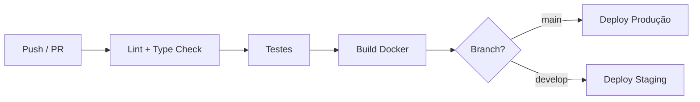

| Pipeline | Trigger | Steps |
|----------|---------|-------|
| **Backend CI** | PR + push | ruff, pytest, coverage |
| **Frontend CI** | PR + push | eslint, tsc, vitest |
| **Deploy** | merge em `main` | build → push image → SSH deploy |

### 15.3 Ambientes

| Ambiente | Propósito | URL |
|----------|-----------|-----|
| **development** | Local (Docker Compose dev) | `localhost:5174` / `localhost:5175` / `localhost:8001` |
| **staging** | Testes integrados | `staging.foodservice.app` |
| **production** | Clientes reais | `*.foodservice.app` |

### 15.4 Variáveis de Ambiente

```
# Backend (.env.example)
DJANGO_SECRET_KEY=
DJANGO_DEBUG=False
DJANGO_ALLOWED_HOSTS=.foodservice.app
DATABASE_URL=postgres://user:pass@db:5432/foodservice
REDIS_URL=redis://redis:6379/0
CELERY_BROKER_URL=redis://redis:6379/1
JWT_ACCESS_LIFETIME_MINUTES=15
JWT_REFRESH_LIFETIME_DAYS=7
CORS_ALLOWED_ORIGINS=https://*.foodservice.app
MEDIA_URL=/media/
DEFAULT_FROM_EMAIL=noreply@foodservice.app

# Frontend (.env.example)
VITE_API_URL=https://api.foodservice.app/api/v1
VITE_APP_NAME=Food Service
```

---

## 16. Integrações Futuras

### 16.1 Mapa de Integrações

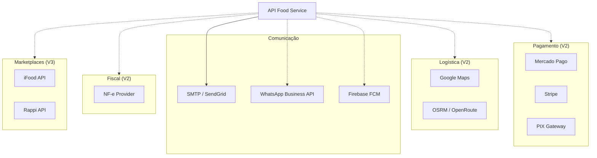

### 16.2 Padrão de Integração: Ports & Adapters

Para cada integração futura, definir uma **port** (interface) no domínio e um **adapter** na infraestrutura:

```
apps/payments/
├── domain/
│   └── interfaces.py          # PaymentGateway (ABC)
├── services/
│   └── payment_service.py     # Usa PaymentGateway
└── infrastructure/
    ├── mercado_pago.py        # MercadoPagoGateway(PaymentGateway)
    └── stripe_gateway.py      # StripeGateway(PaymentGateway)
```

**Vantagem:** Trocar provider sem alterar regras de negócio. Testar com mock.

### 16.3 Webhooks (Futuro)

Endpoint genérico para receber eventos externos:

```
POST /api/v1/webhooks/{provider}/
```

Providers: `mercadopago`, `stripe`, `ifood`. Validação de assinatura por provider.

---

## 17. Segurança

### 17.1 Checklist de Segurança

| Área | Medida |
|------|--------|
| **Transporte** | TLS 1.2+ obrigatório |
| **Autenticação** | JWT com refresh rotation, bcrypt para senhas |
| **Autorização** | RBAC + tenant isolation em toda query |
| **Input** | Validação Zod (frontend) + Serializer (backend) |
| **SQL** | ORM Django (sem raw SQL sem parametrização) |
| **XSS** | React escapa por padrão; sanitizar HTML rico (futuro) |
| **CSRF** | Não aplicável à API JWT; cookie CSRF se sessão |
| **Rate Limiting** | DRF throttling + Redis |
| **Headers** | `X-Content-Type-Options`, `X-Frame-Options`, CSP |
| **Upload** | Validar MIME type, limitar tamanho, storage isolado |
| **Secrets** | `.env` nunca no Git; GitHub Secrets no CI |
| **Dependências** | `dependabot` / `safety check` no CI |

### 17.2 Testes de Isolamento de Tenant

Obrigatório em CI:

```python
# Conceito — test_tenant_isolation.py
def test_tenant_a_cannot_see_tenant_b_orders():
    order_a = create_order(tenant=tenant_a)
    with tenant_context(tenant_b):
        with pytest.raises(Order.DoesNotExist):
            Order.objects.get(id=order_a.id)
```

---

## 18. Observabilidade

### 18.1 MVP (Mínimo)

| Ferramenta | Uso |
|------------|-----|
| **Django logging** | Arquivo + stdout estruturado (JSON) |
| **Sentry** | Erros frontend + backend |
| **Health check** | `GET /api/v1/health/` → `{status: "ok"}` |
| **Docker logs** | `docker compose logs -f` |

### 18.2 V1+

| Ferramenta | Uso |
|------------|-----|
| **Prometheus + Grafana** | Métricas de API (latência, throughput) |
| **Loki** | Agregação de logs |
| **Uptime monitoring** | UptimeRobot / Better Uptime |
| **APM** | Sentry Performance ou Datadog |

### 18.3 Logs Estruturados

```json
{
  "timestamp": "2026-07-06T17:30:00Z",
  "level": "INFO",
  "message": "Order created",
  "tenant_id": "uuid",
  "order_id": "uuid",
  "user_id": "uuid",
  "duration_ms": 45
}
```

---

## 19. Decisões Arquiteturais (ADRs)

### ADR-001: Shared Schema Multi-Tenant

| | |
|---|---|
| **Status** | Aceito |
| **Contexto** | Precisamos isolar dados de centenas de estabelecimentos |
| **Decisão** | Shared database, shared schema, `tenant_id` em todas as tabelas |
| **Alternativas** | DB por tenant, schema por tenant (django-tenants) |
| **Consequências** | Discipline em queries; managers customizados; testes de isolamento |

### ADR-002: Modular Monolith

| | |
|---|---|
| **Status** | Aceito |
| **Contexto** | Um desenvolvedor, MVP rápido, escala inicial modesta |
| **Decisão** | Monólito Django modularizado em apps de domínio |
| **Alternativas** | Microserviços, serverless |
| **Consequências** | Deploy simples; extração futura possível por app |

### ADR-003: JWT para Autenticação

| | |
|---|---|
| **Status** | Aceito |
| **Contexto** | API REST consumida por SPA, futuros apps móveis |
| **Decisão** | JWT com refresh token via `simplejwt` |
| **Alternativas** | Session-based, OAuth2 provider |
| **Consequências** | Stateless API; gestão de refresh e blacklist |

### ADR-004: TanStack Query para Server State

| | |
|---|---|
| **Status** | Aceito |
| **Contexto** | SPA React com muitas chamadas à API |
| **Decisão** | TanStack Query para cache, sync e mutations |
| **Alternativas** | Redux Toolkit Query, SWR, Apollo |
| **Consequências** | Menos boilerplate; cache automático; devtools |

### ADR-005: Subdomínio para Resolução de Tenant (Storefront)

| | |
|---|---|
| **Status** | Aceito |
| **Contexto** | Cada estabelecimento precisa de URL própria |
| **Decisão** | `{slug}.foodservice.app` resolve tenant no middleware |
| **Alternativas** | Path-based, header-based |
| **Consequências** | Wildcard DNS + TLS; config Nginx |

### ADR-006: Sem Processamento de Pagamento no MVP

| | |
|---|---|
| **Status** | Aceito |
| **Contexto** | MVP valida fluxo operacional, não financeiro |
| **Decisão** | Pagamento manual na entrega (dinheiro, PIX, cartão) |
| **Alternativas** | Integrar Mercado Pago no MVP |
| **Consequências** | Sem compliance PCI no MVP; gateway em V2 |

### ADR-007: Feature-Based Frontend

| | |
|---|---|
| **Status** | Aceito |
| **Contexto** | Dois apps (storefront + backoffice) com domínios compartilhados |
| **Decisão** | Pastas por feature em `src/features/`, shared em `src/shared/` |
| **Alternativas** | Layer-based (components/hooks/pages), atomic design puro |
| **Consequências** | Colocation; imports unidirecionais feature → shared |

---

## 20. Próximos Documentos

| # | Documento | Relação com este |
|---|-----------|------------------|
| 03 | `03-modelagem-do-banco.md` | Detalha entidades referenciadas aqui |
| 05 | `05-frontend.md` | Expande estrutura e padrões React |
| 06 | `06-backend.md` | Expande estrutura e padrões Django |
| 07 | `07-api.md` | Contratos REST detalhados |
| 10 | `10-padroes-de-codigo.md` | Convenções de nomenclatura e Git |

---

## Histórico de Revisões

| Versão | Data | Autor | Alterações |
|--------|------|-------|------------|
| 1.0 | Jul/2026 | — | Versão inicial — aprovado |

---

> **Documento aprovado.** Próximo: `03-modelagem-do-banco.md`.
