# 03 — Modelagem do Banco de Dados

> **Documento:** Modelagem do Banco de Dados  
> **Produto:** Food Service *(nome comercial provisório)*  
> **Versão:** 1.0  
> **Status:** Aprovado  
> **Última atualização:** Julho/2026  
> **Depende de:** `01-visao-do-produto.md`, `02-arquitetura.md` (aprovados)  
> **SGBD:** PostgreSQL 16+

---

## Sumário

1. [Visão Geral](#1-visão-geral)
2. [Convenções Globais](#2-convenções-globais)
3. [Diagrama ER Completo](#3-diagrama-er-completo)
4. [Módulo: Empresa (Tenant)](#4-módulo-empresa-tenant)
5. [Módulo: Contas e Funcionários](#5-módulo-contas-e-funcionários)
6. [Módulo: Clientes](#6-módulo-clientes)
7. [Módulo: Catálogo](#7-módulo-catálogo)
8. [Módulo: Pedidos](#8-módulo-pedidos)
9. [Módulo: Pagamentos](#9-módulo-pagamentos)
10. [Módulo: Entrega](#10-módulo-entrega)
11. [Módulo: Promoções](#11-módulo-promoções)
12. [Módulo: Notificações](#12-módulo-notificações)
13. [Módulo: Fidelidade (Futuro)](#13-módulo-fidelidade-futuro)
14. [Enums e Tipos](#14-enums-e-tipos)
15. [Índices e Performance](#15-índices-e-performance)
16. [Integridade e Constraints](#16-integridade-e-constraints)
17. [Padrão de Snapshot em Pedidos](#17-padrão-de-snapshot-em-pedidos)
18. [Soft Delete e Auditoria](#18-soft-delete-e-auditoria)
19. [Escopo por Fase](#19-escopo-por-fase)
20. [Migrations e Versionamento](#20-migrations-e-versionamento)
21. [Próximos Documentos](#21-próximos-documentos)

---

## 1. Visão Geral

### 1.1 Objetivo

Este documento define o **modelo de dados completo** do Food Service — entidades, relacionamentos, responsabilidades, regras de negócio refletidas no schema e estratégias de performance para centenas ou milhares de tenants.

### 1.2 Princípios de Modelagem

| Princípio | Aplicação |
|-----------|-----------|
| **Genérico** | Nenhuma tabela `pizzas`, `hamburgueres`, `acais` — apenas `products`, `option_groups`, `options` |
| **Multi-tenant** | Toda tabela de negócio possui `tenant_id` FK para `companies` |
| **Snapshot em pedidos** | Preços e nomes são congelados no momento do pedido |
| **UUID como PK** | Todas as PKs são `UUID v4` — sem expor sequência interna |
| **Imutabilidade parcial** | Pedidos confirmados não alteram itens; apenas status evolui |
| **Normalização com pragmatismo** | Catálogo normalizado; pedidos desnormalizados para histórico |
| **Extensibilidade** | Campos JSONB para configurações flexíveis sem migrations frequentes |

### 1.3 Módulos e Tabelas

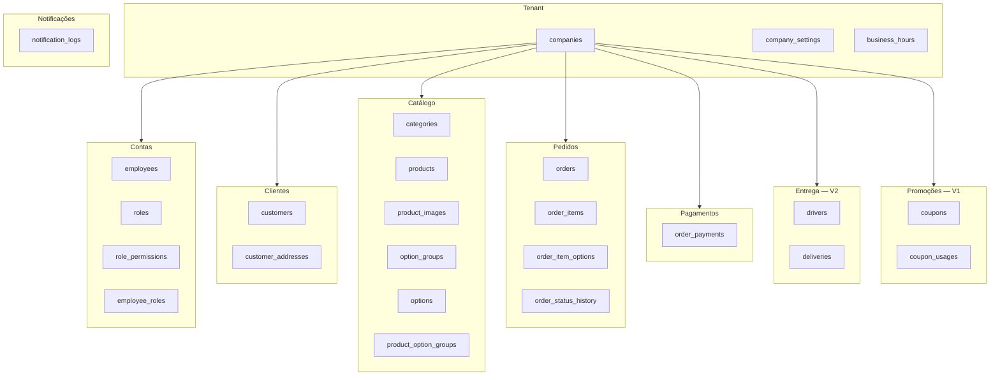

---

## 2. Convenções Globais

### 2.1 Campos Padrão (BaseModel)

Toda tabela herda estes campos via `core.models.BaseModel`:

| Campo | Tipo | Descrição |
|-------|------|-----------|
| `id` | `UUID` | PK, `gen_random_uuid()` |
| `created_at` | `TIMESTAMPTZ` | Criação, `now()` |
| `updated_at` | `TIMESTAMPTZ` | Última atualização, auto |

### 2.2 Campos Padrão (TenantAwareModel)

Tabelas de negócio herdam também:

| Campo | Tipo | Descrição |
|-------|------|-----------|
| `tenant_id` | `UUID` | FK → `companies.id`, `NOT NULL`, `ON DELETE CASCADE` |

### 2.3 Nomenclatura

| Elemento | Convenção | Exemplo |
|----------|-----------|---------|
| Tabelas | `snake_case`, plural | `order_items` |
| Colunas | `snake_case` | `unit_price` |
| PKs | `id` | `id` |
| FKs | `{entidade}_id` | `customer_id` |
| Índices | `idx_{tabela}_{colunas}` | `idx_orders_tenant_status` |
| Enums DB | `snake_case` tipo PostgreSQL | `order_status` |
| Constraints | `{tabela}_{descricao}` | `orders_positive_total` |

### 2.4 Tipos Monetários

| Campo | Tipo | Regra |
|-------|------|-------|
| Preços, totais | `NUMERIC(10, 2)` | Sempre 2 casas decimais |
| Moeda | `VARCHAR(3)` | Default `'BRL'` |
| Armazenamento | Centavos **não** usados | `NUMERIC` direto em reais |

> **Justificativa:** `NUMERIC(10,2)` evita erros de ponto flutuante. Para escala futura com múltiplas moedas, `currency` já está previsto.

### 2.5 Diagrama de Herança de Models

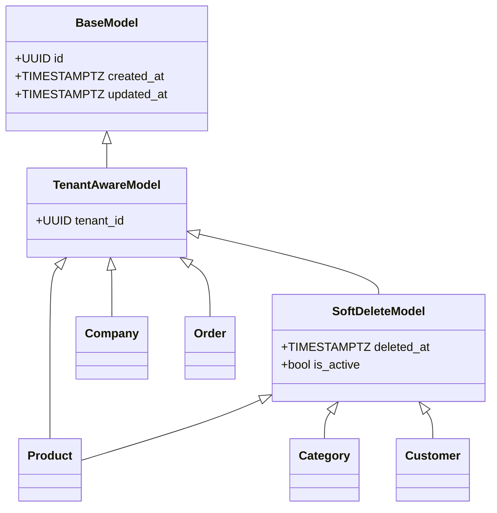

---

## 3. Diagrama ER Completo

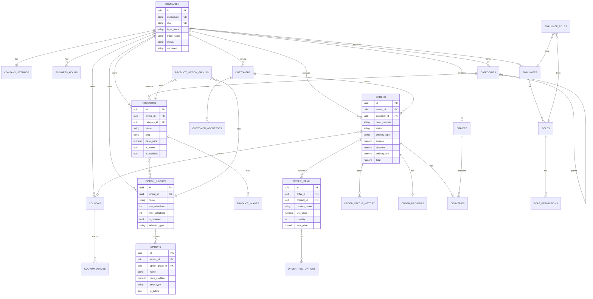

---

## 4. Módulo: Empresa (Tenant)

O módulo `companies` representa o **tenant** — cada estabelecimento cadastrado na plataforma.

### 4.1 `companies`

Entidade raiz do multi-tenant. Toda a operação de um estabelecimento gira em torno desta tabela.

| Coluna | Tipo | Null | Default | Descrição |
|--------|------|------|---------|-----------|
| `id` | `UUID` | NO | `gen_random_uuid()` | PK |
| `subdomain` | `VARCHAR(63)` | NO | — | Subdomínio único global (`pizzaria-joao`) |
| `slug` | `VARCHAR(100)` | NO | — | Slug para URLs (`pizzaria-joao`) |
| `legal_name` | `VARCHAR(255)` | NO | — | Razão social |
| `trade_name` | `VARCHAR(255)` | NO | — | Nome fantasia (exibido no storefront) |
| `document` | `VARCHAR(18)` | YES | — | CNPJ ou CPF |
| `email` | `VARCHAR(254)` | NO | — | E-mail principal |
| `phone` | `VARCHAR(20)` | YES | — | Telefone principal |
| `status` | `company_status` | NO | `'active'` | `active`, `inactive`, `suspended`, `trial` |
| `logo_url` | `VARCHAR(500)` | YES | — | URL do logo |
| `cover_url` | `VARCHAR(500)` | YES | — | Imagem de capa do storefront |
| `description` | `TEXT` | YES | — | Descrição do estabelecimento |
| `timezone` | `VARCHAR(50)` | NO | `'America/Sao_Paulo'` | Fuso horário |
| `created_at` | `TIMESTAMPTZ` | NO | `now()` | — |
| `updated_at` | `TIMESTAMPTZ` | NO | `now()` | — |

**Índices:**
- `UNIQUE (subdomain)`
- `UNIQUE (slug)`
- `INDEX (status)`

**Regras:**
- `subdomain` aceita apenas `[a-z0-9-]`, 3–63 caracteres
- `subdomain` é imutável após criação (ou alteração apenas por Super Admin)
- `status = suspended` bloqueia storefront e novos pedidos
- `companies` **não** possui `tenant_id` — é a própria raiz do tenant

---

### 4.2 `company_settings`

Configurações operacionais do estabelecimento. Relação 1:1 com `companies`.

| Coluna | Tipo | Null | Default | Descrição |
|--------|------|------|---------|-----------|
| `id` | `UUID` | NO | — | PK |
| `tenant_id` | `UUID` | NO | — | FK → `companies.id` UNIQUE |
| `min_order_value` | `NUMERIC(10,2)` | NO | `0` | Pedido mínimo |
| `delivery_fee` | `NUMERIC(10,2)` | NO | `0` | Taxa de entrega padrão |
| `free_delivery_above` | `NUMERIC(10,2)` | YES | — | Entrega grátis acima de |
| `estimated_prep_time` | `INT` | NO | `30` | Tempo estimado de preparo (min) |
| `estimated_delivery_time` | `INT` | NO | `45` | Tempo estimado de entrega (min) |
| `accepts_delivery` | `BOOLEAN` | NO | `true` | Aceita delivery |
| `accepts_pickup` | `BOOLEAN` | NO | `true` | Aceita retirada |
| `accepts_dine_in` | `BOOLEAN` | NO | `false` | Aceita consumo no local (futuro) |
| `is_open` | `BOOLEAN` | NO | `true` | Loja aberta manualmente |
| `auto_close_outside_hours` | `BOOLEAN` | NO | `true` | Fechar fora do horário |
| `payment_methods` | `JSONB` | NO | `'["cash","pix","card_on_delivery"]'` | Formas aceitas |
| `delivery_areas` | `JSONB` | YES | — | Áreas/bairros atendidos (futuro) |
| `theme` | `JSONB` | YES | — | Cores, fontes (white-label futuro) |
| `notification_settings` | `JSONB` | YES | — | Preferências de notificação |
| `created_at` | `TIMESTAMPTZ` | NO | — | — |
| `updated_at` | `TIMESTAMPTZ` | NO | — | — |

**Regras:**
- Criada automaticamente ao criar `companies` (signal)
- `payment_methods` no MVP: `cash`, `pix`, `card_on_delivery` — sem gateway
- `is_open = false` exibe aviso no storefront mas não bloqueia navegação

---

### 4.3 `business_hours`

Horário de funcionamento por dia da semana.

| Coluna | Tipo | Null | Default | Descrição |
|--------|------|------|---------|-----------|
| `id` | `UUID` | NO | — | PK |
| `tenant_id` | `UUID` | NO | — | FK → `companies.id` |
| `day_of_week` | `SMALLINT` | NO | — | 0=Segunda … 6=Domingo |
| `opens_at` | `TIME` | NO | — | Horário de abertura |
| `closes_at` | `TIME` | NO | — | Horário de fechamento |
| `is_closed` | `BOOLEAN` | NO | `false` | Dia fechado |
| `created_at` | `TIMESTAMPTZ` | NO | — | — |
| `updated_at` | `TIMESTAMPTZ` | NO | — | — |

**Índices:**
- `UNIQUE (tenant_id, day_of_week)`

**Regras:**
- Máximo 7 registros por tenant (um por dia)
- `closes_at` pode ser menor que `opens_at` (ex: 18:00–02:00 = madrugada)
- Service layer valida se loja está aberta combinando `business_hours` + `company_settings.is_open`

```mermaid
erDiagram
    COMPANIES ||--|| COMPANY_SETTINGS : "1:1"
    COMPANIES ||--|{ BUSINESS_HOURS : "1:7"

    COMPANIES {
        uuid id PK
        string subdomain UK
        string trade_name
        company_status status
    }

    COMPANY_SETTINGS {
        uuid id PK
        uuid tenant_id UK_FK
        numeric min_order_value
        boolean accepts_delivery
        jsonb payment_methods
    }

    BUSINESS_HOURS {
        uuid id PK
        uuid tenant_id FK
        smallint day_of_week
        time opens_at
        time closes_at
    }
```

---

## 5. Módulo: Contas e Funcionários

Funcionários do estabelecimento que acessam o **Backoffice**. Separados de `customers`.

### 5.1 `employees`

| Coluna | Tipo | Null | Default | Descrição |
|--------|------|------|---------|-----------|
| `id` | `UUID` | NO | — | PK |
| `tenant_id` | `UUID` | NO | — | FK → `companies.id` |
| `email` | `VARCHAR(254)` | NO | — | Login |
| `password_hash` | `VARCHAR(255)` | NO | — | bcrypt |
| `first_name` | `VARCHAR(100)` | NO | — | — |
| `last_name` | `VARCHAR(100)` | NO | — | — |
| `phone` | `VARCHAR(20)` | YES | — | — |
| `is_active` | `BOOLEAN` | NO | `true` | — |
| `is_owner` | `BOOLEAN` | NO | `false` | Dono do estabelecimento |
| `last_login_at` | `TIMESTAMPTZ` | YES | — | — |
| `created_at` | `TIMESTAMPTZ` | NO | — | — |
| `updated_at` | `TIMESTAMPTZ` | NO | — | — |

**Índices:**
- `UNIQUE (tenant_id, email)`
- `INDEX (tenant_id, is_active)`

**Regras:**
- E-mail único **dentro do tenant** (mesmo e-mail pode existir em tenants diferentes)
- Primeiro employee criado no onboarding tem `is_owner = true`
- `is_owner` tem todas as permissões implicitamente
- Autenticação via JWT com `employee_id` e `tenant_id` nos claims

---

### 5.2 `roles`

Papéis de acesso configuráveis por tenant.

| Coluna | Tipo | Null | Default | Descrição |
|--------|------|------|---------|-----------|
| `id` | `UUID` | NO | — | PK |
| `tenant_id` | `UUID` | NO | — | FK → `companies.id` |
| `name` | `VARCHAR(50)` | NO | — | `owner`, `manager`, `operator`, `kitchen` |
| `display_name` | `VARCHAR(100)` | NO | — | Nome exibido |
| `is_system` | `BOOLEAN` | NO | `false` | Role padrão do sistema (não deletável) |
| `created_at` | `TIMESTAMPTZ` | NO | — | — |
| `updated_at` | `TIMESTAMPTZ` | NO | — | — |

**Índices:**
- `UNIQUE (tenant_id, name)`

**Regras:**
- Roles de sistema são criadas no onboarding (`owner`, `manager`, `operator`, `kitchen`)
- `is_system = true` não pode ser deletada

---

### 5.3 `role_permissions`

| Coluna | Tipo | Null | Default | Descrição |
|--------|------|------|---------|-----------|
| `id` | `UUID` | NO | — | PK |
| `role_id` | `UUID` | NO | — | FK → `roles.id` |
| `permission` | `VARCHAR(100)` | NO | — | Ex: `orders.view` |
| `created_at` | `TIMESTAMPTZ` | NO | — | — |

**Índices:**
- `UNIQUE (role_id, permission)`

---

### 5.4 `employee_roles`

Tabela de junção N:N entre employees e roles.

| Coluna | Tipo | Null | Default | Descrição |
|--------|------|------|---------|-----------|
| `id` | `UUID` | NO | — | PK |
| `employee_id` | `UUID` | NO | — | FK → `employees.id` |
| `role_id` | `UUID` | NO | — | FK → `roles.id` |
| `created_at` | `TIMESTAMPTZ` | NO | — | — |

**Índices:**
- `UNIQUE (employee_id, role_id)`

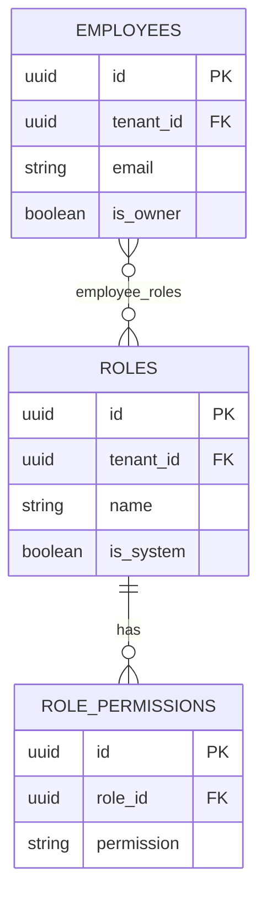

---

## 6. Módulo: Clientes

Consumidores finais que pedem pelo **Storefront**.

### 6.1 `customers`

| Coluna | Tipo | Null | Default | Descrição |
|--------|------|------|---------|-----------|
| `id` | `UUID` | NO | — | PK |
| `tenant_id` | `UUID` | NO | — | FK → `companies.id` |
| `email` | `VARCHAR(254)` | YES | — | Opcional (guest checkout) |
| `phone` | `VARCHAR(20)` | NO | — | Identificador principal |
| `password_hash` | `VARCHAR(255)` | YES | — | Null = guest / sem conta |
| `first_name` | `VARCHAR(100)` | NO | — | — |
| `last_name` | `VARCHAR(100)` | YES | — | — |
| `is_active` | `BOOLEAN` | NO | `true` | — |
| `deleted_at` | `TIMESTAMPTZ` | YES | — | Soft delete |
| `last_order_at` | `TIMESTAMPTZ` | YES | — | Desnormalizado para relatórios |
| `total_orders` | `INT` | NO | `0` | Contador desnormalizado |
| `total_spent` | `NUMERIC(12,2)` | NO | `0` | Soma desnormalizada |
| `created_at` | `TIMESTAMPTZ` | NO | — | — |
| `updated_at` | `TIMESTAMPTZ` | NO | — | — |

**Índices:**
- `UNIQUE (tenant_id, phone)` — telefone único por estabelecimento
- `UNIQUE (tenant_id, email) WHERE email IS NOT NULL` — partial unique
- `INDEX (tenant_id, last_order_at DESC)`
- `INDEX (tenant_id, deleted_at) WHERE deleted_at IS NULL`

**Regras:**
- Guest checkout cria `customer` com `password_hash = NULL`
- Mesma pessoa em tenants diferentes = registros `customers` distintos
- `phone` é normalizado no service (apenas dígitos)
- Contadores (`total_orders`, `total_spent`) atualizados via signal ao confirmar pedido

---

### 6.2 `customer_addresses`

| Coluna | Tipo | Null | Default | Descrição |
|--------|------|------|---------|-----------|
| `id` | `UUID` | NO | — | PK |
| `tenant_id` | `UUID` | NO | — | FK → `companies.id` |
| `customer_id` | `UUID` | NO | — | FK → `customers.id` |
| `label` | `VARCHAR(50)` | YES | — | `Casa`, `Trabalho` |
| `street` | `VARCHAR(255)` | NO | — | Rua |
| `number` | `VARCHAR(20)` | NO | — | Número |
| `complement` | `VARCHAR(100)` | YES | — | Apto, bloco |
| `neighborhood` | `VARCHAR(100)` | NO | — | Bairro |
| `city` | `VARCHAR(100)` | NO | — | Cidade |
| `state` | `VARCHAR(2)` | NO | — | UF |
| `zip_code` | `VARCHAR(9)` | NO | — | CEP |
| `reference` | `VARCHAR(255)` | YES | — | Ponto de referência |
| `latitude` | `NUMERIC(10,7)` | YES | — | Futuro: mapas |
| `longitude` | `NUMERIC(10,7)` | YES | — | Futuro: mapas |
| `is_default` | `BOOLEAN` | NO | `false` | Endereço padrão |
| `created_at` | `TIMESTAMPTZ` | NO | — | — |
| `updated_at` | `TIMESTAMPTZ` | NO | — | — |

**Índices:**
- `INDEX (customer_id)`
- `INDEX (tenant_id, customer_id)`

**Regras:**
- Apenas um `is_default = true` por customer (constraint via service)
- No checkout, endereço é **copiado** para `orders` (snapshot) — alterações futuras no endereço não afetam pedidos antigos

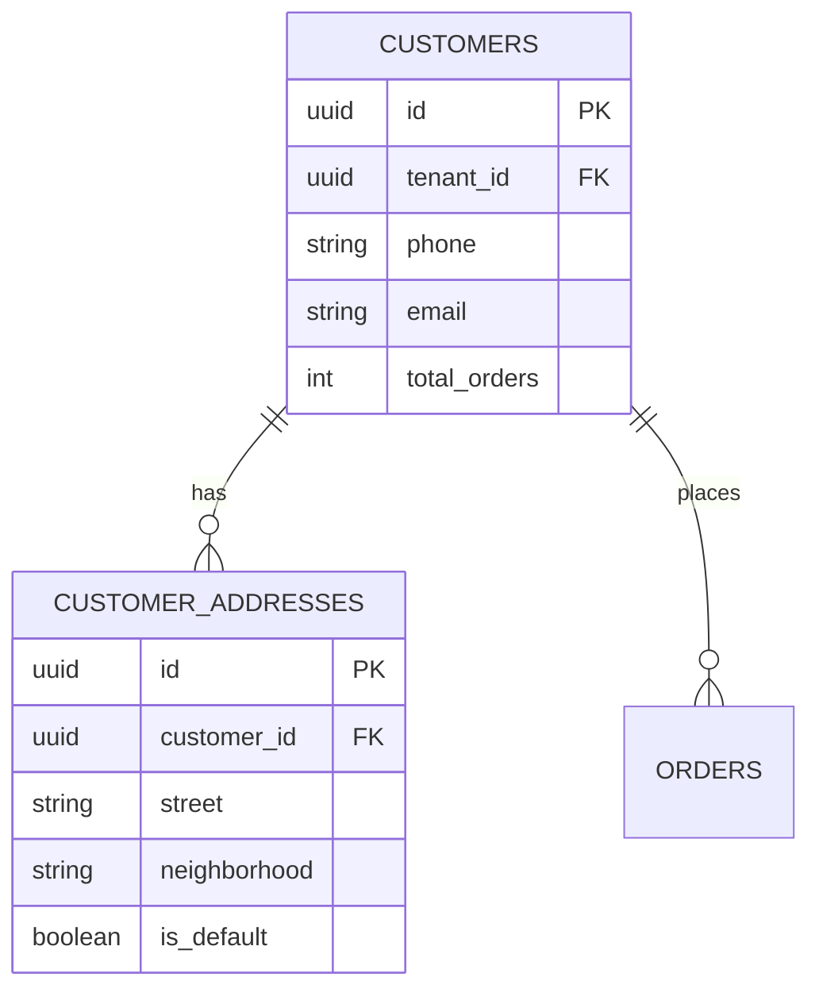

---

## 7. Módulo: Catálogo

O coração da genericidade da plataforma. Qualquer alimento é um `product`; qualquer variação é configurada via `option_groups` e `options`.

### 7.1 Visão Conceitual

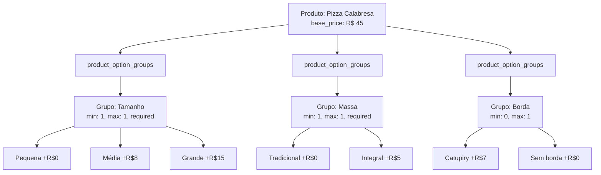

O mesmo mecanismo serve hamburgueria, açaiteria, cafeteria — apenas os nomes dos grupos e opções mudam.

---

### 7.2 `categories`

| Coluna | Tipo | Null | Default | Descrição |
|--------|------|------|---------|-----------|
| `id` | `UUID` | NO | — | PK |
| `tenant_id` | `UUID` | NO | — | FK → `companies.id` |
| `parent_id` | `UUID` | YES | — | FK → `categories.id` (subcategoria) |
| `name` | `VARCHAR(100)` | NO | — | Nome da categoria |
| `slug` | `VARCHAR(120)` | NO | — | URL-friendly |
| `description` | `TEXT` | YES | — | — |
| `image_url` | `VARCHAR(500)` | YES | — | — |
| `sort_order` | `INT` | NO | `0` | Ordenação no cardápio |
| `is_active` | `BOOLEAN` | NO | `true` | — |
| `deleted_at` | `TIMESTAMPTZ` | YES | — | Soft delete |
| `created_at` | `TIMESTAMPTZ` | NO | — | — |
| `updated_at` | `TIMESTAMPTZ` | NO | — | — |

**Índices:**
- `UNIQUE (tenant_id, slug)`
- `INDEX (tenant_id, is_active, sort_order)`
- `INDEX (tenant_id, parent_id)`

**Regras:**
- Hierarquia máxima de 2 níveis (categoria → subcategoria) no MVP
- `slug` único por tenant
- Categoria com produtos ativos não pode ser deletada (soft delete)

---

### 7.3 `products`

| Coluna | Tipo | Null | Default | Descrição |
|--------|------|------|---------|-----------|
| `id` | `UUID` | NO | — | PK |
| `tenant_id` | `UUID` | NO | — | FK → `companies.id` |
| `category_id` | `UUID` | NO | — | FK → `categories.id` |
| `name` | `VARCHAR(200)` | NO | — | Nome do produto |
| `slug` | `VARCHAR(220)` | NO | — | URL-friendly |
| `description` | `TEXT` | YES | — | Descrição |
| `base_price` | `NUMERIC(10,2)` | NO | — | Preço base (sem opções) |
| `compare_price` | `NUMERIC(10,2)` | YES | — | Preço "de" (promoção visual) |
| `sku` | `VARCHAR(50)` | YES | — | Código interno |
| `is_active` | `BOOLEAN` | NO | `true` | Visível no cardápio |
| `is_available` | `BOOLEAN` | NO | `true` | Disponível para pedido agora |
| `sort_order` | `INT` | NO | `0` | Ordenação na categoria |
| `prep_time` | `INT` | YES | — | Tempo de preparo específico (min) |
| `calories` | `INT` | YES | — | Informação nutricional (futuro) |
| `tags` | `JSONB` | YES | `'[]'` | Tags para busca (`vegano`, `sem glúten`) |
| `metadata` | `JSONB` | YES | — | Dados extras flexíveis |
| `deleted_at` | `TIMESTAMPTZ` | YES | — | Soft delete |
| `created_at` | `TIMESTAMPTZ` | NO | — | — |
| `updated_at` | `TIMESTAMPTZ` | NO | — | — |

**Índices:**
- `UNIQUE (tenant_id, slug)`
- `INDEX (tenant_id, category_id, is_active, sort_order)`
- `INDEX (tenant_id, is_available) WHERE is_active = true`
- `GIN (tags)` — busca por tags

**Regras:**
- `base_price >= 0`
- `is_available = false` exibe produto como "indisponível" (não esconde)
- `is_active = false` esconde do cardápio
- Preço final = `base_price` + soma dos `price_modifier` das opções selecionadas

---

### 7.4 `product_images`

| Coluna | Tipo | Null | Default | Descrição |
|--------|------|------|---------|-----------|
| `id` | `UUID` | NO | — | PK |
| `tenant_id` | `UUID` | NO | — | FK → `companies.id` |
| `product_id` | `UUID` | NO | — | FK → `products.id` |
| `image_url` | `VARCHAR(500)` | NO | — | URL da imagem |
| `alt_text` | `VARCHAR(200)` | YES | — | Acessibilidade |
| `sort_order` | `INT` | NO | `0` | Ordenação |
| `is_primary` | `BOOLEAN` | NO | `false` | Imagem principal |
| `created_at` | `TIMESTAMPTZ` | NO | — | — |

**Regras:**
- Apenas uma imagem `is_primary = true` por produto
- MVP: máximo 5 imagens por produto

---

### 7.5 `option_groups`

Grupos de opções reutilizáveis entre produtos. Ex: "Tamanho" pode ser usado em vários produtos.

| Coluna | Tipo | Null | Default | Descrição |
|--------|------|------|---------|-----------|
| `id` | `UUID` | NO | — | PK |
| `tenant_id` | `UUID` | NO | — | FK → `companies.id` |
| `name` | `VARCHAR(100)` | NO | — | Nome do grupo (`Tamanho`, `Massa`) |
| `description` | `VARCHAR(255)` | YES | — | Instrução para o cliente |
| `selection_type` | `option_selection_type` | NO | `'single'` | `single`, `multiple` |
| `min_selections` | `INT` | NO | `0` | Mínimo de opções a selecionar |
| `max_selections` | `INT` | NO | `1` | Máximo de opções a selecionar |
| `is_required` | `BOOLEAN` | NO | `false` | Obrigatório selecionar |
| `sort_order` | `INT` | NO | `0` | — |
| `is_active` | `BOOLEAN` | NO | `true` | — |
| `created_at` | `TIMESTAMPTZ` | NO | — | — |
| `updated_at` | `TIMESTAMPTZ` | NO | — | — |

**Índices:**
- `INDEX (tenant_id, is_active)`

**Regras de seleção:**

| Cenário | `selection_type` | `min` | `max` | `is_required` |
|---------|------------------|-------|-------|---------------|
| Tamanho (obrigatório, 1) | `single` | 1 | 1 | `true` |
| Borda (opcional, 0-1) | `single` | 0 | 1 | `false` |
| Adicionais (0-5) | `multiple` | 0 | 5 | `false` |
| Sabores (2 obrigatórios) | `multiple` | 2 | 2 | `true` |
| Molhos (1-3) | `multiple` | 1 | 3 | `true` |

**Validação no service:**
- `min_selections <= max_selections`
- Se `is_required = true`, então `min_selections >= 1`
- Se `selection_type = single`, então `max_selections = 1`

---

### 7.6 `options`

Opções individuais dentro de um grupo.

| Coluna | Tipo | Null | Default | Descrição |
|--------|------|------|---------|-----------|
| `id` | `UUID` | NO | — | PK |
| `tenant_id` | `UUID` | NO | — | FK → `companies.id` |
| `option_group_id` | `UUID` | NO | — | FK → `option_groups.id` |
| `name` | `VARCHAR(100)` | NO | — | Nome (`Grande`, `Catupiry`) |
| `description` | `VARCHAR(255)` | YES | — | — |
| `price_modifier` | `NUMERIC(10,2)` | NO | `0` | Valor adicionado ao preço |
| `price_type` | `option_price_type` | NO | `'fixed'` | `fixed`, `percentage` |
| `is_active` | `BOOLEAN` | NO | `true` | — |
| `is_available` | `BOOLEAN` | NO | `true` | Disponível agora |
| `sort_order` | `INT` | NO | `0` | — |
| `created_at` | `TIMESTAMPTZ` | NO | — | — |
| `updated_at` | `TIMESTAMPTZ` | NO | — | — |

**Índices:**
- `INDEX (option_group_id, is_active, sort_order)`
- `INDEX (tenant_id, option_group_id)`

**Regras:**
- `price_type = fixed`: `price_modifier` é valor em R$ adicionado ao preço base
- `price_type = percentage`: `price_modifier` é % sobre o `base_price` do produto
- `price_modifier` pode ser `0` (opção sem custo adicional)
- Opção indisponível (`is_available = false`) aparece mas não é selecionável

---

### 7.7 `product_option_groups`

Tabela de junção N:N — vincula grupos de opções a produtos, permitindo reutilização.

| Coluna | Tipo | Null | Default | Descrição |
|--------|------|------|---------|-----------|
| `id` | `UUID` | NO | — | PK |
| `tenant_id` | `UUID` | NO | — | FK → `companies.id` |
| `product_id` | `UUID` | NO | — | FK → `products.id` |
| `option_group_id` | `UUID` | NO | — | FK → `option_groups.id` |
| `sort_order` | `INT` | NO | `0` | Ordem de exibição no produto |
| `override_min` | `INT` | YES | — | Sobrescreve `min_selections` do grupo |
| `override_max` | `INT` | YES | — | Sobrescreve `max_selections` do grupo |
| `created_at` | `TIMESTAMPTZ` | NO | — | — |

**Índices:**
- `UNIQUE (product_id, option_group_id)`
- `INDEX (product_id, sort_order)`

**Regras:**
- Um grupo pode estar em múltiplos produtos
- `override_min` / `override_max` permitem customizar regras por produto (ex: "Sabores" com min=1 em um produto e min=2 em outro)
- Se override é `NULL`, usa valores do `option_groups`

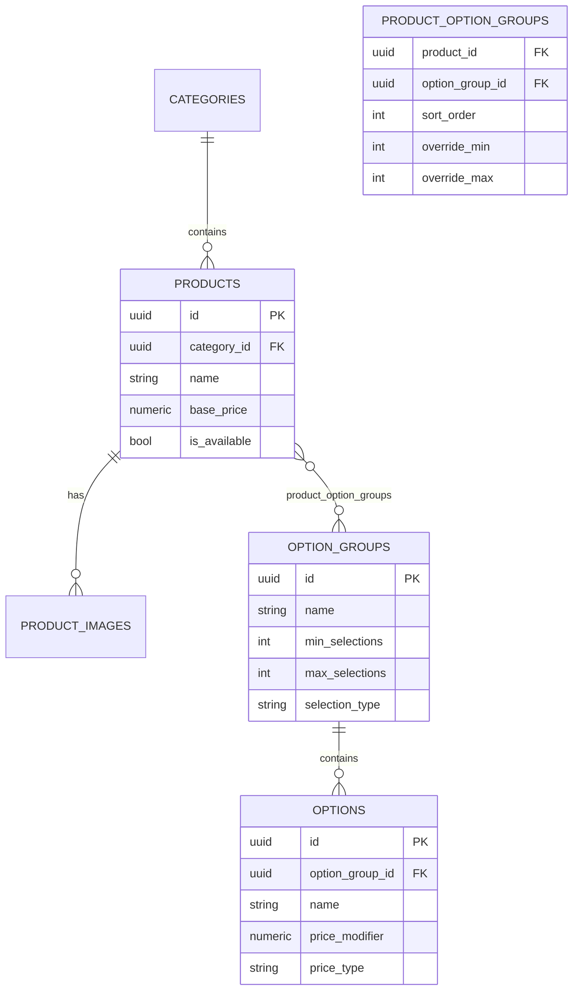

### 7.8 Exemplo: Mesmo Mecanismo, Segmentos Diferentes

**Pizzaria — Produto "Pizza Calabresa":**

| Grupo | Tipo | Opções |
|-------|------|--------|
| Tamanho | single, required, 1-1 | Pequena (+R$0), Média (+R$8), Grande (+R$15) |
| Massa | single, required, 1-1 | Tradicional (+R$0), Integral (+R$5) |
| Borda | single, optional, 0-1 | Catupiry (+R$7), Cheddar (+R$7) |

**Hamburgueria — Produto "X-Bacon":**

| Grupo | Tipo | Opções |
|-------|------|--------|
| Pão | single, required, 1-1 | Brioche (+R$0), Australiano (+R$3) |
| Ponto da Carne | single, required, 1-1 | Mal passado, Ao ponto, Bem passado |
| Adicionais | multiple, optional, 0-5 | Bacon (+R$5), Queijo (+R$4), Ovo (+R$3) |

**Açaiteria — Produto "Açaí Tradicional":**

| Grupo | Tipo | Opções |
|-------|------|--------|
| Tamanho | single, required, 1-1 | 300ml (+R$0), 500ml (+R$8), 700ml (+R$15) |
| Frutas | multiple, optional, 0-3 | Banana (+R$2), Morango (+R$3), Kiwi (+R$4) |
| Coberturas | multiple, optional, 0-5 | Nutella (+R$5), Leite condensado (+R$2) |

---

## 8. Módulo: Pedidos

### 8.1 Máquina de Estados

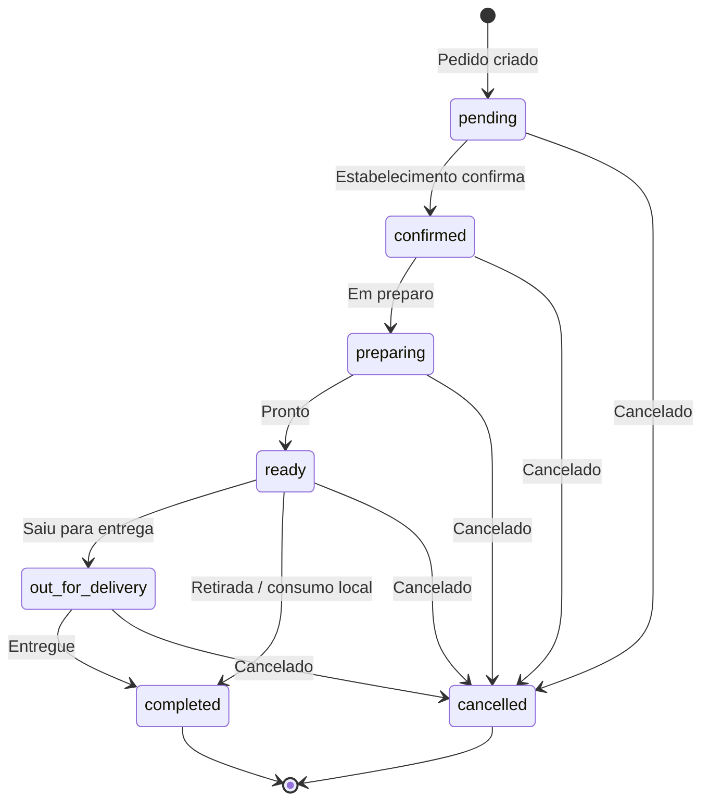

| Status | Descrição | Quem altera |
|--------|-----------|-------------|
| `pending` | Pedido recebido, aguardando confirmação | Sistema |
| `confirmed` | Estabelecimento confirmou | Operador |
| `preparing` | Em preparo na cozinha | Cozinha / Operador |
| `ready` | Pronto para entrega/retirada | Cozinha / Operador |
| `out_for_delivery` | Saiu para entrega | Operador / Entregador |
| `completed` | Entregue ou retirado | Operador / Entregador |
| `cancelled` | Cancelado | Operador / Sistema (timeout) |

**Transições válidas:**

```python
# Conceito
VALID_TRANSITIONS = {
    "pending": ["confirmed", "cancelled"],
    "confirmed": ["preparing", "cancelled"],
    "preparing": ["ready", "cancelled"],
    "ready": ["out_for_delivery", "completed", "cancelled"],
    "out_for_delivery": ["completed", "cancelled"],
    "completed": [],
    "cancelled": [],
}
```

---

### 8.2 `orders`

| Coluna | Tipo | Null | Default | Descrição |
|--------|------|------|---------|-----------|
| `id` | `UUID` | NO | — | PK |
| `tenant_id` | `UUID` | NO | — | FK → `companies.id` |
| `customer_id` | `UUID` | NO | — | FK → `customers.id` |
| `order_number` | `VARCHAR(20)` | NO | — | Número legível (`#0001`) |
| `status` | `order_status` | NO | `'pending'` | Status atual |
| `delivery_type` | `delivery_type` | NO | — | `delivery`, `pickup`, `dine_in` |
| `subtotal` | `NUMERIC(10,2)` | NO | — | Soma dos itens |
| `discount` | `NUMERIC(10,2)` | NO | `0` | Desconto (cupom) |
| `delivery_fee` | `NUMERIC(10,2)` | NO | `0` | Taxa de entrega |
| `total` | `NUMERIC(10,2)` | NO | — | Total final |
| `currency` | `VARCHAR(3)` | NO | `'BRL'` | — |
| `coupon_id` | `UUID` | YES | — | FK → `coupons.id` |
| `coupon_code` | `VARCHAR(50)` | YES | — | Snapshot do código |
| `notes` | `TEXT` | YES | — | Observações do cliente |
| `internal_notes` | `TEXT` | YES | — | Observações internas |
| `delivery_address` | `JSONB` | YES | — | Snapshot do endereço |
| `customer_name` | `VARCHAR(200)` | NO | — | Snapshot do nome |
| `customer_phone` | `VARCHAR(20)` | NO | — | Snapshot do telefone |
| `estimated_prep_at` | `TIMESTAMPTZ` | YES | — | Previsão de preparo |
| `estimated_delivery_at` | `TIMESTAMPTZ` | YES | — | Previsão de entrega |
| `confirmed_at` | `TIMESTAMPTZ` | YES | — | — |
| `completed_at` | `TIMESTAMPTZ` | YES | — | — |
| `cancelled_at` | `TIMESTAMPTZ` | YES | — | — |
| `cancellation_reason` | `VARCHAR(255)` | YES | — | — |
| `source` | `order_source` | NO | `'storefront'` | `storefront`, `backoffice`, `api` |
| `created_at` | `TIMESTAMPTZ` | NO | — | — |
| `updated_at` | `TIMESTAMPTZ` | NO | — | — |

**Índices:**
- `UNIQUE (tenant_id, order_number)`
- `INDEX (tenant_id, status, created_at DESC)` — listagem principal do painel
- `INDEX (tenant_id, customer_id, created_at DESC)` — histórico do cliente
- `INDEX (tenant_id, created_at DESC)` — relatórios
- `INDEX (tenant_id, status) WHERE status NOT IN ('completed', 'cancelled')` — pedidos ativos

**Regras:**
- `order_number` sequencial por tenant (service gera: `#0001`, `#0002`...)
- `total = subtotal - discount + delivery_fee`
- `total >= 0`
- Após `confirmed`, itens **não podem** ser alterados
- `delivery_address` é JSONB snapshot — não FK para `customer_addresses`
- Campos `customer_name`, `customer_phone` são snapshot

---

### 8.3 `order_items`

| Coluna | Tipo | Null | Default | Descrição |
|--------|------|------|---------|-----------|
| `id` | `UUID` | NO | — | PK |
| `tenant_id` | `UUID` | NO | — | FK → `companies.id` |
| `order_id` | `UUID` | NO | — | FK → `orders.id` |
| `product_id` | `UUID` | YES | — | FK → `products.id` (pode ser null se produto deletado) |
| `product_name` | `VARCHAR(200)` | NO | — | Snapshot do nome |
| `unit_price` | `NUMERIC(10,2)` | NO | — | Preço unitário (base + opções) |
| `quantity` | `INT` | NO | — | Quantidade |
| `total_price` | `NUMERIC(10,2)` | NO | — | `unit_price × quantity` |
| `notes` | `VARCHAR(255)` | YES | — | Observação do item |
| `created_at` | `TIMESTAMPTZ` | NO | — | — |

**Índices:**
- `INDEX (order_id)`
- `INDEX (tenant_id, product_id)` — relatório de produtos vendidos

**Regras:**
- `quantity >= 1`
- `unit_price` calculado no service no momento do pedido
- `product_name` é snapshot — se produto for renomeado depois, pedido mantém nome original

---

### 8.4 `order_item_options`

Snapshot das opções selecionadas para cada item.

| Coluna | Tipo | Null | Default | Descrição |
|--------|------|------|---------|-----------|
| `id` | `UUID` | NO | — | PK |
| `tenant_id` | `UUID` | NO | — | FK → `companies.id` |
| `order_item_id` | `UUID` | NO | — | FK → `order_items.id` |
| `option_group_name` | `VARCHAR(100)` | NO | — | Snapshot (`Tamanho`) |
| `option_name` | `VARCHAR(100)` | NO | — | Snapshot (`Grande`) |
| `price_modifier` | `NUMERIC(10,2)` | NO | — | Snapshot do valor |
| `option_id` | `UUID` | YES | — | FK → `options.id` (referência) |
| `created_at` | `TIMESTAMPTZ` | NO | — | — |

**Índices:**
- `INDEX (order_item_id)`

**Regras:**
- Dados são **imutáveis** após criação do pedido
- `option_group_name` e `option_name` garantem legibilidade mesmo se opção for deletada do catálogo

---

### 8.5 `order_status_history`

Auditoria de mudanças de status.

| Coluna | Tipo | Null | Default | Descrição |
|--------|------|------|---------|-----------|
| `id` | `UUID` | NO | — | PK |
| `tenant_id` | `UUID` | NO | — | FK → `companies.id` |
| `order_id` | `UUID` | NO | — | FK → `orders.id` |
| `from_status` | `order_status` | YES | — | Status anterior (null = criação) |
| `to_status` | `order_status` | NO | — | Novo status |
| `changed_by_id` | `UUID` | YES | — | FK → `employees.id` (null = sistema) |
| `notes` | `VARCHAR(255)` | YES | — | — |
| `created_at` | `TIMESTAMPTZ` | NO | — | — |

**Índices:**
- `INDEX (order_id, created_at)`

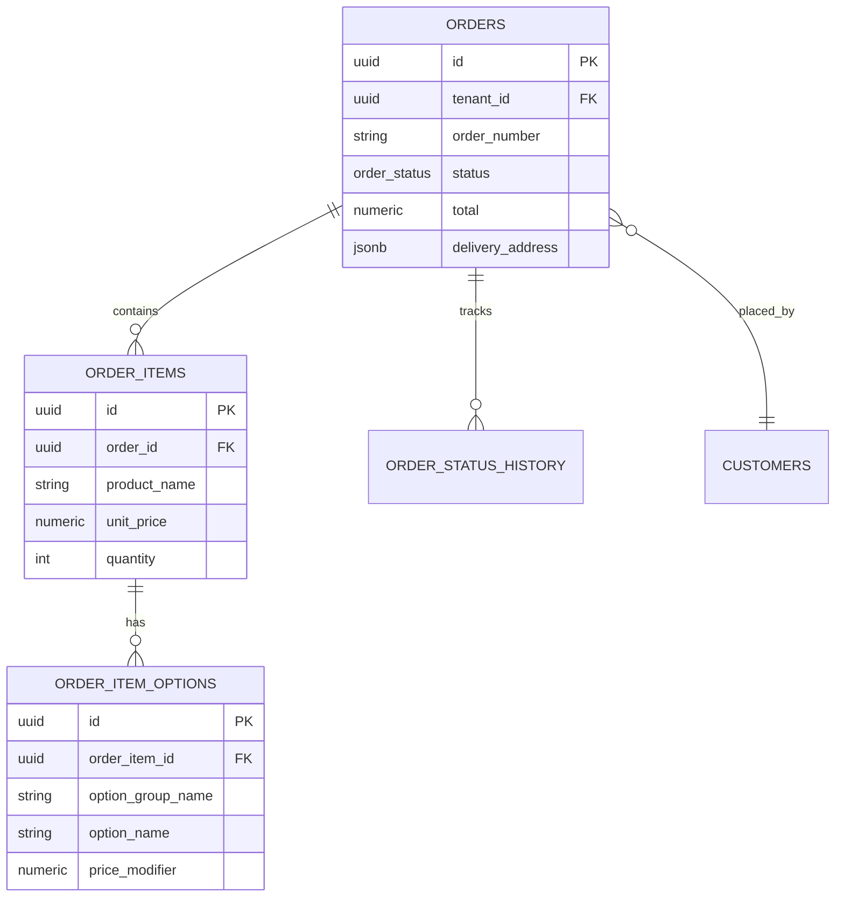

---

## 9. Módulo: Pagamentos

No MVP, pagamento é **manual na entrega** — sem gateway. O módulo registra a forma de pagamento escolhida e o status.

### 9.1 `order_payments`

| Coluna | Tipo | Null | Default | Descrição |
|--------|------|------|---------|-----------|
| `id` | `UUID` | NO | — | PK |
| `tenant_id` | `UUID` | NO | — | FK → `companies.id` |
| `order_id` | `UUID` | NO | — | FK → `orders.id` UNIQUE |
| `method` | `payment_method` | NO | — | `cash`, `pix`, `card_on_delivery` |
| `status` | `payment_status` | NO | `'pending'` | `pending`, `paid`, `failed`, `refunded` |
| `amount` | `NUMERIC(10,2)` | NO | — | Valor (= `orders.total`) |
| `change_for` | `NUMERIC(10,2)` | YES | — | Troco para (dinheiro) |
| `paid_at` | `TIMESTAMPTZ` | YES | — | Quando foi pago |
| `notes` | `VARCHAR(255)` | YES | — | — |
| `gateway_transaction_id` | `VARCHAR(255)` | YES | — | Futuro: ID do gateway |
| `gateway_data` | `JSONB` | YES | — | Futuro: resposta do gateway |
| `created_at` | `TIMESTAMPTZ` | NO | — | — |
| `updated_at` | `TIMESTAMPTZ` | NO | — | — |

**Regras MVP:**
- Criado junto com o pedido
- `status = pending` até operador marcar como `paid` na entrega
- `change_for` só aplicável quando `method = cash`
- Campos `gateway_*` reservados para V2 (Mercado Pago, Stripe)

---

## 10. Módulo: Entrega

Escopo **V2**. Documentado para alinhar modelagem desde já.

### 10.1 `drivers`

| Coluna | Tipo | Null | Default | Descrição |
|--------|------|------|---------|-----------|
| `id` | `UUID` | NO | — | PK |
| `tenant_id` | `UUID` | NO | — | FK → `companies.id` |
| `employee_id` | `UUID` | YES | — | FK → `employees.id` (se também é funcionário) |
| `name` | `VARCHAR(200)` | NO | — | — |
| `phone` | `VARCHAR(20)` | NO | — | — |
| `vehicle_type` | `VARCHAR(50)` | YES | — | `moto`, `carro`, `bike` |
| `is_active` | `BOOLEAN` | NO | `true` | — |
| `is_available` | `BOOLEAN` | NO | `true` | Disponível agora |
| `created_at` | `TIMESTAMPTZ` | NO | — | — |
| `updated_at` | `TIMESTAMPTZ` | NO | — | — |

### 10.2 `deliveries`

| Coluna | Tipo | Null | Default | Descrição |
|--------|------|------|---------|-----------|
| `id` | `UUID` | NO | — | PK |
| `tenant_id` | `UUID` | NO | — | FK → `companies.id` |
| `order_id` | `UUID` | NO | — | FK → `orders.id` UNIQUE |
| `driver_id` | `UUID` | YES | — | FK → `drivers.id` |
| `status` | `delivery_status` | NO | `'pending'` | `pending`, `assigned`, `picked_up`, `delivered` |
| `pickup_at` | `TIMESTAMPTZ` | YES | — | — |
| `delivered_at` | `TIMESTAMPTZ` | YES | — | — |
| `tracking_data` | `JSONB` | YES | — | Futuro: coordenadas |
| `created_at` | `TIMESTAMPTZ` | NO | — | — |
| `updated_at` | `TIMESTAMPTZ` | NO | — | — |

---

## 11. Módulo: Promoções

Escopo **V1**. Cupons de desconto.

### 11.1 `coupons`

| Coluna | Tipo | Null | Default | Descrição |
|--------|------|------|---------|-----------|
| `id` | `UUID` | NO | — | PK |
| `tenant_id` | `UUID` | NO | — | FK → `companies.id` |
| `code` | `VARCHAR(50)` | NO | — | Código (`PIZZA10`) |
| `description` | `VARCHAR(255)` | YES | — | — |
| `discount_type` | `discount_type` | NO | — | `fixed`, `percentage` |
| `discount_value` | `NUMERIC(10,2)` | NO | — | Valor ou % |
| `min_order_value` | `NUMERIC(10,2)` | NO | `0` | Pedido mínimo |
| `max_discount` | `NUMERIC(10,2)` | YES | — | Teto do desconto (%) |
| `usage_limit` | `INT` | YES | — | Limite total de usos |
| `usage_count` | `INT` | NO | `0` | Usos realizados |
| `per_customer_limit` | `INT` | NO | `1` | Usos por cliente |
| `starts_at` | `TIMESTAMPTZ` | NO | — | Início da validade |
| `expires_at` | `TIMESTAMPTZ` | YES | — | Fim da validade |
| `is_active` | `BOOLEAN` | NO | `true` | — |
| `created_at` | `TIMESTAMPTZ` | NO | — | — |
| `updated_at` | `TIMESTAMPTZ` | NO | — | — |

**Índices:**
- `UNIQUE (tenant_id, code)`
- `INDEX (tenant_id, is_active, starts_at, expires_at)`

**Regras:**
- `discount_type = percentage`: `discount_value` entre 1 e 100
- `discount_type = fixed`: desconto em R$
- Desconto nunca pode exceder `subtotal` do pedido
- `usage_count` incrementado atomicamente ao aplicar

### 11.2 `coupon_usages`

| Coluna | Tipo | Null | Default | Descrição |
|--------|------|------|---------|-----------|
| `id` | `UUID` | NO | — | PK |
| `tenant_id` | `UUID` | NO | — | FK → `companies.id` |
| `coupon_id` | `UUID` | NO | — | FK → `coupons.id` |
| `order_id` | `UUID` | NO | — | FK → `orders.id` UNIQUE |
| `customer_id` | `UUID` | NO | — | FK → `customers.id` |
| `discount_applied` | `NUMERIC(10,2)` | NO | — | Valor efetivo do desconto |
| `created_at` | `TIMESTAMPTZ` | NO | — | — |

---

## 12. Módulo: Notificações

### 12.1 `notification_logs`

| Coluna | Tipo | Null | Default | Descrição |
|--------|------|------|---------|-----------|
| `id` | `UUID` | NO | — | PK |
| `tenant_id` | `UUID` | NO | — | FK → `companies.id` |
| `channel` | `notification_channel` | NO | — | `email`, `sms`, `push`, `whatsapp` |
| `recipient` | `VARCHAR(254)` | NO | — | E-mail ou telefone |
| `template` | `VARCHAR(100)` | NO | — | `order_confirmation`, `status_update` |
| `subject` | `VARCHAR(255)` | YES | — | — |
| `status` | `notification_status` | NO | `'pending'` | `pending`, `sent`, `failed` |
| `payload` | `JSONB` | YES | — | Dados do template |
| `error_message` | `TEXT` | YES | — | — |
| `sent_at` | `TIMESTAMPTZ` | YES | — | — |
| `created_at` | `TIMESTAMPTZ` | NO | — | — |

**Índices:**
- `INDEX (tenant_id, status, created_at DESC)`
- `INDEX (tenant_id, template)`

---

## 13. Módulo: Fidelidade (Futuro)

Documentado para referência — **não implementar no MVP/V1**.

### 13.1 `loyalty_programs`

| Coluna | Tipo | Descrição |
|--------|------|-----------|
| `tenant_id` | FK | Um programa por tenant |
| `points_per_currency` | `NUMERIC` | Pontos por R$ 1 gasto |
| `is_active` | `BOOLEAN` | — |

### 13.2 `loyalty_transactions`

| Coluna | Tipo | Descrição |
|--------|------|-----------|
| `customer_id` | FK | — |
| `order_id` | FK | — |
| `type` | `ENUM` | `earn`, `redeem`, `expire` |
| `points` | `INT` | — |
| `balance_after` | `INT` | — |

---

## 14. Enums e Tipos

Tipos PostgreSQL customizados para integridade:

```sql
CREATE TYPE company_status AS ENUM (
    'active', 'inactive', 'suspended', 'trial'
);

CREATE TYPE order_status AS ENUM (
    'pending', 'confirmed', 'preparing',
    'ready', 'out_for_delivery', 'completed', 'cancelled'
);

CREATE TYPE delivery_type AS ENUM (
    'delivery', 'pickup', 'dine_in'
);

CREATE TYPE order_source AS ENUM (
    'storefront', 'backoffice', 'api'
);

CREATE TYPE option_selection_type AS ENUM (
    'single', 'multiple'
);

CREATE TYPE option_price_type AS ENUM (
    'fixed', 'percentage'
);

CREATE TYPE payment_method AS ENUM (
    'cash', 'pix', 'card_on_delivery',
    'credit_card', 'debit_card'  -- futuros (gateway)
);

CREATE TYPE payment_status AS ENUM (
    'pending', 'paid', 'failed', 'refunded'
);

CREATE TYPE discount_type AS ENUM (
    'fixed', 'percentage'
);

CREATE TYPE delivery_status AS ENUM (
    'pending', 'assigned', 'picked_up', 'delivered'
);

CREATE TYPE notification_channel AS ENUM (
    'email', 'sms', 'push', 'whatsapp'
);

CREATE TYPE notification_status AS ENUM (
    'pending', 'sent', 'failed'
);
```

> No Django, usar `models.TextChoices` mapeados para estes tipos. Migrations criam os ENUMs no PostgreSQL.

---

## 15. Índices e Performance

### 15.1 Índices Compostos Críticos

Toda tabela de negócio com `tenant_id` deve ter índices compostos iniciando por `tenant_id`:

```sql
-- Catálogo (leitura frequente no storefront)
CREATE INDEX idx_products_tenant_active
    ON products (tenant_id, is_active, is_available, sort_order);

CREATE INDEX idx_categories_tenant_active
    ON categories (tenant_id, is_active, sort_order);

CREATE INDEX idx_options_group_active
    ON options (option_group_id, is_active, sort_order);

-- Pedidos (escrita e leitura intensa)
CREATE INDEX idx_orders_tenant_status_date
    ON orders (tenant_id, status, created_at DESC);

CREATE INDEX idx_orders_tenant_active
    ON orders (tenant_id, created_at DESC)
    WHERE status NOT IN ('completed', 'cancelled');

CREATE INDEX idx_orders_tenant_customer
    ON orders (tenant_id, customer_id, created_at DESC);

-- Clientes
CREATE INDEX idx_customers_tenant_phone
    ON customers (tenant_id, phone);

CREATE INDEX idx_customers_tenant_active
    ON customers (tenant_id, last_order_at DESC)
    WHERE deleted_at IS NULL;

-- Funcionários
CREATE INDEX idx_employees_tenant_email
    ON employees (tenant_id, email);
```

### 15.2 Estimativa de Volume (500 tenants)

| Tabela | Registros estimados | Crescimento |
|--------|---------------------|-------------|
| `companies` | 500 | Lento |
| `products` | 25.000 (50/tenant) | Lento |
| `options` | 50.000 | Lento |
| `customers` | 250.000 (500/tenant) | Médio |
| `orders` | 1.500.000 (100/mês/tenant) | **Rápido** |
| `order_items` | 4.500.000 (3 itens/pedido) | **Rápido** |
| `order_item_options` | 9.000.000 | **Rápido** |

**Conclusão:** `orders` e derivados são as tabelas que mais crescem. Índices compostos com `tenant_id` são essenciais. Particionamento por `created_at` pode ser considerado na Fase 4 (500+ tenants).

### 15.3 Estratégia de Particionamento (Futuro)

```sql
-- Conceito para Fase 4
CREATE TABLE orders (
    ...
) PARTITION BY RANGE (created_at);

CREATE TABLE orders_2026_q3 PARTITION OF orders
    FOR VALUES FROM ('2026-07-01') TO ('2026-10-01');
```

---

## 16. Integridade e Constraints

### 16.1 Constraints de Negócio

```sql
-- Preços não negativos
ALTER TABLE products
    ADD CONSTRAINT products_positive_price CHECK (base_price >= 0);

ALTER TABLE orders
    ADD CONSTRAINT orders_positive_total CHECK (total >= 0);

ALTER TABLE order_items
    ADD CONSTRAINT order_items_positive_qty CHECK (quantity >= 1);

-- Seleções de opções
ALTER TABLE option_groups
    ADD CONSTRAINT option_groups_valid_range
    CHECK (min_selections >= 0 AND max_selections >= min_selections);

-- Cupom percentual
ALTER TABLE coupons
    ADD CONSTRAINT coupons_valid_percentage
    CHECK (
        discount_type != 'percentage'
        OR (discount_value > 0 AND discount_value <= 100)
    );
```

### 16.2 Foreign Keys e Cascata

| Relação | ON DELETE |
|---------|-----------|
| `tenant_id` → `companies` | `CASCADE` (deletar empresa = deletar tudo) |
| `order_id` → `orders` | `CASCADE` |
| `product_id` → `products` | `SET NULL` (em `order_items` — manter histórico) |
| `customer_id` → `customers` | `RESTRICT` (não deletar cliente com pedidos) |
| `option_id` → `options` | `SET NULL` (em `order_item_options`) |

### 16.3 Unicidades Importantes

| Tabela | Constraint | Escopo |
|--------|-----------|--------|
| `companies` | `subdomain` | Global |
| `companies` | `slug` | Global |
| `products` | `slug` | Por tenant |
| `categories` | `slug` | Por tenant |
| `employees` | `email` | Por tenant |
| `customers` | `phone` | Por tenant |
| `customers` | `email` | Por tenant (partial, WHERE NOT NULL) |
| `orders` | `order_number` | Por tenant |
| `coupons` | `code` | Por tenant |

---

## 17. Padrão de Snapshot em Pedidos

### 17.1 Por que Snapshot?

Quando um pedido é criado, o catálogo pode mudar depois:
- Produto renomeado ou deletado
- Preço alterado
- Opção removida

O cliente e o estabelecimento devem ver **exatamente o que foi pedido**, independente de mudanças futuras no catálogo.

### 17.2 O que é Snapshot vs Referência

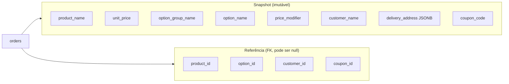

| Campo | Tipo | Motivo |
|-------|------|--------|
| `product_name` | Snapshot | Produto pode ser renomeado |
| `unit_price` | Snapshot | Preço pode mudar |
| `option_name` | Snapshot | Opção pode ser deletada |
| `delivery_address` | Snapshot JSONB | Endereço do cliente pode mudar |
| `product_id` | FK (nullable) | Referência para relatórios; SET NULL se deletado |

### 17.3 Cálculo de Preço no Pedido

```
unit_price = product.base_price
           + SUM(selected_options.price_modifier WHERE price_type = 'fixed')
           + SUM(product.base_price * option.price_modifier / 100 WHERE price_type = 'percentage')

total_price = unit_price × quantity

order.subtotal = SUM(order_items.total_price)
order.total    = order.subtotal - order.discount + order.delivery_fee
```

Cálculo feito **no backend** (OrderService). Frontend exibe estimativa; backend é fonte da verdade.

---

## 18. Soft Delete e Auditoria

### 18.1 Soft Delete

Tabelas com `deleted_at`:

| Tabela | Motivo |
|--------|--------|
| `products` | Manter referência em pedidos antigos |
| `categories` | Não quebrar histórico |
| `customers` | LGPD: anonimizar em vez de deletar |

**Padrão:**
- `deleted_at IS NULL` = ativo
- Queries padrão filtram `deleted_at IS NULL`
- Manager `all_objects` para acesso admin

### 18.2 Campos de Auditoria

| Evento | Onde registrado |
|--------|-----------------|
| Mudança de status do pedido | `order_status_history` |
| Envio de notificação | `notification_logs` |
| Uso de cupom | `coupon_usages` |
| Login de funcionário | `employees.last_login_at` |

> Auditoria completa (quem alterou o quê) é escopo V2 via tabela `audit_logs` genérica.

---

## 19. Escopo por Fase

### 19.1 MVP

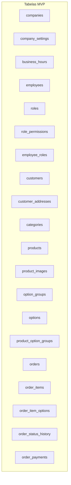

**Total MVP: 20 tabelas**

### 19.2 V1 (adicionar)

| Tabela | Funcionalidade |
|--------|----------------|
| `coupons` | Cupons de desconto |
| `coupon_usages` | Rastreamento de uso |
| `notification_logs` | E-mail de confirmação |

### 19.3 V2 (adicionar)

| Tabela | Funcionalidade |
|--------|----------------|
| `drivers` | Entregadores |
| `deliveries` | Rastreamento de entrega |
| `loyalty_programs` | Fidelidade |
| `loyalty_transactions` | Pontos |
| `audit_logs` | Auditoria completa |

### 19.4 Diagrama de Dependências para Migrations

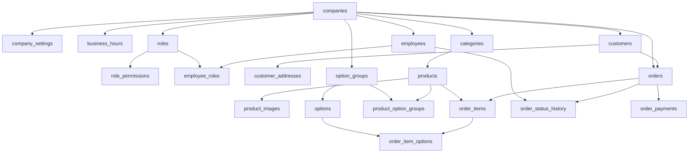

---

## 20. Migrations e Versionamento

### 20.1 Convenções Django Migrations

| Regra | Descrição |
|-------|-----------|
| Uma migration por feature | `0003_add_option_groups` |
| Nunca editar migration aplicada | Criar nova migration corretiva |
| Migrations de dados separadas | `0004_populate_default_roles` |
| Squash a cada release major | Reduzir histórico |

### 20.2 Seed de Desenvolvimento

Script `seed_dev.py` cria:
1. Company de teste (`demo.foodservice.app`)
2. Roles padrão com permissões
3. Employee owner
4. Categorias e produtos de exemplo (genéricos, não só pizza)
5. Option groups e options
6. Customer de teste

### 20.3 Ordem de Criação no Onboarding

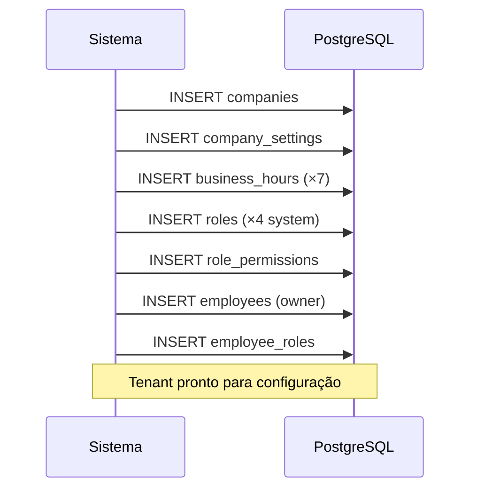

---

## 21. Próximos Documentos

| # | Documento | Relação |
|---|-----------|---------|
| 06 | `06-backend.md` | Implementação Django destes models |
| 07 | `07-api.md` | Endpoints que expõem estas entidades |
| 08 | `08-regras-de-negocio.md` | Regras detalhadas referenciadas aqui |
| 12 | `12-checklist-mvp.md` | Quais tabelas implementar no MVP |

---

## Histórico de Revisões

| Versão | Data | Autor | Alterações |
|--------|------|-------|------------|
| 1.0 | Jul/2026 | — | Versão inicial — aprovado |

---

## Apêndice A — Diagrama ER Simplificado (MVP)

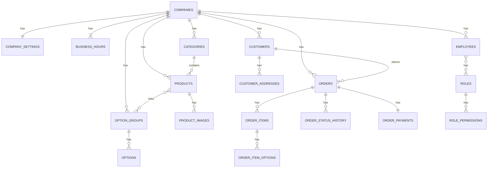

## Apêndice B — Contagem de Tabelas

| Fase | Tabelas | Acumulado |
|------|---------|-----------|
| MVP | 20 | 20 |
| V1 | +3 | 23 |
| V2 | +5 | 28 |

---

> **Documento aprovado.** Próximo: `04-design-system.md`.
