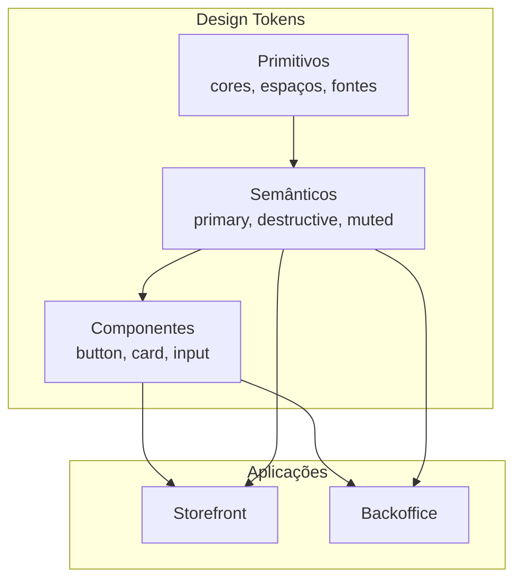
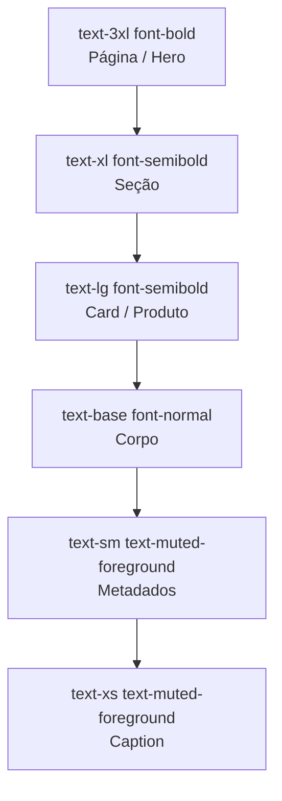
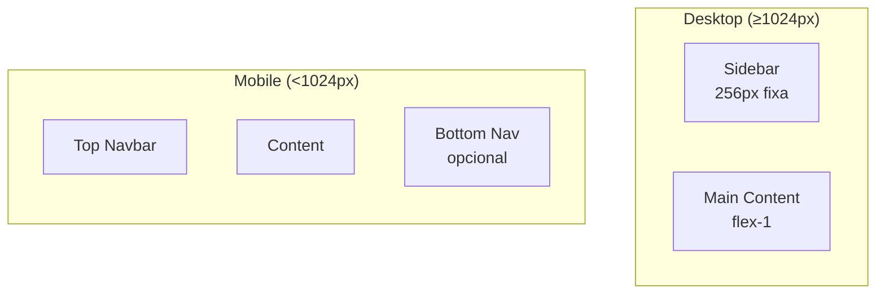
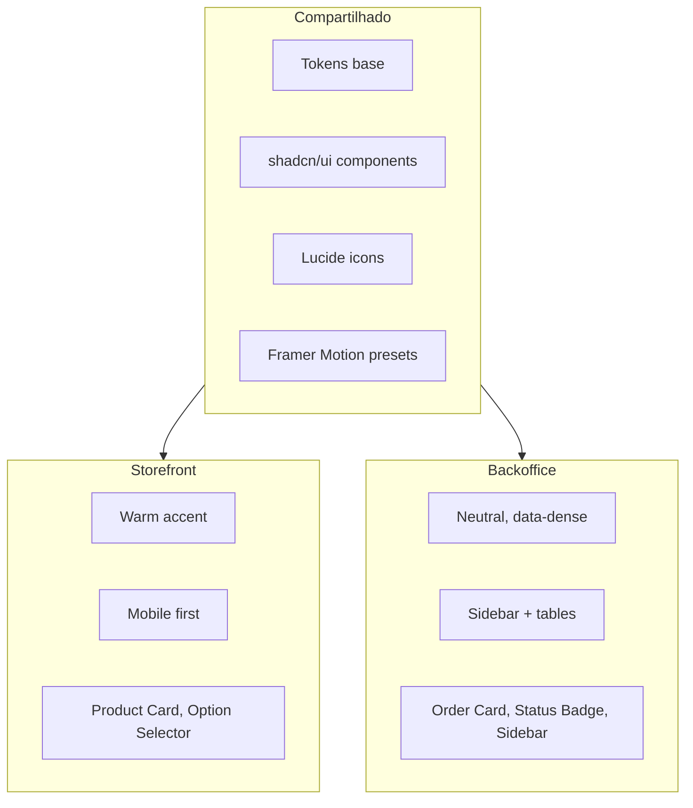

# 04 — Design System

> **Documento:** Design System  
> **Produto:** Food Service *(nome comercial provisório)*  
> **Versão:** 1.1  
> **Status:** Aprovado  
> **Última atualização:** Julho/2026  
> **Depende de:** `01-visao-do-produto.md`, `02-arquitetura.md`, `03-modelagem-do-banco.md` (aprovados)  
> **Stack:** Tailwind CSS 4.x, shadcn/ui, Framer Motion, Lucide Icons

---

## Sumário

1. [Visão Geral](#1-visão-geral)
2. [Princípios de Design](#2-princípios-de-design)
3. [Identidade Visual](#3-identidade-visual)
4. [Tokens de Design](#4-tokens-de-design)
5. [Tipografia](#5-tipografia)
6. [Cores](#6-cores)
7. [Espaçamento e Escala](#7-espaçamento-e-escala)
8. [Grid e Layout](#8-grid-e-layout)
9. [Elevação e Sombras](#9-elevação-e-sombras)
10. [Bordas e Raios](#10-bordas-e-raios)
11. [Ícones](#11-ícones)
12. [Componentes](#12-componentes)
13. [Estados Interativos](#13-estados-interativos)
14. [Estados de Feedback](#14-estados-de-feedback)
15. [Dark Mode](#15-dark-mode)
16. [Animações e Motion](#16-animações-e-motion)
17. [Responsividade](#17-responsividade)
18. [Acessibilidade](#18-acessibilidade)
19. [Storefront vs Backoffice](#19-storefront-vs-backoffice)
20. [Theming por Tenant (Futuro)](#20-theming-por-tenant-futuro)
21. [Implementação Técnica](#21-implementação-técnica)
22. [Próximos Documentos](#22-próximos-documentos)

---

## 1. Visão Geral

### 1.1 Objetivo

Este documento define o **Design System** do Food Service — a linguagem visual e os componentes que garantem consistência, qualidade e velocidade de desenvolvimento em toda a plataforma.

O Design System serve duas aplicações distintas:

| Aplicação | Tom visual | Prioridade |
|-----------|------------|------------|
| **Storefront** | Acolhedor, apetitoso, confiável | Emoção + conversão |
| **Backoffice** | Profissional, denso, eficiente | Produtividade + clareza |

Ambas compartilham **tokens base** (tipografia, espaçamento, componentes shadcn/ui), mas divergem em **acentos e densidade**.

### 1.2 Stack de Implementação

| Ferramenta | Papel |
|------------|-------|
| **Tailwind CSS** | Utility classes + design tokens via CSS variables |
| **shadcn/ui** | Componentes acessíveis baseados em Radix UI |
| **Framer Motion** | Animações e transições |
| **Lucide React** | Biblioteca de ícones |
| **class-variance-authority (cva)** | Variantes de componentes |
| **tailwind-merge + clsx** | Composição de classes (`cn()`) |

### 1.3 Arquitetura de Tokens



---

## 2. Princípios de Design

| Princípio | Significado | Aplicação |
|-----------|-------------|-----------|
| **Clareza** | Cada elemento comunica uma coisa | Hierarquia tipográfica forte |
| **Confiança** | Visual profissional transmite segurança | Consistência, feedback, estados claros |
| **Velocidade** | Interface parece instantânea | Skeleton, optimistic UI, transições curtas |
| **Simplicidade** | Remover até não poder mais | Progressive disclosure |
| **Leveza premium** | Marca do tenant assina, não pinta | Primary em controles; fundos neutros |
| **Densidade adaptável** | Dados no admin, respiro no cliente | Espaçamento diferente por app |
| **Acessível por padrão** | WCAG 2.1 AA mínimo | Contraste, foco, ARIA |

### 2.1 O que NÃO fazer

- Gradientes excessivos ou neon
- **Blocos grandes de cor da marca** (hero/page fills, shells tintados)
- Mais de 2 famílias tipográficas
- Animações longas (> 400ms) em interações
- Ícones decorativos sem função
- Cores de status apenas por cor (sempre + ícone/texto)
- Popups intrusivos bloqueando pedido
- Fontes menores que 14px em texto de leitura (mobile)

### 2.2 Cor do estabelecimento (white-label)

A cor `primary` do tenant reforça identidade nos **detalhes**:

| Usar primary | Não usar primary |
|--------------|------------------|
| Botões, links, ícones ativos | Fundos de página / seções |
| Chips, badges, switches | Headers / heroes inteiros |
| Progress, loading, focus ring | Sidebar como fill da marca |
| Hairlines 1–2px, halo da logo | Cards painel `bg-brand-soft` largos |

**Fundos canônicos:** shell `#F7F8FA` (`--background` / `--surface`); cards sempre `#FFFFFF` (`--card`). Hierarquia por contraste de camada, não por cor de marca.

**Sensação alvo:** "esse sistema é bonito" — não "esse sistema é muito colorido". Refs: Stripe, Linear, Notion, Spotify, Airbnb (princípios, não layout).

---

## 3. Identidade Visual

### 3.1 Personalidade da Marca (Food Service — plataforma)

| Atributo | Descrição |
|----------|-----------|
| **Tom** | Profissional, moderno, confiável |
| **Voz** | Direta, amigável, sem jargão técnico |
| **Sensação** | "A ferramenta que todo restaurante merecia" |

### 3.2 Paleta Conceitual

A identidade da **plataforma** usa **verde-esmeralda** como cor primária — transmite frescor, crescimento e confiança sem ser genérica demais (azul SaaS) nem agressiva (vermelho fast-food).

O **storefront de cada tenant** poderá, no futuro, sobrescrever a cor primária (white-label). A plataforma define o default.

### 3.3 Referências de Inspiração

| Referência | O que absorver |
|------------|----------------|
| **Stripe** | Formulários, hierarquia, espaçamento |
| **Linear** | Densidade no admin, dark mode, tipografia |
| **Vercel** | Geist font, gradientes sutis, polish |
| **Uber Eats** | Cards de produto, fluxo de pedido |
| **Apple** | Clareza, fotos, minimalismo |
| **Notion** | Sidebar, organização, empty states |
| **Airbnb** | Confiança, fotografia, reviews |

---

## 4. Tokens de Design

### 4.1 Estrutura de Arquivos

```
src/styles/
├── globals.css          # Reset + CSS variables
├── tokens.css           # Design tokens primitivos
└── themes/
    ├── storefront.css   # Overrides storefront
    └── backoffice.css   # Overrides backoffice
```

### 4.2 Formato dos Tokens

Tokens semânticos em **HSL** (padrão shadcn/ui) para facilitar manipulação de opacidade:

```css
/* tokens.css — conceito */
:root {
  /* Primitivos */
  --color-emerald-500: 160 84% 39%;
  --color-gray-50: 210 20% 98%;
  --color-gray-900: 220 20% 10%;

  /* Semânticos — mapeados no globals.css */
  --background: var(--color-gray-50);
  --foreground: var(--color-gray-900);
  --primary: var(--color-emerald-500);
}
```

### 4.3 Nomenclatura de Tokens

| Camada | Padrão | Exemplo |
|--------|--------|---------|
| Primitivo | `--color-{hue}-{step}` | `--color-emerald-500` |
| Semântico | `--{role}` | `--primary`, `--destructive` |
| Componente | `--{component}-{property}` | `--sidebar-width` |
| Utilitário Tailwind | Mapeado em `tailwind.config.ts` | `bg-primary` |

---

## 5. Tipografia

### 5.1 Famílias Tipográficas

| Token | Família | Uso |
|-------|---------|-----|
| `--font-sans` | **Inter** | Texto geral, UI, formulários |
| `--font-display` | **Inter** | Títulos (mesma família, pesos diferentes) |
| `--font-mono` | **JetBrains Mono** | Códigos de pedido, valores técnicos |

> **Fallback stack:** `Inter, -apple-system, BlinkMacSystemFont, "Segoe UI", Roboto, sans-serif`

**Justificativa:** Inter é altamente legível em telas, open source, amplamente usada em produtos premium (Linear, GitHub, Figma). Uma única família reduz complexidade e peso de fonte.

### 5.2 Escala Tipográfica

Baseada em escala **1.250 (Major Third)** com `16px` como corpo.

| Token | Tamanho | Line Height | Peso | Uso |
|-------|---------|-------------|------|-----|
| `text-xs` | 12px / 0.75rem | 16px | 400 | Badges, captions, metadados |
| `text-sm` | 14px / 0.875rem | 20px | 400 | Labels, texto secundário, tabelas |
| `text-base` | 16px / 1rem | 24px | 400 | Corpo padrão, inputs |
| `text-lg` | 18px / 1.125rem | 28px | 500 | Subtítulos, preços |
| `text-xl` | 20px / 1.25rem | 28px | 600 | Títulos de seção |
| `text-2xl` | 24px / 1.5rem | 32px | 600 | Títulos de página (mobile) |
| `text-3xl` | 30px / 1.875rem | 36px | 700 | Títulos de página (desktop) |
| `text-4xl` | 36px / 2.25rem | 40px | 700 | Hero, landing |

### 5.3 Pesos

| Token | Valor | Uso |
|-------|-------|-----|
| `font-normal` | 400 | Corpo, descrições |
| `font-medium` | 500 | Labels, navegação, ênfase leve |
| `font-semibold` | 600 | Títulos, botões, preços |
| `font-bold` | 700 | Hero, destaques |

### 5.4 Regras Tipográficas

| Regra | Storefront | Backoffice |
|-------|------------|------------|
| Tamanho mínimo de leitura | 16px | 14px |
| Títulos de produto | `text-lg font-semibold` | — |
| Número do pedido | `font-mono text-sm` | `font-mono text-sm` |
| Preço | `text-lg font-semibold tabular-nums` | `tabular-nums` |
| Texto truncado | `truncate` com `title` tooltip | `truncate` + hover tooltip |
| Letter-spacing títulos | `-0.02em` (tracking-tight) | `-0.01em` |
| Máximo de caracteres por linha | ~65ch (prosa) | ~80ch (tabelas) |

### 5.5 Hierarquia Visual



---

## 6. Cores

### 6.1 Paleta Primitiva

#### Neutros (Gray — tom levemente azulado)

| Token | HSL | Hex | Uso |
|-------|-----|-----|-----|
| `gray-50` | 210 20% 98% | `#F9FAFB` | Background principal (light) |
| `gray-100` | 210 17% 95% | `#F3F4F6` | Background secundário |
| `gray-200` | 210 14% 89% | `#E5E7EB` | Bordas, divisores |
| `gray-300` | 210 11% 78% | `#D1D5DB` | Bordas inputs, placeholders |
| `gray-400` | 210 9% 62% | `#9CA3AF` | Ícones inativos |
| `gray-500` | 210 7% 46% | `#6B7280` | Texto secundário |
| `gray-600` | 210 8% 38% | `#4B5563` | Texto secundário forte |
| `gray-700` | 210 10% 30% | `#374151` | Texto em dark surfaces |
| `gray-800` | 210 15% 20% | `#1F2937` | Background dark mode card |
| `gray-900` | 220 20% 10% | `#111827` | Texto principal / background dark |
| `gray-950` | 220 25% 6% | `#0A0F1A` | Background dark mode |

#### Primária (Emerald — frescor, confiança)

| Token | HSL | Hex | Uso |
|-------|-----|-----|-----|
| `emerald-50` | 152 76% 95% | `#ECFDF5` | Background sutil primário |
| `emerald-100` | 149 80% 90% | `#D1FAE5` | Hover backgrounds |
| `emerald-200` | 152 76% 80% | `#A7F3D0` | — |
| `emerald-300` | 156 72% 67% | `#6EE7B7` | — |
| `emerald-400` | 158 64% 52% | `#34D399` | — |
| `emerald-500` | 160 84% 39% | `#10B981` | **Primary** — botões, links, foco |
| `emerald-600` | 161 94% 30% | `#059669` | Hover botão primário |
| `emerald-700` | 163 94% 24% | `#047857` | Active / pressed |
| `emerald-800` | 164 86% 16% | — | — |
| `emerald-900` | 166 78% 10% | — | — |

#### Semânticas

| Token | HSL | Hex | Uso |
|-------|-----|-----|-----|
| `red-500` | 0 84% 60% | `#EF4444` | Erro, destructive |
| `red-600` | 0 72% 51% | `#DC2626` | Hover destructive |
| `amber-500` | 38 92% 50% | `#F59E0B` | Aviso, pendente |
| `amber-600` | 32 95% 44% | `#D97706` | Hover warning |
| `blue-500` | 217 91% 60% | `#3B82F6` | Info, links informativos |
| `blue-600` | 221 83% 53% | `#2563EB` | Hover info |
| `green-500` | 142 71% 45% | `#22C55E` | Sucesso, confirmado |
| `green-600` | 142 76% 36% | `#16A34A` | Hover success |

#### Accent Storefront (Warm — apetite)

| Token | HSL | Hex | Uso |
|-------|-----|-----|-----|
| `orange-500` | 25 95% 53% | `#F97316` | CTA secundário storefront, destaques |
| `orange-600` | 21 90% 48% | `#EA580C` | Hover |
| `warm-50` | 30 100% 97% | `#FFF7ED` | Background acolhedor |

### 6.2 Tokens Semânticos (shadcn/ui)

```css
/* globals.css — Light Mode */
:root {
  --background: 210 20% 98%;          /* gray-50 */
  --foreground: 220 20% 10%;          /* gray-900 */

  --card: 0 0% 100%;
  --card-foreground: 220 20% 10%;

  --popover: 0 0% 100%;
  --popover-foreground: 220 20% 10%;

  --primary: 160 84% 39%;             /* emerald-500 */
  --primary-foreground: 0 0% 100%;

  --secondary: 210 17% 95%;           /* gray-100 */
  --secondary-foreground: 220 20% 10%;

  --muted: 210 17% 95%;
  --muted-foreground: 210 7% 46%;     /* gray-500 */

  --accent: 210 17% 95%;
  --accent-foreground: 220 20% 10%;

  --destructive: 0 84% 60%;           /* red-500 */
  --destructive-foreground: 0 0% 100%;

  --border: 210 14% 89%;              /* gray-200 */
  --input: 210 14% 89%;
  --ring: 160 84% 39%;                /* focus ring = primary */

  --radius: 0.5rem;

  /* Sidebar (backoffice) */
  --sidebar-background: 0 0% 100%;
  --sidebar-foreground: 220 20% 10%;
  --sidebar-border: 210 14% 89%;
  --sidebar-accent: 210 17% 95%;
  --sidebar-accent-foreground: 220 20% 10%;
  --sidebar-width: 16rem;
  --sidebar-width-collapsed: 4rem;
}
```

### 6.3 Cores de Status (Pedidos)

| Status | Cor | Background | Ícone |
|--------|-----|------------|-------|
| `pending` | `amber-600` | `amber-50` | `Clock` |
| `confirmed` | `blue-600` | `blue-50` | `CheckCircle` |
| `preparing` | `orange-600` | `orange-50` | `Flame` |
| `ready` | `emerald-600` | `emerald-50` | `PackageCheck` |
| `out_for_delivery` | `blue-600` | `blue-50` | `Truck` |
| `completed` | `green-600` | `green-50` | `CircleCheck` |
| `cancelled` | `red-600` | `red-50` | `XCircle` |

> **Regra:** Status **nunca** usa apenas cor. Sempre: cor + ícone + label textual.

### 6.4 Contraste (WCAG AA)

| Par | Ratio mínimo | Status |
|-----|-------------|--------|
| `foreground` sobre `background` | 15.8:1 | ✅ AAA |
| `muted-foreground` sobre `background` | 4.6:1 | ✅ AA |
| `primary-foreground` sobre `primary` | 4.5:1 | ✅ AA |
| `destructive-foreground` sobre `destructive` | 4.5:1 | ✅ AA |

---

## 7. Espaçamento e Escala

### 7.1 Escala de Espaçamento (Tailwind padrão)

Base: **4px** (`1 unit = 0.25rem`)

| Token | Valor | Uso comum |
|-------|-------|-----------|
| `0` | 0px | — |
| `0.5` | 2px | Micro ajustes |
| `1` | 4px | Gap entre ícone e texto |
| `1.5` | 6px | Padding interno compacto |
| `2` | 8px | Gap em badges, chips |
| `3` | 12px | Padding input compacto |
| `4` | 16px | Padding padrão de cards, gaps |
| `5` | 20px | — |
| `6` | 24px | Padding de seções (mobile) |
| `8` | 32px | Padding de seções (desktop) |
| `10` | 40px | — |
| `12` | 48px | Espaço entre seções |
| `16` | 64px | Hero spacing |
| `20` | 80px | — |
| `24` | 96px | Landing sections |

### 7.2 Espaçamento por Contexto

| Contexto | Padding | Gap |
|----------|---------|-----|
| Card de produto (storefront) | `p-4` | — |
| Card de dashboard | `p-6` | — |
| Página (container) | `px-4 md:px-6 lg:px-8` | — |
| Seção vertical | `py-8 md:py-12` | — |
| Grid de produtos | — | `gap-4 md:gap-6` |
| Formulário (entre campos) | — | `gap-4` |
| Sidebar item | `px-3 py-2` | — |
| Tabela (célula) | `px-4 py-3` | — |
| Bottom bar (mobile) | `px-4 py-3` | — |

### 7.3 Tamanhos de Componentes

| Tamanho | Altura | Padding X | Font | Uso |
|---------|--------|-----------|------|-----|
| `xs` | 28px | 8px | 12px | Chips, badges compactos |
| `sm` | 32px | 12px | 14px | Botões secundários, inputs compactos |
| `md` | 40px | 16px | 14px | **Padrão** — botões, inputs |
| `lg` | 44px | 20px | 16px | CTA principal storefront |
| `xl` | 48px | 24px | 16px | Hero CTA |
| `icon` | 40px | — | — | Botão somente ícone |

---

## 8. Grid e Layout

### 8.1 Breakpoints

| Token | Largura | Dispositivo |
|-------|---------|-------------|
| `sm` | 640px | Mobile landscape |
| `md` | 768px | Tablet |
| `lg` | 1024px | Desktop |
| `xl` | 1280px | Desktop largo |
| `2xl` | 1536px | Ultrawide |

### 8.2 Containers

| Variante | Max Width | Uso |
|----------|-----------|-----|
| `container-sm` | 640px | Formulários, checkout |
| `container-md` | 768px | Detalhe de produto |
| `container-lg` | 1024px | Storefront padrão |
| `container-xl` | 1280px | Backoffice |
| `container-full` | 100% | Tabelas, dashboards |

```css
/* Conceito */
.container {
  width: 100%;
  margin-inline: auto;
  padding-inline: 1rem;       /* 16px mobile */
}

@media (min-width: 768px) {
  .container { padding-inline: 1.5rem; }  /* 24px tablet+ */
}

@media (min-width: 1280px) {
  .container { max-width: 1280px; }
}
```

### 8.3 Grid de Produtos (Storefront)

| Breakpoint | Colunas | Gap |
|------------|---------|-----|
| `< 640px` | 1 (lista) ou 2 (grid) | 16px |
| `640–1024px` | 2–3 | 16px |
| `> 1024px` | 3–4 | 24px |

### 8.4 Layout Backoffice



| Área | Desktop | Mobile |
|------|---------|--------|
| Sidebar | Fixa, 256px, colapsável para 64px | Drawer (overlay) |
| Header | 64px altura, breadcrumbs + ações | 56px, título + menu |
| Content | `p-6`, scroll | `p-4`, scroll |
| Footer | — | Bottom nav para ações principais |

### 8.5 Layout Storefront

| Área | Mobile | Desktop |
|------|--------|---------|
| Header | Logo + busca + carrinho (sticky) | Logo + nav categorias + busca + carrinho |
| Hero / Banner | Full width, aspect 16:9 | Max container-lg |
| Categorias | Scroll horizontal (chips) | Tabs ou sidebar |
| Produtos | Grid 2 colunas ou lista | Grid 3–4 colunas |
| Carrinho | Bottom sheet / página | Sidebar drawer (opcional) |
| Footer | Compacto | Completo com info do estabelecimento |

### 8.6 Z-Index Scale

| Token | Valor | Uso |
|-------|-------|-----|
| `z-base` | 0 | Conteúdo normal |
| `z-dropdown` | 10 | Dropdowns, tooltips |
| `z-sticky` | 20 | Header sticky, bottom bar |
| `z-overlay` | 30 | Overlay de drawer/modal |
| `z-modal` | 40 | Modal, drawer |
| `z-toast` | 50 | Toasts, notificações |
| `z-max` | 9999 | Apenas emergências |

---

## 9. Elevação e Sombras

| Token | CSS | Uso |
|-------|-----|-----|
| `shadow-xs` | `0 1px 2px rgba(0,0,0,0.05)` | Inputs, chips |
| `shadow-sm` | `0 1px 3px rgba(0,0,0,0.1)` | Cards em repouso |
| `shadow-md` | `0 4px 6px rgba(0,0,0,0.07)` | Cards hover, dropdowns |
| `shadow-lg` | `0 10px 15px rgba(0,0,0,0.1)` | Modais, drawer |
| `shadow-xl` | `0 20px 25px rgba(0,0,0,0.1)` | Popover flutuante |

**Regra:** Sombras sutis. Evitar `shadow-2xl` exceto em modais. Dark mode usa sombras mais escuras com opacidade reduzida.

---

## 10. Bordas e Raios

### 10.1 Border Radius

| Token | Valor | Uso |
|-------|-------|-----|
| `rounded-none` | 0 | Tabelas, dividers |
| `rounded-sm` | 4px | Badges, chips |
| `rounded-md` | 6px | Inputs, botões sm |
| `rounded-lg` | 8px | **Padrão** — cards, botões, inputs |
| `rounded-xl` | 12px | Cards de produto (storefront) |
| `rounded-2xl` | 16px | Modais, bottom sheets |
| `rounded-full` | 9999px | Avatares, pills, FAB |

### 10.2 Bordas

| Token | Valor | Uso |
|-------|-------|-----|
| `border` | 1px solid `border` | Cards, inputs, dividers |
| `border-2` | 2px solid | Focus states, seleção ativa |
| `border-dashed` | 1px dashed | Upload zones, empty states |

---

## 11. Ícones

### 11.1 Biblioteca

**Lucide React** — ícones open source, consistentes, tree-shakeable.

```tsx
import { ShoppingCart, Search, Clock } from "lucide-react";
```

### 11.2 Tamanhos

| Token | Tamanho | Uso |
|-------|---------|-----|
| `icon-xs` | 14px | Inline com text-xs |
| `icon-sm` | 16px | Inline com text-sm, badges |
| `icon-md` | 20px | **Padrão** — botões, navegação |
| `icon-lg` | 24px | Títulos de seção, empty states |
| `icon-xl` | 32px | Hero, destaques |

### 11.3 Regras

| Regra | Descrição |
|-------|-----------|
| Stroke width | `2` (padrão Lucide) |
| Cor | Herda `currentColor` |
| Botão ícone | Sempre com `aria-label` |
| Ícone + texto | Gap de `8px` (`gap-2`) |
| Ícones de status | Sempre acompanhados de texto |

### 11.4 Ícones Padrão por Contexto

| Contexto | Ícone |
|----------|-------|
| Carrinho | `ShoppingCart` |
| Busca | `Search` |
| Pedido | `Receipt` |
| Entrega | `Truck` |
| Retirada | `Store` |
| Usuário | `User` |
| Configurações | `Settings` |
| Adicionar | `Plus` |
| Remover | `Minus` / `Trash2` |
| Fechar | `X` |
| Menu | `Menu` |
| Voltar | `ArrowLeft` |
| Sucesso | `CheckCircle2` |
| Erro | `AlertCircle` |
| Aviso | `AlertTriangle` |
| Loading | `Loader2` (com `animate-spin`) |
| Produto sem foto | `ImageOff` |

---

## 12. Componentes

Todos os componentes base vêm do **shadcn/ui**, customizados com os tokens deste Design System. Componentes são copiados para `src/shared/components/ui/` (não instalados como pacote).

### 12.1 Inventário de Componentes

| Componente | shadcn/ui | Customizado | Fase |
|------------|-----------|-------------|------|
| Button | ✅ | Variantes extras | MVP |
| Input | ✅ | — | MVP |
| Textarea | ✅ | — | MVP |
| Select | ✅ | — | MVP |
| Checkbox | ✅ | — | MVP |
| Radio Group | ✅ | — | MVP |
| Label | ✅ | — | MVP |
| Card | ✅ | Variante product | MVP |
| Badge | ✅ | Variante status | MVP |
| Dialog (Modal) | ✅ | — | MVP |
| Sheet (Drawer) | ✅ | — | MVP |
| Tabs | ✅ | — | MVP |
| Toast (Sonner) | ✅ | — | MVP |
| Skeleton | ✅ | — | MVP |
| Avatar | ✅ | — | MVP |
| Dropdown Menu | ✅ | — | MVP |
| Separator | ✅ | — | MVP |
| Scroll Area | ✅ | — | MVP |
| Table | ✅ | — | MVP |
| Pagination | ✅ | — | V1 |
| Command (Search) | ✅ | — | V1 |
| Calendar | ✅ | — | V1 |
| Stepper | ❌ | Custom | MVP |
| Sidebar | ✅ | Backoffice layout | MVP |
| Empty State | ❌ | Custom | MVP |
| Product Card | ❌ | Custom | MVP |
| Order Status Badge | ❌ | Custom | MVP |
| Price Display | ❌ | Custom | MVP |
| Quantity Selector | ❌ | Custom | MVP |
| Option Group Selector | ❌ | Custom | MVP |

---

### 12.2 Button

#### Variantes

| Variante | Aparência | Uso |
|----------|-----------|-----|
| `default` | Fundo `primary`, texto branco | Ação principal |
| `secondary` | Fundo `secondary`, texto `foreground` | Ação secundária |
| `outline` | Borda `border`, fundo transparente | Ações alternativas |
| `ghost` | Sem fundo, hover sutil | Toolbar, navegação |
| `destructive` | Fundo `destructive` | Excluir, cancelar pedido |
| `link` | Texto `primary`, sublinhado no hover | Links inline |

#### Tamanhos

| Size | Altura | Padding | Font |
|------|--------|---------|------|
| `sm` | 32px | `px-3` | 14px |
| `default` | 40px | `px-4` | 14px |
| `lg` | 44px | `px-6` | 16px |
| `icon` | 40×40px | — | — |

#### Anatomia

```
┌─────────────────────────────────┐
│  [icon]  Label do Botão  [icon] │  ← h-10, px-4, rounded-lg
└─────────────────────────────────┘
         ↑ gap-2 entre ícone e texto
```

#### Regras

- Um botão `default` por tela/seção (CTA principal)
- Botão de submit em formulário: `type="submit"`, `default`, `lg` no storefront
- Loading: substituir label por `Loader2` spinner + "Carregando..."
- Disabled: `opacity-50`, `cursor-not-allowed`, sem hover
- Largura total no mobile para CTAs (`w-full md:w-auto`)

```tsx
// Conceito — variantes via cva
const buttonVariants = cva(
  "inline-flex items-center justify-center gap-2 rounded-lg font-medium transition-colors focus-visible:outline-none focus-visible:ring-2 focus-visible:ring-ring disabled:pointer-events-none disabled:opacity-50",
  {
    variants: {
      variant: {
        default: "bg-primary text-primary-foreground hover:bg-primary/90",
        secondary: "bg-secondary text-secondary-foreground hover:bg-secondary/80",
        outline: "border border-input bg-background hover:bg-accent",
        ghost: "hover:bg-accent hover:text-accent-foreground",
        destructive: "bg-destructive text-destructive-foreground hover:bg-destructive/90",
        link: "text-primary underline-offset-4 hover:underline",
      },
      size: {
        sm: "h-8 px-3 text-sm",
        default: "h-10 px-4 text-sm",
        lg: "h-11 px-6 text-base",
        icon: "h-10 w-10",
      },
    },
    defaultVariants: { variant: "default", size: "default" },
  }
);
```

---

### 12.3 Input

#### Anatomia

```
Label *                    ← text-sm font-medium
┌─────────────────────────┐
│ [icon] Placeholder...   │  ← h-10, px-3, rounded-lg, border
└─────────────────────────┘
Mensagem de ajuda          ← text-xs text-muted-foreground
Mensagem de erro           ← text-xs text-destructive
```

#### Estados

| Estado | Borda | Background | Outros |
|--------|-------|------------|--------|
| Default | `border-input` | `background` | — |
| Focus | `ring-2 ring-ring` | `background` | Sem border color change |
| Error | `border-destructive` | `background` | Texto erro abaixo |
| Disabled | `border-input` | `muted` | `opacity-50` |
| Readonly | `border-input` | `muted` | Sem cursor |

#### Variantes

| Variante | Uso |
|----------|-----|
| `default` | Texto geral |
| `search` | Ícone `Search` à esquerda, `rounded-full` opcional |
| `price` | `tabular-nums`, sufixo "R$" |
| `phone` | Máscara `(00) 00000-0000` |

#### Regras

- Label sempre visível (não usar apenas placeholder como label)
- Campos obrigatórios: asterisco ou `(obrigatório)` no label
- Erro exibido abaixo do campo, não em alert genérico
- Autocomplete habilitado (`autoComplete="email"`, etc.)
- Tamanho mínimo `16px` no mobile (evita zoom iOS)

---

### 12.4 Card

#### Variantes

| Variante | Uso | Estilo |
|----------|-----|--------|
| `default` | Conteúdo geral | `bg-card border shadow-sm rounded-lg p-6` |
| `product` | Card de produto (storefront) | `rounded-xl overflow-hidden, imagem top` |
| `interactive` | Clicável | `hover:shadow-md transition-shadow cursor-pointer` |
| `stat` | Dashboard KPI | `p-6`, número grande + label + trend |
| `order` | Card de pedido | Status badge + itens resumidos + ações |

#### Product Card (Storefront)

```
┌─────────────────────────┐
│                         │
│      [Imagem 4:3]       │
│                         │
├─────────────────────────┤
│ Nome do Produto         │  ← text-base font-semibold truncate
│ Descrição curta...      │  ← text-sm text-muted-foreground line-clamp-2
│                         │
│ R$ 45,00    [+ Adicionar]│  ← flex justify-between items-center
└─────────────────────────┘
```

| Propriedade | Valor |
|-------------|-------|
| Imagem aspect ratio | `4:3` |
| Border radius | `rounded-xl` |
| Hover | `shadow-md`, `scale-[1.02]` (sutil, 150ms) |
| Indisponível | Overlay `opacity-60`, badge "Indisponível" |
| Sem imagem | Placeholder com `ImageOff` em `muted` background |

---

### 12.5 Badge

#### Variantes

| Variante | Uso | Estilo |
|----------|-----|--------|
| `default` | Geral | `bg-primary text-primary-foreground` |
| `secondary` | Neutro | `bg-secondary text-secondary-foreground` |
| `outline` | Sutil | `border text-foreground` |
| `destructive` | Erro | `bg-destructive/10 text-destructive` |
| `success` | Sucesso | `bg-green-50 text-green-700` |
| `warning` | Aviso | `bg-amber-50 text-amber-700` |
| `status` | Status de pedido | Cor dinâmica por status |

#### Tamanhos

| Size | Padding | Font |
|------|---------|------|
| `sm` | `px-2 py-0.5` | 12px |
| `default` | `px-2.5 py-0.5` | 12px |
| `lg` | `px-3 py-1` | 14px |

---

### 12.6 Modal (Dialog)

#### Anatomia

```
┌──────────────────────────────────────────┐
│  Overlay (bg-black/50, backdrop-blur-sm)   │
│  ┌────────────────────────────────────┐  │
│  │  Título                        [X] │  │
│  │  Descrição opcional                │  │
│  │────────────────────────────────────│  │
│  │                                    │  │
│  │  Conteúdo                          │  │
│  │                                    │  │
│  │────────────────────────────────────│  │
│  │              [Cancelar] [Confirmar]│  │
│  └────────────────────────────────────┘  │
└──────────────────────────────────────────┘
```

| Propriedade | Valor |
|-------------|-------|
| Max width | `sm: 400px`, `md: 500px`, `lg: 640px` |
| Border radius | `rounded-2xl` |
| Padding | `p-6` |
| Animação entrada | Fade + scale from 95% (200ms) |
| Fechar | X button, Escape, click no overlay |
| Foco | Trap focus dentro do modal |

#### Quando usar

| Usar Modal | Usar Drawer |
|------------|-------------|
| Confirmações (excluir, cancelar) | Carrinho |
| Formulários curtos | Filtros |
| Alertas importantes | Detalhe de produto (mobile) |
| — | Navegação mobile (sidebar) |

---

### 12.7 Drawer (Sheet)

#### Variantes de Posição

| Posição | Uso |
|---------|-----|
| `bottom` | Carrinho, filtros (mobile) |
| `right` | Detalhe de pedido, carrinho (desktop) |
| `left` | Sidebar mobile (backoffice) |

| Propriedade | Valor |
|-------------|-------|
| Border radius | `rounded-t-2xl` (bottom), `rounded-l-2xl` (right) |
| Handle | Barra `w-12 h-1.5 bg-muted rounded-full` (bottom sheet) |
| Max height (bottom) | `85vh` |
| Width (right) | `400px` (sm), `480px` (md) |
| Animação | Slide + fade (300ms, spring) |

---

### 12.8 Stepper

Componente customizado para checkout e onboarding.

```
  ●━━━━━━━━●━━━━━━━━○━━━━━━━━○
  Carrinho   Entrega   Pagamento  Confirmação
  (done)     (active)  (pending)  (pending)
```

| Estado | Estilo |
|--------|--------|
| `completed` | Círculo `bg-primary`, check icon, linha `bg-primary` |
| `active` | Círculo `border-2 border-primary`, número, linha `bg-border` |
| `pending` | Círculo `bg-muted`, número `text-muted-foreground` |
| `error` | Círculo `bg-destructive`, ícone alerta |

| Propriedade | Valor |
|-------------|-------|
| Orientação | Horizontal (desktop), compact horizontal (mobile) |
| Tamanho círculo | 32px |
| Label | `text-sm`, abaixo do círculo |
| Clique | Apenas em steps completados (voltar) |

---

### 12.9 Navbar (Storefront)

#### Mobile

```
┌────────────────────────────────────────────┐
│ [≡]  Logo do Estabelecimento    [🔍] [🛒]│  ← h-14, sticky top-0, bg-background/80 backdrop-blur
└────────────────────────────────────────────┘
```

#### Desktop

```
┌──────────────────────────────────────────────────────────┐
│ Logo    [Pizzas] [Bebidas] [Sobremesas]    [🔍 Buscar...] [🛒 3]│
└──────────────────────────────────────────────────────────┘
```

| Propriedade | Valor |
|-------------|-------|
| Altura | 56px (mobile), 64px (desktop) |
| Background | `bg-background/80 backdrop-blur-md` |
| Border | `border-b` ao scrollar |
| Z-index | `z-sticky` (20) |
| Badge carrinho | `bg-primary text-primary-foreground rounded-full text-xs min-w-[20px] h-5` |

---

### 12.10 Sidebar (Backoffice)

```
┌──────────────────┐
│ [Logo] Food Svc  │
│ ──────────────── │
│ 📊 Dashboard     │  ← active: bg-accent, font-medium
│ 📦 Pedidos    (3)│  ← badge com contagem
│ 🍽️ Catálogo      │
│   ├ Produtos     │
│   ├ Categorias   │
│   └ Opções       │
│ 👥 Clientes      │
│ ⚙️ Configurações  │
│ ──────────────── │
│ [Avatar] Nome    │
│ Gerente          │
└──────────────────┘
```

| Propriedade | Valor |
|-------------|-------|
| Largura expandida | 256px (`--sidebar-width`) |
| Largura colapsada | 64px (apenas ícones) |
| Item altura | 36px |
| Item padding | `px-3 py-2` |
| Item radius | `rounded-md` |
| Active state | `bg-accent text-accent-foreground font-medium` |
| Hover | `bg-accent/50` |
| Grupos | Label `text-xs text-muted-foreground uppercase tracking-wider` |
| Transição collapse | 200ms ease |

---

### 12.11 Loading

#### Spinner

```tsx
<Loader2 className="h-5 w-5 animate-spin text-primary" />
```

| Contexto | Componente |
|----------|-------------|
| Botão | Spinner `h-4 w-4` substituindo label |
| Página inteira | Spinner centralizado `h-8 w-8` + "Carregando..." |
| Seção | Spinner `h-6 w-6` centralizado na área |
| Inline | Spinner `h-4 w-4` ao lado do texto |

#### Progress Bar (upload, checkout)

```
┌──────────────────────────────────────┐
│████████████████░░░░░░░░░░░░░░░░░░░░░░│  ← h-1.5, rounded-full, bg-primary
└──────────────────────────────────────┘
```

---

### 12.12 Skeleton

Placeholder animado durante carregamento. **Sempre preferir skeleton a spinner** para listas e cards.

```tsx
// Product Card Skeleton
<div className="rounded-xl border overflow-hidden">
  <Skeleton className="aspect-[4/3] w-full" />
  <div className="p-4 space-y-2">
    <Skeleton className="h-5 w-3/4" />
    <Skeleton className="h-4 w-full" />
    <div className="flex justify-between pt-2">
      <Skeleton className="h-6 w-20" />
      <Skeleton className="h-9 w-24 rounded-lg" />
    </div>
  </div>
</div>
```

| Propriedade | Valor |
|-------------|-------|
| Background | `bg-muted` |
| Animação | `animate-pulse` (shimmer alternativo em V1) |
| Border radius | Mesmo do componente real |
| Quantidade | Mostrar 4–6 skeletons em listas |

---

### 12.13 Empty State

```
┌─────────────────────────────────────┐
│                                     │
│            [Ícone 48px]             │
│                                     │
│       Nenhum pedido ainda           │  ← text-lg font-semibold
│   Quando você receber pedidos,      │  ← text-sm text-muted-foreground
│   eles aparecerão aqui.             │
│                                     │
│        [CTA opcional]               │
│                                     │
└─────────────────────────────────────┘
```

| Propriedade | Valor |
|-------------|-------|
| Ícone | `icon-xl`, `text-muted-foreground` |
| Título | `text-lg font-semibold` |
| Descrição | `text-sm text-muted-foreground`, max 2 linhas |
| CTA | Botão `outline` ou `default` (contextual) |
| Padding | `py-12 px-4` |
| Alinhamento | Centro |

#### Empty States Padrão

| Contexto | Ícone | Título | CTA |
|----------|-------|--------|-----|
| Sem produtos | `Package` | "Nenhum produto cadastrado" | "Adicionar produto" |
| Sem pedidos | `Receipt` | "Nenhum pedido ainda" | — |
| Carrinho vazio | `ShoppingCart` | "Seu carrinho está vazio" | "Ver cardápio" |
| Busca sem resultado | `SearchX` | "Nenhum resultado para '{query}'" | "Limpar busca" |
| Sem conexão | `WifiOff` | "Sem conexão com a internet" | "Tentar novamente" |

---

### 12.14 Componentes de Domínio

#### Price Display

```tsx
// Formato brasileiro, tabular-nums
<span className="text-lg font-semibold tabular-nums">
  R$ 45,90
</span>

// Com desconto
<div className="flex items-center gap-2">
  <span className="text-sm text-muted-foreground line-through">R$ 52,00</span>
  <span className="text-lg font-semibold text-primary tabular-nums">R$ 45,90</span>
</div>
```

#### Quantity Selector

```
┌─────────────────────────┐
│  [−]    2    [+]        │  ← h-10, rounded-lg, border
└─────────────────────────┘
```

| Propriedade | Valor |
|-------------|-------|
| Min | 1 |
| Max | 99 |
| Botões | `icon-sm`, `ghost` variant |
| Número | `text-base font-medium tabular-nums w-8 text-center` |
| Debounce | Atualização imediata (sem debounce) |

#### Option Group Selector

```
Tamanho *                              ← label + required indicator
┌─────────┐ ┌─────────┐ ┌─────────┐
│ Pequena │ │  Média  │ │ Grande  │     ← radio cards (single)
│  R$ 0   │ │ +R$ 8   │ │ +R$ 15  │
└─────────┘ └─────────┘ └─────────┘

Adicionais (opcional, até 5)           ← label + hint
┌─────────┐ ┌─────────┐
│ ☑ Bacon │ │ ☐ Queijo│               ← checkbox cards (multiple)
│  +R$ 5  │ │  +R$ 4  │
└─────────┘ └─────────┘
```

| Propriedade | Valor |
|-------------|-------|
| Single selection | Cards com `border-2`, selected = `border-primary bg-primary/5` |
| Multiple | Checkbox dentro do card |
| Preço | `text-sm text-muted-foreground`, atualiza total em tempo real |
| Disabled option | `opacity-50`, badge "Indisponível" |
| Validação | Erro se required e nenhuma selecionada |

---

## 13. Estados Interativos

### 13.1 Matriz de Estados

| Estado | Visual | Cursor | Transição |
|--------|--------|--------|-----------|
| **Default** | Cor base | `pointer` (se clicável) | — |
| **Hover** | Background/border mais escuro | `pointer` | 150ms ease |
| **Active/Pressed** | Scale 98% ou background mais escuro | `pointer` | 100ms |
| **Focus** | `ring-2 ring-ring ring-offset-2` | — | instant |
| **Focus-visible** | Ring (apenas teclado) | — | instant |
| **Disabled** | `opacity-50` | `not-allowed` | — |
| **Loading** | Spinner, `pointer-events-none` | `wait` | — |
| **Selected** | `border-primary bg-primary/5` | `pointer` | 150ms |

### 13.2 Hover por Componente

| Componente | Hover |
|------------|-------|
| Button `default` | `bg-primary/90` |
| Button `ghost` | `bg-accent` |
| Card `interactive` | `shadow-md`, `translate-y-[-1px]` |
| Product Card | `shadow-md`, `scale-[1.02]` |
| Sidebar item | `bg-accent/50` |
| Table row | `bg-muted/50` |
| Link | `underline` |

### 13.3 Focus

- **Sempre** visível para navegação por teclado (`:focus-visible`)
- Nunca remover outline sem substituto
- Ring: `2px solid ring color`, `2px offset`

---

## 14. Estados de Feedback

### 14.1 Toast (Sonner)

| Tipo | Ícone | Cor | Duração |
|------|-------|-----|---------|
| `success` | `CheckCircle2` | `green-600` | 4s |
| `error` | `AlertCircle` | `destructive` | 6s (mais tempo para ler) |
| `warning` | `AlertTriangle` | `amber-600` | 5s |
| `info` | `Info` | `blue-600` | 4s |
| `loading` | `Loader2` spin | `muted-foreground` | Até completar |

| Propriedade | Valor |
|-------------|-------|
| Posição | `bottom-right` (desktop), `bottom-center` (mobile) |
| Max width | 400px |
| Empilhamento | Máximo 3 visíveis |

### 14.2 Alert (Inline)

Para erros de formulário e avisos persistentes:

```
┌─────────────────────────────────────────┐
│ ⚠️ O pedido mínimo é R$ 25,00.         │  ← bg-amber-50 border-amber-200
│    Adicione mais R$ 5,00.              │
└─────────────────────────────────────────┘
```

| Variante | Background | Border | Ícone |
|----------|------------|--------|-------|
| `info` | `blue-50` | `blue-200` | `Info` |
| `warning` | `amber-50` | `amber-200` | `AlertTriangle` |
| `error` | `red-50` | `red-200` | `AlertCircle` |
| `success` | `green-50` | `green-200` | `CheckCircle2` |

### 14.3 Error Pages

| Página | Código | Mensagem |
|--------|--------|----------|
| Não encontrado | 404 | "Página não encontrada" |
| Sem tenant | 404 | "Estabelecimento não encontrado" |
| Erro servidor | 500 | "Algo deu errado. Tente novamente." |
| Sem conexão | — | "Verifique sua conexão com a internet" |

---

## 15. Dark Mode

### 15.1 Estratégia

| Aspecto | Decisão |
|---------|---------|
| Implementação | CSS variables + classe `.dark` no `<html>` |
| Default | **Light mode** |
| Persistência | `localStorage` + preferência do sistema |
| Escopo | Backoffice prioritário; storefront opcional (V1) |
| Toggle | Ícone sol/lua no header |

### 15.2 Tokens Dark Mode

```css
.dark {
  --background: 220 25% 6%;           /* gray-950 */
  --foreground: 210 20% 98%;          /* gray-50 */

  --card: 220 20% 10%;                /* gray-900 */
  --card-foreground: 210 20% 98%;

  --popover: 220 20% 10%;
  --popover-foreground: 210 20% 98%;

  --primary: 160 64% 52%;             /* emerald-400 (mais claro no dark) */
  --primary-foreground: 220 25% 6%;

  --secondary: 220 15% 15%;
  --secondary-foreground: 210 20% 98%;

  --muted: 220 15% 15%;
  --muted-foreground: 210 9% 62%;     /* gray-400 */

  --accent: 220 15% 15%;
  --accent-foreground: 210 20% 98%;

  --destructive: 0 62% 50%;
  --destructive-foreground: 210 20% 98%;

  --border: 220 15% 18%;
  --input: 220 15% 18%;
  --ring: 160 64% 52%;

  --sidebar-background: 220 20% 8%;
  --sidebar-foreground: 210 20% 98%;
  --sidebar-border: 220 15% 15%;
  --sidebar-accent: 220 15% 15%;
}
```

### 15.3 Regras Dark Mode

| Regra | Descrição |
|-------|-----------|
| Imagens | Não inverter; manter cores originais |
| Sombras | Reduzir opacidade ou usar `border` em vez de shadow |
| Status colors | Manter mesmas cores semânticas (ajustar background para dark) |
| Contraste | Re-validar todos os pares (mínimo AA) |
| Elevation | Usar variação de background (`card` vs `background`) em vez de sombra |

---

## 16. Animações e Motion

### 16.1 Princípios (Framer Motion)

| Princípio | Valor |
|-----------|-------|
| Duração padrão | 200ms |
| Duração entrada modal | 250ms |
| Duração transição de página | 300ms |
| Easing padrão | `[0.4, 0, 0.2, 1]` (ease-out) |
| Easing spring | `{ stiffness: 500, damping: 30 }` |
| Reduzir movimento | Respeitar `prefers-reduced-motion` |

### 16.2 Catálogo de Animações

| Nome | Uso | Configuração |
|------|-----|-------------|
| `fade-in` | Aparição geral | `opacity: 0→1`, 200ms |
| `fade-up` | Cards, itens de lista | `opacity + y: 8→0`, 250ms |
| `scale-in` | Modais | `scale: 0.95→1`, 200ms |
| `slide-up` | Bottom sheet | `y: 100%→0`, spring |
| `slide-right` | Drawer direito | `x: 100%→0`, 300ms |
| `stagger` | Lista de produtos | delay incremental 50ms |
| `shake` | Erro de validação | `x: [-4, 4, -4, 0]`, 300ms |
| `pulse` | Skeleton | Tailwind `animate-pulse` |
| `spin` | Loading | Tailwind `animate-spin` |
| `bounce` | Badge carrinho (item adicionado) | `scale: [1, 1.2, 1]`, 300ms |

### 16.3 Implementação

```tsx
// Conceito — variants Framer Motion
export const fadeUp = {
  initial: { opacity: 0, y: 8 },
  animate: { opacity: 1, y: 0 },
  exit: { opacity: 0, y: 8 },
  transition: { duration: 0.25, ease: [0.4, 0, 0.2, 1] },
};

export const staggerContainer = {
  animate: { transition: { staggerChildren: 0.05 } },
};

// Respeitar prefers-reduced-motion
const prefersReducedMotion =
  window.matchMedia("(prefers-reduced-motion: reduce)").matches;
```

### 16.4 O que Animar vs Não Animar

| Animar ✅ | Não animar ❌ |
|-----------|---------------|
| Transição de páginas | Hover em cada item de tabela |
| Aparição de modais/drawers | Loading > 3s sem skeleton |
| Adicionar ao carrinho (feedback) | Scroll parallax |
| Mudança de status do pedido | Animações em loop infinito |
| Stagger em listas (primeira carga) | Texto digitando |

---

## 17. Responsividade

### 17.1 Abordagem

**Mobile First** para storefront, **Desktop First** para backoffice.

### 17.2 Padrões Responsivos

| Padrão | Mobile | Desktop |
|--------|--------|---------|
| Navegação storefront | Bottom bar + hamburger | Top navbar com categorias |
| Navegação backoffice | Drawer sidebar | Sidebar fixa |
| Tabelas | Cards empilhados | Tabela completa |
| Formulários | 1 coluna | 2 colunas onde faz sentido |
| Modais | Full screen ou bottom sheet | Centered dialog |
| Grid produtos | 2 colunas | 3–4 colunas |
| Tipografia títulos | `text-2xl` | `text-3xl` |
| Padding página | `px-4` | `px-8` |
| Botão CTA | `w-full` | `w-auto` |

### 17.3 Touch Targets

| Regra | Valor |
|-------|-------|
| Tamanho mínimo | 44×44px (Apple HIG) |
| Espaço entre targets | Mínimo 8px |
| Botões storefront | `h-11` (44px) mínimo |
| Ícones clicáveis | Padding extra para atingir 44px |

### 17.4 Safe Areas

```css
/* Para iPhone notch e bottom bar */
padding-bottom: env(safe-area-inset-bottom);
padding-top: env(safe-area-inset-top);
```

---

## 18. Acessibilidade

### 18.1 Padrão Mínimo

**WCAG 2.1 Level AA** em toda a plataforma.

### 18.2 Checklist

| Critério | Implementação |
|----------|---------------|
| Contraste de cores | Mínimo 4.5:1 (texto), 3:1 (UI components) |
| Navegação por teclado | Tab order lógico, focus visible |
| Screen readers | ARIA labels, roles, live regions |
| Formulários | Labels associados, erros com `aria-describedby` |
| Imagens | `alt` text obrigatório |
| Animações | `prefers-reduced-motion` |
| Idioma | `<html lang="pt-BR">` |
| Tamanho de toque | Mínimo 44×44px |
| Zoom | Funcional até 200% sem perda |
| Cores | Nunca único indicador (sempre + ícone/texto) |

### 18.3 ARIA Patterns

| Componente | Role / ARIA |
|------------|-------------|
| Modal | `role="dialog"`, `aria-modal="true"`, `aria-labelledby` |
| Toast | `role="status"`, `aria-live="polite"` |
| Tabs | `role="tablist"`, `role="tab"`, `aria-selected` |
| Stepper | `aria-label="Progresso do checkout"`, `aria-current="step"` |
| Loading | `aria-busy="true"`, `aria-label="Carregando"` |
| Badge contagem | `aria-label="3 itens no carrinho"` |
| Status pedido | `role="status"`, texto + ícone |

### 18.4 Testes de Acessibilidade

| Ferramenta | Quando |
|------------|--------|
| `eslint-plugin-jsx-a11y` | CI (todo PR) |
| Lighthouse Accessibility | CI (score mínimo 90) |
| axe DevTools | Desenvolvimento manual |
| Navegação só teclado | QA manual em cada feature |
| VoiceOver / NVDA | QA manual antes de release |

---

## 19. Storefront vs Backoffice

### 19.1 Comparativo Visual

| Aspecto | Storefront | Backoffice |
|---------|------------|------------|
| **Densidade** | Espaçosa (respiro) | Compacta (mais dados) |
| **Cor primária** | Detalhes (botões, chips, estados) — nunca fill de página | Idem — accents + CTAs |
| **Accent** | Orange em destaques pontuais | Status / alertas quentes |
| **Border radius** | Maior (`rounded-xl` cards) | Padrão (`rounded-lg`) |
| **Fotos** | Grandes no produto; header de loja compacto | Thumbnails pequenas |
| **Tipografia mínima** | 16px | 14px |
| **Dark mode** | V1 (opcional) | MVP |
| **Animações** | Mais expressivas | Sutis, funcionais |
| **CTA** | Primário sólido (único fill forte) | Primário sólido / outline |

### 19.2 Diagrama



---

## 20. Theming por Tenant (Futuro)

### 20.1 Visão

Cada estabelecimento poderá customizar:

| Token | Customizável | Default |
|-------|-------------|---------|
| `--primary` | ✅ | Emerald |
| `--accent` | ✅ | Orange |
| `logo_url` | ✅ | — |
| `cover_url` | ✅ | — |
| `--font-sans` | Futuro | Inter |
| Dark mode | Futuro | Light |

### 20.2 Implementação Futura

```css
/* Injetado dinamicamente via JS a partir de company_settings.theme */
[data-tenant="pizzaria-joao"] {
  --primary: 0 72% 51%;     /* Vermelho da marca */
  --primary-foreground: 0 0% 100%;
}
```

Armazenado em `company_settings.theme` (JSONB) — já previsto na modelagem.

---

## 21. Implementação Técnica

### 21.1 Setup shadcn/ui

```bash
# Comandos futuros (referência)
npx shadcn@latest init
npx shadcn@latest add button input card badge dialog sheet tabs toast skeleton
```

### 21.2 tailwind.config.ts (Conceito)

```typescript
export default {
  darkMode: "class",
  content: ["./src/**/*.{ts,tsx}"],
  theme: {
    extend: {
      colors: {
        border: "hsl(var(--border))",
        background: "hsl(var(--background))",
        foreground: "hsl(var(--foreground))",
        primary: {
          DEFAULT: "hsl(var(--primary))",
          foreground: "hsl(var(--primary-foreground))",
        },
        // ... demais tokens semânticos
      },
      borderRadius: {
        lg: "var(--radius)",
        md: "calc(var(--radius) - 2px)",
        sm: "calc(var(--radius) - 4px)",
      },
      fontFamily: {
        sans: ["Inter", ...defaultTheme.fontFamily.sans],
        mono: ["JetBrains Mono", ...defaultTheme.fontFamily.mono],
      },
      keyframes: {
        "fade-up": {
          from: { opacity: "0", transform: "translateY(8px)" },
          to: { opacity: "1", transform: "translateY(0)" },
        },
      },
      animation: {
        "fade-up": "fade-up 0.25s ease-out",
      },
    },
  },
  plugins: [require("tailwindcss-animate")],
};
```

### 21.3 Utilitário `cn()`

```typescript
// src/shared/lib/utils.ts
import { clsx, type ClassValue } from "clsx";
import { twMerge } from "tailwind-merge";

export function cn(...inputs: ClassValue[]) {
  return twMerge(clsx(inputs));
}
```

### 21.4 Formatação de Preço

```typescript
// src/shared/lib/formatters.ts
export function formatPrice(value: number): string {
  return new Intl.NumberFormat("pt-BR", {
    style: "currency",
    currency: "BRL",
  }).format(value);
}
// → "R$ 45,90"
```

### 21.5 Ordem de Implementação

| Sprint | Componentes |
|--------|-------------|
| Setup | Tokens, globals.css, tailwind config, shadcn init |
| MVP 1 | Button, Input, Card, Badge, Skeleton, Toast |
| MVP 2 | Dialog, Sheet, Product Card, Option Selector, Stepper |
| MVP 3 | Sidebar, Table, Navbar, Empty State, Status Badge |
| V1 | Command, Calendar, Pagination, Dark mode storefront |

---

## 22. Próximos Documentos

| # | Documento | Relação |
|---|-----------|---------|
| 05 | `05-frontend.md` | Estrutura de pastas e uso dos componentes |
| 11 | `11-guia-ui-ux.md` | Fluxos de UX que aplicam este Design System |
| 10 | `10-padroes-de-codigo.md` | Convenções para criar componentes |

---

## Histórico de Revisões

| Versão | Data | Autor | Alterações |
|--------|------|-------|------------|
| 1.0 | Jul/2026 | — | Versão inicial — aprovado |

---

## Apêndice A — Paleta Visual Resumida

```
PRIMÁRIA (Emerald)          NEUTROS (Gray)              SEMÂNTICAS
┌────┐ emerald-50  #ECFDF5  ┌────┐ gray-50   #F9FAFB   ┌────┐ red-500    #EF4444  Erro
┌────┐ emerald-100 #D1FAE5  ┌────┐ gray-100  #F3F4F6   ┌────┐ amber-500 #F59E0B  Aviso
┌────┐ emerald-500 #10B981  ┌────┐ gray-500  #6B7280   ┌────┐ blue-500  #3B82F6  Info
┌────┐ emerald-600 #059669  ┌────┐ gray-900  #111827   ┌────┐ green-500 #22C55E  Sucesso
                            ┌────┐ gray-950  #0A0F1A

ACCENT STOREFRONT (Warm)
┌────┐ orange-500  #F97316
┌────┐ warm-50     #FFF7ED
```

## Apêndice B — Componentes MVP (Checklist)

- [ ] Tokens CSS (globals.css + tokens.css)
- [ ] Tailwind config
- [ ] shadcn/ui init + componentes base
- [ ] Button (6 variantes)
- [ ] Input + Label + Textarea
- [ ] Card (+ product variant)
- [ ] Badge (+ status variant)
- [ ] Dialog (Modal)
- [ ] Sheet (Drawer)
- [ ] Toast (Sonner)
- [ ] Skeleton
- [ ] Stepper (custom)
- [ ] Empty State (custom)
- [ ] Product Card (custom)
- [ ] Option Group Selector (custom)
- [ ] Quantity Selector (custom)
- [ ] Price Display (custom)
- [ ] Order Status Badge (custom)
- [ ] Navbar (storefront)
- [ ] Sidebar (backoffice)

---

> **Documento aprovado.** Próximo: `05-frontend.md`.
