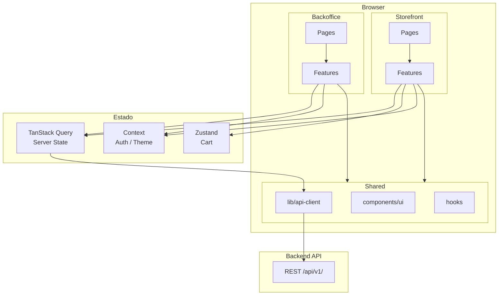
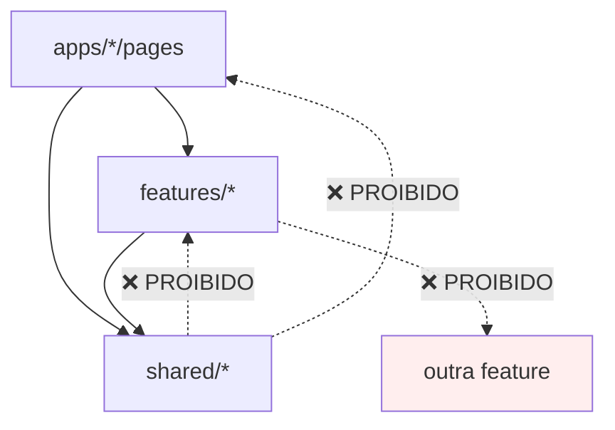
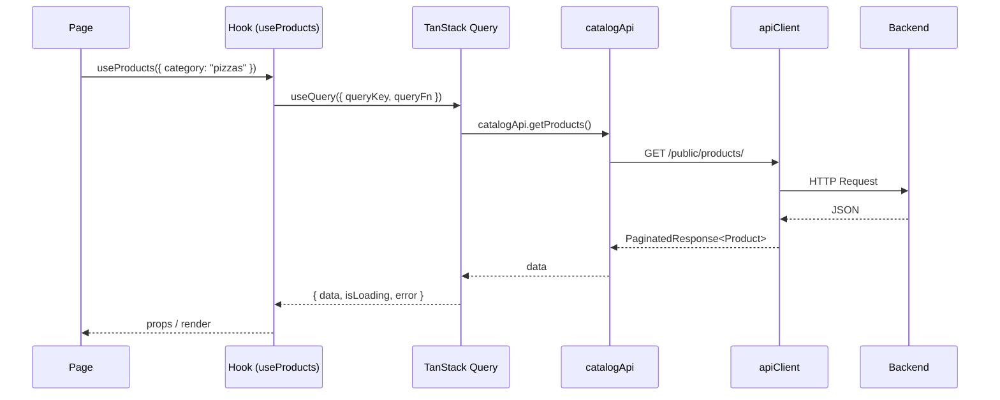
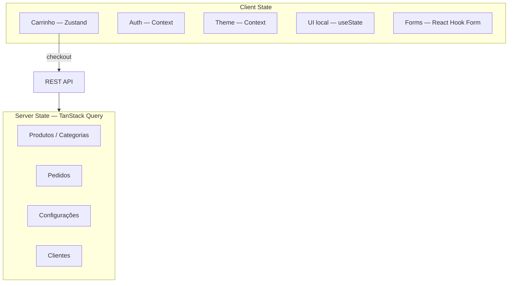
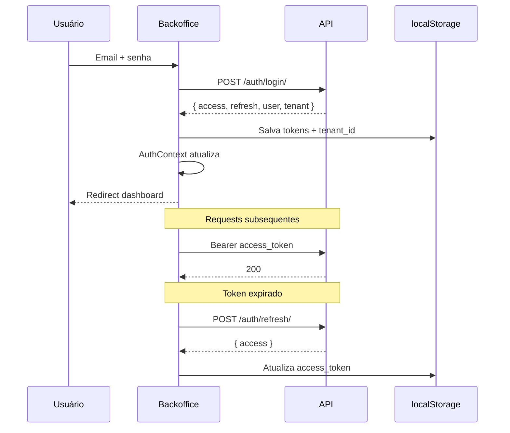

# 05 — Frontend

> **Documento:** Arquitetura e Padrões Frontend  
> **Produto:** Food Service *(nome comercial provisório)*  
> **Versão:** 1.0  
> **Status:** Aprovado  
> **Última atualização:** Julho/2026  
> **Depende de:** `02-arquitetura.md`, `04-design-system.md` (aprovados)  
> **Stack:** React 19, Vite 6, TypeScript, React Router 7, Tailwind CSS, shadcn/ui, TanStack Query, Zustand, React Hook Form, Zod, Framer Motion

---

## Sumário

1. [Visão Geral](#1-visão-geral)
2. [Setup do Projeto](#2-setup-do-projeto)
3. [Estrutura de Pastas](#3-estrutura-de-pastas)
4. [Camadas e Responsabilidades](#4-camadas-e-responsabilidades)
5. [Aplicações: Storefront e Backoffice](#5-aplicações-storefront-e-backoffice)
6. [Roteamento](#6-roteamento)
7. [Gerenciamento de Estado](#7-gerenciamento-de-estado)
8. [Camada de API](#8-camada-de-api)
9. [Hooks](#9-hooks)
10. [Formulários](#10-formulários)
11. [Autenticação e Sessão](#11-autenticação-e-sessão)
12. [Multi-Tenant no Frontend](#12-multi-tenant-no-frontend)
13. [Permissões no Frontend](#13-permissões-no-frontend)
14. [Componentes](#14-componentes)
15. [Tratamento de Erros](#15-tratamento-de-erros)
16. [Loading e Feedback](#16-loading-e-feedback)
17. [Performance](#17-performance)
18. [Testes](#18-testes)
19. [Variáveis de Ambiente](#19-variáveis-de-ambiente)
20. [Build e Deploy](#20-build-e-deploy)
21. [Convenções de Código](#21-convenções-de-código)
22. [Próximos Documentos](#22-próximos-documentos)

---

## 1. Visão Geral

### 1.1 Objetivo

Este documento define **como o frontend do Food Service é organizado, construído e mantido** — estrutura de pastas, padrões de código, fluxo de dados, roteamento, estado e integração com a API.

### 1.2 Duas Aplicações, Um Repositório

| Aplicação | Entry | Público | Prioridade UX |
|-----------|-------|---------|---------------|
| **Storefront** | `apps/storefront/main.tsx` | Consumidor final | Mobile first |
| **Backoffice** | `apps/backoffice/main.tsx` | Funcionários | Desktop first |

Compartilham: `features/`, `shared/`, `styles/`.

### 1.3 Diagrama de Alto Nível



### 1.4 Princípios Frontend

| Princípio | Descrição |
|-----------|-----------|
| **Feature-based** | Código organizado por domínio de negócio |
| **Colocation** | Tudo de uma feature junto (hooks, api, types, components) |
| **Server state ≠ Client state** | TanStack Query para API; Zustand/Context para UI |
| **Thin pages** | Pages compõem features; sem lógica de negócio |
| **API types** | TypeScript interfaces espelhando contratos da API |
| **Optimistic UI** | Atualizar UI antes da resposta quando seguro |
| **Pessimistic checkout** | Pedido e totais sempre validados no servidor |
| **Progressive enhancement** | Funciona sem JS para SEO básico (meta tags); interatividade com JS |

---

## 2. Setup do Projeto

### 2.1 Dependências Principais

```json
{
  "dependencies": {
    "react": "^19.0.0",
    "react-dom": "^19.0.0",
    "react-router": "^7.0.0",
    "@tanstack/react-query": "^5.0.0",
    "zustand": "^5.0.0",
    "react-hook-form": "^7.0.0",
    "@hookform/resolvers": "^3.0.0",
    "zod": "^3.0.0",
    "framer-motion": "^11.0.0",
    "lucide-react": "^0.400.0",
    "axios": "^1.7.0",
    "sonner": "^1.7.0",
    "class-variance-authority": "^0.7.0",
    "clsx": "^2.0.0",
    "tailwind-merge": "^2.0.0"
  },
  "devDependencies": {
    "vite": "^6.0.0",
    "@vitejs/plugin-react": "^4.0.0",
    "typescript": "^5.6.0",
    "tailwindcss": "^4.0.0",
    "@types/react": "^19.0.0",
    "vitest": "^2.0.0",
    "@testing-library/react": "^16.0.0",
    "eslint": "^9.0.0",
    "prettier": "^3.0.0"
  }
}
```

### 2.2 Scripts

```json
{
  "scripts": {
    "dev": "vite",
    "dev:admin": "vite --config vite.config.backoffice.ts",
    "build": "tsc -b && vite build",
    "build:admin": "tsc -b && vite build --config vite.config.backoffice.ts",
    "preview": "vite preview",
    "lint": "eslint src/",
    "typecheck": "tsc --noEmit",
    "test": "vitest",
    "test:ci": "vitest run"
  }
}
```

### 2.3 Path Aliases (tsconfig.json)

```json
{
  "compilerOptions": {
    "baseUrl": ".",
    "paths": {
      "@/*": ["./src/*"],
      "@/shared/*": ["./src/shared/*"],
      "@/features/*": ["./src/features/*"],
      "@/apps/*": ["./src/apps/*"]
    }
  }
}
```

---

## 3. Estrutura de Pastas

### 3.1 Árvore Completa

```
vendas_frontend/
├── docs/
├── public/
│   ├── favicon.ico
│   └── robots.txt
│
├── src/
│   ├── app/                              # Bootstrap compartilhado
│   │   └── providers.tsx                 # Providers globais
│   │
│   ├── apps/                             # Entrypoints
│   │   ├── storefront/
│   │   │   ├── main.tsx
│   │   │   ├── App.tsx
│   │   │   ├── routes.tsx
│   │   │   ├── pages/                    # Páginas (thin)
│   │   │   │   ├── HomePage.tsx
│   │   │   │   ├── CategoryPage.tsx
│   │   │   │   ├── ProductPage.tsx
│   │   │   │   ├── CartPage.tsx
│   │   │   │   ├── CheckoutPage.tsx
│   │   │   │   ├── OrderTrackingPage.tsx
│   │   │   │   ├── LoginPage.tsx
│   │   │   │   └── AccountPage.tsx
│   │   │   └── layouts/
│   │   │       ├── StorefrontLayout.tsx
│   │   │       └── CheckoutLayout.tsx
│   │   │
│   │   └── backoffice/
│   │       ├── main.tsx
│   │       ├── App.tsx
│   │       ├── routes.tsx
│   │       ├── pages/
│   │       │   ├── DashboardPage.tsx
│   │       │   ├── OrdersPage.tsx
│   │       │   ├── OrderDetailPage.tsx
│   │       │   ├── ProductsPage.tsx
│   │       │   ├── ProductFormPage.tsx
│   │       │   ├── CategoriesPage.tsx
│   │       │   ├── OptionGroupsPage.tsx
│   │       │   ├── LoginPage.tsx
│   │       │   └── SettingsPage.tsx
│   │       └── layouts/
│   │           ├── BackofficeLayout.tsx
│   │           └── AuthLayout.tsx
│   │
│   ├── features/                         # Domínios de negócio
│   │   ├── auth/
│   │   ├── catalog/
│   │   ├── cart/
│   │   ├── checkout/
│   │   ├── orders/
│   │   ├── company/
│   │   ├── customers/
│   │   ├── dashboard/
│   │   ├── promotions/
│   │   └── settings/
│   │
│   ├── shared/
│   │   ├── components/
│   │   │   ├── ui/                       # shadcn/ui
│   │   │   ├── feedback/                 # EmptyState, ErrorBoundary
│   │   │   ├── layout/                   # PageHeader, PageContainer
│   │   │   └── guards/                   # RequireAuth, RequirePermission
│   │   ├── hooks/
│   │   ├── lib/
│   │   ├── types/
│   │   ├── constants/
│   │   └── config/
│   │
│   └── styles/
│       ├── globals.css
│       └── tokens.css
│
├── index.html
├── index.admin.html
├── vite.config.ts
├── vite.config.backoffice.ts
├── tailwind.config.ts
├── components.json
├── tsconfig.json
├── tsconfig.app.json
├── eslint.config.js
├── .env.example
└── package.json
```

### 3.2 Estrutura de uma Feature

Toda feature segue o mesmo template:

```
features/catalog/
├── api/
│   └── catalogApi.ts           # Chamadas HTTP
├── components/
│   ├── ProductCard.tsx
│   ├── ProductList.tsx
│   ├── ProductDetail.tsx
│   ├── OptionGroupSelector.tsx
│   ├── CategoryNav.tsx
│   └── ProductForm.tsx         # Backoffice
├── hooks/
│   ├── useProducts.ts
│   ├── useProduct.ts
│   ├── useCategories.ts
│   ├── useCreateProduct.ts
│   └── useUpdateProduct.ts
├── schemas/
│   └── product.schema.ts       # Zod schemas
├── types/
│   └── catalog.types.ts
├── utils/
│   └── priceCalculator.ts
├── constants/
│   └── query-keys.ts
└── index.ts                    # Public API
```

### 3.3 Regras de Importação



| De | Pode importar | Não pode importar |
|----|---------------|-------------------|
| `apps/*/pages` | `features/*`, `shared/*` | Outras pages diretamente |
| `features/*` | `shared/*` | Outras features |
| `shared/*` | Pacotes npm | `features/*`, `apps/*` |

**Exceção:** `cart` pode importar **tipos** de `catalog` via `shared/types` ou duplicação mínima de interfaces — nunca componentes.

**Comunicação cross-feature:**
- Router (navegação)
- Context (auth, tenant)
- Zustand store (cart)
- TanStack Query cache (invalidação cruzada via query keys)

### 3.4 Public API da Feature (`index.ts`)

Cada feature exporta apenas o que outras camadas precisam:

```typescript
// features/catalog/index.ts
export { ProductCard, ProductList, ProductDetail } from "./components";
export { useProducts, useProduct, useCategories } from "./hooks";
export type { Product, Category, OptionGroup } from "./types";
```

Pages importam da public API:

```typescript
import { ProductList, useProducts } from "@/features/catalog";
```

---

## 4. Camadas e Responsabilidades

### 4.1 Fluxo de Dados



### 4.2 Responsabilidade por Camada

| Camada | Local | Faz | Não faz |
|--------|-------|-----|---------|
| **Page** | `apps/*/pages/` | Compõe layout + features, define meta | Fetch direto, lógica de negócio |
| **Layout** | `apps/*/layouts/` | Shell (nav, sidebar, footer) | Dados de domínio |
| **Feature Component** | `features/*/components/` | UI de domínio, interação | Chamadas HTTP diretas |
| **Hook** | `features/*/hooks/` | Query/mutation, deriva estado | Renderizar JSX |
| **API** | `features/*/api/` | Funções HTTP tipadas | Estado, cache |
| **Schema** | `features/*/schemas/` | Validação Zod | — |
| **Utils** | `features/*/utils/` | Lógica pura (preço, formatação) | Side effects |
| **Shared UI** | `shared/components/ui/` | Componentes genéricos | Regras de negócio |
| **Guard** | `shared/components/guards/` | Proteção de rotas | — |

### 4.3 Exemplo: Page Thin

```tsx
// apps/storefront/pages/CategoryPage.tsx
import { useParams } from "react-router";
import { ProductList, useProducts, useCategory } from "@/features/catalog";
import { PageContainer } from "@/shared/components/layout/PageContainer";
import { Skeleton } from "@/shared/components/ui/skeleton";

export function CategoryPage() {
  const { slug } = useParams<{ slug: string }>();
  const { data: category, isLoading: loadingCategory } = useCategory(slug!);
  const { data: products, isLoading: loadingProducts } = useProducts({
    category: slug,
  });

  if (loadingCategory) return <CategoryPageSkeleton />;

  return (
    <PageContainer>
      <h1 className="text-2xl font-bold">{category?.name}</h1>
      <ProductList
        products={products?.results ?? []}
        isLoading={loadingProducts}
      />
    </PageContainer>
  );
}
```

---

## 5. Aplicações: Storefront e Backoffice

### 5.1 Storefront

**Propósito:** Cardápio digital, carrinho, checkout e acompanhamento de pedidos.

| Aspecto | Decisão |
|---------|---------|
| Entry | `index.html` → `apps/storefront/main.tsx` |
| Base path | `/` |
| Tenant | Resolvido pelo subdomínio (sem header) |
| Auth | Opcional (guest checkout) |
| Layout | `StorefrontLayout` com navbar + footer |
| Checkout | `CheckoutLayout` sem distrações |

### 5.2 Backoffice

**Propósito:** Gestão operacional do estabelecimento.

| Aspecto | Decisão |
|---------|---------|
| Entry | `index.admin.html` → `apps/backoffice/main.tsx` |
| Base path | `/` (servido em `admin.foodservice.app`) |
| Tenant | JWT claim + header `X-Tenant-ID` |
| Auth | Obrigatória (exceto `/login`) |
| Layout | `BackofficeLayout` com sidebar + header |

### 5.3 Providers

```tsx
// app/providers.tsx
import { QueryClientProvider } from "@tanstack/react-query";
import { ReactQueryDevtools } from "@tanstack/react-query-devtools";
import { Toaster } from "sonner";
import { queryClient } from "@/shared/lib/query-client";
import { AuthProvider } from "@/features/auth/components/AuthProvider";
import { ThemeProvider } from "@/shared/components/ThemeProvider";

interface AppProvidersProps {
  children: React.ReactNode;
  withAuth?: boolean;
}

export function AppProviders({ children, withAuth = false }: AppProvidersProps) {
  return (
    <QueryClientProvider client={queryClient}>
      <ThemeProvider>
        {withAuth ? (
          <AuthProvider>{children}</AuthProvider>
        ) : (
          children
        )}
        <Toaster position="bottom-right" richColors />
      </ThemeProvider>
      <ReactQueryDevtools initialIsOpen={false} />
    </QueryClientProvider>
  );
}
```

```tsx
// apps/storefront/main.tsx
import { StrictMode } from "react";
import { createRoot } from "react-dom/client";
import { AppProviders } from "@/app/providers";
import { StorefrontApp } from "./App";
import "@/styles/globals.css";

createRoot(document.getElementById("root")!).render(
  <StrictMode>
    <AppProviders>
      <StorefrontApp />
    </AppProviders>
  </StrictMode>
);
```

```tsx
// apps/backoffice/main.tsx
import { StrictMode } from "react";
import { createRoot } from "react-dom/client";
import { AppProviders } from "@/app/providers";
import { BackofficeApp } from "./App";
import "@/styles/globals.css";

createRoot(document.getElementById("root")!).render(
  <StrictMode>
    <AppProviders withAuth>
      <BackofficeApp />
    </AppProviders>
  </StrictMode>
);
```

### 5.4 Estratégia de Build

| Fase | Abordagem |
|------|-----------|
| **MVP** | Um `vite.config.ts`, rotas `/` e `/admin` no mesmo SPA com `React.lazy` |
| **V1** | Dois configs Vite, builds separados, deploy otimizado |

```typescript
// vite.config.backoffice.ts — conceito
import { defineConfig } from "vite";
import react from "@vitejs/plugin-react";
import path from "path";

export default defineConfig({
  plugins: [react()],
  resolve: { alias: { "@": path.resolve(__dirname, "./src") } },
  build: {
    outDir: "dist/admin",
    rollupOptions: { input: { main: "index.admin.html" } },
  },
});
```

---

## 6. Roteamento

### 6.1 React Router 7

Configuração declarativa com route objects, lazy loading e guards.

```tsx
// apps/storefront/routes.tsx
import { lazy } from "react";
import { createBrowserRouter, Navigate } from "react-router";
import { StorefrontLayout } from "./layouts/StorefrontLayout";
import { CheckoutLayout } from "./layouts/CheckoutLayout";

const HomePage = lazy(() => import("./pages/HomePage"));
const CategoryPage = lazy(() => import("./pages/CategoryPage"));
const ProductPage = lazy(() => import("./pages/ProductPage"));
const CartPage = lazy(() => import("./pages/CartPage"));
const CheckoutPage = lazy(() => import("./pages/CheckoutPage"));
const OrderTrackingPage = lazy(() => import("./pages/OrderTrackingPage"));

export const storefrontRoutes = createBrowserRouter([
  {
    element: <StorefrontLayout />,
    children: [
      { index: true, element: <HomePage /> },
      { path: "categoria/:slug", element: <CategoryPage /> },
      { path: "produto/:slug", element: <ProductPage /> },
      { path: "carrinho", element: <CartPage /> },
      { path: "pedido/:id", element: <OrderTrackingPage /> },
      // auth routes (V1)
    ],
  },
  {
    element: <CheckoutLayout />,
    children: [
      { path: "checkout", element: <CheckoutPage /> },
    ],
  },
  { path: "*", element: <Navigate to="/" replace /> },
]);
```

### 6.2 Rotas Storefront (MVP)

| Rota | Page | Lazy | Auth |
|------|------|------|------|
| `/` | `HomePage` | ✅ | Não |
| `/categoria/:slug` | `CategoryPage` | ✅ | Não |
| `/produto/:slug` | `ProductPage` | ✅ | Não |
| `/carrinho` | `CartPage` | ✅ | Não |
| `/checkout` | `CheckoutPage` | ✅ | Opcional |
| `/pedido/:id` | `OrderTrackingPage` | ✅ | Não |
| `/login` | `LoginPage` | ✅ | Não |
| `/cadastro` | `RegisterPage` | ✅ | Não |
| `/conta` | `AccountPage` | ✅ | Sim |
| `/conta/pedidos` | `OrderHistoryPage` | ✅ | Sim |

### 6.3 Rotas Backoffice (MVP)

| Rota | Page | Permissão |
|------|------|-----------|
| `/login` | `LoginPage` | Público |
| `/` | `DashboardPage` | `dashboard.view` |
| `/pedidos` | `OrdersPage` | `orders.view` |
| `/pedidos/:id` | `OrderDetailPage` | `orders.view` |
| `/catalogo/produtos` | `ProductsPage` | `catalog.view` |
| `/catalogo/produtos/novo` | `ProductFormPage` | `catalog.manage` |
| `/catalogo/produtos/:id` | `ProductFormPage` | `catalog.manage` |
| `/catalogo/categorias` | `CategoriesPage` | `catalog.view` |
| `/catalogo/opcoes` | `OptionGroupsPage` | `catalog.manage` |
| `/configuracoes` | `SettingsPage` | `settings.manage` |

### 6.4 Route Guards

```tsx
// shared/components/guards/RequireAuth.tsx
import { Navigate, Outlet, useLocation } from "react-router";
import { useAuth } from "@/features/auth";

export function RequireAuth() {
  const { isAuthenticated, isLoading } = useAuth();
  const location = useLocation();

  if (isLoading) return <AuthLoadingSkeleton />;
  if (!isAuthenticated) {
    return <Navigate to="/login" state={{ from: location }} replace />;
  }

  return <Outlet />;
}
```

```tsx
// shared/components/guards/RequirePermission.tsx
import { Navigate, Outlet } from "react-router";
import { usePermissions } from "@/features/auth";

interface RequirePermissionProps {
  permission: string;
}

export function RequirePermission({ permission }: RequirePermissionProps) {
  const { can, isLoading } = usePermissions();

  if (isLoading) return <AuthLoadingSkeleton />;
  if (!can(permission)) {
    return <Navigate to="/" replace />;
  }

  return <Outlet />;
}
```

```tsx
// apps/backoffice/routes.tsx — uso
{
  element: <RequireAuth />,
  children: [
    {
      element: <BackofficeLayout />,
      children: [
        { index: true, element: <DashboardPage /> },
        {
          element: <RequirePermission permission="orders.view" />,
          children: [
            { path: "pedidos", element: <OrdersPage /> },
            { path: "pedidos/:id", element: <OrderDetailPage /> },
          ],
        },
      ],
    },
  ],
}
```

### 6.5 Suspense e Code Splitting

```tsx
// apps/storefront/App.tsx
import { Suspense } from "react";
import { RouterProvider } from "react-router";
import { storefrontRoutes } from "./routes";
import { PageLoadingSkeleton } from "@/shared/components/feedback/PageLoadingSkeleton";

export function StorefrontApp() {
  return (
    <Suspense fallback={<PageLoadingSkeleton />}>
      <RouterProvider router={storefrontRoutes} />
    </Suspense>
  );
}
```

---

## 7. Gerenciamento de Estado

### 7.1 Mapa de Estado



### 7.2 TanStack Query — Configuração

```typescript
// shared/lib/query-client.ts
import { QueryClient } from "@tanstack/react-query";

export const queryClient = new QueryClient({
  defaultOptions: {
    queries: {
      staleTime: 1000 * 60 * 5,       // 5 min default
      gcTime: 1000 * 60 * 30,         // 30 min garbage collection
      retry: 1,
      refetchOnWindowFocus: false,
    },
    mutations: {
      retry: 0,
    },
  },
});
```

### 7.3 Query Keys

Padrão hierárquico e tipado:

```typescript
// features/catalog/constants/query-keys.ts
export const catalogKeys = {
  all: ["catalog"] as const,
  categories: () => [...catalogKeys.all, "categories"] as const,
  category: (slug: string) => [...catalogKeys.categories(), slug] as const,
  products: (filters?: ProductFilters) =>
    [...catalogKeys.all, "products", filters] as const,
  product: (slug: string) => [...catalogKeys.all, "product", slug] as const,
};

// features/orders/constants/query-keys.ts
export const orderKeys = {
  all: ["orders"] as const,
  lists: () => [...orderKeys.all, "list"] as const,
  list: (filters?: OrderFilters) => [...orderKeys.lists(), filters] as const,
  detail: (id: string) => [...orderKeys.all, "detail", id] as const,
  active: () => [...orderKeys.all, "active"] as const,
};
```

**Regras:**
- Invalidação em cascata: `queryClient.invalidateQueries({ queryKey: orderKeys.all })`
- Filtros fazem parte da key (cache separado por filtro)
- Nunca usar strings soltas como query key

### 7.4 Stale Times por Domínio

| Domínio | staleTime | Motivo |
|---------|-----------|--------|
| Cardápio (produtos, categorias) | 5 min | Muda pouco; cache agressivo |
| Configurações da empresa | 15 min | Quase estático |
| Pedido ativo (tracking) | 0 | Polling frequente |
| Lista de pedidos (backoffice) | 30s | Atualização frequente |
| Dashboard KPIs | 1 min | Balanceado |

### 7.5 Zustand — Carrinho

```typescript
// features/cart/store/cartStore.ts
import { create } from "zustand";
import { persist } from "zustand/middleware";
import type { CartItem } from "../types/cart.types";

interface CartState {
  items: CartItem[];
  addItem: (item: CartItem) => void;
  removeItem: (id: string) => void;
  updateQuantity: (id: string, quantity: number) => void;
  clearCart: () => void;
  totalItems: () => number;
  subtotal: () => number;
}

export const useCartStore = create<CartState>()(
  persist(
    (set, get) => ({
      items: [],
      addItem: (item) =>
        set((state) => {
          const existing = state.items.find((i) => i.id === item.id);
          if (existing) {
            return {
              items: state.items.map((i) =>
                i.id === item.id
                  ? { ...i, quantity: i.quantity + item.quantity }
                  : i
              ),
            };
          }
          return { items: [...state.items, item] };
        }),
      removeItem: (id) =>
        set((state) => ({ items: state.items.filter((i) => i.id !== id) })),
      updateQuantity: (id, quantity) =>
        set((state) => ({
          items: quantity <= 0
            ? state.items.filter((i) => i.id !== id)
            : state.items.map((i) =>
                i.id === id ? { ...i, quantity } : i
              ),
        })),
      clearCart: () => set({ items: [] }),
      totalItems: () => get().items.reduce((sum, i) => sum + i.quantity, 0),
      subtotal: () =>
        get().items.reduce((sum, i) => sum + i.unitPrice * i.quantity, 0),
    }),
    { name: "foodservice-cart" }
  )
);
```

**Regras do carrinho:**
- Persistido em `localStorage` (key inclui tenant no futuro)
- `CartItem.id` = hash de `productId + selectedOptions`
- Preço é estimativa; backend valida no checkout
- Limpar carrinho após pedido confirmado

### 7.6 Polling para Pedidos Ativos

```typescript
// features/orders/hooks/useOrder.ts
export function useOrder(id: string, options?: { polling?: boolean }) {
  return useQuery({
    queryKey: orderKeys.detail(id),
    queryFn: () => ordersApi.getOrder(id),
    refetchInterval: options?.polling ? 10_000 : false, // 10s
    enabled: !!id,
  });
}
```

---

## 8. Camada de API

### 8.1 API Client

```typescript
// shared/lib/api-client.ts
import axios, { type AxiosError, type InternalAxiosRequestConfig } from "axios";
import { env } from "@/shared/config/env";
import type { ApiError } from "@/shared/types/api.types";

export const apiClient = axios.create({
  baseURL: env.VITE_API_URL,
  headers: { "Content-Type": "application/json" },
  timeout: 30_000,
});

apiClient.interceptors.request.use((config: InternalAxiosRequestConfig) => {
  const token = localStorage.getItem("access_token");
  if (token) {
    config.headers.Authorization = `Bearer ${token}`;
  }

  const tenantId = localStorage.getItem("tenant_id");
  if (tenantId) {
    config.headers["X-Tenant-ID"] = tenantId;
  }

  return config;
});

apiClient.interceptors.response.use(
  (response) => response,
  async (error: AxiosError<ApiError>) => {
    if (error.response?.status === 401) {
      // Tentar refresh ou redirect login
      const isBackoffice = window.location.hostname.startsWith("admin.");
      if (isBackoffice) {
        localStorage.removeItem("access_token");
        window.location.href = "/login";
      }
    }
    return Promise.reject(normalizeError(error));
  }
);

function normalizeError(error: AxiosError<ApiError>): ApiError {
  if (error.response?.data) return error.response.data;
  return {
    detail: "Erro de conexão. Verifique sua internet.",
    code: "NETWORK_ERROR",
  };
}
```

### 8.2 Tipos Compartilhados

```typescript
// shared/types/api.types.ts
export interface PaginatedResponse<T> {
  count: number;
  next: string | null;
  previous: string | null;
  results: T[];
}

export interface ApiError {
  detail: string;
  code?: string;
  fields?: Record<string, string[]>;
}

export interface PaginationParams {
  page?: number;
  page_size?: number;
  ordering?: string;
}
```

### 8.3 API por Feature

```typescript
// features/catalog/api/catalogApi.ts
import { apiClient } from "@/shared/lib/api-client";
import type { PaginatedResponse } from "@/shared/types/api.types";
import type {
  Product,
  Category,
  ProductFilters,
  CreateProductDTO,
} from "../types/catalog.types";

const PUBLIC_PREFIX = "/public";
const ADMIN_PREFIX = "/admin";

export const catalogApi = {
  // Storefront (tenant via subdomínio)
  getCategories: () =>
    apiClient
      .get<Category[]>(`${PUBLIC_PREFIX}/categories/`)
      .then((r) => r.data),

  getProducts: (params?: ProductFilters) =>
    apiClient
      .get<PaginatedResponse<Product>>(`${PUBLIC_PREFIX}/products/`, { params })
      .then((r) => r.data),

  getProduct: (slug: string) =>
    apiClient
      .get<Product>(`${PUBLIC_PREFIX}/products/${slug}/`)
      .then((r) => r.data),

  // Backoffice
  createProduct: (data: CreateProductDTO) =>
    apiClient
      .post<Product>(`${ADMIN_PREFIX}/products/`, data)
      .then((r) => r.data),

  updateProduct: (id: string, data: Partial<CreateProductDTO>) =>
    apiClient
      .patch<Product>(`${ADMIN_PREFIX}/products/${id}/`, data)
      .then((r) => r.data),

  deleteProduct: (id: string) =>
    apiClient.delete(`${ADMIN_PREFIX}/products/${id}/`),
};
```

### 8.4 Prefixos da API

| Prefixo | Contexto | Auth | Tenant |
|---------|----------|------|--------|
| `/api/v1/public/` | Storefront | Opcional | Subdomínio |
| `/api/v1/admin/` | Backoffice | JWT obrigatório | JWT + header |
| `/api/v1/auth/` | Login, refresh | Variável | — |

---

## 9. Hooks

### 9.1 Padrão Query Hook

```typescript
// features/catalog/hooks/useProducts.ts
import { useQuery } from "@tanstack/react-query";
import { catalogApi } from "../api/catalogApi";
import { catalogKeys } from "../constants/query-keys";
import type { ProductFilters } from "../types/catalog.types";

export function useProducts(filters?: ProductFilters) {
  return useQuery({
    queryKey: catalogKeys.products(filters),
    queryFn: () => catalogApi.getProducts(filters),
    staleTime: 1000 * 60 * 5,
  });
}
```

### 9.2 Padrão Mutation Hook

```typescript
// features/orders/hooks/useUpdateOrderStatus.ts
import { useMutation, useQueryClient } from "@tanstack/react-query";
import { toast } from "sonner";
import { ordersApi } from "../api/ordersApi";
import { orderKeys } from "../constants/query-keys";
import type { OrderStatus } from "../types/orders.types";

export function useUpdateOrderStatus() {
  const queryClient = useQueryClient();

  return useMutation({
    mutationFn: ({ id, status }: { id: string; status: OrderStatus }) =>
      ordersApi.updateStatus(id, status),
    onSuccess: (order) => {
      queryClient.invalidateQueries({ queryKey: orderKeys.detail(order.id) });
      queryClient.invalidateQueries({ queryKey: orderKeys.lists() });
      toast.success("Status atualizado");
    },
    onError: (error: ApiError) => {
      toast.error(error.detail || "Erro ao atualizar status");
    },
  });
}
```

### 9.3 Inventário de Hooks por Feature

#### `auth`

| Hook | Tipo | Descrição |
|------|------|-----------|
| `useAuth()` | Context | Usuário, login, logout |
| `usePermissions()` | Context | `can(permission)` |
| `useLogin()` | Mutation | Login backoffice |
| `useCustomerLogin()` | Mutation | Login storefront |

#### `catalog`

| Hook | Tipo | Descrição |
|------|------|-----------|
| `useCategories()` | Query | Lista categorias |
| `useCategory(slug)` | Query | Detalhe categoria |
| `useProducts(filters?)` | Query | Lista produtos |
| `useProduct(slug)` | Query | Detalhe produto |
| `useCreateProduct()` | Mutation | Criar produto |
| `useUpdateProduct()` | Mutation | Atualizar produto |
| `useDeleteProduct()` | Mutation | Deletar produto |
| `useOptionGroups()` | Query | Grupos de opções |

#### `cart`

| Hook | Tipo | Descrição |
|------|------|-----------|
| `useCart()` | Zustand | Estado do carrinho |
| `useAddToCart()` | Action | Adicionar item |
| `useCartTotal()` | Derived | Subtotal calculado |

#### `checkout`

| Hook | Tipo | Descrição |
|------|------|-----------|
| `useCheckoutForm()` | Form | Formulário de checkout |
| `useCreateOrder()` | Mutation | Finalizar pedido |

#### `orders`

| Hook | Tipo | Descrição |
|------|------|-----------|
| `useOrders(filters?)` | Query | Lista pedidos |
| `useOrder(id, opts?)` | Query | Detalhe + polling |
| `useUpdateOrderStatus()` | Mutation | Mudar status |
| `useActiveOrders()` | Query | Pedidos não finalizados |

#### `shared`

| Hook | Tipo | Descrição |
|------|------|-----------|
| `useDebounce(value, ms)` | UI | Debounce de busca |
| `useMediaQuery(query)` | UI | Breakpoints |
| `useLocalStorage(key)` | UI | Persistência genérica |
| `useDisclosure()` | UI | Open/close modais |

---

## 10. Formulários

### 10.1 Stack

**React Hook Form** + **Zod** + `@hookform/resolvers/zod`

### 10.2 Padrão Schema

```typescript
// features/checkout/schemas/checkout.schema.ts
import { z } from "zod";

export const checkoutSchema = z.object({
  customerName: z
    .string()
    .min(2, "Nome deve ter pelo menos 2 caracteres"),
  customerPhone: z
    .string()
    .regex(/^\(\d{2}\) \d{4,5}-\d{4}$/, "Telefone inválido"),
  deliveryType: z.enum(["delivery", "pickup"]),
  paymentMethod: z.enum(["cash", "pix", "card_on_delivery"]),
  notes: z.string().max(500).optional(),
  changeFor: z.number().positive().optional(),
  address: z.object({
    street: z.string().min(1, "Rua é obrigatória"),
    number: z.string().min(1, "Número é obrigatório"),
    complement: z.string().optional(),
    neighborhood: z.string().min(1, "Bairro é obrigatório"),
    city: z.string().min(1),
    state: z.string().length(2),
    zipCode: z.string().regex(/^\d{5}-?\d{3}$/, "CEP inválido"),
    reference: z.string().optional(),
  }).optional(),
}).refine(
  (data) => data.deliveryType !== "delivery" || data.address,
  { message: "Endereço é obrigatório para delivery", path: ["address"] }
).refine(
  (data) => data.paymentMethod !== "cash" || data.changeFor,
  { message: "Informe o valor para troco", path: ["changeFor"] }
);

export type CheckoutFormData = z.infer<typeof checkoutSchema>;
```

### 10.3 Padrão Form Component

```tsx
// features/checkout/components/CheckoutForm.tsx
import { useForm } from "react-hook-form";
import { zodResolver } from "@hookform/resolvers/zod";
import { checkoutSchema, type CheckoutFormData } from "../schemas/checkout.schema";
import { useCreateOrder } from "../hooks/useCreateOrder";
import { Button } from "@/shared/components/ui/button";
import {
  Form, FormControl, FormField, FormItem, FormLabel, FormMessage,
} from "@/shared/components/ui/form";
import { Input } from "@/shared/components/ui/input";

export function CheckoutForm() {
  const { mutate: createOrder, isPending } = useCreateOrder();

  const form = useForm<CheckoutFormData>({
    resolver: zodResolver(checkoutSchema),
    defaultValues: {
      deliveryType: "delivery",
      paymentMethod: "pix",
    },
  });

  function onSubmit(data: CheckoutFormData) {
    createOrder(data);
  }

  return (
    <Form {...form}>
      <form onSubmit={form.handleSubmit(onSubmit)} className="space-y-4">
        <FormField
          control={form.control}
          name="customerName"
          render={({ field }) => (
            <FormItem>
              <FormLabel>Nome completo</FormLabel>
              <FormControl>
                <Input placeholder="Seu nome" {...field} />
              </FormControl>
              <FormMessage />
            </FormItem>
          )}
        />
        {/* demais campos */}
        <Button type="submit" size="lg" className="w-full" disabled={isPending}>
          {isPending ? "Finalizando..." : "Confirmar pedido"}
        </Button>
      </form>
    </Form>
  );
}
```

### 10.4 Schemas por Feature

| Feature | Schema | Uso |
|---------|--------|-----|
| `auth` | `loginSchema`, `registerSchema` | Login/cadastro |
| `checkout` | `checkoutSchema` | Finalizar pedido |
| `catalog` | `productSchema`, `categorySchema`, `optionGroupSchema` | CRUD backoffice |
| `settings` | `companySettingsSchema` | Configurações |
| `customers` | `addressSchema` | Endereços |

### 10.5 Máscaras de Input

Máscaras aplicadas via `onChange` transform ou componentes dedicados:

| Campo | Máscara | Biblioteca |
|-------|---------|------------|
| Telefone | `(00) 00000-0000` | Custom ou `react-input-mask` |
| CEP | `00000-000` | Custom |
| CPF/CNPJ | Futuro | — |
| Preço | `R$ 0,00` | `formatPrice` no blur |

---

## 11. Autenticação e Sessão

### 11.1 Fluxo Backoffice



### 11.2 AuthContext

```typescript
// features/auth/types/auth.types.ts
export interface Employee {
  id: string;
  email: string;
  firstName: string;
  lastName: string;
  isOwner: boolean;
  permissions: string[];
}

export interface Tenant {
  id: string;
  tradeName: string;
  slug: string;
  subdomain: string;
}

export interface AuthState {
  user: Employee | null;
  tenant: Tenant | null;
  isAuthenticated: boolean;
  isLoading: boolean;
  login: (email: string, password: string) => Promise<void>;
  logout: () => void;
}
```

```tsx
// features/auth/components/AuthProvider.tsx
// Implementação com useState + useEffect para restaurar sessão do token
```

### 11.3 Armazenamento

| Chave | Conteúdo | Onde |
|-------|----------|------|
| `access_token` | JWT access | localStorage |
| `refresh_token` | JWT refresh | localStorage (MVP) / httpOnly cookie (V1) |
| `tenant_id` | UUID do tenant | localStorage |

> **MVP:** localStorage. **V1:** migrar refresh token para httpOnly cookie.

### 11.4 Guest Checkout (Storefront)

- Sem JWT obrigatório
- `customer` criado no backend durante checkout
- Opcional: login pós-pedido para histórico

---

## 12. Multi-Tenant no Frontend

### 12.1 Storefront — Subdomínio

O tenant é resolvido **no backend** pelo header `Host`. O frontend não envia `X-Tenant-ID`.

```
pizzaria-joao.foodservice.app → API resolve tenant automaticamente
```

O frontend pode buscar dados públicos da empresa:

```typescript
// features/company/hooks/useCompanyPublic.ts
export function useCompanyPublic() {
  return useQuery({
    queryKey: ["company", "public"],
    queryFn: () => companyApi.getPublic(),
    staleTime: 1000 * 60 * 15,
  });
}
```

Usado para: logo, nome, horários, status aberto/fechado.

### 12.2 Backoffice — JWT + Header

Tenant vem do JWT após login. `tenant_id` salvo no localStorage para o interceptor.

### 12.3 Carrinho por Tenant (Futuro)

```typescript
// Chave de persistência inclui tenant
{ name: `foodservice-cart-${tenantId}` }
```

Evita misturar carrinhos se o usuário acessar dois tenants no mesmo browser.

---

## 13. Permissões no Frontend

### 13.1 Hook usePermissions

```typescript
// features/auth/hooks/usePermissions.ts
import { useAuth } from "./useAuth";

export function usePermissions() {
  const { user, isLoading } = useAuth();

  const can = (permission: string): boolean => {
    if (!user) return false;
    if (user.isOwner) return true;
    return user.permissions.includes(permission);
  };

  const canAny = (permissions: string[]): boolean =>
    permissions.some(can);

  const canAll = (permissions: string[]): boolean =>
    permissions.every(can);

  return { can, canAny, canAll, isLoading };
}
```

### 13.2 Uso em Componentes

```tsx
// Ocultar botão sem permissão
const { can } = usePermissions();

{can("catalog.manage") && (
  <Button onClick={handleCreate}>Novo Produto</Button>
)}
```

```tsx
// Componente wrapper
<Can permission="orders.manage">
  <Button onClick={handleCancel}>Cancelar pedido</Button>
</Can>
```

### 13.3 Sidebar Dinâmica

```typescript
// apps/backoffice/layouts/nav-items.ts
export const navItems = [
  { label: "Dashboard", href: "/", icon: LayoutDashboard, permission: "dashboard.view" },
  { label: "Pedidos", href: "/pedidos", icon: Receipt, permission: "orders.view" },
  {
    label: "Catálogo",
    icon: UtensilsCrossed,
    permission: "catalog.view",
    children: [
      { label: "Produtos", href: "/catalogo/produtos", permission: "catalog.view" },
      { label: "Categorias", href: "/catalogo/categorias", permission: "catalog.view" },
      { label: "Opções", href: "/catalogo/opcoes", permission: "catalog.manage" },
    ],
  },
  { label: "Configurações", href: "/configuracoes", icon: Settings, permission: "settings.manage" },
];
```

Filtrar itens com `can(item.permission)` antes de renderizar.

> **Importante:** Permissões no frontend são **UX** — backend sempre valida autorização.

---

## 14. Componentes

### 14.1 Categorias de Componentes

| Categoria | Local | Exemplos |
|-----------|-------|----------|
| **UI primitivos** | `shared/components/ui/` | Button, Input, Dialog (shadcn) |
| **Feedback** | `shared/components/feedback/` | EmptyState, ErrorBoundary, PageLoadingSkeleton |
| **Layout** | `shared/components/layout/` | PageContainer, PageHeader, Section |
| **Guards** | `shared/components/guards/` | RequireAuth, RequirePermission, Can |
| **Domínio** | `features/*/components/` | ProductCard, OrderStatusBadge, CheckoutForm |

### 14.2 Convenção de Nomenclatura

| Tipo | Padrão | Exemplo |
|------|--------|---------|
| Componente | PascalCase | `ProductCard.tsx` |
| Hook | camelCase com `use` | `useProducts.ts` |
| API | camelCase + `Api` | `catalogApi.ts` |
| Types | PascalCase + `.types.ts` | `catalog.types.ts` |
| Schema | camelCase + `.schema.ts` | `checkout.schema.ts` |
| Constants | SCREAMING_SNAKE ou objeto | `query-keys.ts` |
| Page | PascalCase + `Page` | `HomePage.tsx` |
| Layout | PascalCase + `Layout` | `StorefrontLayout.tsx` |

### 14.3 Anatomia de Componente

```tsx
// features/catalog/components/ProductCard.tsx
import { Link } from "react-router";
import { motion } from "framer-motion";
import { Plus } from "lucide-react";
import { Button } from "@/shared/components/ui/button";
import { Badge } from "@/shared/components/ui/badge";
import { PriceDisplay } from "@/shared/components/PriceDisplay";
import { cn } from "@/shared/lib/utils";
import type { Product } from "../types/catalog.types";

interface ProductCardProps {
  product: Product;
  onAddToCart?: (product: Product) => void;
  className?: string;
}

export function ProductCard({ product, onAddToCart, className }: ProductCardProps) {
  const isAvailable = product.isAvailable;

  return (
    <motion.div
      whileHover={{ scale: 1.02 }}
      transition={{ duration: 0.15 }}
      className={cn(
        "group rounded-xl border bg-card overflow-hidden",
        !isAvailable && "opacity-60",
        className
      )}
    >
      <Link to={`/produto/${product.slug}`}>
        <div className="aspect-[4/3] bg-muted relative">
          {product.imageUrl ? (
            
          ) : (
            <div className="flex items-center justify-center h-full">
              <ImageOff className="h-8 w-8 text-muted-foreground" />
            </div>
          )}
          {!isAvailable && (
            <Badge className="absolute top-2 right-2" variant="secondary">
              Indisponível
            </Badge>
          )}
        </div>
      </Link>

      <div className="p-4">
        <Link to={`/produto/${product.slug}`}>
          <h3 className="font-semibold truncate">{product.name}</h3>
          {product.description && (
            <p className="text-sm text-muted-foreground line-clamp-2 mt-1">
              {product.description}
            </p>
          )}
        </Link>

        <div className="flex items-center justify-between mt-3">
          <PriceDisplay value={product.basePrice} />
          {isAvailable && onAddToCart && (
            <Button size="sm" onClick={() => onAddToCart(product)}>
              <Plus className="h-4 w-4" />
              Adicionar
            </Button>
          )}
        </div>
      </div>
    </motion.div>
  );
}
```

### 14.4 Composição vs Props

| Preferir composição | Preferir props |
|--------------------|----------------|
| Layouts flexíveis | Componentes de domínio |
| Slots (`children`) | Configuração simples |
| Compound components | Variações via `variant` (cva) |

---

## 15. Tratamento de Erros

### 15.1 Error Boundary

```tsx
// shared/components/feedback/ErrorBoundary.tsx
// Captura erros de renderização
// Exibe fallback com "Algo deu errado" + botão retry
// Reporta para Sentry (V1)
```

### 15.2 Erros de API

| Código | Ação no frontend |
|--------|------------------|
| 400 | Exibir `fields` nos campos do form |
| 401 | Redirect login (backoffice) |
| 403 | Toast "Sem permissão" |
| 404 | Página não encontrada / EmptyState |
| 422 | Exibir erros de validação |
| 429 | Toast "Muitas tentativas" |
| 500 | Toast genérico + retry |

### 15.3 Padrão em Hooks

```typescript
const { data, error, isError, refetch } = useProducts();

if (isError) {
  return <ErrorState message={error.message} onRetry={refetch} />;
}
```

---

## 16. Loading e Feedback

### 16.1 Hierarquia de Loading

| Prioridade | Padrão | Quando |
|------------|--------|--------|
| 1 | **Skeleton** | Listas, cards, páginas |
| 2 | **Spinner inline** | Botões (mutation pending) |
| 3 | **Page skeleton** | Transição de rota (Suspense) |
| 4 | **Spinner full page** | Apenas auth check inicial |

### 16.2 Optimistic Updates

Usar apenas onde seguro:

| Ação | Optimistic? | Motivo |
|------|-------------|--------|
| Atualizar status do pedido | ✅ | Reversível, UX crítica |
| Adicionar ao carrinho | ✅ | Estado local (Zustand) |
| Criar pedido | ❌ | Dinheiro envolvido |
| Deletar produto | ❌ | Destrutivo |
| Aplicar cupom | ❌ | Cálculo no servidor |

```typescript
// Exemplo optimistic update
onMutate: async ({ id, status }) => {
  await queryClient.cancelQueries({ queryKey: orderKeys.detail(id) });
  const previous = queryClient.getQueryData(orderKeys.detail(id));
  queryClient.setQueryData(orderKeys.detail(id), (old) => ({
    ...old,
    status,
  }));
  return { previous };
},
onError: (_err, { id }, context) => {
  queryClient.setQueryData(orderKeys.detail(id), context?.previous);
},
```

### 16.3 Toasts

Usar **Sonner** para feedback de ações:

| Ação | Toast |
|------|-------|
| Pedido criado | `success`: "Pedido #0001 confirmado!" |
| Produto salvo | `success`: "Produto salvo" |
| Erro de rede | `error`: "Erro de conexão" |
| Status atualizado | `success`: "Status atualizado" |
| Item adicionado ao carrinho | `success`: "Adicionado ao carrinho" (curto, 2s) |

---

## 17. Performance

### 17.1 Checklist

| Técnica | Implementação |
|---------|---------------|
| Code splitting | `React.lazy` em todas as pages |
| Image lazy loading | `loading="lazy"` + WebP |
| Query cache | TanStack Query staleTime |
| Memoização | `React.memo` em listas grandes (ProductCard) |
| Virtualização | `@tanstack/react-virtual` em listas > 100 itens (V1) |
| Debounce busca | `useDebounce(300ms)` |
| Bundle analysis | `rollup-plugin-visualizer` no CI |
| Prefetch | `queryClient.prefetchQuery` em hover de ProductCard (V1) |

### 17.2 Metas

| Métrica | Meta |
|---------|------|
| LCP | < 2.5s |
| FID / INP | < 200ms |
| CLS | < 0.1 |
| Bundle inicial (storefront) | < 200KB gzip |
| Bundle inicial (backoffice) | < 300KB gzip |

### 17.3 Imagens

| Regra | Valor |
|-------|-------|
| Formato | WebP com fallback JPEG |
| Thumbnail produto | 400×300 |
| Hero / capa | 1200×675 |
| Lazy load | Sempre abaixo do fold |
| Placeholder | Skeleton ou blur hash (V1) |

---

## 18. Testes

### 18.1 Stack

| Ferramenta | Uso |
|------------|-----|
| **Vitest** | Runner |
| **@testing-library/react** | Testes de componentes |
| **MSW** | Mock da API |
| **@testing-library/user-event** | Simulação de interação |

### 18.2 O que Testar

| Prioridade | O quê | Tipo |
|------------|-------|------|
| Alta | `priceCalculator.ts` | Unit |
| Alta | Zod schemas | Unit |
| Alta | `cartStore` (add, remove, total) | Unit |
| Média | Hooks com MSW | Integration |
| Média | Formulários (validação) | Integration |
| Média | Route guards | Integration |
| Baixa | Snapshot de componentes UI | Snapshot |

### 18.3 Exemplo

```typescript
// features/catalog/utils/priceCalculator.test.ts
import { describe, it, expect } from "vitest";
import { calculateItemPrice } from "./priceCalculator";

describe("calculateItemPrice", () => {
  it("soma preço base e modificadores fixos", () => {
    const price = calculateItemPrice({
      basePrice: 45,
      options: [
        { priceModifier: 8, priceType: "fixed" },
        { priceModifier: 7, priceType: "fixed" },
      ],
    });
    expect(price).toBe(60);
  });

  it("aplica modificador percentual sobre base", () => {
    const price = calculateItemPrice({
      basePrice: 100,
      options: [{ priceModifier: 10, priceType: "percentage" }],
    });
    expect(price).toBe(110);
  });
});
```

### 18.4 Estrutura de Testes

```
features/catalog/
├── utils/
│   ├── priceCalculator.ts
│   └── priceCalculator.test.ts    # Colocado junto ao código
```

---

## 19. Variáveis de Ambiente

```bash
# .env.example
VITE_API_BASE_URL=http://localhost:8001/api/v1
VITE_APP_NAME=Food Service
VITE_APP_ENV=development
```

```typescript
// shared/config/env.ts
import { z } from "zod";

const envSchema = z.object({
  VITE_API_URL: z.string().url(),
  VITE_APP_NAME: z.string().default("Food Service"),
  VITE_APP_ENV: z.enum(["development", "staging", "production"]).default("development"),
});

export const env = envSchema.parse(import.meta.env);
```

| Variável | Descrição | Exemplo |
|----------|-----------|---------|
| `VITE_API_URL` | Base URL da API | `https://api.foodservice.app/api/v1` |
| `VITE_APP_NAME` | Nome exibido | `Food Service` |
| `VITE_APP_ENV` | Ambiente | `production` |

> Apenas variáveis com prefixo `VITE_` são expostas ao client.

---

## 20. Build e Deploy

### 20.1 Build de Produção

```bash
# Storefront
npm run build
# Output: dist/

# Backoffice (V1)
npm run build:admin
# Output: dist/admin/
```

### 20.2 Docker (Frontend)

```dockerfile
# Conceito — docker/Dockerfile
FROM node:22-alpine AS builder
WORKDIR /app
COPY package*.json ./
RUN npm ci
COPY . .
ARG VITE_API_URL
RUN npm run build

FROM nginx:alpine
COPY --from=builder /app/dist /usr/share/nginx/html
COPY docker/nginx.conf /etc/nginx/conf.d/default.conf
EXPOSE 80
```

### 20.3 Nginx para SPA

```nginx
location / {
    try_files $uri $uri/ /index.html;
}

location /api/ {
    proxy_pass http://backend:8000;  # porta interna do container em produção
}
```

### 20.4 CI (GitHub Actions)

```yaml
# Conceito
jobs:
  frontend-ci:
    steps:
      - uses: actions/checkout@v4
      - uses: actions/setup-node@v4
      - run: npm ci
      - run: npm run typecheck
      - run: npm run lint
      - run: npm run test:ci
      - run: npm run build
```

---

## 21. Convenções de Código

### 21.1 Imports

Ordem padronizada (ESLint `import/order`):

```typescript
// 1. React / libs externas
import { useState } from "react";
import { useQuery } from "@tanstack/react-query";

// 2. Shared
import { Button } from "@/shared/components/ui/button";
import { cn } from "@/shared/lib/utils";

// 3. Features (public API)
import { useProducts, ProductCard } from "@/features/catalog";

// 4. Relativos (mesma feature)
import { catalogKeys } from "../constants/query-keys";
import type { Product } from "../types/catalog.types";
```

### 21.2 Exportações

| Regra | Exemplo |
|-------|---------|
| Named exports (preferido) | `export function ProductCard()` |
| Default exports | Apenas em `pages/` e `main.tsx` |
| Barrel exports | `index.ts` por feature |
| Types | `export type { Product }` |

### 21.3 TypeScript

| Regra | Descrição |
|-------|-----------|
| `strict: true` | Sem exceções |
| Sem `any` | Usar `unknown` + type guard |
| Props tipadas | Interface `ComponentNameProps` |
| DTOs separados | `CreateProductDTO` vs `Product` |
| Enums | `const` objects ou union types (não TS enum) |

```typescript
// Preferir union types
export type OrderStatus =
  | "pending"
  | "confirmed"
  | "preparing"
  | "ready"
  | "out_for_delivery"
  | "completed"
  | "cancelled";
```

### 21.4 Arquivos

| Regra | Valor |
|-------|-------|
| Max linhas por arquivo | ~300 (dividir se maior) |
| Um componente por arquivo | Sim |
| Colocation de testes | `*.test.ts` junto ao arquivo |
| CSS | Apenas `globals.css` + Tailwind (sem CSS modules) |

---

## 22. Próximos Documentos

| # | Documento | Relação |
|---|-----------|---------|
| 06 | `06-backend.md` | Contrato API consumido pelo frontend |
| 07 | `07-api.md` | Endpoints detalhados |
| 10 | `10-padroes-de-codigo.md` | Convenções Git e código expandidas |
| 11 | `11-guia-ui-ux.md` | Fluxos de UX aplicados |
| 12 | `12-checklist-mvp.md` | Páginas e features do MVP |

---

## Histórico de Revisões

| Versão | Data | Autor | Alterações |
|--------|------|-------|------------|
| 1.0 | Jul/2026 | — | Versão inicial — aprovado |

---

## Apêndice A — Mapa de Features MVP

| Feature | Storefront | Backoffice |
|---------|------------|------------|
| `auth` | Login opcional | Login obrigatório |
| `company` | Dados públicos (logo, horário) | — |
| `catalog` | Listar, detalhe, opções | CRUD produtos, categorias, opções |
| `cart` | Carrinho persistente | — |
| `checkout` | Fluxo de checkout | — |
| `orders` | Tracking | Lista, detalhe, status |
| `dashboard` | — | KPIs básicos |
| `settings` | — | Configurações da empresa |

## Apêndice B — Checklist Setup Inicial

- [ ] `npm create vite@latest` + React + TypeScript
- [ ] Tailwind CSS + tokens
- [ ] shadcn/ui init
- [ ] Path aliases (`@/`)
- [ ] React Router 7
- [ ] TanStack Query + devtools
- [ ] Zustand
- [ ] React Hook Form + Zod
- [ ] Axios api-client
- [ ] ESLint + Prettier
- [ ] Vitest + Testing Library
- [ ] Estrutura de pastas (`apps/`, `features/`, `shared/`)
- [ ] Providers (Query, Theme, Toast)
- [ ] Storefront routes + layout
- [ ] Backoffice routes + layout

---

> **Documento aprovado.** Próximo: `06-backend.md`.
