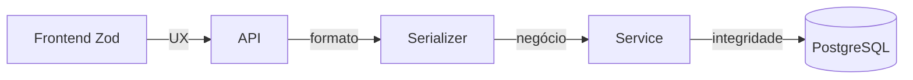
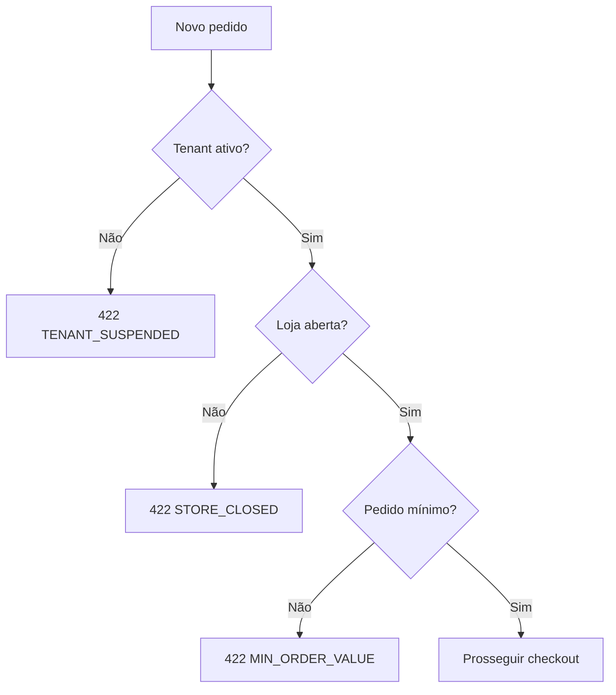
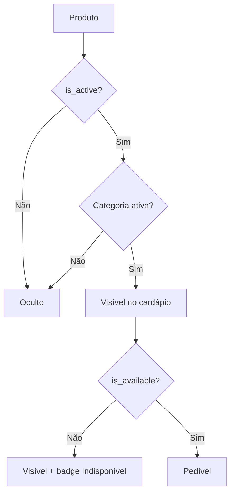
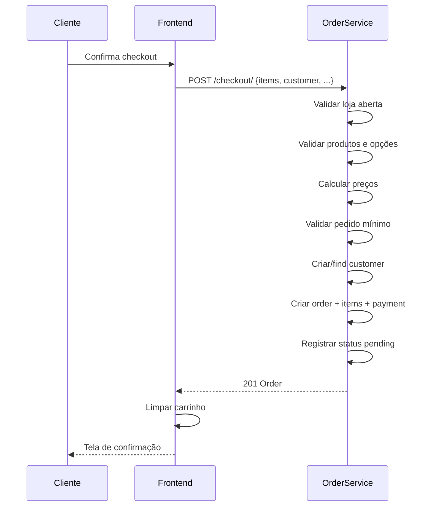
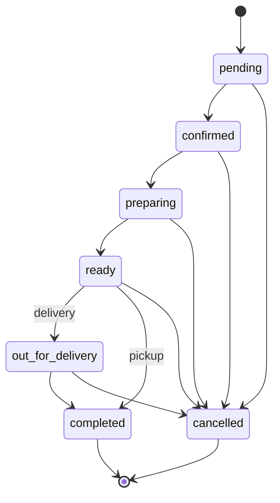
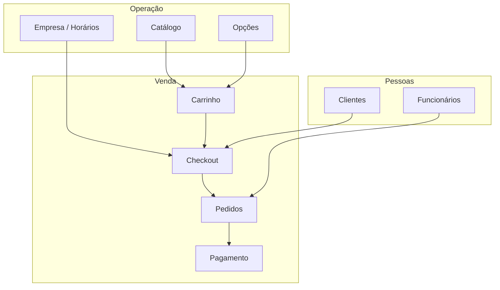

# 08 — Regras de Negócio

> **Documento:** Regras de Negócio  
> **Produto:** Food Service *(nome comercial provisório)*  
> **Versão:** 1.0  
> **Status:** Aprovado  
> **Última atualização:** Julho/2026  
> **Depende de:** `03-modelagem-do-banco.md`, `06-backend.md`, `07-api.md` (aprovados)

---

## Sumário

1. [Visão Geral](#1-visão-geral)
2. [Princípios das Regras](#2-princípios-das-regras)
3. [Multi-Tenant e Isolamento](#3-multi-tenant-e-isolamento)
4. [Empresa e Operação](#4-empresa-e-operação)
5. [Catálogo](#5-catálogo)
6. [Personalização de Produtos](#6-personalização-de-produtos)
7. [Precificação](#7-precificação)
8. [Carrinho e Checkout](#8-carrinho-e-checkout)
9. [Pedidos](#9-pedidos)
10. [Pagamentos](#10-pagamentos)
11. [Clientes](#11-clientes)
12. [Funcionários e Permissões](#12-funcionários-e-permissões)
13. [Cupons e Promoções](#13-cupons-e-promoções)
14. [Notificações](#14-notificações)
15. [Entrega](#15-entrega)
16. [Regras por Segmento](#16-regras-por-segmento)
17. [Matriz de Validações](#17-matriz-de-validações)
18. [Exceções e Mensagens](#18-exceções-e-mensagens)
19. [Escopo por Fase](#19-escopo-por-fase)
20. [Próximos Documentos](#20-próximos-documentos)

---

## 1. Visão Geral

### 1.1 Objetivo

Este documento consolida **todas as regras de negócio** do Food Service — o que o sistema deve fazer, quando, sob quais condições e com quais restrições. É a referência para implementação nos **services** do backend e validações no frontend.

### 1.2 Onde as Regras Vivem

| Camada | Responsabilidade |
|--------|------------------|
| **Backend (services)** | Fonte da verdade — toda regra crítica |
| **Backend (serializers)** | Validação de formato apenas |
| **Frontend (Zod)** | UX — validação antecipada, não substitui backend |
| **Banco (constraints)** | Integridade estrutural (FK, unique, check) |



> **Regra de ouro:** Se envolve dinheiro, estoque, status ou isolamento de tenant → **sempre validar no backend**.

---

## 2. Princípios das Regras

| # | Princípio | Descrição |
|---|-----------|-----------|
| R1 | **Genérico** | Regras aplicam-se a qualquer tipo de alimento |
| R2 | **Configurável** | Comportamento via settings do tenant, não código |
| R3 | **Imutável após confirmação** | Pedido confirmado não altera itens |
| R4 | **Snapshot** | Preços e nomes congelados no pedido |
| R5 | **Fail secure** | Dúvida → rejeitar operação |
| R6 | **Servidor calcula** | Totais sempre recalculados no backend |
| R7 | **Auditoria** | Mudanças de status registradas |
| R8 | **Tenant isolation** | Dados nunca cruzam tenants |

---

## 3. Multi-Tenant e Isolamento

### 3.1 Regras de Tenant

| ID | Regra | Implementação |
|----|-------|---------------|
| T-01 | Todo recurso de negócio pertence a exatamente um tenant | `tenant_id` NOT NULL |
| T-02 | Query sem tenant retorna vazio ou erro | `TenantManager` |
| T-03 | Subdomínio é único globalmente | `UNIQUE(subdomain)` |
| T-04 | Slug é único globalmente | `UNIQUE(slug)` |
| T-05 | Tenant `suspended` bloqueia novos pedidos | `OrderService` |
| T-06 | Tenant `suspended` exibe storefront com aviso | Frontend |
| T-07 | Tenant `inactive` retorna 404 no storefront | Middleware |
| T-08 | Employee só acessa dados do próprio tenant | JWT + permission |
| T-09 | Customer é único por `(tenant, phone)` | Constraint |
| T-10 | Mesma pessoa em tenants diferentes = customers distintos | Por design |

### 3.2 Cenários de Bloqueio



---

## 4. Empresa e Operação

### 4.1 Cadastro de Empresa (Onboarding)

| ID | Regra |
|----|-------|
| E-01 | Ao criar empresa, gerar automaticamente: `CompanySettings`, `BusinessHours` (7 dias), roles de sistema, employee owner |
| E-02 | `subdomain` aceita apenas `[a-z0-9-]`, 3–63 caracteres |
| E-03 | `subdomain` não pode ser reservado: `www`, `api`, `admin`, `app`, `mail`, `ftp` |
| E-04 | `subdomain` é imutável após criação (exceto Super Admin futuro) |
| E-05 | Primeiro employee recebe `is_owner = true` e role `owner` |
| E-06 | `trade_name` é obrigatório e exibido no storefront |
| E-07 | `document` (CNPJ/CPF) é opcional no MVP |

### 4.2 Horário de Funcionamento

| ID | Regra |
|----|-------|
| E-08 | Cada tenant tem exatamente 7 registros de `business_hours` (um por dia) |
| E-09 | `day_of_week`: 0=Segunda, 6=Domingo |
| E-10 | `is_closed = true` → dia inteiro fechado |
| E-11 | `closes_at < opens_at` é válido (ex: 18:00–02:00 = madrugada) |
| E-12 | Loja aberta = `settings.is_open = true` AND dentro do horário (se `auto_close_outside_hours`) |
| E-13 | `settings.is_open = false` → manualmente fechada (donos podem fechar temporariamente) |
| E-14 | Storefront exibe status aberto/fechado em tempo real |
| E-15 | Pedido bloqueado se loja fechada (`STORE_CLOSED`) |

**Algoritmo `is_store_open(tenant, now)`:**

```
1. Se settings.is_open == false → FECHADO
2. Se settings.auto_close_outside_hours == false → ABERTO
3. Obter business_hours do dia atual (timezone do tenant)
4. Se is_closed → FECHADO
5. Se closes_at > opens_at (mesmo dia):
     ABERTO se opens_at <= now.time() <= closes_at
6. Se closes_at < opens_at (cruza meia-noite):
     ABERTO se now.time() >= opens_at OU now.time() <= closes_at
7. Caso contrário → FECHADO
```

### 4.3 Configurações Operacionais

| ID | Regra | Default |
|----|-------|---------|
| E-16 | `min_order_value` ≥ 0 | 0 |
| E-17 | `delivery_fee` ≥ 0 | 0 |
| E-18 | `free_delivery_above` null = sem entrega grátis | null |
| E-19 | Se `subtotal >= free_delivery_above` → `delivery_fee = 0` | — |
| E-20 | `accepts_delivery = false` → `delivery_type = delivery` bloqueado | true |
| E-21 | `accepts_pickup = false` → `delivery_type = pickup` bloqueado | true |
| E-22 | `payment_methods` define formas aceitas no checkout | `["cash","pix","card_on_delivery"]` |
| E-23 | `estimated_prep_time` em minutos, usado para previsão | 30 |
| E-24 | `estimated_delivery_time` em minutos, somado ao prep para delivery | 45 |

---

## 5. Catálogo

### 5.1 Categorias

| ID | Regra |
|----|-------|
| C-01 | Nome obrigatório, 1–100 caracteres |
| C-02 | Slug único por tenant, gerado automaticamente se omitido |
| C-03 | Hierarquia máxima: 2 níveis (categoria → subcategoria) |
| C-04 | Categoria inativa não aparece no storefront |
| C-05 | Categoria com produtos ativos não pode ser deletada (soft delete bloqueado → 422) |
| C-06 | `sort_order` define ordem no cardápio (menor = primeiro) |
| C-07 | Categoria deletada (soft) não aparece em lugar nenhum |

### 5.2 Produtos

| ID | Regra |
|----|-------|
| C-08 | Nome obrigatório, 1–200 caracteres |
| C-09 | Slug único por tenant |
| C-10 | `base_price` ≥ 0 |
| C-11 | `compare_price` opcional; se preenchido, deve ser > `base_price` (exibição promocional) |
| C-12 | Produto pertence a exatamente uma categoria |
| C-13 | `is_active = false` → oculto do storefront |
| C-14 | `is_available = false` → visível mas não pedível (badge "Indisponível") |
| C-15 | Produto inativo não aceita pedidos (`PRODUCT_UNAVAILABLE`) |
| C-16 | Soft delete: produto some do cardápio; pedidos antigos mantêm snapshot |
| C-17 | Máximo 5 imagens por produto (MVP) |
| C-18 | Apenas uma imagem `is_primary = true` |
| C-19 | Imagem: max 5MB, formatos JPEG/PNG/WebP |
| C-20 | `tags` são strings livres para busca (ex: `vegano`, `sem-gluten`) |
| C-21 | `prep_time` opcional; se null, usa `settings.estimated_prep_time` |

### 5.3 Visibilidade no Storefront



---

## 6. Personalização de Produtos

### 6.1 Grupos de Opções

| ID | Regra |
|----|-------|
| O-01 | Grupo de opções é reutilizável entre produtos |
| O-02 | Vínculo produto↔grupo via `product_option_groups` |
| O-03 | `selection_type = single` → `max_selections` deve ser 1 |
| O-04 | `min_selections` ≤ `max_selections` |
| O-05 | `is_required = true` → `min_selections` ≥ 1 |
| O-06 | `override_min` / `override_max` no vínculo sobrescrevem regras do grupo |
| O-07 | Grupo inativo não aparece no produto |
| O-08 | Ordem de exibição: `product_option_groups.sort_order` |

### 6.2 Opções (Modificadores)

| ID | Regra |
|----|-------|
| O-09 | Nome obrigatório, 1–100 caracteres |
| O-10 | `price_modifier` ≥ 0 (desconto em opção = futuro) |
| O-11 | `price_type = fixed` → valor em R$ adicionado ao preço |
| O-12 | `price_type = percentage` → % sobre `base_price` do produto |
| O-13 | Opção `is_available = false` → visível mas não selecionável |
| O-14 | Opção inativa (`is_active = false`) → não aparece |

### 6.3 Validação de Seleção no Pedido

| ID | Regra |
|----|-------|
| O-15 | Toda opção selecionada deve pertencer a um grupo vinculado ao produto |
| O-16 | Quantidade de seleções por grupo deve estar entre `min` e `max` |
| O-17 | Grupos `is_required` devem ter pelo menos `min_selections` opções |
| O-18 | Em `single`, no máximo 1 opção por grupo |
| O-19 | Em `multiple`, opções duplicadas no mesmo grupo são inválidas |
| O-20 | Opção indisponível no momento do pedido → `PRODUCT_UNAVAILABLE` |

**Exemplos de configuração válida:**

| Cenário | type | min | max | required |
|---------|------|-----|-----|----------|
| Tamanho (obrigatório) | single | 1 | 1 | true |
| Borda (opcional) | single | 0 | 1 | false |
| Adicionais (0 a 5) | multiple | 0 | 5 | false |
| 2 sabores (meio a meio) | multiple | 2 | 2 | true |
| Molhos (1 a 3) | multiple | 1 | 3 | true |

### 6.4 Algoritmo de Validação de Opções

```
Para cada product_option_group do produto:
  1. Resolver min = override_min ?? group.min_selections
  2. Resolver max = override_max ?? group.max_selections
  3. Filtrar opções selecionadas deste grupo
  4. Se count < min → INVALID_OPTIONS
  5. Se count > max → INVALID_OPTIONS
  6. Para cada opção selecionada:
     a. Verificar option.is_active e option.is_available
     b. Verificar option pertence ao group
```

---

## 7. Precificação

### 7.1 Cálculo de Preço Unitário

| ID | Regra |
|----|-------|
| P-01 | Preço unitário = `base_price` + soma dos modificadores |
| P-02 | Modificador `fixed`: soma direta |
| P-03 | Modificador `percentage`: `base_price × (price_modifier / 100)` |
| P-04 | Resultado arredondado para 2 casas decimais (half up) |
| P-05 | Preço nunca negativo (mínimo 0) |
| P-06 | Cálculo feito no **backend** no momento do checkout |
| P-07 | Frontend exibe estimativa; backend é fonte da verdade |

**Fórmula:**

```
unit_price = base_price
           + SUM(fixed_modifiers)
           + SUM(base_price * percentage_modifier / 100)

item_total = unit_price × quantity
```

### 7.2 Cálculo do Pedido

| ID | Regra |
|----|-------|
| P-08 | `subtotal` = SUM(item_total) de todos os itens |
| P-09 | `discount` = valor do cupom (0 no MVP sem cupom) |
| P-10 | `delivery_fee` = settings.delivery_fee, exceto se entrega grátis |
| P-11 | Entrega grátis se `subtotal >= free_delivery_above` |
| P-12 | `delivery_fee = 0` se `delivery_type = pickup` |
| P-13 | `total` = `subtotal - discount + delivery_fee` |
| P-14 | `total` ≥ 0 |
| P-15 | `subtotal` deve ser ≥ `min_order_value` (exceto se min = 0) |

### 7.3 Exemplo de Cálculo

```
Produto: Pizza Calabresa (base R$ 45,00)
  + Média (fixed +R$ 8,00)
  + Catupiry (fixed +R$ 7,00)
  = unit_price R$ 60,00 × 1 = R$ 60,00

Produto: Refrigerante (base R$ 6,50)
  = R$ 6,50 × 2 = R$ 13,00

subtotal = R$ 73,00
delivery_fee = R$ 5,00 (subtotal < R$ 80,00 free delivery)
discount = R$ 0,00
total = R$ 78,00
```

---

## 8. Carrinho e Checkout

### 8.1 Carrinho (Frontend)

| ID | Regra |
|----|-------|
| K-01 | Carrinho vive no frontend (Zustand + localStorage) |
| K-02 | Backend não persiste carrinho no MVP (stateless checkout) |
| K-03 | Item do carrinho = `product_id` + opções selecionadas + quantity |
| K-04 | ID do item = hash de `product_id + sorted(option_ids)` |
| K-05 | Mesmo produto com opções diferentes = itens separados |
| K-06 | Quantidade mínima: 1; máxima: 99 |
| K-07 | Preço exibido é estimativa; backend recalcula no checkout |
| K-08 | Carrinho limpo após pedido confirmado com sucesso |
| K-09 | Carrinho persiste entre sessões (localStorage) |
| K-10 | Chave do localStorage inclui tenant (futuro) |

### 8.2 Checkout

| ID | Regra |
|----|-------|
| K-11 | Guest checkout permitido (sem login) |
| K-12 | `customer_name` obrigatório, min 2 caracteres |
| K-13 | `customer_phone` obrigatório, formato BR válido |
| K-14 | `customer_email` opcional |
| K-15 | `delivery_type = delivery` → endereço obrigatório |
| K-16 | `delivery_type = pickup` → endereço ignorado |
| K-17 | `payment_method` deve estar em `settings.payment_methods` |
| K-18 | `payment_method = cash` → `change_for` obrigatório e > `total` |
| K-19 | `notes` opcional, max 500 caracteres |
| K-20 | Mínimo 1 item no pedido |
| K-21 | Todos os produtos devem estar ativos e disponíveis |
| K-22 | Loja deve estar aberta |
| K-23 | Subtotal ≥ pedido mínimo |
| K-24 | Endereço é snapshot no pedido (JSONB) |

### 8.3 Fluxo de Checkout



---

## 9. Pedidos

### 9.1 Criação

| ID | Regra |
|----|-------|
| PD-01 | Pedido criado com `status = pending` |
| PD-02 | `order_number` sequencial por tenant (`#0001`, `#0002`...) |
| PD-03 | `source = storefront` para checkout público |
| PD-04 | `source = backoffice` para pedidos manuais (futuro) |
| PD-05 | Snapshots: `customer_name`, `customer_phone`, `delivery_address` |
| PD-06 | Snapshots em itens: `product_name`, `unit_price`, opções |
| PD-07 | `product_id` mantido como FK (SET NULL se produto deletado) |
| PD-08 | `estimated_prep_at` = now + prep_time |
| PD-09 | `estimated_delivery_at` = prep_at + delivery_time (se delivery) |
| PD-10 | Notificação de confirmação disparada async (Celery) |

### 9.2 Máquina de Estados

| ID | Regra |
|----|-------|
| PD-11 | Apenas transições definidas em `VALID_TRANSITIONS` são permitidas |
| PD-12 | Transição inválida → `INVALID_ORDER_TRANSITION` (422) |
| PD-13 | Após `confirmed`, itens **não podem** ser alterados |
| PD-14 | Após `confirmed`, totais **não podem** ser alterados |
| PD-15 | `cancelled` requer `notes` (motivo) quando feito por operador |
| PD-16 | `cancelled` registra `cancelled_at` e `cancellation_reason` |
| PD-17 | `confirmed` registra `confirmed_at` |
| PD-18 | `completed` registra `completed_at` |
| PD-19 | Toda mudança de status gera registro em `order_status_history` |
| PD-20 | `changed_by` = employee que alterou (null se sistema) |

**Diagrama de transições:**



### 9.3 Regras por Status

| Status | Significado | Ações permitidas |
|--------|-------------|------------------|
| `pending` | Recebido, aguardando confirmação | Confirmar, Cancelar |
| `confirmed` | Aceito pelo estabelecimento | Iniciar preparo, Cancelar |
| `preparing` | Em preparo | Marcar pronto, Cancelar |
| `ready` | Pronto | Enviar/Entregar, Cancelar |
| `out_for_delivery` | Em trânsito | Marcar entregue, Cancelar |
| `completed` | Finalizado | Nenhuma |
| `cancelled` | Cancelado | Nenhuma |

### 9.4 Permissões por Transição

| Transição | Permissão mínima |
|-----------|------------------|
| `pending → confirmed` | `orders.manage` |
| `* → preparing` | `orders.update_status` |
| `* → ready` | `orders.update_status` |
| `* → out_for_delivery` | `orders.manage` |
| `* → completed` | `orders.manage` |
| `* → cancelled` | `orders.manage` |

> Role `kitchen` pode: `preparing`, `ready`. Não pode cancelar.

### 9.5 Regras de Negócio por Tipo de Entrega

| delivery_type | Fluxo de status típico |
|---------------|------------------------|
| `delivery` | pending → confirmed → preparing → ready → out_for_delivery → completed |
| `pickup` | pending → confirmed → preparing → ready → completed |
| `dine_in` *(futuro)* | pending → confirmed → preparing → ready → completed |

### 9.6 Imutabilidade

| Campo | Editável após criação? |
|-------|------------------------|
| Itens do pedido | ❌ Nunca |
| Preços | ❌ Nunca |
| `customer_name` / `phone` | ❌ (snapshot) |
| `status` | ✅ Via transições |
| `internal_notes` | ✅ Sempre |
| `payment.status` | ✅ (marcar como pago) |

---

## 10. Pagamentos

### 10.1 Regras MVP (Manual na Entrega)

| ID | Regra |
|----|-------|
| PG-01 | **Sem processamento de pagamento pelo sistema no MVP** |
| PG-02 | Pagamento criado junto com o pedido |
| PG-03 | `payment.status = pending` na criação |
| PG-04 | `payment.amount` = `order.total` |
| PG-05 | `payment.method` = forma escolhida no checkout |
| PG-06 | Operador marca `paid` na entrega/confirmação |
| PG-07 | `change_for` apenas quando `method = cash` |
| PG-08 | `change_for` deve ser ≥ `total` |
| PG-09 | `paid_at` registrado ao marcar como pago |
| PG-10 | Formas aceitas definidas em `settings.payment_methods` |

### 10.2 Formas de Pagamento MVP

| Método | Comportamento |
|--------|---------------|
| `cash` | Cliente informa valor para troco (`change_for`) |
| `pix` | Pagamento manual na entrega (sem QR code do sistema) |
| `card_on_delivery` | Máquina do entregador/estabelecimento |

### 10.3 Regras Futuras (V2 — Gateway)

| ID | Regra | Fase |
|----|-------|------|
| PG-11 | Integração Mercado Pago / Stripe | V2 |
| PG-12 | Webhook confirma pagamento | V2 |
| PG-13 | Pedido só confirmado após pagamento aprovado (configurável) | V2 |
| PG-14 | Estorno via gateway | V2 |

---

## 11. Clientes

### 11.1 Cadastro

| ID | Regra |
|----|-------|
| CL-01 | Customer criado implicitamente no checkout (guest) |
| CL-02 | Identificação primária: `phone` (único por tenant) |
| CL-03 | `email` opcional; único por tenant quando preenchido |
| CL-04 | `password_hash = null` → guest (sem conta) |
| CL-05 | Telefone normalizado antes de salvar (apenas dígitos → formato) |
| CL-06 | Guest com mesmo telefone em novo pedido → reutiliza customer |
| CL-07 | Login de customer atualiza `password_hash` (V1) |

### 11.2 Endereços

| ID | Regra |
|----|-------|
| CL-08 | Customer pode ter múltiplos endereços |
| CL-09 | Apenas um `is_default = true` por customer |
| CL-10 | Endereço no checkout é **copiado** para o pedido (não FK) |
| CL-11 | Alterar endereço do customer não afeta pedidos antigos |

### 11.3 Métricas

| ID | Regra |
|----|-------|
| CL-12 | `total_orders` incrementado ao confirmar pedido |
| CL-13 | `total_spent` incrementado com `order.total` ao completar |
| CL-14 | `last_order_at` atualizado a cada pedido |
| CL-15 | Soft delete de customer: anonimizar dados (LGPD futuro) |

---

## 12. Funcionários e Permissões

### 12.1 Employees

| ID | Regra |
|----|-------|
| F-01 | Employee pertence a exatamente um tenant |
| F-02 | Email único por tenant |
| F-03 | `is_owner` tem todas as permissões implicitamente |
| F-04 | Owner não pode ser deletado se for único owner |
| F-05 | Employee inativo (`is_active = false`) não pode logar |
| F-06 | Senha: mínimo 8 caracteres, bcrypt hash |
| F-07 | Employee pode ter múltiplas roles |

### 12.2 Roles de Sistema

| Role | Criada no onboarding | Deletável |
|------|---------------------|-----------|
| `owner` | Sim | Não |
| `manager` | Sim | Não |
| `operator` | Sim | Não |
| `kitchen` | Sim | Não |

### 12.3 Matriz de Permissões

| Permissão | owner | manager | operator | kitchen |
|-----------|:-----:|:-------:|:--------:|:-------:|
| `dashboard.view` | ✅ | ✅ | ✅ | ❌ |
| `orders.view` | ✅ | ✅ | ✅ | ✅ |
| `orders.manage` | ✅ | ✅ | ✅ | ❌ |
| `orders.update_status` | ✅ | ✅ | ✅ | ✅ |
| `catalog.view` | ✅ | ✅ | ✅ | ❌ |
| `catalog.manage` | ✅ | ✅ | ❌ | ❌ |
| `customers.view` | ✅ | ✅ | ✅ | ❌ |
| `customers.manage` | ✅ | ✅ | ❌ | ❌ |
| `settings.manage` | ✅ | ❌ | ❌ | ❌ |
| `employees.manage` | ✅ | ❌ | ❌ | ❌ |
| `reports.view` | ✅ | ✅ | ❌ | ❌ |

### 12.4 Regras de Autorização

| ID | Regra |
|----|-------|
| F-08 | Toda rota `/admin/*` requer JWT válido |
| F-09 | Permissão verificada no backend (não confiar no frontend) |
| F-10 | Employee de tenant A não acessa dados de tenant B |
| F-11 | JWT expirado → 401; frontend tenta refresh |
| F-12 | Logout invalida refresh token (blacklist Redis) |

---

## 13. Cupons e Promoções

> **Campanhas (Fase 1):** preço promocional de produto — regras de UX em `20`, modelo em `22`, checklist `23`.  
> **Cupons:** escopo V1 (abaixo) — separado das campanhas conversacionais.

### 13.0 Campanhas — produto em oferta (Fase 1)

| ID | Regra |
|----|-------|
| CA-01 | `promo_price` &lt; preço de catálogo (`reference_price`) |
| CA-02 | Elegibilidade respeita `starts_at` / `ends_at` e recorrência (`once` / `weekdays`) |
| CA-03 | Checkout calcula com preço promocional no servidor (`CampaignResolver`) |
| CA-04 | Indicadores (−% / economize) calculados — nunca digitados pelo comerciante |
| CA-05 | `link_only` não entra em carrosséis Home/Cardápio |
| CA-06 | Em conflito no mesmo produto, prevalece o menor `promo_price` |

### 13.1 Cupons

| ID | Regra | Fase |
|----|-------|------|
| PR-01 | Código único por tenant | V1 |
| PR-02 | `discount_type = fixed` → desconto em R$ | V1 |
| PR-03 | `discount_type = percentage` → 1–100% | V1 |
| PR-04 | Desconto nunca excede `subtotal` | V1 |
| PR-05 | `max_discount` limita desconto percentual | V1 |
| PR-06 | `min_order_value` do cupom verificado contra subtotal | V1 |
| PR-07 | `usage_limit` = null → ilimitado | V1 |
| PR-08 | `per_customer_limit` padrão = 1 | V1 |
| PR-09 | Cupom fora da validade (`starts_at` / `expires_at`) → rejeitado | V1 |
| PR-10 | `usage_count` incrementado atomicamente | V1 |
| PR-11 | Um cupom por pedido | V1 |

### 13.2 Validação de Cupom

```
1. Cupom existe e is_active?
2. now entre starts_at e expires_at?
3. usage_count < usage_limit (se limitado)?
4. customer não excedeu per_customer_limit?
5. subtotal >= coupon.min_order_value?
6. Calcular desconto:
   - fixed: min(discount_value, subtotal)
   - percentage: min(subtotal * value/100, max_discount, subtotal)
```

---

## 14. Notificações

### 14.1 Regras MVP

| ID | Regra |
|----|-------|
| N-01 | E-mail de confirmação ao criar pedido |
| N-02 | E-mail de atualização de status (opcional por tenant) |
| N-03 | Notificações processadas via Celery (async) |
| N-04 | Falha no envio não bloqueia o pedido |
| N-05 | `notification_logs` registra tentativas |
| N-06 | Retry automático: 3 tentativas com backoff |
| N-07 | Template inclui: número do pedido, itens, total, previsão |

### 14.2 Eventos que Disparam Notificação

| Evento | Canal | Destinatário | Fase |
|--------|-------|--------------|------|
| Pedido criado | E-mail | Customer email (se informado) | MVP |
| Status → confirmed | E-mail | Customer | V1 |
| Status → out_for_delivery | E-mail | Customer | V1 |
| Status → completed | E-mail | Customer | V1 |
| Novo pedido | Push/Som | Backoffice | V1 |

---

## 15. Entrega

> **Escopo V2.** Regras documentadas para referência.

| ID | Regra | Fase |
|----|-------|------|
| D-01 | Entregador vinculado a um tenant | V2 |
| D-02 | Pedido delivery pode ter um entregador atribuído | V2 |
| D-03 | Atribuição só em status `ready` ou `out_for_delivery` | V2 |
| D-04 | `delivery.status`: pending → assigned → picked_up → delivered | V2 |
| D-05 | Rastreamento via coordenadas (futuro) | V2 |

---

## 16. Regras por Segmento

Todas as regras acima são **genéricas**. A diferença entre segmentos é apenas **configuração**:

| Segmento | Configuração | Mesmo motor |
|----------|--------------|-------------|
| Pizzaria | Grupos: Tamanho, Massa, Borda | `option_groups` |
| Hamburgueria | Grupos: Pão, Ponto, Molhos | `option_groups` |
| Açaiteria | Grupos: Tamanho, Frutas, Coberturas | `option_groups` |
| Restaurante | Grupos: Proteína, Acompanhamentos | `option_groups` |
| Cafeteria | Grupos: Tamanho, Leite, Extras | `option_groups` |

**Não existem regras de negócio específicas por segmento no código.**

### 16.1 Exemplo: Meio a Meio (Pizzaria)

Configuração, não código:

```
Grupo: "Sabores"
  selection_type: multiple
  min_selections: 2
  max_selections: 2
  is_required: true
  options: [Calabresa, Frango, Mussarela, ...]
```

### 16.2 Exemplo: Combo (Qualquer segmento)

No MVP: produto com `base_price` do combo + grupos de opções.
No V1: entidade `Promotion` com regras de combo (futuro).

---

## 17. Matriz de Validações

### 17.1 Checkout — Ordem de Validação

| # | Validação | Erro |
|---|-----------|------|
| 1 | Tenant ativo | `TENANT_SUSPENDED` |
| 2 | Loja aberta | `STORE_CLOSED` |
| 3 | Payload válido (formato) | `VALIDATION_ERROR` |
| 4 | ≥ 1 item | `EMPTY_CART` |
| 5 | Produtos existem e ativos | `PRODUCT_UNAVAILABLE` |
| 6 | Opções válidas por produto | `INVALID_OPTIONS` |
| 7 | Preços recalculados | — |
| 8 | Subtotal ≥ mínimo | `MIN_ORDER_VALUE` |
| 9 | delivery_type aceito | `VALIDATION_ERROR` |
| 10 | payment_method aceito | `VALIDATION_ERROR` |
| 11 | Endereço se delivery | `VALIDATION_ERROR` |
| 12 | change_for se cash | `VALIDATION_ERROR` |
| 13 | Criar pedido (transaction) | — |

### 17.2 Atualização de Status — Ordem

| # | Validação | Erro |
|---|-----------|------|
| 1 | Employee autenticado | `401` |
| 2 | Permissão adequada | `403` |
| 3 | Pedido existe no tenant | `404` |
| 4 | Transição válida | `INVALID_ORDER_TRANSITION` |
| 5 | Motivo se cancelamento | `VALIDATION_ERROR` |
| 6 | Atualizar + registrar histórico | — |
| 7 | Disparar notificação async | — |

---

## 18. Exceções e Mensagens

### 18.1 Mensagens para o Usuário (PT-BR)

| Code | Mensagem (detail) |
|------|-------------------|
| `EMPTY_CART` | Seu carrinho está vazio |
| `PRODUCT_UNAVAILABLE` | Um ou mais produtos estão indisponíveis |
| `INVALID_OPTIONS` | Seleção de opções inválida. Verifique o produto |
| `STORE_CLOSED` | O estabelecimento está fechado no momento |
| `MIN_ORDER_VALUE` | O pedido mínimo é R$ {valor}. Adicione mais R$ {diferença} |
| `INVALID_ORDER_TRANSITION` | Não é possível alterar para este status |
| `TENANT_NOT_FOUND` | Estabelecimento não encontrado |
| `TENANT_SUSPENDED` | Este estabelecimento está temporariamente indisponível |
| `AUTHENTICATION_FAILED` | E-mail ou senha incorretos |
| `PERMISSION_DENIED` | Você não tem permissão para esta ação |
| `COUPON_INVALID` | Cupom inválido ou expirado |
| `COUPON_LIMIT_REACHED` | Este cupom atingiu o limite de uso |

### 18.2 Mensagens com Interpolação

```python
# Conceito
raise DomainException(
    code="MIN_ORDER_VALUE",
    message=f"O pedido mínimo é R$ {min_value:.2f}. "
            f"Adicione mais R$ {min_value - subtotal:.2f}.",
)
```

---

## 19. Escopo por Fase

### 19.1 MVP

| Domínio | Regras ativas |
|---------|---------------|
| Tenant | T-01 a T-10 |
| Empresa | E-01 a E-24 |
| Catálogo | C-01 a C-21 |
| Opções | O-01 a O-20 |
| Preço | P-01 a P-15 |
| Carrinho/Checkout | K-01 a K-24 |
| Pedidos | PD-01 a PD-20 |
| Pagamento | PG-01 a PG-10 |
| Clientes | CL-01 a CL-11 |
| Funcionários | F-01 a F-12 |
| Notificações | N-01 a N-07 |

### 19.2 V1 (adicionar)

- Cupons (PR-01 a PR-11)
- Login customer (CL-07)
- Métricas customer (CL-12 a CL-14)
- Notificações de status (N-02 expandido)

### 19.3 V2 (adicionar)

- Gateway pagamento (PG-11 a PG-14)
- Entrega (D-01 a D-05)
- Combos e promoções avançadas

---

## 20. Próximos Documentos

| # | Documento | Relação |
|---|-----------|---------|
| 09 | `09-roadmap.md` | Quando implementar cada regra |
| 12 | `12-checklist-mvp.md` | Regras obrigatórias no MVP |
| 10 | `10-padroes-de-codigo.md` | Como codificar services |

---

## Histórico de Revisões

| Versão | Data | Autor | Alterações |
|--------|------|-------|------------|
| 1.0 | Jul/2026 | — | Versão inicial — aprovado |

---

## Apêndice A — Contagem de Regras

| Domínio | Regras | Fase |
|---------|--------|------|
| Multi-tenant | 10 | MVP |
| Empresa | 24 | MVP |
| Catálogo | 21 | MVP |
| Opções | 20 | MVP |
| Preço | 15 | MVP |
| Carrinho/Checkout | 24 | MVP |
| Pedidos | 20 | MVP |
| Pagamento | 10 (+4 futuro) | MVP |
| Clientes | 15 | MVP/V1 |
| Funcionários | 12 | MVP |
| Cupons | 11 | V1 |
| Notificações | 7 | MVP |
| Entrega | 5 | V2 |
| **Total MVP** | **~178** | — |

## Apêndice B — Diagrama de Domínios



---

> **Documento aprovado.** Próximo: `09-roadmap.md`.
