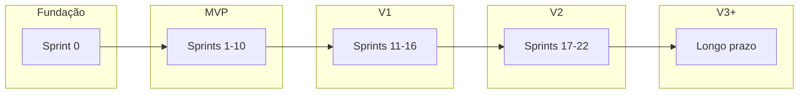
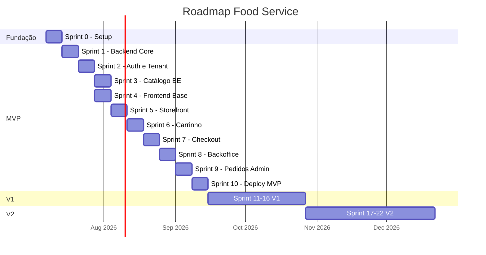
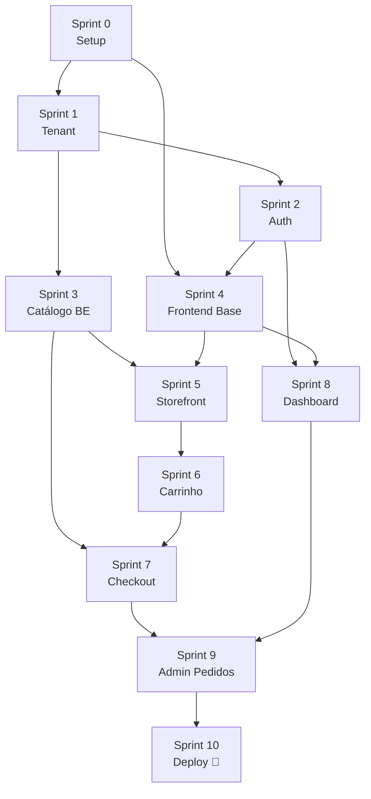
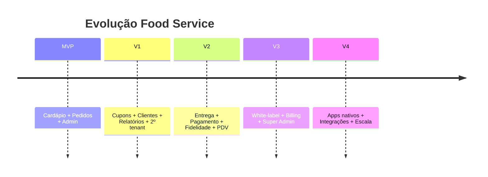

# 09 — Roadmap

> **Documento:** Roadmap de Desenvolvimento  
> **Produto:** Food Service *(nome comercial provisório)*  
> **Versão:** 1.0  
> **Status:** Aprovado  
> **Última atualização:** Julho/2026  
> **Depende de:** Todos os documentos 01–08 (aprovados)

---

## Sumário

1. [Visão Geral](#1-visão-geral)
2. [Premissas e Metodologia](#2-premissas-e-metodologia)
3. [Fases do Produto](#3-fases-do-produto)
4. [Linha do Tempo](#4-linha-do-tempo)
5. [Sprint 0 — Fundação](#5-sprint-0--fundação)
6. [Sprints MVP (1–10)](#6-sprints-mvp-110)
7. [Sprints V1 (11–16)](#7-sprints-v1-1116)
8. [Sprints V2 (17–22)](#8-sprints-v2-1722)
9. [Visão de Longo Prazo](#9-visão-de-longo-prazo)
10. [Métricas de Progresso](#10-métricas-de-progresso)
11. [Riscos do Roadmap](#11-riscos-do-roadmap)
12. [Próximos Documentos](#12-próximos-documentos)

---

## 1. Visão Geral

### 1.1 Objetivo

Este roadmap define **quando** e **em que ordem** construir o Food Service — do zero até uma plataforma SaaS completa, em sprints incrementais com entregas testáveis.

### 1.2 Primeiro Cliente

A **pizzaria familiar** é o laboratório de validação do MVP. O roadmap prioriza entregar valor real para ela o mais cedo possível, sem sacrificar a arquitetura genérica.

### 1.3 Resumo Executivo

| Fase | Sprints | Duração estimada | Resultado |
|------|---------|------------------|-----------|
| **Fundação** | Sprint 0 | 1 semana | Projeto configurado, CI, Docker |
| **MVP** | Sprints 1–10 | 10–12 semanas | Pizzaria operando com pedidos reais |
| **V1** | Sprints 11–16 | 6–8 semanas | SaaS com cupons, clientes, relatórios |
| **V2** | Sprints 17–22 | 8–10 semanas | Entrega, fidelidade, pagamento online |
| **Longo prazo** | V3+ | Contínuo | Multi-loja, white-label, integrações |

**Total até MVP em produção: ~11–13 semanas** (1 desenvolvedor, dedicação parcial a integral)

---

## 2. Premissas e Metodologia

### 2.1 Premissas

| # | Premissa |
|---|----------|
| P1 | 1 desenvolvedor principal (você) usando Cursor |
| P2 | Dedicação estimada: 20–40h/semana |
| P3 | Sprint = 1 semana (ajustável) |
| P4 | Cada sprint entrega algo testável |
| P5 | Backend e frontend evoluem em paralelo quando possível |
| P6 | Primeiro deploy em staging no Sprint 8; produção Sprint 10 |
| P7 | Documentação (docs/) é a fonte de verdade |

### 2.2 Definição de Pronto (DoD)

Uma funcionalidade está **pronta** quando:

- [ ] Código implementado seguindo `10-padroes-de-codigo.md`
- [ ] API documentada em `07-api.md` (se aplicável)
- [ ] Testes mínimos (services críticos)
- [ ] Funciona no ambiente local (Docker)
- [ ] Sem regressão em features anteriores
- [ ] Revisado contra `08-regras-de-negocio.md`

### 2.3 Prioridades

| Nível | Significado |
|-------|-------------|
| **P0** | Bloqueante — sem isso nada funciona |
| **P1** | Essencial para o MVP |
| **P2** | Importante mas pode esperar V1 |
| **P3** | Desejável — backlog |

### 2.4 Legenda das Sprints

Cada sprint contém:

| Campo | Descrição |
|-------|-----------|
| **Objetivo** | Meta da sprint |
| **Funcionalidades** | O que será construído |
| **Dependências** | Sprints anteriores necessárias |
| **Resultado esperado** | Como validar sucesso |
| **Prioridade** | P0–P3 |
| **Tempo estimado** | 1 sprint = ~1 semana |

---

## 3. Fases do Produto



### 3.1 MVP — O que é sucesso?

| Critério | Meta |
|----------|------|
| Cardápio publicado | Link acessível da pizzaria |
| Pedidos reais | ≥ 10 pedidos completos |
| Personalização | Tamanho, opções funcionando |
| Painel | Pedidos em tempo real |
| Autonomia | Dono altera cardápio sem dev |
| Estabilidade | Zero downtime no horário de pico |

### 3.2 V1 — O que muda?

Plataforma pronta para **segundo cliente** sem código customizado.

### 3.3 V2 — O que muda?

Ferramentas de **crescimento** (fidelidade, entrega, pagamento online).

---

## 4. Linha do Tempo



> Datas ilustrativas a partir de Julho/2026. Ajustar conforme velocidade real.

---

## 5. Sprint 0 — Fundação

| Campo | Valor |
|-------|-------|
| **Objetivo** | Projetos configurados, infra local, CI básico |
| **Prioridade** | P0 |
| **Tempo** | 1 semana |
| **Dependências** | Documentação aprovada (docs 01–08) |

### Funcionalidades

**Backend:**
- [ ] Repositório `vendas_backend` com estrutura de pastas
- [ ] Django 5 + DRF configurado
- [ ] Settings por ambiente (dev, test, prod)
- [ ] Docker Compose (PostgreSQL, Redis)
- [ ] `core/` — BaseModel, TenantAwareModel (estrutura)
- [ ] Health check endpoint
- [ ] pytest configurado

**Frontend:**
- [ ] Repositório `vendas_frontend` com Vite + React + TS
- [ ] Tailwind + shadcn/ui init
- [ ] Estrutura `apps/`, `features/`, `shared/`
- [ ] Path aliases, ESLint, Prettier
- [ ] TanStack Query + React Router setup
- [ ] Design tokens (globals.css)

**DevOps:**
- [ ] GitHub Actions: lint + typecheck (CI)
- [ ] `.env.example` em ambos repos
- [ ] README com instruções de setup

### Resultado esperado

```bash
docker compose up -d          # DB + Redis
python manage.py runserver    # GET /api/v1/health/ → 200
npm run dev                   # Frontend abre em localhost:5173
```

---

## 6. Sprints MVP (1–10)

### Sprint 1 — Backend Core e Empresa

| Campo | Valor |
|-------|-------|
| **Objetivo** | Tenant funcional com onboarding |
| **Prioridade** | P0 |
| **Tempo** | 1 semana |
| **Dependências** | Sprint 0 |

**Funcionalidades:**
- [ ] App `companies`: models Company, CompanySettings, BusinessHours
- [ ] Migrations iniciais
- [ ] TenantMiddleware + TenantContext + TenantManager
- [ ] OnboardingService (criar empresa + defaults)
- [ ] Seed script (`demo` tenant)
- [ ] Testes de isolamento de tenant

**Resultado esperado:**
- Tenant `demo` criado via seed
- Middleware resolve subdomínio
- Testes de tenant isolation passando

---

### Sprint 2 — Autenticação e Funcionários

| Campo | Valor |
|-------|-------|
| **Objetivo** | Login backoffice funcional |
| **Prioridade** | P0 |
| **Tempo** | 1 semana |
| **Dependências** | Sprint 1 |

**Funcionalidades:**
- [ ] App `accounts`: Employee, Role, RolePermission, EmployeeRole
- [ ] Roles de sistema criadas no onboarding
- [ ] JWT auth (simplejwt) + EmployeeJWTAuthentication
- [ ] AuthService: login, refresh, logout, permissions
- [ ] Endpoints: `/auth/login/`, `/auth/refresh/`, `/auth/logout/`
- [ ] RBAC: HasPermission base
- [ ] Testes AuthService

**Resultado esperado:**
- Login retorna JWT + user + tenant + permissions
- Rotas admin bloqueadas sem token

---

### Sprint 3 — Catálogo (Backend)

| Campo | Valor |
|-------|-------|
| **Objetivo** | API de cardápio completa |
| **Prioridade** | P0 |
| **Tempo** | 1 semana |
| **Dependências** | Sprint 1 |

**Funcionalidades:**
- [ ] App `catalog`: Category, Product, ProductImage, OptionGroup, Option, ProductOptionGroup
- [ ] Migrations
- [ ] ProductService, OptionGroupService, PriceCalculator
- [ ] CatalogSelector (queries otimizadas)
- [ ] API pública: categories, products, product detail
- [ ] API admin: CRUD products, categories, option-groups
- [ ] Upload de imagens
- [ ] Cache Redis para catálogo
- [ ] Testes PriceCalculator + validação de opções

**Resultado esperado:**
- Cardápio demo com produtos e opções via API
- `GET /public/catalog/products/{slug}/` retorna option_groups

---

### Sprint 4 — Frontend Base e Design System

| Campo | Valor |
|-------|-------|
| **Objetivo** | Fundação visual e layouts |
| **Prioridade** | P0 |
| **Tempo** | 1 semana |
| **Dependências** | Sprint 0 (paralelo com 2–3) |

**Funcionalidades:**
- [ ] Componentes shadcn: Button, Input, Card, Badge, Dialog, Sheet, Toast, Skeleton
- [ ] Componentes custom: ProductCard, PriceDisplay, EmptyState, OrderStatusBadge
- [ ] StorefrontLayout + BackofficeLayout
- [ ] api-client + TanStack Query setup
- [ ] AuthProvider + useAuth + usePermissions
- [ ] Páginas placeholder com rotas
- [ ] Login page (backoffice)

**Resultado esperado:**
- Navegação entre páginas funciona
- Login backoffice conectado à API
- Design System aplicado visualmente

---

### Sprint 5 — Storefront: Cardápio

| Campo | Valor |
|-------|-------|
| **Objetivo** | Cliente navega e vê cardápio |
| **Prioridade** | P0 |
| **Tempo** | 1 semana |
| **Dependências** | Sprint 3, Sprint 4 |

**Funcionalidades:**
- [ ] `useCompanyPublic()` — dados do estabelecimento
- [ ] `useCategories()`, `useProducts()`, `useProduct()`
- [ ] HomePage — listagem de categorias e produtos
- [ ] CategoryPage — produtos filtrados
- [ ] ProductPage — detalhe com OptionGroupSelector
- [ ] Navbar storefront (logo, carrinho, status aberto/fechado)
- [ ] Skeleton loading states
- [ ] Responsivo mobile first

**Resultado esperado:**
- `pizzaria-joao.localhost:5173` exibe cardápio completo
- Personalização de produto funciona na UI (preço atualiza)

---

### Sprint 6 — Carrinho

| Campo | Valor |
|-------|-------|
| **Objetivo** | Adicionar, editar e remover itens |
| **Prioridade** | P0 |
| **Tempo** | 1 semana |
| **Dependências** | Sprint 5 |

**Funcionalidades:**
- [ ] Zustand cartStore com persistência localStorage
- [ ] useCart, useAddToCart hooks
- [ ] CartPage — listagem de itens
- [ ] QuantitySelector
- [ ] Badge de contagem no navbar
- [ ] Bottom sheet carrinho (mobile)
- [ ] Cálculo de subtotal no frontend (estimativa)
- [ ] Toast "Adicionado ao carrinho"

**Resultado esperado:**
- Fluxo: produto → opções → adicionar → carrinho com itens corretos
- Carrinho persiste ao recarregar página

---

### Sprint 7 — Checkout e Pedidos (Backend + Frontend)

| Campo | Valor |
|-------|-------|
| **Objetivo** | Fluxo completo de pedido |
| **Prioridade** | P0 |
| **Tempo** | 1–2 semanas |
| **Dependências** | Sprint 3, Sprint 6 |

**Backend:**
- [ ] App `customers`: Customer model
- [ ] App `orders`: Order, OrderItem, OrderItemOption, OrderStatusHistory, OrderPayment
- [ ] CartValidationService
- [ ] OrderService.create_from_checkout
- [ ] POST `/public/orders/checkout/`
- [ ] GET `/public/orders/{id}/` (tracking)
- [ ] Testes OrderService (criar pedido, validações)

**Frontend:**
- [ ] CheckoutPage com Stepper
- [ ] CheckoutForm (RHF + Zod)
- [ ] Seleção delivery/pickup, endereço, pagamento
- [ ] useCreateOrder mutation
- [ ] OrderTrackingPage com polling
- [ ] Página de confirmação

**Resultado esperado:**
- Pedido real criado end-to-end
- Tracking mostra status `pending`
- Carrinho limpo após sucesso

---

### Sprint 8 — Backoffice: Dashboard e Configurações

| Campo | Valor |
|-------|-------|
| **Objetivo** | Dono configura e monitora operação |
| **Prioridade** | P1 |
| **Tempo** | 1 semana |
| **Dependências** | Sprint 2, Sprint 4 |

**Funcionalidades:**
- [ ] Sidebar com navegação por permissão
- [ ] DashboardPage — KPIs do dia
- [ ] GET `/admin/dashboard/`
- [ ] SettingsPage — empresa, horários, taxas
- [ ] GET/PATCH `/admin/settings/`
- [ ] Upload de logo
- [ ] Toggle "loja aberta/fechada"

**Resultado esperado:**
- Dono vê dashboard com métricas
- Dono altera horário e taxa de entrega
- Storefront reflete mudanças (cache invalidado)

---

### Sprint 9 — Backoffice: Pedidos e Catálogo

| Campo | Valor |
|-------|-------|
| **Objetivo** | Operar pedidos e gerenciar cardápio |
| **Prioridade** | P0 |
| **Tempo** | 1–2 semanas |
| **Dependências** | Sprint 7, Sprint 8 |

**Pedidos:**
- [ ] OrdersPage — lista com filtros e busca
- [ ] OrderDetailPage — itens, status, pagamento
- [ ] useUpdateOrderStatus (optimistic)
- [ ] PATCH `/admin/orders/{id}/status/`
- [ ] PATCH `/admin/orders/{id}/payment/`
- [ ] Alerta sonoro novo pedido (opcional)
- [ ] Polling/refetch pedidos ativos

**Catálogo Admin:**
- [ ] ProductsPage — listagem
- [ ] ProductFormPage — criar/editar produto
- [ ] CategoriesPage — CRUD
- [ ] OptionGroupsPage — CRUD grupos e opções
- [ ] Vincular option groups a produtos

**Resultado esperado:**
- Atendente processa pedido: pending → confirmed → preparing → ready → completed
- Dono cadastra novo produto com opções sem ajuda técnica

---

### Sprint 10 — Deploy MVP e Validação

| Campo | Valor |
|-------|-------|
| **Objetivo** | Pizzaria em produção com pedidos reais |
| **Prioridade** | P0 |
| **Tempo** | 1 semana |
| **Dependências** | Sprints 1–9 |

**Funcionalidades:**
- [ ] Docker produção (Nginx + Gunicorn + Celery)
- [ ] CI/CD: build + deploy staging
- [ ] Deploy produção (VPS ou cloud)
- [ ] DNS: `*.foodservice.app` + subdomínio pizzaria
- [ ] TLS (Let's Encrypt)
- [ ] Sentry (erros)
- [ ] Notificação e-mail confirmação (Celery)
- [ ] Seed/onboarding tenant pizzaria real
- [ ] Testes end-to-end manuais
- [ ] Checklist `12-checklist-mvp.md` 100%

**Resultado esperado:**
- ✅ Cardápio publicado em `pizzaria-joao.foodservice.app`
- ✅ 10 pedidos reais completos
- ✅ Dono opera autonomamente
- ✅ Zero downtime no horário de pico

---

### Resumo MVP



| Sprint | Foco | Semanas acumuladas |
|--------|------|-------------------|
| 0 | Setup | 1 |
| 1 | Tenant | 2 |
| 2 | Auth | 3 |
| 3 | Catálogo BE | 4 |
| 4 | Frontend base | 4–5 |
| 5 | Storefront | 5–6 |
| 6 | Carrinho | 6–7 |
| 7 | Checkout | 7–9 |
| 8 | Dashboard | 8–9 |
| 9 | Admin completo | 9–11 |
| 10 | Deploy | 10–12 |

---

## 7. Sprints V1 (11–16)

**Objetivo da fase:** Plataforma pronta para **onboardar o 2º cliente** sem código customizado.

### Sprint 11 — Clientes e Conta

| Campo | Valor |
|-------|-------|
| **Objetivo** | Consumidor com conta e histórico |
| **Prioridade** | P1 |
| **Tempo** | 1 semana |
| **Dependências** | MVP completo |

- [ ] Login/cadastro consumidor (storefront)
- [ ] CustomerAddress CRUD
- [ ] Histórico de pedidos na conta
- [ ] Admin: listagem de clientes
- [ ] Endpoints `/auth/customer/*`, `/public/account/orders/`

**Resultado:** Cliente recorrente vê pedidos anteriores e reutiliza endereço.

---

### Sprint 12 — Cupons e Promoções

| Campo | Valor |
|-------|-------|
| **Objetivo** | Descontos configuráveis |
| **Prioridade** | P1 |
| **Tempo** | 1 semana |
| **Dependências** | Sprint 11 |

- [ ] App `promotions`: Coupon, CouponUsage
- [ ] CouponService com validação
- [ ] Admin: CRUD cupons
- [ ] Checkout: campo cupom + validação
- [ ] Regras PR-01 a PR-11

**Resultado:** Dono cria cupom `PIZZA10` e cliente usa no checkout.

---

### Sprint 13 — Funcionários e Equipe

| Campo | Valor |
|-------|-------|
| **Objetivo** | Múltiplos operadores com perfis |
| **Prioridade** | P1 |
| **Tempo** | 1 semana |
| **Dependências** | MVP |

- [ ] Admin: CRUD employees
- [ ] Convite por e-mail
- [ ] Atribuição de roles
- [ ] UI respeita permissões por role

**Resultado:** Atendente e cozinha com acessos diferentes.

---

### Sprint 14 — Relatórios e Financeiro Básico

| Campo | Valor |
|-------|-------|
| **Objetivo** | Dados para tomada de decisão |
| **Prioridade** | P1 |
| **Tempo** | 1–2 semanas |
| **Dependências** | MVP |

- [ ] App `reports`: ReportService
- [ ] Vendas por período
- [ ] Produtos mais vendidos
- [ ] Ticket médio
- [ ] Export CSV
- [ ] Dashboard enriquecido

**Resultado:** Dono vê relatório semanal de vendas.

---

### Sprint 15 — Notificações e UX Avançada

| Campo | Valor |
|-------|-------|
| **Objetivo** | Comunicação e polish |
| **Prioridade** | P2 |
| **Tempo** | 1 semana |
| **Dependências** | Sprint 11 |

- [ ] E-mail em mudança de status
- [ ] Notificação sonora backoffice (novo pedido)
- [ ] Busca no cardápio
- [ ] Favoritos (storefront)
- [ ] PWA manifest (instalável)

**Resultado:** Cliente recebe e-mail quando pedido sai para entrega.

---

### Sprint 16 — Onboarding SaaS e Segundo Cliente

| Campo | Valor |
|-------|-------|
| **Objetivo** | Validar multi-tenant com 2º estabelecimento |
| **Prioridade** | P0 |
| **Tempo** | 1 semana |
| **Dependências** | Sprints 11–15 |

- [ ] Fluxo de criação de novo tenant (script/admin)
- [ ] Onboarding guiado (wizard configuração)
- [ ] Dois builds frontend (storefront otimizado)
- [ ] OpenAPI docs (`drf-spectacular`)
- [ ] Onboardar 2º cliente (hamburgueria ou açaiteria)
- [ ] Checklist `13-checklist-v1.md` 100%

**Resultado:** Segundo estabelecimento operando sem alteração de código.

---

## 8. Sprints V2 (17–22)

**Objetivo da fase:** Ferramentas de crescimento e operação avançada.

### Sprint 17 — Entregadores

| Campo | Valor |
|-------|-------|
| **Objetivo** | Gestão de entregas |
| **Tempo** | 1 semana |

- [ ] App `delivery`: Driver, Delivery
- [ ] CRUD entregadores
- [ ] Atribuir entregador ao pedido
- [ ] Status de entrega

---

### Sprint 18 — Rastreamento e Mapas

| Campo | Valor |
|-------|-------|
| **Objetivo** | Cliente acompanha entrega |
| **Tempo** | 1–2 semanas |

- [ ] Integração mapas (Google/OSRM)
- [ ] Áreas de entrega configuráveis
- [ ] Taxa por bairro/distância
- [ ] Tracking page com mapa (futuro)

---

### Sprint 19 — Pagamento Online

| Campo | Valor |
|-------|-------|
| **Objetivo** | Gateway de pagamento |
| **Tempo** | 2 semanas |

- [ ] Integração Mercado Pago (PIX + cartão)
- [ ] Webhooks
- [ ] Fluxo: pagar → confirmar pedido
- [ ] Ports & Adapters pattern

---

### Sprint 20 — Fidelidade e Cashback

| Campo | Valor |
|-------|-------|
| **Objetivo** | Retenção de clientes |
| **Tempo** | 1–2 semanas |

- [ ] Programa de pontos
- [ ] Cashback configurável
- [ ] Resgate no checkout

---

### Sprint 21 — PDV e QR Code Mesa

| Campo | Valor |
|-------|-------|
| **Objetivo** | Venda no balcão e na mesa |
| **Tempo** | 2 semanas |

- [ ] PDV simplificado (balcão)
- [ ] QR Code por mesa
- [ ] Pedido dine-in

---

### Sprint 22 — Estoque e Caixa

| Campo | Valor |
|-------|-------|
| **Objetivo** | Controle operacional |
| **Tempo** | 2 semanas |

- [ ] Estoque básico (insumos)
- [ ] Abertura/fechamento de caixa
- [ ] Sangria
- [ ] Checklist `14-checklist-v2.md`

---

## 9. Visão de Longo Prazo

### V3+ (Backlog estratégico)

| Área | Funcionalidades | Prioridade |
|------|-----------------|------------|
| **White-label** | Domínio próprio, cores, fontes por tenant | Alta |
| **Multi-loja** | Um dono, vários estabelecimentos | Alta |
| **App nativo** | React Native ou Flutter | Média |
| **Integrações** | iFood, Rappi (receber pedidos) | Média |
| **Fiscal** | NF-e, NFC-e | Média |
| **Billing SaaS** | Planos, assinatura, cobrança | Alta |
| **Super Admin** | Painel da plataforma, métricas globais | Alta |
| **API pública** | Webhooks, API keys para parceiros | Média |
| **Inteligência** | Sugestões, previsão de demanda | Baixa |
| **Marketplace** | Marketplace entre estabelecimentos | Baixa |



---

## 10. Métricas de Progresso

### 10.1 Por Sprint

| Métrica | Como medir |
|---------|------------|
| Funcionalidades entregues | Checklist da sprint ✓ |
| Testes passando | CI green |
| Bugs abertos | GitHub Issues |
| Cobertura de testes | pytest-cov ≥ 60% em services |

### 10.2 Por Fase

| Fase | KPI |
|------|-----|
| MVP | 10 pedidos reais |
| V1 | 2 tenants ativos |
| V2 | Pagamento online funcionando |
| V3 | 10 tenants pagantes |

### 10.3 Velocity

Ajustar estimativas após Sprint 3 com base na velocidade real:

```
velocity = story points ou funcionalidades entregues / sprint
```

Recalibrar roadmap a cada 3 sprints.

---

## 11. Riscos do Roadmap

| Risco | Impacto | Mitigação |
|-------|---------|-----------|
| Sprint 7 (checkout) mais complexa que estimado | Atraso 1–2 semanas | Priorizar fluxo mínimo; polish depois |
| Um dev só | Bus factor | Documentação extensa (feito) |
| Scope creep no MVP | Nunca lança | Checklist MVP rigoroso |
| Integração frontend/backend | Bugs | Contrato API fixo (doc 07) |
| Deploy/infrastructure | Bloqueio Sprint 10 | Testar Docker desde Sprint 0 |
| Pizzaria não usa no horário de pico | Validação fraca | Combinar data de go-live com família |

---

## 12. Próximos Documentos

| # | Documento | Relação |
|---|-----------|---------|
| 10 | `10-padroes-de-codigo.md` | Como codificar cada sprint |
| 11 | `11-guia-ui-ux.md` | Fluxos de UX por sprint |
| 12 | `12-checklist-mvp.md` | Escopo fechado do MVP |
| 13 | `13-checklist-v1.md` | Escopo V1 |
| 14 | `14-checklist-v2.md` | Escopo V2 |
| 15 | `15-futuras-funcionalidades.md` | Backlog detalhado V3+ |

---

## Histórico de Revisões

| Versão | Data | Autor | Alterações |
|--------|------|-------|------------|
| 1.0 | Jul/2026 | — | Versão inicial — aprovado |

---

## Apêndice A — Mapa Sprint → Documentação

| Sprint | Docs de referência |
|--------|-------------------|
| 0 | 02, 04, 05, 06, 10 |
| 1–3 | 03, 06, 08 |
| 4–6 | 04, 05, 11 |
| 7 | 07, 08 |
| 8–9 | 05, 07, 11 |
| 10 | 12 |
| 11–16 | 13 |
| 17–22 | 14, 15 |

## Apêndice B — Paralelização Backend × Frontend

| Semana | Backend | Frontend |
|--------|---------|----------|
| 1 | Sprint 0 + 1 | Sprint 0 + 4 |
| 2 | Sprint 2 + 3 | Sprint 4 |
| 3 | Sprint 3 | Sprint 5 |
| 4 | Sprint 7 (início) | Sprint 6 |
| 5 | Sprint 7 | Sprint 7 |
| 6 | Sprint 8 (API) | Sprint 8 |
| 7 | Sprint 9 (API) | Sprint 9 |
| 8 | Sprint 10 (deploy) | Sprint 10 |

---

> **Documento aprovado.** Próximo: `10-padroes-de-codigo.md`.
