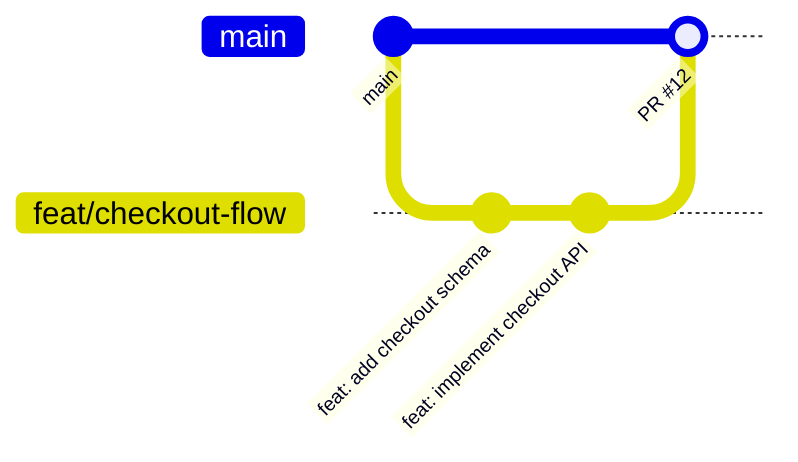

# 10 — Padrões de Código

> **Documento:** Padrões de Código e Convenções  
> **Produto:** Food Service *(nome comercial provisório)*  
> **Versão:** 1.0  
> **Status:** Aprovado  
> **Última atualização:** Julho/2026  
> **Depende de:** `02-arquitetura.md`, `05-frontend.md`, `06-backend.md` (aprovados)

---

## Sumário

1. [Visão Geral](#1-visão-geral)
2. [Git — Branches](#2-git--branches)
3. [Git — Commits](#3-git--commits)
4. [Pull Requests](#4-pull-requests)
5. [Nomenclatura Geral](#5-nomenclatura-geral)
6. [Python / Django](#6-python--django)
7. [Models](#7-models)
8. [Serializers](#8-serializers)
9. [Services](#9-services)
10. [Views e ViewSets](#10-views-e-viewsets)
11. [Selectors e Domain](#11-selectors-e-domain)
12. [Testes Backend](#12-testes-backend)
13. [TypeScript / React](#13-typescript--react)
14. [Componentes React](#14-componentes-react)
15. [Hooks](#15-hooks)
16. [Contexts e Estado](#16-contexts-e-estado)
17. [API Client (Frontend)](#17-api-client-frontend)
18. [Pastas e Arquivos](#18-pastas-e-arquivos)
19. [Testes Frontend](#19-testes-frontend)
20. [Docker](#20-docker)
21. [Variáveis de Ambiente](#21-variáveis-de-ambiente)
22. [Linting e Formatação](#22-linting-e-formatação)
23. [Próximos Documentos](#23-próximos-documentos)

---

## 1. Visão Geral

### 1.1 Objetivo

Este documento define **como escrever código** no Food Service — convenções, padrões e anti-padrões para manter o projeto legível, consistente e escalável por anos.

### 1.2 Princípios

| Princípio | Descrição |
|-----------|-----------|
| **Consistência** | Código novo segue o que já existe |
| **Clareza** | Nomes explícitos > comentários |
| **Simplicidade** | Menor diff que resolve o problema |
| **Testabilidade** | Services testáveis sem HTTP |
| **Sem surpresas** | Comportamento previsível |

### 1.3 Repositórios

| Repo | Stack | Lint |
|------|-------|------|
| `vendas_backend` | Python 3.12, Django 5 | ruff |
| `vendas_frontend` | TypeScript, React 19 | ESLint + Prettier |

---

## 2. Git — Branches

### 2.1 Branch Principal

| Branch | Propósito |
|--------|-----------|
| `main` | Produção — sempre deployável |
| `develop` | Integração (opcional; pode usar só `main` no início) |

### 2.2 Nomenclatura de Branches

```
<tipo>/<descrição-curta>
```

| Tipo | Uso | Exemplo |
|------|-----|---------|
| `feat/` | Nova funcionalidade | `feat/checkout-flow` |
| `fix/` | Correção de bug | `fix/order-status-transition` |
| `refactor/` | Refatoração sem mudança de comportamento | `refactor/order-service` |
| `docs/` | Documentação | `docs/api-endpoints` |
| `test/` | Testes | `test/cart-validation` |
| `chore/` | Tarefas de manutenção | `chore/update-dependencies` |

**Regras:**
- Minúsculas, hífens (kebab-case)
- Máximo ~50 caracteres
- Descritivo: `feat/product-option-groups` ✅ — `feat/stuff` ❌
- Uma branch por feature/fix
- Deletar branch após merge

### 2.3 Fluxo



---

## 3. Git — Commits

### 3.1 Formato (Conventional Commits)

```
<tipo>(<escopo>): <descrição>

[corpo opcional]

[rodapé opcional]
```

### 3.2 Tipos

| Tipo | Uso |
|------|-----|
| `feat` | Nova funcionalidade |
| `fix` | Correção de bug |
| `refactor` | Refatoração |
| `docs` | Documentação |
| `test` | Testes |
| `chore` | Build, deps, CI |
| `style` | Formatação (sem mudança lógica) |
| `perf` | Performance |

### 3.3 Escopos Comuns

| Escopo | Repo |
|--------|------|
| `catalog`, `orders`, `auth`, `cart` | Ambos |
| `api`, `models`, `services` | Backend |
| `ui`, `storefront`, `backoffice` | Frontend |
| `docker`, `ci` | Ambos |

### 3.4 Exemplos

```bash
# ✅ Bom
feat(orders): add checkout endpoint with cart validation
fix(catalog): prevent cross-tenant product access
refactor(auth): extract JWT claims to AuthService
docs(api): document public catalog endpoints
test(orders): add tenant isolation tests for OrderService

# ❌ Ruim
fix bug
update
WIP
changes
feat: stuff
```

### 3.5 Regras

| Regra | Descrição |
|-------|-----------|
| Imperativo | "add" não "added" |
| Minúsculas | Após o tipo |
| Sem ponto final | Na descrição curta |
| Uma mudança lógica | Por commit quando possível |
| Máximo 72 chars | Na primeira linha |
| Corpo opcional | Explicar "por quê" se necessário |

### 3.6 Commits atômicos

```
✅ feat(catalog): add OptionGroup model and migration
✅ feat(catalog): add OptionGroupService with validation
✅ feat(catalog): expose option-groups admin API

❌ feat: catalog, orders, fix login, update docs (tudo junto)
```

---

## 4. Pull Requests

### 4.1 Título

Mesmo formato dos commits:

```
feat(orders): implement checkout flow
```

### 4.2 Template

```markdown
## Summary
- Breve descrição do que foi feito e por quê

## Changes
- Item 1
- Item 2

## Test plan
- [ ] Teste manual X
- [ ] pytest passou
- [ ] Sem regressão em Y

## Screenshots (se UI)
```

### 4.3 Regras

| Regra | Descrição |
|-------|-----------|
| Tamanho | Preferir PRs < 400 linhas |
| Uma feature | Por PR quando possível |
| CI verde | Obrigatório para merge |
| Review | Self-review antes de abrir |
| Sem secrets | `.env`, credenciais nunca no PR |
| Link | Referenciar issue/doc se houver |

### 4.4 Merge

- **Squash merge** preferido (histórico limpo)
- Branch deletada após merge
- `main` sempre deployável

---

## 5. Nomenclatura Geral

| Elemento | Convenção | Exemplo |
|----------|-----------|---------|
| Variáveis Python | snake_case | `order_number` |
| Classes Python | PascalCase | `OrderService` |
| Constantes Python | SCREAMING_SNAKE | `VALID_TRANSITIONS` |
| Variáveis TS | camelCase | `orderNumber` |
| Componentes React | PascalCase | `ProductCard` |
| Hooks | camelCase + `use` | `useProducts` |
| Types/Interfaces | PascalCase | `Order`, `CreateOrderDTO` |
| Arquivos Python | snake_case | `order_service.py` |
| Arquivos React | PascalCase (componentes) | `ProductCard.tsx` |
| Arquivos utils/hooks | camelCase | `priceCalculator.ts`, `useProducts.ts` |
| Pastas | kebab-case ou snake | `option-groups/` ou `orders/` |
| Endpoints API | kebab-case, plural | `/option-groups/` |
| Query keys | camelCase array | `['catalog', 'products']` |

---

## 6. Python / Django

### 6.1 Estilo

- **PEP 8** com line length **100** (ruff)
- **Type hints** obrigatórios em services, selectors, domain
- Imports ordenados: stdlib → third-party → local
- `from __future__ import annotations` em módulos novos

### 6.2 Imports

```python
# ✅ Ordem correta
from decimal import Decimal
from uuid import UUID

from django.db import transaction
from rest_framework import status

from apps.catalog.models import Product
from apps.orders.domain.exceptions import EmptyCartError
from core.tenancy.context import TenantContext


# ❌ Evitar
from apps.catalog.models import *  # wildcard
from apps.orders.models import Order  # em views de outro app
```

### 6.3 Docstrings

Apenas em services e lógica não óbvia:

```python
def validate(cls, *, tenant: Company, items: list[dict]) -> list[dict]:
    """
    Valida itens do carrinho contra o catálogo atual.

    Raises:
        EmptyCartError: Se items estiver vazio.
        ProductUnavailableError: Se produto inativo/indisponível.
    """
```

### 6.4 Anti-padrões Python

| ❌ Evitar | ✅ Preferir |
|----------|------------|
| `except:` bare | `except SpecificError:` |
| `print()` em produção | `logging` |
| Raw SQL sem parametrização | ORM ou `cursor.execute(sql, params)` |
| Lógica em `save()` override | Service layer |
| Circular imports | Services públicos, lazy import |

---

## 7. Models

### 7.1 Estrutura

```python
# apps/orders/models.py

from django.db import models
from core.models.tenant_model import TenantAwareModel
from apps.orders.domain.enums import OrderStatus


class Order(TenantAwareModel):
    """Pedido de um cliente."""

    customer = models.ForeignKey(
        "customers.Customer",
        on_delete=models.PROTECT,
        related_name="orders",
    )
    order_number = models.CharField(max_length=20)
    status = models.CharField(
        max_length=20,
        choices=OrderStatus.choices,
        default=OrderStatus.PENDING,
        db_index=True,
    )
    total = models.DecimalField(max_digits=10, decimal_places=2)

    class Meta:
        db_table = "orders"
        ordering = ["-created_at"]
        indexes = [
            models.Index(fields=["tenant", "status", "-created_at"]),
        ]

    def __str__(self) -> str:
        return f"#{self.order_number}"
```

### 7.2 Regras

| Regra | Descrição |
|-------|-----------|
| Herdar `TenantAwareModel` | Toda entidade de negócio |
| `db_table` explícito | snake_case plural |
| `related_name` explícito | Sempre |
| `__str__` | Sempre implementar |
| Enums | `TextChoices` em `domain/enums.py` |
| Lógica mínima | Apenas properties simples |
| Sem side effects em `save()` | Usar signals ou services |
| Indexes | Em campos de filtro frequente |

### 7.3 O que NÃO colocar em Models

- Chamadas a Celery
- Envio de e-mail
- Cálculos complexos de negócio
- Validação cross-model complexa

---

## 8. Serializers

### 8.1 Nomenclatura

| Tipo | Sufixo | Uso |
|------|--------|-----|
| Leitura | `*Serializer` | GET |
| Criação | `*CreateSerializer` | POST |
| Atualização | `*UpdateSerializer` | PATCH |
| Lista | `*ListSerializer` | Listagens resumidas |
| Público | `*PublicSerializer` | Storefront |

### 8.2 Exemplo

```python
# apps/orders/serializers/order_serializers.py

from rest_framework import serializers
from apps.orders.models import Order


class OrderListSerializer(serializers.ModelSerializer):
    items_count = serializers.IntegerField(read_only=True)

    class Meta:
        model = Order
        fields = [
            "id",
            "order_number",
            "status",
            "customer_name",
            "total",
            "delivery_type",
            "items_count",
            "created_at",
        ]


class OrderStatusUpdateSerializer(serializers.Serializer):
    status = serializers.ChoiceField(choices=OrderStatus.choices)
    notes = serializers.CharField(required=False, allow_blank=True, max_length=255)

    def validate_status(self, value):
        # Validação de formato apenas; transição no service
        return value
```

### 8.3 Regras

| Regra | Descrição |
|-------|-----------|
| Formato apenas | Validação de negócio no service |
| `fields` explícitos | Nunca `__all__` em produção |
| `read_only_fields` | Para snapshots e campos gerados |
| `create()` delega | Para service quando há regras |
| Um arquivo por domínio | `order_serializers.py` |

---

## 9. Services

### 9.1 Estrutura

```python
# apps/orders/services/order_service.py

from decimal import Decimal
from django.db import transaction

from apps.companies.models import Company
from apps.orders.domain.enums import OrderStatus, VALID_TRANSITIONS
from apps.orders.domain.exceptions import InvalidOrderTransition
from apps.orders.models import Order


class OrderService:
    """Orquestra regras de negócio de pedidos."""

    @staticmethod
    @transaction.atomic
    def create_from_checkout(*, tenant: Company, data: dict) -> Order:
        ...

    @staticmethod
    @transaction.atomic
    def update_status(
        *,
        order_id: UUID,
        new_status: str,
        employee: Employee,
        notes: str | None = None,
    ) -> Order:
        order = Order.objects.select_for_update().get(id=order_id)

        if new_status not in VALID_TRANSITIONS.get(order.status, []):
            raise InvalidOrderTransition(order.status, new_status)

        ...

    @staticmethod
    def _generate_order_number(tenant: Company) -> str:
        """Privado — detalhe de implementação."""
        ...
```

### 9.2 Regras

| Regra | Descrição |
|-------|-----------|
| Classe com métodos estáticos | Sem estado global |
| Keyword-only args | `*, tenant, data` após self/cls |
| Type hints | Parâmetros e retorno |
| `@transaction.atomic` | Mutações multi-tabela |
| `select_for_update` | Concorrência em status |
| Métodos privados | `_prefix` para helpers |
| Uma responsabilidade | `OrderService`, não `GodService` |
| Exceções de domínio | Não DRF exceptions |
| Retornar models ou entities | Não dicts genéricos |

### 9.3 Tamanho

- Máximo ~200 linhas por service file
- Se maior, dividir: `OrderService`, `CartValidationService`

---

## 10. Views e ViewSets

### 10.1 ViewSet Admin

```python
# apps/orders/views/admin_order_viewset.py

from rest_framework import viewsets, status
from rest_framework.decorators import action
from rest_framework.response import Response

from apps.orders.permissions import HasOrderPermission
from apps.orders.selectors.order_selectors import OrderSelector
from apps.orders.serializers.order_serializers import (
    OrderDetailSerializer,
    OrderListSerializer,
    OrderStatusUpdateSerializer,
)
from apps.orders.services.order_service import OrderService


class AdminOrderViewSet(viewsets.ReadOnlyModelViewSet):
    permission_classes = [HasOrderPermission]
    filterset_class = OrderFilter
    search_fields = ["order_number", "customer_name", "customer_phone"]
    ordering = ["-created_at"]

    def get_serializer_class(self):
        if self.action == "retrieve":
            return OrderDetailSerializer
        return OrderListSerializer

    def get_queryset(self):
        return OrderSelector.list_orders()

    @action(detail=True, methods=["patch"], url_path="status")
    def update_status(self, request, pk=None):
        serializer = OrderStatusUpdateSerializer(data=request.data)
        serializer.is_valid(raise_exception=True)

        order = OrderService.update_status(
            order_id=pk,
            new_status=serializer.validated_data["status"],
            employee=request.user.employee,
            notes=serializer.validated_data.get("notes"),
        )
        return Response(OrderDetailSerializer(order).data)
```

### 10.2 APIView Pública

```python
# apps/orders/views/public_order_views.py

class CheckoutView(APIView):
    permission_classes = [AllowAny]

    def post(self, request):
        serializer = CheckoutCreateSerializer(data=request.data)
        serializer.is_valid(raise_exception=True)

        order = OrderService.create_from_checkout(
            tenant=TenantContext.get(),
            data=serializer.validated_data,
        )
        return Response(
            OrderPublicSerializer(order).data,
            status=status.HTTP_201_CREATED,
        )
```

### 10.3 Regras

| Regra | Descrição |
|-------|-----------|
| Thin views | Máximo ~30 linhas por método |
| Sem ORM direto | Usar selectors/services |
| `raise_exception=True` | Em `is_valid()` |
| Status codes corretos | 201, 204, 400, 422 |
| Permissões declaradas | `permission_classes` |
| Um ViewSet por recurso | `AdminOrderViewSet` |

---

## 11. Selectors e Domain

### 11.1 Selectors

```python
# apps/orders/selectors/order_selectors.py

class OrderSelector:
    @staticmethod
    def list_orders(*, status: str | None = None):
        qs = Order.objects.select_related("customer")
        if status:
            qs = qs.filter(status=status)
        return qs

    @staticmethod
    def get_order_detail(order_id: UUID) -> Order:
        return (
            Order.objects
            .select_related("customer")
            .prefetch_related("items__options", "status_history")
            .get(id=order_id)
        )
```

**Regras:** Somente leitura. Otimizar com `select_related` / `prefetch_related`.

### 11.2 Domain

```python
# apps/orders/domain/enums.py — TextChoices
# apps/orders/domain/exceptions.py — DomainException subclasses
# apps/orders/domain/entities.py — dataclasses (quando útil)
```

**Regras:** Domain não importa Django, DRF, Redis.

---

## 12. Testes Backend

### 12.1 Estrutura

```
apps/orders/tests/
├── conftest.py              # fixtures, factories
├── test_order_service.py
├── test_cart_validation.py
├── test_views.py
└── test_tenant_isolation.py
```

### 12.2 Convenções

```python
# apps/orders/tests/test_order_service.py

import pytest
from apps.orders.services.order_service import OrderService
from apps.orders.domain.exceptions import InvalidOrderTransition


@pytest.mark.django_db
class TestOrderServiceUpdateStatus:
    def test_valid_transition_pending_to_confirmed(self, order_pending, employee):
        order = OrderService.update_status(
            order_id=order_pending.id,
            new_status="confirmed",
            employee=employee,
        )
        assert order.status == "confirmed"
        assert order.confirmed_at is not None

    def test_invalid_transition_raises(self, order_completed, employee):
        with pytest.raises(InvalidOrderTransition):
            OrderService.update_status(
                order_id=order_completed.id,
                new_status="pending",
                employee=employee,
            )
```

### 12.3 Regras

| Regra | Descrição |
|-------|-----------|
| pytest | Não unittest |
| `@pytest.mark.django_db` | Quando acessa DB |
| factory-boy | Para criar dados |
| Nomear `test_<cenário>` | Descritivo |
| AAA | Arrange, Act, Assert |
| Isolamento tenant | Teste obrigatório por app |
| Colocation | `test_*.py` junto ao módulo |

### 12.4 Prioridade

1. Services (OrderService, PriceCalculator, CartValidation)
2. Tenant isolation
3. Views (integration)
4. Serializers (formato)

---

## 13. TypeScript / React

### 13.1 Estilo

- **Strict mode** habilitado
- **Sem `any`** — usar `unknown` + type guard
- **Interfaces** para props e DTOs
- **Named exports** (exceto pages e main)
- **Functional components** apenas

### 13.2 Imports

```typescript
// 1. React / libs
import { useState } from "react";
import { useQuery } from "@tanstack/react-query";

// 2. Shared
import { Button } from "@/shared/components/ui/button";
import { cn } from "@/shared/lib/utils";

// 3. Features (public API)
import { useProducts, ProductCard } from "@/features/catalog";

// 4. Relativos
import { catalogKeys } from "../constants/query-keys";
import type { Product } from "../types/catalog.types";
```

### 13.3 Types

```typescript
// features/orders/types/orders.types.ts

export type OrderStatus =
  | "pending"
  | "confirmed"
  | "preparing"
  | "ready"
  | "out_for_delivery"
  | "completed"
  | "cancelled";

export interface Order {
  id: string;
  orderNumber: string;
  status: OrderStatus;
  total: number;
  createdAt: string;
}

// DTO separado do model
export interface CreateOrderDTO {
  customerName: string;
  customerPhone: string;
  deliveryType: "delivery" | "pickup";
  items: CheckoutItemDTO[];
}
```

**Regra:** API retorna `snake_case`; converter na camada API ou usar tipos espelhando backend (decidir um padrão e manter).

> **Decisão:** Frontend usa **camelCase** nos types; `api-client` transforma snake ↔ camel (implementar interceptor ou manual por campo).

---

## 14. Componentes React

### 14.1 Estrutura

```tsx
// features/catalog/components/ProductCard.tsx

import { Link } from "react-router";
import { Plus } from "lucide-react";
import { Button } from "@/shared/components/ui/button";
import { PriceDisplay } from "@/shared/components/PriceDisplay";
import { cn } from "@/shared/lib/utils";
import type { Product } from "../types/catalog.types";

interface ProductCardProps {
  product: Product;
  onAddToCart?: (product: Product) => void;
  className?: string;
}

export function ProductCard({ product, onAddToCart, className }: ProductCardProps) {
  const isAvailable = product.isAvailable;

  return (
    <div className={cn("rounded-xl border bg-card overflow-hidden", className)}>
      {/* ... */}
    </div>
  );
}
```

### 14.2 Regras

| Regra | Descrição |
|-------|-----------|
| `interface XxxProps` | Props tipadas |
| Named export | `export function ProductCard` |
| Um componente por arquivo | Exceto compound components |
| Máximo ~150 linhas | Dividir se maior |
| Sem fetch direto | Usar hooks |
| `cn()` para classes | Composição Tailwind |
| `className?` opcional | Para extensibilidade |
| Acessibilidade | `aria-label` em botões ícone |

### 14.3 Pages vs Components

| Tipo | Local | Responsabilidade |
|------|-------|------------------|
| **Page** | `apps/*/pages/` | Compõe features, define layout |
| **Feature component** | `features/*/components/` | UI de domínio |
| **Shared UI** | `shared/components/ui/` | Genérico (shadcn) |

```tsx
// Page = thin
export function CategoryPage() {
  const { slug } = useParams<{ slug: string }>();
  const { data: products, isLoading } = useProducts({ category: slug });

  return (
    <PageContainer>
      <ProductList products={products?.results ?? []} isLoading={isLoading} />
    </PageContainer>
  );
}
```

---

## 15. Hooks

### 15.1 Query Hook

```typescript
// features/catalog/hooks/useProducts.ts

import { useQuery } from "@tanstack/react-query";
import { catalogApi } from "../api/catalogApi";
import { catalogKeys } from "../constants/query-keys";
import type { ProductFilters } from "../types/catalog.types";

export function useProducts(filters?: ProductFilters) {
  return useQuery({
    queryKey: catalogKeys.products(filters),
    queryFn: () => catalogApi.getProducts(filters),
    staleTime: 1000 * 60 * 5,
  });
}
```

### 15.2 Mutation Hook

```typescript
// features/orders/hooks/useUpdateOrderStatus.ts

export function useUpdateOrderStatus() {
  const queryClient = useQueryClient();

  return useMutation({
    mutationFn: ({ id, status }: { id: string; status: OrderStatus }) =>
      ordersApi.updateStatus(id, status),
    onSuccess: (order) => {
      queryClient.invalidateQueries({ queryKey: orderKeys.detail(order.id) });
      queryClient.invalidateQueries({ queryKey: orderKeys.lists() });
      toast.success("Status atualizado");
    },
    onError: (error: ApiError) => {
      toast.error(error.detail);
    },
  });
}
```

### 15.3 Regras

| Regra | Descrição |
|-------|-----------|
| Prefixo `use` | Sempre |
| Um hook por arquivo | `useProducts.ts` |
| Query keys em `constants/` | Não inline |
| API calls em `api/` | Hook chama api, não axios direto |
| Toasts em mutations | Feedback ao usuário |
| Retornar query/mutation object | Não desestruturar no hook |

---

## 16. Contexts e Estado

### 16.1 Quando usar

| Ferramenta | Quando |
|------------|--------|
| TanStack Query | Dados do servidor |
| Zustand | Carrinho, UI global leve |
| Context | Auth, theme (baixa frequência de mudança) |
| useState | UI local (modal, tab) |
| React Hook Form | Formulários |

### 16.2 Context Pattern

```typescript
// features/auth/components/AuthProvider.tsx

const AuthContext = createContext<AuthState | null>(null);

export function AuthProvider({ children }: { children: React.ReactNode }) {
  const [state, setState] = useState<AuthState>(initialState);
  // ...
  return <AuthContext.Provider value={value}>{children}</AuthContext.Provider>;
}

export function useAuth(): AuthState {
  const context = useContext(AuthContext);
  if (!context) throw new Error("useAuth must be used within AuthProvider");
  return context;
}
```

### 16.3 Regras

| Regra | Descrição |
|-------|-----------|
| Não usar Context para server state | TanStack Query |
| Evitar Context profundo | Performance |
| Exportar hook, não context | `useAuth()` |
| Zustand para cart | Persist middleware |

---

## 17. API Client (Frontend)

### 17.1 Estrutura

```typescript
// shared/lib/api-client.ts — instância axios
// features/catalog/api/catalogApi.ts — endpoints do domínio
```

```typescript
// features/catalog/api/catalogApi.ts

export const catalogApi = {
  getProducts: (params?: ProductFilters) =>
    apiClient
      .get<PaginatedResponse<Product>>("/public/catalog/products/", { params })
      .then((r) => r.data),

  getProduct: (slug: string) =>
    apiClient
      .get<Product>(`/public/catalog/products/${slug}/`)
      .then((r) => r.data),
};
```

### 17.2 Regras

| Regra | Descrição |
|-------|-----------|
| Um arquivo por feature | `catalogApi.ts` |
| Funções tipadas | Input e output |
| Sem lógica de negócio | Apenas HTTP |
| Interceptors no client | Auth, errors, tenant |
| Prefixos corretos | `/public/`, `/admin/` |

---

## 18. Pastas e Arquivos

### 18.1 Quando criar nova feature

```
features/nova-feature/
├── api/
├── components/
├── hooks/
├── types/
├── schemas/       # se tiver forms
├── constants/     # se tiver query keys
├── utils/         # se tiver lógica pura
└── index.ts       # public API
```

### 18.2 Regras de arquivos

| Regra | Limite |
|-------|--------|
| Linhas por arquivo | ~300 máx |
| Componente | 1 por arquivo |
| Teste | `*.test.ts` colocado junto |
| Barrel export | `index.ts` por feature |
| Sem default export | Exceto pages, main, lazy |

### 18.3 O que não commitar

```
.env
.env.local
*.pyc
__pycache__/
node_modules/
dist/
media/          # uploads locais
*.log
.DS_Store
.idea/
.vscode/        # exceto settings compartilhados
```

---

## 19. Testes Frontend

### 19.1 Stack

- **Vitest** + **@testing-library/react**
- **MSW** para mock de API (integration)

### 19.2 O que testar

| Prioridade | Alvo |
|------------|------|
| Alta | `priceCalculator.ts`, Zod schemas, cartStore |
| Média | Hooks com MSW, form validation |
| Baixa | Snapshot de componentes |

```typescript
// features/catalog/utils/priceCalculator.test.ts

import { describe, it, expect } from "vitest";
import { calculateItemPrice } from "./priceCalculator";

describe("calculateItemPrice", () => {
  it("sums base price and fixed modifiers", () => {
    expect(
      calculateItemPrice({
        basePrice: 45,
        options: [{ priceModifier: 8, priceType: "fixed" }],
      })
    ).toBe(53);
  });
});
```

### 19.3 Regras

- Colocation: teste junto ao código
- Nomear `describe` + `it` em português ou inglês (consistente — **inglês** preferido)
- Não testar implementação; testar comportamento

---

## 20. Docker

### 20.1 Arquivos

```
vendas_backend/
├── docker/
│   ├── Dockerfile
│   ├── Dockerfile.dev
│   └── entrypoint.sh
├── docker-compose.yml          # produção
└── docker-compose.dev.yml      # desenvolvimento
```

### 20.2 Regras

| Regra | Descrição |
|-------|-----------|
| Multi-stage build | Produção |
| Não rodar como root | Produção |
| `.dockerignore` | node_modules, .git, __pycache__ |
| Volumes em dev | Código montado |
| Health checks | db, redis, web |
| Um processo por container | Gunicorn, Celery separados |

### 20.3 docker-compose.dev.yml

```yaml
# Serviços: db, redis, web, celery (opcional em dev)
# Portas expostas apenas em dev
# env_file: .env
```

---

## 21. Variáveis de Ambiente

### 21.1 Backend

```bash
# .env.example — sempre commitado
DJANGO_ENV=development
DJANGO_SECRET_KEY=change-me
DATABASE_URL=postgres://...
REDIS_URL=redis://...
```

| Regra | Descrição |
|-------|-----------|
| `.env.example` | Commitado, sem valores reais |
| `.env` | No `.gitignore` |
| Secrets em produção | GitHub Secrets, não no repo |
| `django-environ` ou `os.environ` | Carregar settings |
| Validar no startup | Falhar cedo se faltar |

### 21.2 Frontend

```bash
# .env.example
VITE_API_BASE_URL=http://localhost:8001/api/v1
VITE_APP_NAME=Food Service
```

| Regra | Descrição |
|-------|-----------|
| Prefixo `VITE_` | Obrigatório para expor ao client |
| Validar com Zod | `shared/config/env.ts` |
| Sem secrets no frontend | Tudo é público no bundle |

---

## 22. Linting e Formatação

### 22.1 Backend (ruff)

```toml
# ruff.toml
target-version = "py312"
line-length = 100

[lint]
select = ["E", "F", "I", "N", "UP", "B", "SIM"]
```

```bash
ruff check .
ruff format .
```

### 22.2 Frontend (ESLint + Prettier)

```bash
npm run lint
npm run typecheck
```

### 22.3 CI

Todo PR deve passar:

```yaml
# Backend
- ruff check
- pytest

# Frontend
- eslint
- tsc --noEmit
- vitest run
```

### 22.4 Pre-commit (recomendado)

```bash
# Opcional — configurar após Sprint 0
ruff check --fix
ruff format
npm run lint --fix
```

---

## 23. Próximos Documentos

| # | Documento | Relação |
|---|-----------|---------|
| 11 | `11-guia-ui-ux.md` | UX além do código |
| 12 | `12-checklist-mvp.md` | Escopo de implementação |
| 09 | `09-roadmap.md` | Quando aplicar padrões |

---

## Histórico de Revisões

| Versão | Data | Autor | Alterações |
|--------|------|-------|------------|
| 1.0 | Jul/2026 | — | Versão inicial — aprovado |

---

## Apêndice A — Checklist de Code Review

### Backend

- [ ] Regra de negócio está no service?
- [ ] View é thin?
- [ ] Tenant isolation respeitado?
- [ ] `@transaction.atomic` em mutações?
- [ ] Type hints presentes?
- [ ] Testes para lógica crítica?
- [ ] Migration incluída se model mudou?
- [ ] Sem secrets no código?

### Frontend

- [ ] Componente < 150 linhas?
- [ ] Sem fetch direto em componente?
- [ ] Query keys corretas?
- [ ] Types sem `any`?
- [ ] Acessibilidade básica?
- [ ] Loading e error states?
- [ ] Mobile testado?

### Geral

- [ ] Commit message segue Conventional Commits?
- [ ] PR < 400 linhas?
- [ ] CI verde?
- [ ] Sem código comentado morto?

## Apêndice B — Exemplos de Commits por Sprint

```bash
# Sprint 1
feat(companies): add Company and CompanySettings models
feat(core): implement TenantMiddleware and TenantContext

# Sprint 7
feat(orders): add OrderService.create_from_checkout
feat(orders): add checkout public API endpoint
feat(checkout): implement CheckoutPage with form validation

# Sprint 10
chore(docker): add production Dockerfile and nginx config
chore(ci): add deploy workflow for staging
```

---

> **Documento aprovado.** Próximo: `11-guia-ui-ux.md`.
