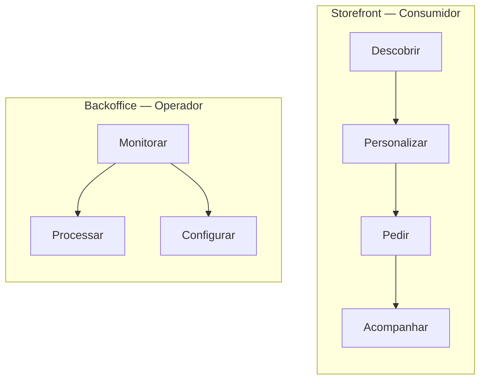
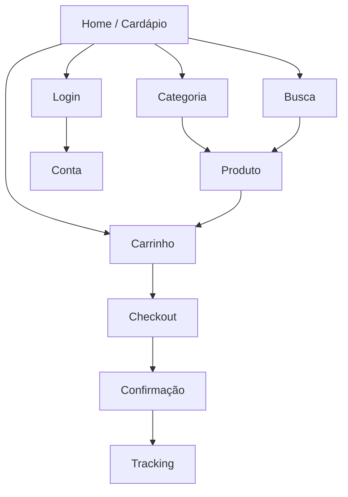
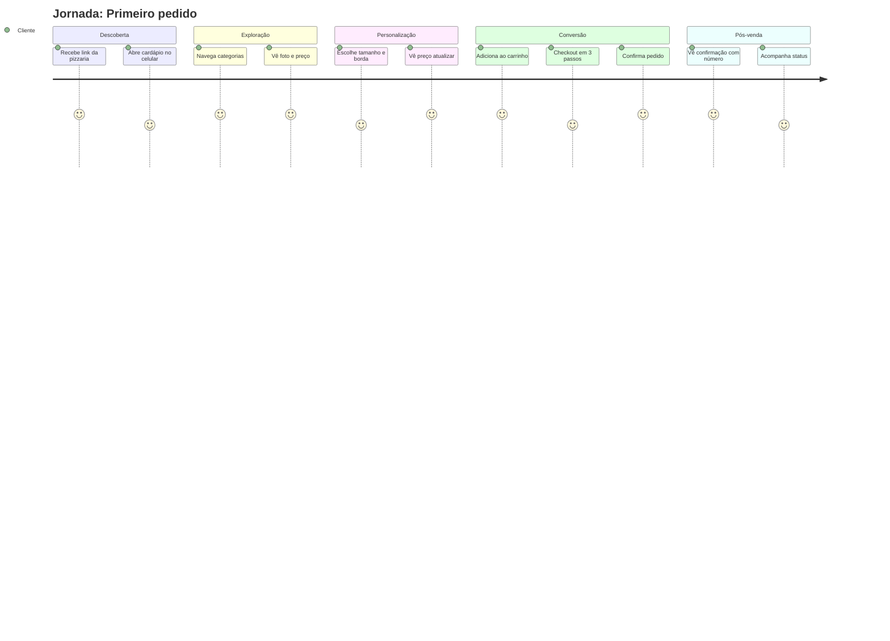
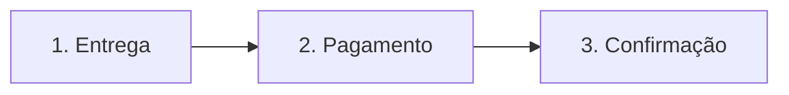
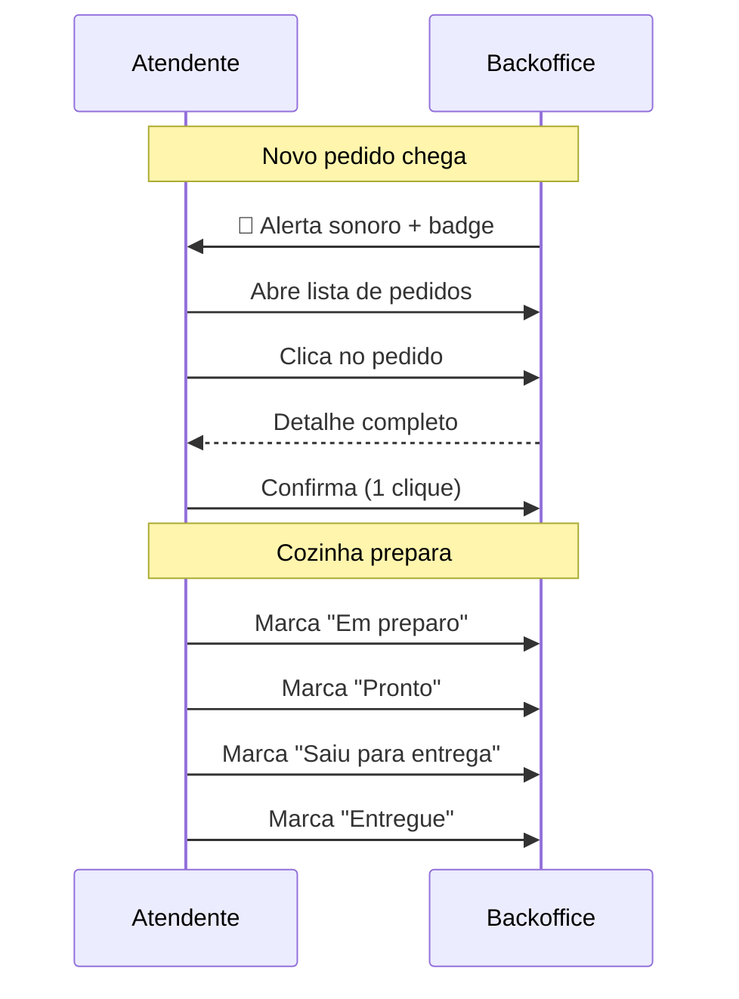
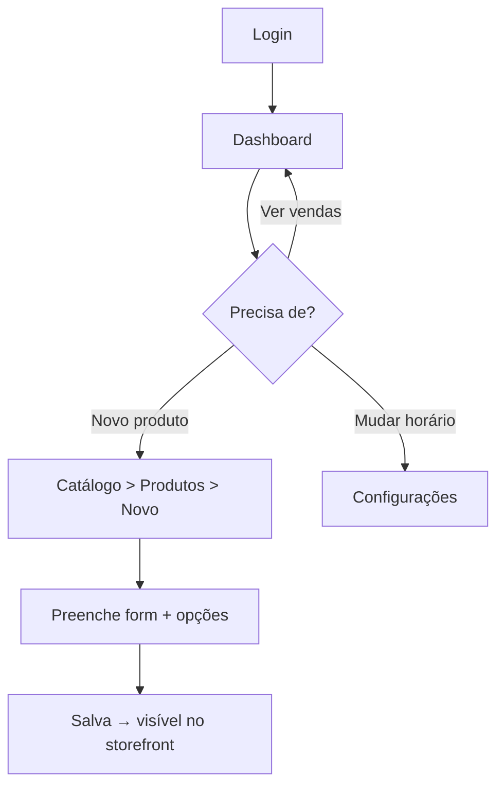
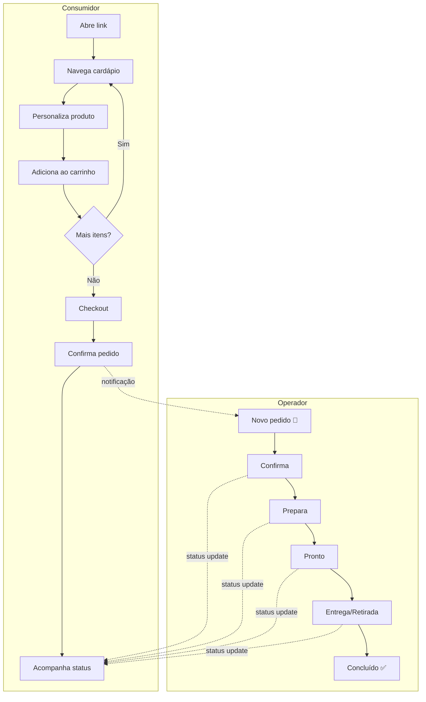

# 11 — Guia UI/UX

> **Documento:** Guia de Interface e Experiência do Usuário  
> **Produto:** Food Service *(nome comercial provisório)*  
> **Versão:** 1.0  
> **Status:** Aprovado  
> **Última atualização:** Julho/2026  
> **Depende de:** `01-visao-do-produto.md`, `04-design-system.md`, `08-regras-de-negocio.md` (aprovados)

---

## Sumário

1. [Visão Geral](#1-visão-geral)
2. [Princípios de UX](#2-princípios-de-ux)
3. [Personas e Contextos de Uso](#3-personas-e-contextos-de-uso)
4. [Arquitetura de Informação](#4-arquitetura-de-informação)
5. [Storefront — Jornada do Consumidor](#5-storefront--jornada-do-consumidor)
6. [Storefront — Telas e Wireframes](#6-storefront--telas-e-wireframes)
7. [Storefront — Fluxo de Checkout](#7-storefront--fluxo-de-checkout)
8. [Storefront — Personalização de Produto](#8-storefront--personalização-de-produto)
9. [Backoffice — Jornada do Operador](#9-backoffice--jornada-do-operador)
10. [Backoffice — Telas e Wireframes](#10-backoffice--telas-e-wireframes)
11. [Backoffice — Gestão de Pedidos](#11-backoffice--gestão-de-pedidos)
12. [Backoffice — Configuração de Cardápio](#12-backoffice--configuração-de-cardápio)
13. [Microcopy e Tom de Voz](#13-microcopy-e-tom-de-voz)
14. [Estados da Interface](#14-estados-da-interface)
15. [Feedback e Notificações](#15-feedback-e-notificações)
16. [Mobile e Touch](#16-mobile-e-touch)
17. [Acessibilidade UX](#17-acessibilidade-ux)
18. [Heurísticas de Avaliação](#18-heurísticas-de-avaliação)
19. [Anti-Padrões](#19-anti-padrões)
20. [Checklist UX por Feature](#20-checklist-ux-por-feature)
21. [Próximos Documentos](#21-próximos-documentos)

---

## 1. Visão Geral

### 1.1 Objetivo

Este documento define **como o usuário interage** com o Food Service — jornadas, fluxos, wireframes conceituais, padrões de comportamento e critérios de qualidade de experiência.

| Documento | Foco |
|-----------|------|
| `04-design-system.md` | **Como parece** — cores, tipografia, componentes |
| `11-guia-ui-ux.md` | **Como funciona** — fluxos, jornadas, comportamento |

### 1.2 Duas Experiências



### 1.3 Meta de Experiência

> Pedir comida deve ser tão fácil quanto conversar com o atendente — mas mais rápido, mais claro e disponível 24h.

| Métrica UX | Meta |
|------------|------|
| Tempo até primeiro pedido (novo usuário) | < 3 min |
| Passos do checkout | ≤ 4 telas |
| Toques para repetir pedido (V1) | ≤ 3 |
| Tempo para mudar status (operador) | 1 toque |
| Taxa de abandono de carrinho | < 60% |

---

## 2. Princípios de UX

### 2.1 Pilares

| Pilar | Significado | Aplicação prática |
|-------|-------------|-------------------|
| **Clareza** | Usuário sempre sabe onde está e o que fazer | Títulos, breadcrumbs, progresso |
| **Velocidade** | Interface parece instantânea | Skeleton, optimistic UI, poucos passos |
| **Confiança** | Usuário se sente seguro para pedir | Preços visíveis, confirmação, status |
| **Simplicidade** | Mínimo de decisões por tela | Progressive disclosure |
| **Apetite** | Food service é emoção | Fotos grandes, cores quentes no storefront |
| **Eficiência** | Operador processa sem fricção | Atalhos, ações em 1 clique |

### 2.2 Leis de UX Aplicadas

| Lei | Aplicação no Food Service |
|-----|---------------------------|
| **Hick's Law** | Poucas opções por tela; categorias organizadas |
| **Fitts's Law** | CTAs grandes no mobile; botões de ação no polegar |
| **Jakob's Law** | Padrões familiares (carrinho, checkout, status) |
| **Miller's Law** | Máximo 5–7 categorias visíveis; opções em grupos |
| **Doherty Threshold** | Feedback < 400ms; skeleton enquanto carrega |
| **Peak-End Rule** | Confirmação de pedido memorável; tracking claro |
| **Aesthetic-Usability** | Visual premium aumenta tolerância a espera |

### 2.3 Progressive Disclosure

Mostrar complexidade apenas quando necessária:

| Nível | O que mostrar |
|-------|---------------|
| **Cardápio** | Nome, foto, preço base |
| **Produto** | Descrição + grupos de opções |
| **Checkout** | Endereço e pagamento |
| **Admin produto** | Opções avançadas (SKU, tags) colapsadas |

---

## 3. Personas e Contextos de Uso

### 3.1 Camila — Consumidora (Storefront)

| Atributo | Detalhe |
|----------|---------|
| Dispositivo | Smartphone (90% do tempo) |
| Contexto | Sofá, transporte, trabalho |
| Objetivo | Pedir rápido com personalização exata |
| Frustração | Apps lentos, opções escondidas, checkout longo |
| Mental model | "Quero igual ao iFood, mas do restaurante" |

**Implicações UX:**
- Mobile first obrigatório
- Preço atualiza ao selecionar opções
- Guest checkout (sem obrigar cadastro)
- Carrinho acessível em 1 toque

### 3.2 Ricardo — Dono (Backoffice)

| Atributo | Detalhe |
|----------|---------|
| Dispositivo | Notebook + celular |
| Contexto | Entre atendimentos, fim do dia |
| Objetivo | Ver vendas, ajustar cardápio, resolver problemas |
| Frustração | Sistemas feios, dados confusos |
| Mental model | "Quero um painel simples que funcione" |

**Implicações UX:**
- Dashboard com KPIs claros
- Configuração sem treinamento
- Mobile funcional para consultas rápidas

### 3.3 Fernanda — Atendente (Backoffice)

| Atributo | Detalhe |
|----------|---------|
| Dispositivo | Tablet ou desktop no balcão |
| Contexto | Horário de pico, múltiplos pedidos |
| Objetivo | Processar pedidos sem erro |
| Frustração | Interface lenta, info incompleta |
| Mental model | "Preciso ver o pedido e mudar o status rápido" |

**Implicações UX:**
- Lista de pedidos com destaque visual por status
- Mudança de status em 1 clique
- Alerta sonoro em novo pedido
- Informações do pedido completas (opções, endereço, troco)

---

## 4. Arquitetura de Informação

### 4.1 Storefront

```
Home (Cardápio)
├── Categoria
│   └── Produto (detalhe + opções)
├── Busca
├── Carrinho
│   └── Checkout
│       ├── Dados / Entrega
│       ├── Pagamento
│       └── Confirmação
├── Pedido (tracking)
└── Conta (V1)
    ├── Perfil
    ├── Endereços
    └── Histórico
```

### 4.2 Backoffice

```
Login
Dashboard
Pedidos
├── Lista
└── Detalhe
Catálogo
├── Produtos
│   └── Formulário
├── Categorias
└── Grupos de Opções
Clientes (V1)
Configurações
├── Empresa
├── Horários
└── Operação
```

### 4.3 Mapa de Navegação Storefront



---

## 5. Storefront — Jornada do Consumidor

### 5.1 Fluxo Feliz (Happy Path)



### 5.2 Momentos Críticos (Make or Break)

| Momento | Risco | Solução UX |
|---------|-------|------------|
| Primeira impressão (3s) | Loja parece fechada/feia | Hero com logo, status aberto, fotos |
| Personalização | Confusão com opções | Cards selecionáveis, preço em tempo real |
| Ver preço total | Surpresa no checkout | Subtotal visível no carrinho e checkout |
| Checkout | Abandono | Guest checkout, poucos campos |
| Pós-pedido | Ansiedade | Número do pedido + tracking imediato |
| Loja fechada | Frustração | Banner claro + horário de abertura |

### 5.3 Tempo Alvo por Etapa

| Etapa | Tempo alvo |
|-------|------------|
| Abrir cardápio → ver produto | < 10s |
| Personalizar produto | < 30s |
| Adicionar ao carrinho | 1 toque |
| Checkout completo | < 2 min |
| Total (primeiro pedido) | < 3 min |

---

## 6. Storefront — Telas e Wireframes

### 6.1 Home / Cardápio

**Objetivo:** Apresentar o estabelecimento e permitir navegação rápida ao produto desejado.

```
┌─────────────────────────────────────┐
│ [≡]  Pizzaria do João    [🔍] [🛒2]│  ← Navbar sticky
├─────────────────────────────────────┤
│ ┌─────────────────────────────────┐│
│ │     [Imagem capa / Hero]        ││  ← cover_url
│ │     Pizzaria do João            ││
│ │     🟢 Aberto · Entrega 45min   ││
│ └─────────────────────────────────┘│
├─────────────────────────────────────┤
│ [Pizzas] [Bebidas] [Sobremesas] →  │  ← Scroll horizontal
├─────────────────────────────────────┤
│ Pizzas                              │
│ ┌──────────┐ ┌──────────┐          │
│ │ [foto]   │ │ [foto]   │          │  ← Grid 2 colunas
│ │ Calabresa│ │ Margherita│         │
│ │ R$ 45    │ │ R$ 42    │          │
│ │ [+ Add]  │ │ [+ Add]  │          │
│ └──────────┘ └──────────┘          │
│ ┌──────────┐ ┌──────────┐          │
│ │ ...      │ │ ...      │          │
│ └──────────┘ └──────────┘          │
├─────────────────────────────────────┤
│ Bebidas                             │
│ ...                                 │
└─────────────────────────────────────┘
```

| Elemento | Comportamento |
|----------|---------------|
| Status aberto/fechado | Banner verde/cinza abaixo do hero |
| Categorias | Scroll horizontal com chip ativo |
| Produto indisponível | Overlay + badge, sem botão adicionar |
| Carrinho | Badge com contagem, sempre visível |
| Pedido mínimo | Banner sutil se subtotal < mínimo |

---

### 6.2 Página do Produto

**Objetivo:** Personalizar e adicionar ao carrinho.

```
┌─────────────────────────────────────┐
│ [←]                          [🛒2] │
├─────────────────────────────────────┤
│ ┌─────────────────────────────────┐ │
│ │                                 │ │
│ │        [Foto grande 4:3]        │ │
│ │                                 │ │
│ └─────────────────────────────────┘ │
│                                     │
│ Pizza Calabresa                     │
│ Molho, mussarela e calabresa        │
│                                     │
│ ── Tamanho * ─────────────────────  │
│ ┌─────────┐┌─────────┐┌─────────┐   │
│ │ Pequena ││● Média  ││ Grande  │   │  ← Radio cards
│ │  R$ 0   ││ +R$ 8   ││ +R$ 15  │   │
│ └─────────┘└─────────┘└─────────┘   │
│                                     │
│ ── Borda (opcional) ──────────────  │
│ ┌─────────┐┌─────────┐              │
│ │☐ Sem    ││☐ Catupiry│             │  ← Checkbox cards
│ │  R$ 0   ││  +R$ 7  │              │
│ └─────────┘└─────────┘              │
│                                     │
│ Observações                         │
│ ┌─────────────────────────────────┐ │
│ │ Ex: sem cebola                  │ │
│ └─────────────────────────────────┘ │
│                                     │
├─────────────────────────────────────┤
│ [−]  1  [+]     R$ 60,00  [Adicionar]│  ← Sticky bottom bar
└─────────────────────────────────────┘
```

| Regra UX | Detalhe |
|----------|---------|
| Preço sticky | Barra inferior sempre visível com total |
| Grupos obrigatórios | Asterisco + validação antes de adicionar |
| Seleção visual | Card com border primary quando selecionado |
| Scroll | Grupos longos scrollam; barra inferior fixa |
| Feedback | Toast + animação no badge do carrinho |

---

### 6.3 Carrinho

```
┌─────────────────────────────────────┐
│ [←]  Seu carrinho                   │
├─────────────────────────────────────┤
│ ┌─────────────────────────────────┐ │
│ │ Pizza Calabresa          [🗑]  │ │
│ │ Média · Catupiry                │ │
│ │ [−] 1 [+]              R$ 60,00 │ │
│ └─────────────────────────────────┘ │
│ ┌─────────────────────────────────┐ │
│ │ Coca-Cola 2L               [🗑]│ │
│ │ [−] 2 [+]              R$ 13,00 │ │
│ └─────────────────────────────────┘ │
│                                     │
│ ─────────────────────────────────── │
│ Subtotal                    R$ 73,00│
│ Taxa de entrega              R$ 5,00│
│ ─────────────────────────────────── │
│ Total                       R$ 78,00│
│                                     │
│ Pedido mínimo: R$ 25,00 ✅          │
├─────────────────────────────────────┤
│        [ Continuar para checkout ]  │  ← Full width CTA
└─────────────────────────────────────┘
```

**Estado vazio:**

```
┌─────────────────────────────────────┐
│         🛒                          │
│   Seu carrinho está vazio           │
│   Que tal dar uma olhada no cardápio?│
│        [ Ver cardápio ]             │
└─────────────────────────────────────┘
```

---

## 7. Storefront — Fluxo de Checkout

### 7.1 Estrutura (3 passos)



| Passo | Conteúdo | Campos |
|-------|----------|--------|
| **1. Entrega** | Tipo + dados + endereço | Nome, telefone, delivery/pickup, endereço |
| **2. Pagamento** | Forma de pagamento | cash/pix/card, troco se cash |
| **3. Revisão** | Resumo + confirmar | Itens, totais, observações |

### 7.2 Wireframe — Passo 1 (Entrega)

```
┌─────────────────────────────────────┐
│ [←]  Checkout                       │
│  ●━━━━○━━━━○                        │  ← Stepper
│  Entrega  Pagamento  Confirmar      │
├─────────────────────────────────────┤
│ Como deseja receber?                  │
│ ┌──────────────┐┌──────────────┐    │
│ │  🛵 Entrega  ││  🏪 Retirada │    │  ← Toggle cards
│ └──────────────┘└──────────────┘    │
│                                     │
│ Nome completo *                       │
│ ┌─────────────────────────────────┐ │
│ │ Maria Santos                    │ │
│ └─────────────────────────────────┘ │
│ Telefone *                           │
│ ┌─────────────────────────────────┐ │
│ │ (11) 98765-4321                 │ │
│ └─────────────────────────────────┘ │
│                                     │
│ ── Endereço de entrega ──            │
│ CEP *                               │
│ ┌─────────────────────────────────┐ │
│ │ 01310-100                       │ │
│ └─────────────────────────────────┘ │
│ Rua *          Número *              │
│ ...                                 │
│                                     │
├─────────────────────────────────────┤
│        [ Continuar ]                │
└─────────────────────────────────────┘
```

### 7.3 Wireframe — Passo 2 (Pagamento)

```
┌─────────────────────────────────────┐
│ Forma de pagamento                  │
│                                     │
│ ○ PIX na entrega                    │
│ ○ Dinheiro                          │
│   └─ Troco para: R$ [ 100,00 ]      │  ← Condicional
│ ○ Cartão na entrega                 │
│                                     │
│ Observações (opcional)               │
│ ┌─────────────────────────────────┐ │
│ │ Interfone 102                   │ │
│ └─────────────────────────────────┘ │
├─────────────────────────────────────┤
│        [ Continuar ]                │
└─────────────────────────────────────┘
```

### 7.4 Wireframe — Passo 3 (Confirmação)

```
┌─────────────────────────────────────┐
│ Resumo do pedido                    │
│                                     │
│ 1× Pizza Calabresa (Média, Catupiry)│
│    R$ 60,00                         │
│ 2× Coca-Cola 2L                     │
│    R$ 13,00                         │
│ ─────────────────────────────────── │
│ Subtotal                    R$ 73,00│
│ Entrega                      R$ 5,00│
│ Total                       R$ 78,00│
│                                     │
│ 🛵 Entrega · PIX                    │
│ Rua das Flores, 123 - Centro        │
├─────────────────────────────────────┤
│        [ Confirmar pedido ]         │
└─────────────────────────────────────┘
```

### 7.5 Tela de Sucesso

```
┌─────────────────────────────────────┐
│                                     │
│            ✅                       │
│                                     │
│     Pedido confirmado!              │
│                                     │
│         #0001                       │  ← font-mono, grande
│                                     │
│   Previsão de entrega: 19:30        │
│                                     │
│   [ Acompanhar pedido ]             │
│   [ Voltar ao cardápio ]            │
│                                     │
└─────────────────────────────────────┘
```

### 7.6 Regras UX do Checkout

| Regra | Detalhe |
|-------|---------|
| Guest first | Não pedir login antes do checkout |
| Menos campos | Só o essencial; CEP preenche endereço (V1) |
| Validação inline | Erro abaixo do campo, não popup |
| Não perder dados | Manter form ao voltar passo |
| Loading no submit | Botão disabled + spinner |
| Erro recuperável | Mensagem clara + retry |
| Loja fechada | Bloquear no início com mensagem e horário |

---

## 8. Storefront — Personalização de Produto

### 8.1 Padrões por Tipo de Seleção

| Tipo | UI | Exemplo |
|------|-----|---------|
| **Single required** | Radio cards em linha | Tamanho |
| **Single optional** | Radio cards + opção "Nenhum" | Borda |
| **Multiple optional** | Checkbox cards em grid | Adicionais |
| **Multiple required (N)** | Checkbox + contador "2 de 2" | Meio a meio |

### 8.2 Feedback de Preço

```
Preço base:     R$ 45,00
+ Média:        R$  8,00
+ Catupiry:     R$  7,00
─────────────────────────
Total:          R$ 60,00   ← Atualiza em tempo real
```

- Animação sutil ao mudar preço (fade ou count-up)
- Total na barra inferior sticky

### 8.3 Validação de Opções

| Situação | Feedback |
|----------|----------|
| Grupo obrigatório vazio | Shake no grupo + "Selecione um tamanho" |
| Máximo atingido | Desabilitar opções não selecionadas |
| Opção indisponível | Card cinza + badge "Indisponível" |
| Tentar adicionar sem opções | Scroll até primeiro grupo inválido |

### 8.4 Exemplos por Segmento (mesma UI)

| Segmento | Grupos | UI idêntica |
|----------|--------|-------------|
| Pizzaria | Tamanho, Massa, Borda | Radio + Radio + Optional |
| Hamburgueria | Pão, Ponto, Adicionais | Radio + Radio + Multiple |
| Açaiteria | Tamanho, Frutas, Coberturas | Radio + Multiple + Multiple |

---

## 9. Backoffice — Jornada do Operador

### 9.1 Fluxo do Atendente (Horário de Pico)



### 9.2 Fluxo do Dono (Configuração)



---

## 10. Backoffice — Telas e Wireframes

### 10.1 Login

```
┌─────────────────────────────────────┐
│                                     │
│         [Logo] Food Service         │
│                                     │
│         Acesse sua conta            │
│                                     │
│  E-mail                             │
│  ┌─────────────────────────────────┐│
│  │ admin@pizzaria.com              ││
│  └─────────────────────────────────┘│
│  Senha                              │
│  ┌─────────────────────────────────┐│
│  │ ••••••••                        ││
│  └─────────────────────────────────┘│
│                                     │
│        [ Entrar ]                   │
│                                     │
└─────────────────────────────────────┘
```

- Centralizado, minimalista
- Erro inline abaixo do form
- Sem distrações

---

### 10.2 Dashboard

```
┌──────────┬──────────────────────────────────────────┐
│ [Logo]   │  Dashboard          [🔔] [Avatar ▼]     │
│          ├──────────────────────────────────────────┤
│ Dashboard│  Bom dia, Ricardo! 👋                    │
│ Pedidos 3│                                          │
│ Catálogo │  ┌────────┐┌────────┐┌────────┐┌────────┐│
│ Config   │  │ 23     ││ 3      ││ R$1.847││ R$80  ││
│          │  │Pedidos ││Pendent.││Receita ││Ticket ││
│          │  └────────┘└────────┘└────────┘└────────┘│
│          │                                          │
│          │  Pedidos recentes                        │
│          │  ┌──────────────────────────────────────┐│
│          │  │ #0023 · Maria · R$78 · 🟡 Pendente  ││
│          │  │ #0022 · João  · R$45 · 🟢 Preparo   ││
│          │  │ #0021 · Ana   · R$92 · ✅ Concluído ││
│          │  └──────────────────────────────────────┘│
└──────────┴──────────────────────────────────────────┘
```

---

### 10.3 Layout Geral Backoffice

| Área | Desktop | Mobile |
|------|---------|--------|
| Sidebar | Fixa 256px, colapsável | Drawer overlay |
| Header | Breadcrumbs + ações | Título + menu hamburger |
| Content | `p-6`, max-width fluid | `p-4` |
| Tabelas | Full table | Cards empilhados |

---

## 11. Backoffice — Gestão de Pedidos

### 11.1 Lista de Pedidos

```
┌──────────────────────────────────────────────────────┐
│ Pedidos                              [Filtros ▼]    │
├──────────────────────────────────────────────────────┤
│ [Todos] [Pendentes 3] [Em preparo] [Prontos] [+]     │  ← Tabs por status
├──────────────────────────────────────────────────────┤
│ 🔍 Buscar por número, nome, telefone...             │
├──────────────────────────────────────────────────────┤
│ #0023 · Maria Santos · (11) 98765-4321              │
│ 🟡 Pendente · 🛵 Delivery · R$ 78,00 · há 2 min     │
│ 1× Pizza Calabresa, 2× Coca-Cola                    │
│ [Confirmar] [Ver detalhes]                           │
├──────────────────────────────────────────────────────┤
│ #0022 · João Silva · (11) 91234-5678                │
│ 🟠 Em preparo · 🏪 Retirada · R$ 45,00 · há 8 min  │
│ ...                                                  │
└──────────────────────────────────────────────────────┘
```

| Elemento | Comportamento |
|----------|---------------|
| Tabs | Filtro rápido por status; badge com contagem |
| Card de pedido | Informação suficiente sem abrir detalhe |
| Ação primária | Próximo status lógico em destaque |
| Auto-refresh | Polling 30s ou manual |
| Som | Beep discreto em novo pedido (configurável) |

### 11.2 Detalhe do Pedido

```
┌──────────────────────────────────────────────────────┐
│ [←] Pedido #0023                    🟡 Pendente      │
├──────────────────────────────────────────────────────┤
│ Cliente                                              │
│ Maria Santos · (11) 98765-4321                       │
│                                                      │
│ Entrega                                              │
│ 🛵 Rua das Flores, 123 - Apto 102 - Centro          │
│ Ref: Próximo ao mercado                              │
│                                                      │
│ Itens                                                │
│ ┌──────────────────────────────────────────────────┐ │
│ │ 1× Pizza Calabresa                      R$ 60,00 │ │
│ │    Tamanho: Média (+R$8)                         │ │
│ │    Borda: Catupiry (+R$7)                        │ │
│ │    Obs: Bem assada                               │ │
│ ├──────────────────────────────────────────────────┤ │
│ │ 2× Coca-Cola 2L                         R$ 13,00 │ │
│ └──────────────────────────────────────────────────┘ │
│                                                      │
│ Pagamento: PIX · Pendente                            │
│                                                      │
│ Subtotal  R$ 73,00                                   │
│ Entrega   R$  5,00                                   │
│ Total     R$ 78,00                                   │
│                                                      │
│ Histórico                                            │
│ ● 18:30 — Pedido recebido                            │
│                                                      │
├──────────────────────────────────────────────────────┤
│ [Confirmar pedido]  [Cancelar]                       │  ← Ações contextuais
└──────────────────────────────────────────────────────┘
```

### 11.3 Ações por Status

| Status atual | Ação primária | Ação secundária |
|--------------|---------------|-----------------|
| `pending` | Confirmar | Cancelar |
| `confirmed` | Iniciar preparo | Cancelar |
| `preparing` | Marcar pronto | Cancelar |
| `ready` (delivery) | Saiu para entrega | Cancelar |
| `ready` (pickup) | Entregue/Retirado | Cancelar |
| `out_for_delivery` | Entregue | Cancelar |
| `completed` | — | — |
| `cancelled` | — | — |

### 11.4 Cancelamento

Modal de confirmação obrigatório:

```
┌─────────────────────────────────────┐
│ Cancelar pedido #0023?              │
│                                     │
│ Motivo *                            │
│ ┌─────────────────────────────────┐ │
│ │ Produto em falta               │ │
│ └─────────────────────────────────┘ │
│                                     │
│     [ Voltar ]  [ Cancelar pedido ] │
└─────────────────────────────────────┘
```

---

## 12. Backoffice — Configuração de Cardápio

### 12.1 Lista de Produtos

```
┌──────────────────────────────────────────────────────┐
│ Produtos                          [+ Novo produto]  │
├──────────────────────────────────────────────────────┤
│ 🔍 Buscar...          [Categoria ▼] [Status ▼]      │
├──────────────────────────────────────────────────────┤
│ [img] Pizza Calabresa    Pizzas   R$45  🟢 Ativo   │
│ [img] Pizza Margherita   Pizzas   R$42  🟢 Ativo   │
│ [img] Coca-Cola 2L       Bebidas  R$6,5 🔴 Indisp. │
└──────────────────────────────────────────────────────┘
```

### 12.2 Formulário de Produto

Layout em seções colapsáveis:

```
┌──────────────────────────────────────────────────────┐
│ [←] Novo produto                    [Salvar] [Salvar e continuar] │
├──────────────────────────────────────────────────────┤
│ ▼ Informações básicas                                │
│   Nome *          [ Pizza Calabresa              ]   │
│   Categoria *     [ Pizzas                    ▼ ]   │
│   Descrição       [ Molho, mussarela...         ]   │
│   Preço base *    [ R$ 45,00                    ]   │
│                                                      │
│ ▼ Imagens                                            │
│   [📷 Upload]  [img1] [img2] [+]                    │
│                                                      │
│ ▼ Grupos de opções                                   │
│   [✓] Tamanho    [✓] Massa    [✓] Borda             │
│   [+ Vincular grupo]                                 │
│                                                      │
│ ▼ Disponibilidade                                    │
│   [✓] Ativo no cardápio                              │
│   [✓] Disponível para pedido                         │
│                                                      │
│ ▶ Avançado (SKU, tags, tempo de preparo)             │
└──────────────────────────────────────────────────────┘
```

### 12.3 UX de Configuração

| Regra | Detalhe |
|-------|---------|
| Preview | Link "Ver no cardápio" abre storefront |
| Salvar parcial | Campos obrigatórios mínimos para publicar |
| Grupos reutilizáveis | Vincular existente > criar novo |
| Feedback | Toast "Produto salvo" + opção desfazer (V1) |
| Mobile | Formulário funcional mas desktop preferido |

---

## 13. Microcopy e Tom de Voz

### 13.1 Tom de Voz

| Atributo | Storefront | Backoffice |
|----------|------------|------------|
| Tom | Amigável, direto | Profissional, eficiente |
| Pessoa | "você" | "você" |
| Formalidade | Informal mas respeitoso | Neutro |
| Emojis | Com moderação (✅ 🛵) | Apenas em status |

### 13.2 Exemplos de Microcopy

| Contexto | ❌ Evitar | ✅ Usar |
|----------|----------|---------|
| Carrinho vazio | "Nenhum item" | "Seu carrinho está vazio" |
| Loja fechada | "Error: store closed" | "Estamos fechados. Abrimos hoje às 18h" |
| Pedido confirmado | "Success" | "Pedido confirmado! #0001" |
| Erro de rede | "Network error" | "Sem conexão. Verifique sua internet" |
| Botão checkout | "Submit" | "Confirmar pedido" |
| Loading | "Loading..." | "Carregando cardápio..." |
| Produto indisponível | "Unavailable" | "Indisponível no momento" |
| Pedido mínimo | "Min value not met" | "Faltam R$ 5,00 para o pedido mínimo" |

### 13.3 Labels de Status (sempre texto + cor + ícone)

| Status | Label |
|--------|-------|
| `pending` | Pendente |
| `confirmed` | Confirmado |
| `preparing` | Em preparo |
| `ready` | Pronto |
| `out_for_delivery` | Saiu para entrega |
| `completed` | Concluído |
| `cancelled` | Cancelado |

---

## 14. Estados da Interface

### 14.1 Matriz de Estados por Tela

| Estado | Storefront | Backoffice |
|------|------------|------------|
| **Loading** | Skeleton cards | Skeleton table rows |
| **Empty** | Ilustração + CTA | EmptyState + ação |
| **Error** | Mensagem + retry | Toast + retry |
| **Success** | Toast ou tela dedicada | Toast |
| **Partial** | Banner (loja fechando) | — |

### 14.2 Loja Fechada (Storefront)

```
┌─────────────────────────────────────┐
│ ┌─────────────────────────────────┐ │
│ │  🔴 Estamos fechados no momento │ │
│ │  Abrimos hoje às 18:00          │ │
│ └─────────────────────────────────┘ │
│                                     │
│ [Cardápio visível mas desabilitado] │
│ Produtos com overlay "Indisponível" │
│                                     │
│ [ Carrinho desabilitado ]           │
└─────────────────────────────────────┘
```

- Cardápio navegável (para planejar pedido)
- Checkout bloqueado com mensagem clara

### 14.3 Tracking de Pedido

```
┌─────────────────────────────────────┐
│ Pedido #0001                        │
│                                     │
│  ✅ Recebido        18:30           │
│  ✅ Confirmado      18:32           │
│  ● Em preparo       18:35           │  ← Ativo
│  ○ Pronto                           │
│  ○ Saiu para entrega                │
│  ○ Entregue                         │
│                                     │
│  Previsão: 19:30                    │
└─────────────────────────────────────┘
```

- Polling a cada 10s
- Animação sutil ao mudar status
- Push notification (V1)

---

## 15. Feedback e Notificações

### 15.1 Hierarquia de Feedback

| Urgência | Componente | Duração | Exemplo |
|----------|------------|---------|---------|
| Baixa | Toast success | 3s | "Adicionado ao carrinho" |
| Média | Toast warning | 5s | "Pedido mínimo não atingido" |
| Alta | Inline alert | Persistente | "Loja fechada" |
| Crítica | Modal | Até ação | "Cancelar pedido?" |
| Sistema | Som + badge | — | Novo pedido (backoffice) |

### 15.2 Toasts — Quando Usar

| Ação | Toast? |
|------|--------|
| Adicionar ao carrinho | ✅ "Adicionado ao carrinho" |
| Salvar produto (admin) | ✅ "Produto salvo" |
| Mudar status pedido | ✅ "Status atualizado" |
| Erro de validação | ❌ Inline no campo |
| Erro de rede | ✅ "Sem conexão" |
| Pedido confirmado | ❌ Tela dedicada (não toast) |

---

## 16. Mobile e Touch

### 16.1 Padrões Mobile Storefront

| Padrão | Implementação |
|--------|---------------|
| Bottom bar carrinho | Sticky com total + CTA (opcional V1) |
| Thumb zone | CTAs na parte inferior |
| Swipe back | Navegação nativa do browser |
| Pull to refresh | Cardápio (opcional) |
| Bottom sheet | Carrinho rápido no mobile |
| Input type | `tel` para telefone, `numeric` para CEP |
| Teclado | `inputMode` correto por campo |

### 16.2 Safe Areas

- Respeitar notch e home indicator (iPhone)
- `padding-bottom: env(safe-area-inset-bottom)` em barras fixas

### 16.3 Touch Targets

| Elemento | Tamanho mínimo |
|----------|----------------|
| Botões | 44×44px |
| Chips de categoria | 44px altura |
| Quantity selector | 44px botões +/- |
| Cards de opção | 48px altura mínima |

---

## 17. Acessibilidade UX

### 17.1 Checklist por Tela

| Critério | Requisito |
|----------|-----------|
| Contraste | WCAG AA (4.5:1 texto) |
| Foco | Visível em navegação por teclado |
| Labels | Todo input com label associado |
| Imagens | `alt` descritivo em produtos |
| Status | Cor + ícone + texto (nunca só cor) |
| Animações | Respeitar `prefers-reduced-motion` |
| Zoom | Funcional até 200% |
| Idioma | `lang="pt-BR"` |

### 17.2 Navegação por Teclado (Backoffice)

| Tecla | Ação |
|-------|------|
| `Tab` | Próximo elemento |
| `Enter` | Confirmar ação |
| `Escape` | Fechar modal |
| `/` | Focar busca (V1) |

### 17.3 Screen Readers

- Pedido: "Pedido número 0001, status pendente, total 78 reais"
- Opção selecionada: "Tamanho média, adicional 8 reais, selecionado"
- Carrinho: "3 itens no carrinho"

---

## 18. Heurísticas de Avaliação

Usar as **10 Heurísticas de Nielsen** para revisar cada feature:

| # | Heurística | Pergunta de revisão |
|---|------------|---------------------|
| 1 | Visibilidade do status | O usuário sabe o que está acontecendo? |
| 2 | Correspondência com mundo real | Linguagem é familiar (pedido, carrinho)? |
| 3 | Controle e liberdade | Pode voltar, cancelar, editar carrinho? |
| 4 | Consistência | Mesmos padrões em toda a plataforma? |
| 5 | Prevenção de erros | Validação antes de submit? |
| 6 | Reconhecimento > memorização | Opções visíveis, não decoradas? |
| 7 | Flexibilidade | Atalhos para operador experiente? |
| 8 | Design minimalista | Sem informação irrelevante? |
| 9 | Recuperação de erros | Mensagens claras com ação? |
| 10 | Ajuda | Tooltips onde necessário? |

### 18.1 Scorecard (por feature)

```
Feature: Checkout
[1] Visibilidade      ████████░░ 8/10
[2] Correspondência   █████████░ 9/10
[3] Controle          ███████░░░ 7/10
...
Meta: ≥ 7/10 em todas
```

---

## 19. Anti-Padrões

| ❌ Anti-padrão | Por quê | ✅ Alternativa |
|---------------|---------|----------------|
| Popup de promoção bloqueando | Irrita, aumenta bounce | Banner dismissible |
| Login obrigatório antes de pedir | Abandono de carrinho | Guest checkout |
| Preço só no checkout | Surpresa, desconfiança | Preço em tempo real |
| 8 passos no checkout | Abandono | Máximo 3–4 passos |
| Tabela sem filtro (admin) | Inutilizável com volume | Tabs + busca + filtros |
| Status só por cor | Inacessível | Cor + ícone + label |
| Loading infinito | Ansiedade | Skeleton + timeout |
| "Erro 500" | Inútil para usuário | Mensagem humana + retry |
| Opções em dropdown | Esconde personalização | Cards selecionáveis |
| Fotos pequenas | Não apetece | Hero 4:3 no produto |
| Muitas fontes/cores | Visual amador | Design System rigoroso |
| Autoplay de vídeo/som | Irritante | Silencioso por padrão |

---

## 20. Checklist UX por Feature

### 20.1 Storefront — Cardápio

- [ ] Carrega em < 2.5s (LCP)
- [ ] Skeleton durante loading
- [ ] Status aberto/fechado visível
- [ ] Categorias navegáveis
- [ ] Produto indisponível claramente marcado
- [ ] Carrinho acessível em 1 toque
- [ ] Responsivo mobile

### 20.2 Storefront — Checkout

- [ ] Guest checkout funciona
- [ ] ≤ 4 passos
- [ ] Validação inline
- [ ] Preço total visível antes de confirmar
- [ ] Loading no submit
- [ ] Tela de sucesso com número do pedido
- [ ] Erro recuperável

### 20.3 Backoffice — Pedidos

- [ ] Novo pedido visível em < 30s
- [ ] Alerta sonoro (configurável)
- [ ] Mudança de status em 1 clique
- [ ] Detalhe com todas as opções do item
- [ ] Endereço completo visível
- [ ] Troco visível (pagamento cash)
- [ ] Cancelamento com motivo obrigatório

### 20.4 Backoffice — Catálogo

- [ ] Criar produto em < 5 min (com opções)
- [ ] Preview no storefront
- [ ] Grupos de opções reutilizáveis
- [ ] Upload de imagem com preview
- [ ] Toggle disponibilidade rápido

---

## 21. Próximos Documentos

| # | Documento | Relação |
|---|-----------|---------|
| 04 | `04-design-system.md` | Componentes visuais referenciados aqui |
| 12 | `12-checklist-mvp.md` | Escopo UX do MVP |
| 09 | `09-roadmap.md` | Quando implementar cada fluxo |

---

## Histórico de Revisões

| Versão | Data | Autor | Alterações |
|--------|------|-------|------------|
| 1.0 | Jul/2026 | — | Versão inicial — aprovado |

---

## Apêndice A — Mapa de Telas MVP

| # | Tela | App | Fase |
|---|------|-----|------|
| 1 | Home / Cardápio | Storefront | MVP |
| 2 | Categoria | Storefront | MVP |
| 3 | Produto (detalhe) | Storefront | MVP |
| 4 | Carrinho | Storefront | MVP |
| 5 | Checkout (3 passos) | Storefront | MVP |
| 6 | Confirmação | Storefront | MVP |
| 7 | Tracking | Storefront | MVP |
| 8 | Login | Backoffice | MVP |
| 9 | Dashboard | Backoffice | MVP |
| 10 | Lista de pedidos | Backoffice | MVP |
| 11 | Detalhe do pedido | Backoffice | MVP |
| 12 | Lista de produtos | Backoffice | MVP |
| 13 | Formulário de produto | Backoffice | MVP |
| 14 | Categorias | Backoffice | MVP |
| 15 | Grupos de opções | Backoffice | MVP |
| 16 | Configurações | Backoffice | MVP |

**Total: 16 telas MVP**

## Apêndice B — Fluxo Completo (Diagrama)



---

> **Documento aprovado.** Próximo: `12-checklist-mvp.md`.
