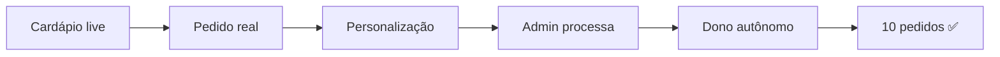
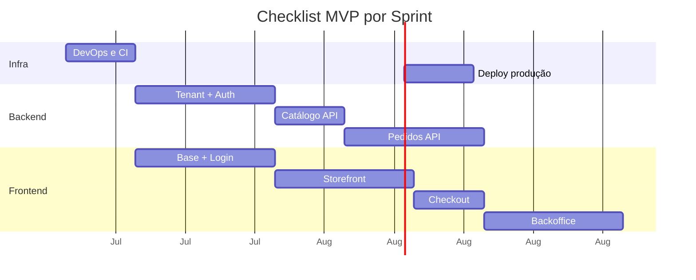
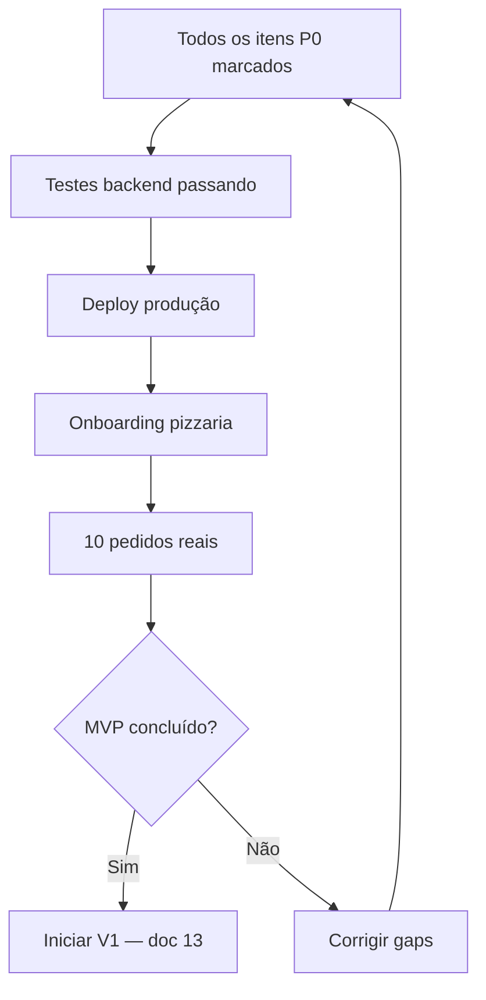

# 12 — Checklist MVP

> **Documento:** Checklist de Escopo Fechado do MVP  
> **Produto:** Food Service *(nome comercial provisório)*  
> **Versão:** 1.0  
> **Status:** Aprovado  
> **Última atualização:** Julho/2026  
> **Depende de:** Documentos 01–11 (aprovados)

---

## Sumário

1. [Visão Geral](#1-visão-geral)
2. [Critérios de Sucesso](#2-critérios-de-sucesso)
3. [Como Usar Este Checklist](#3-como-usar-este-checklist)
4. [Fora do Escopo MVP](#4-fora-do-escopo-mvp)
5. [Infraestrutura e DevOps](#5-infraestrutura-e-devops)
6. [Banco de Dados](#6-banco-de-dados)
7. [Backend — Módulos e Services](#7-backend--módulos-e-services)
8. [API REST — 36 Endpoints](#8-api-rest--36-endpoints)
9. [Frontend — Estrutura e Features](#9-frontend--estrutura-e-features)
10. [Telas — 16 Screens](#10-telas--16-screens)
11. [Regras de Negócio Obrigatórias](#11-regras-de-negócio-obrigatórias)
12. [UX e Qualidade](#12-ux-e-qualidade)
13. [Testes Mínimos](#13-testes-mínimos)
14. [Deploy e Produção](#14-deploy-e-produção)
15. [Validação com Cliente Real](#15-validação-com-cliente-real)
16. [Definição de Pronto (DoD)](#16-definição-de-pronto-dod)
17. [Mapa Sprint → Checklist](#17-mapa-sprint--checklist)
18. [Próximos Documentos](#18-próximos-documentos)

---

## 1. Visão Geral

### 1.1 Objetivo

Este documento define o **escopo fechado do MVP** do Food Service — a lista definitiva do que deve existir antes de considerar a fase concluída. Qualquer item **não listado aqui** não entra no MVP, salvo revisão explícita deste documento.

### 1.2 Propósito

| Uso | Descrição |
|-----|-----------|
| **Controle de escopo** | Evitar creep — cada feature nova passa por este doc |
| **Sprint 10** | Critério de go-live (`09-roadmap.md`) |
| **Revisão de PR** | Feature só mergeia se cobre item deste checklist |
| **Onboarding** | Visão única do que o MVP entrega |

### 1.3 Referências Cruzadas

| Documento | O que valida |
|-----------|--------------|
| `01-visao-do-produto.md` | Visão, métricas de sucesso, decisões aprovadas |
| `03-modelagem-do-banco.md` | 20 tabelas MVP |
| `07-api.md` | 36 endpoints MVP |
| `08-regras-de-negocio.md` | ~178 regras MVP |
| `09-roadmap.md` | Sprints 0–10 |
| `11-guia-ui-ux.md` | 16 telas + critérios UX |

### 1.4 Resumo Quantitativo

| Área | Quantidade |
|------|------------|
| Tabelas PostgreSQL | 20 |
| Endpoints API | 36 |
| Telas (storefront + backoffice) | 16 |
| Regras de negócio | ~178 |
| Sprints de implementação | 0–10 |
| Pedidos reais para validação | ≥ 10 |

---

## 2. Critérios de Sucesso

O MVP está **concluído** quando **todos** os critérios abaixo forem atendidos:

| # | Critério | Como validar |
|---|----------|--------------|
| S1 | Cardápio publicado e acessível | Link `https://{subdomain}.foodservice.app` abre sem erro |
| S2 | ≥ 10 pedidos reais completos | Fluxo checkout → status `completed` em produção |
| S3 | Personalização funciona | Produto com grupos de opções (ex: tamanho, sabores) |
| S4 | Painel em tempo real | Novo pedido visível no admin em < 30s |
| S5 | Autonomia do dono | Dono altera cardápio sem ajuda técnica |
| S6 | Estabilidade | Zero downtime no horário de pico da pizzaria |
| S7 | Checklist 100% | Todas as seções 5–15 marcadas |

---

## 3. Como Usar Este Checklist

### 3.1 Convenções

| Símbolo | Significado |
|---------|-------------|
| `- [ ]` | Pendente |
| `- [x]` | Concluído e validado |
| **P0** | Bloqueante — sem isso não há MVP |
| **P1** | Essencial — deve estar no go-live |
| **P2** | Desejável — pode adiar com justificativa documentada |

### 3.2 Regra de Ouro

> Se não está neste checklist **e** não está na seção [Fora do Escopo](#4-fora-do-escopo-mvp), **não implementar** no MVP.

### 3.3 Atualização

Alterações de escopo exigem:
1. Revisão e aprovação deste documento
2. Atualização dos docs dependentes (API, regras, roadmap)
3. Entrada no histórico de revisões

---

## 4. Fora do Escopo MVP

Itens **explicitamente excluídos**. Implementar qualquer um deles **invalida** o escopo fechado.

### 4.1 Produto e Funcionalidades

| Item | Fase prevista | Referência |
|------|---------------|------------|
| Login/cadastro do consumidor | V1 | `07-api.md` §19.1 |
| Histórico de pedidos na conta | V1 | `07-api.md` §19.1 |
| Cupons e promoções | V1 | `08-regras-de-negocio.md` PR-01–11 |
| CRUD de endereços salvos | V1 | `09-roadmap.md` Sprint 11 |
| Gestão de equipe (convites) | V1 | `09-roadmap.md` Sprint 13 |
| Relatórios avançados | V1 | `07-api.md` §19.4 |
| Pagamento processado (gateway) | V2 | `01-visao-do-produto.md` §8.2 |
| Rastreamento de entrega / mapas | V2 | `09-roadmap.md` Sprint 17+ |
| Entregadores | V2 | `03-modelagem-do-banco.md` §19.3 |
| Programa de fidelidade | V2 | `03-modelagem-do-banco.md` §19.3 |
| Integração iFood/Rappi | V2+ | `01-visao-do-produto.md` §8.2 |
| App nativo iOS/Android | V2+ | `01-visao-do-produto.md` §8.2 |
| PDV físico | V2+ | `01-visao-do-produto.md` §8.2 |
| Gestão de estoque | V2+ | `01-visao-do-produto.md` §8.2 |
| Emissão fiscal (NF-e) | V2+ | `01-visao-do-produto.md` §8.2 |
| White-label completo | Futuro | `01-visao-do-produto.md` §15.3 |
| Multi-idioma | Futuro | `01-visao-do-produto.md` §15.3 |
| Billing / planos SaaS | Futuro | `01-visao-do-produto.md` §10 |

### 4.2 Decisões Aprovadas (não negociáveis no MVP)

| Decisão | Valor |
|---------|-------|
| Pagamento | Manual na entrega — **sem processamento pelo sistema** |
| Identificação do tenant | **Subdomínio** (`pizzaria-joao.foodservice.app`) |
| Métrica de validação | **10 pedidos reais** completos |
| Checkout | **Guest** — nome + telefone, sem conta |
| Formas de pagamento | `cash`, `pix`, `card_on_delivery` |

---

## 5. Infraestrutura e DevOps

**Sprint:** 0, 10 | **Prioridade:** P0

### 5.1 Repositórios

- [ ] **P0** `vendas_backend` — estrutura modular Django (`06-backend.md`)
- [ ] **P0** `vendas_frontend` — Vite + React + TypeScript (`05-frontend.md`)
- [ ] **P0** README com instruções de setup em ambos repos
- [ ] **P0** `.env.example` documentado (`10-padroes-de-codigo.md` §21)

### 5.2 Ambiente Local (Docker)

- [ ] **P0** Docker Compose: PostgreSQL 16+
- [ ] **P0** Docker Compose: Redis
- [ ] **P0** Backend sobe com `docker compose up` + `runserver 8001`
- [ ] **P0** Frontend sobe com `npm run dev` (localhost:5174)
- [ ] **P1** Celery worker local (para e-mail assíncrono)

### 5.3 CI/CD

- [ ] **P0** GitHub Actions: lint backend (ruff)
- [ ] **P0** GitHub Actions: lint frontend (ESLint + typecheck)
- [ ] **P0** GitHub Actions: testes backend (pytest)
- [ ] **P1** Pipeline build + deploy staging
- [ ] **P0** Pipeline deploy produção (Sprint 10)

### 5.4 Observabilidade

- [ ] **P1** Sentry configurado (backend + frontend)
- [ ] **P0** Health check respondendo (`GET /api/v1/health/`)
- [ ] **P2** Logs estruturados (JSON em produção)

---

## 6. Banco de Dados

**Sprint:** 1–3, 7 | **Prioridade:** P0 | **Ref:** `03-modelagem-do-banco.md` §19.1

### 6.1 Tabelas MVP (20)

#### Módulo Empresa (Tenant)

- [ ] **P0** `companies`
- [ ] **P0** `company_settings`
- [ ] **P0** `business_hours`

#### Módulo Contas

- [ ] **P0** `employees`
- [ ] **P0** `roles`
- [ ] **P0** `role_permissions`
- [ ] **P0** `employee_roles`

#### Módulo Clientes

- [ ] **P0** `customers` *(criado no checkout, sem login)*
- [ ] **P0** `customer_addresses` *(endereço do pedido delivery)*

#### Módulo Catálogo

- [ ] **P0** `categories`
- [ ] **P0** `products`
- [ ] **P0** `product_images`
- [ ] **P0** `option_groups`
- [ ] **P0** `options`
- [ ] **P0** `product_option_groups`

#### Módulo Pedidos

- [ ] **P0** `orders`
- [ ] **P0** `order_items`
- [ ] **P0** `order_item_options`
- [ ] **P0** `order_status_history`
- [ ] **P0** `order_payments`

### 6.2 Requisitos Transversais

- [ ] **P0** Todas as PKs são UUID v4
- [ ] **P0** `tenant_id` NOT NULL em tabelas de negócio
- [ ] **P0** Soft delete onde especificado (`is_deleted`, `deleted_at`)
- [ ] **P0** Snapshot de preços/nomes em `order_items` e `order_item_options`
- [ ] **P0** Índices em `tenant_id`, FKs e campos de busca
- [ ] **P0** Migrations versionadas e reproduzíveis
- [ ] **P0** Seed script com tenant `demo` (ou pizzaria real)

### 6.3 Tabelas que NÃO devem existir no MVP

- [ ] Confirmado: **sem** `coupons`, `coupon_usages`
- [ ] Confirmado: **sem** `drivers`, `deliveries`
- [ ] Confirmado: **sem** `loyalty_programs`, `loyalty_transactions`
- [ ] Confirmado: **sem** `audit_logs`
- [ ] Confirmado: **sem** `notification_logs` *(e-mail via Celery sem persistência obrigatória)*

---

## 7. Backend — Módulos e Services

**Sprint:** 1–3, 7, 9 | **Prioridade:** P0 | **Ref:** `06-backend.md`

### 7.1 Core

- [ ] **P0** `BaseModel` (id, created_at, updated_at)
- [ ] **P0** `TenantAwareModel` (tenant_id)
- [ ] **P0** `TenantManager` — filtra por tenant automaticamente
- [ ] **P0** `TenantMiddleware` — resolve subdomínio → tenant
- [ ] **P0** `TenantContext` — thread-local do tenant atual
- [ ] **P0** Formato de erro padronizado (`07-api.md` §5)

### 7.2 App `companies`

- [ ] **P0** Models: Company, CompanySettings, BusinessHours
- [ ] **P0** `OnboardingService` — cria empresa + defaults (E-01)
- [ ] **P0** `StoreHoursService.is_store_open()` (E-08 a E-15)
- [ ] **P0** SettingsService — leitura/atualização de configurações

### 7.3 App `accounts`

- [ ] **P0** Models: Employee, Role, RolePermission, EmployeeRole
- [ ] **P0** Roles de sistema criadas no onboarding (owner, manager, operator)
- [ ] **P0** JWT auth (simplejwt) + `EmployeeJWTAuthentication`
- [ ] **P0** `AuthService`: login, refresh, logout
- [ ] **P0** RBAC: `HasPermission` + permissões por endpoint
- [ ] **P0** Permissões: `dashboard.view`, `orders.view`, `orders.manage`, `catalog.view`, `catalog.manage`, `settings.manage`

### 7.4 App `catalog`

- [ ] **P0** Models completos (Category, Product, ProductImage, OptionGroup, Option, ProductOptionGroup)
- [ ] **P0** `ProductService` — CRUD + soft delete
- [ ] **P0** `OptionGroupService` — CRUD grupos e opções
- [ ] **P0** `PriceCalculator` — P-01 a P-15
- [ ] **P0** `CatalogSelector` — queries otimizadas para storefront
- [ ] **P0** Upload de imagens (max 5MB, JPEG/PNG/WebP)
- [ ] **P1** Cache Redis para catálogo público (invalidação ao editar)

### 7.5 App `customers`

- [ ] **P0** Model Customer — único por `(tenant, phone)` (T-09)
- [ ] **P0** Model CustomerAddress — vinculado ao pedido delivery
- [ ] **P0** Criação/atualização automática no checkout (guest)

### 7.6 App `orders`

- [ ] **P0** Models: Order, OrderItem, OrderItemOption, OrderStatusHistory, OrderPayment
- [ ] **P0** `CartValidationService` — valida itens, opções, disponibilidade
- [ ] **P0** `OrderService.create_from_checkout` — K-01 a K-24, PD-01 a PD-20
- [ ] **P0** `OrderService.update_status` — transições válidas + histórico
- [ ] **P0** `OrderService.update_payment` — PG-01 a PG-10
- [ ] **P0** Geração de `order_number` sequencial por tenant
- [ ] **P0** Cálculo de totais no servidor (subtotal, taxa, desconto=0, total)

### 7.7 Celery (assíncrono)

- [ ] **P1** Task: e-mail de confirmação de pedido (N-01 a N-07)
- [ ] **P1** Redis como broker

---

## 8. API REST — 36 Endpoints

**Sprint:** 1–3, 7–9 | **Prioridade:** P0 | **Ref:** `07-api.md` Apêndice A

### 8.1 Infraestrutura

- [ ] **P0** `GET /api/v1/health/`

### 8.2 Auth (Backoffice)

- [ ] **P0** `POST /api/v1/auth/login/`
- [ ] **P0** `POST /api/v1/auth/refresh/`
- [ ] **P0** `POST /api/v1/auth/logout/`

### 8.3 Pública — Empresa

- [ ] **P0** `GET /api/v1/public/company/` *(via subdomínio)*

### 8.4 Pública — Catálogo

- [ ] **P0** `GET /api/v1/public/catalog/categories/`
- [ ] **P0** `GET /api/v1/public/catalog/products/`
- [ ] **P0** `GET /api/v1/public/catalog/products/{slug}/`

### 8.5 Pública — Pedidos

- [ ] **P0** `POST /api/v1/public/orders/checkout/`
- [ ] **P0** `GET /api/v1/public/orders/{id}/` *(tracking)*

### 8.6 Admin — Dashboard

- [ ] **P0** `GET /api/v1/admin/dashboard/` — `dashboard.view`

### 8.7 Admin — Pedidos

- [ ] **P0** `GET /api/v1/admin/orders/` — `orders.view`
- [ ] **P0** `GET /api/v1/admin/orders/{id}/` — `orders.view`
- [ ] **P0** `PATCH /api/v1/admin/orders/{id}/status/` — `orders.manage`
- [ ] **P0** `PATCH /api/v1/admin/orders/{id}/payment/` — `orders.manage`

### 8.8 Admin — Produtos

- [ ] **P0** `GET /api/v1/admin/products/` — `catalog.view`
- [ ] **P0** `POST /api/v1/admin/products/` — `catalog.manage`
- [ ] **P0** `GET /api/v1/admin/products/{id}/` — `catalog.view`
- [ ] **P0** `PATCH /api/v1/admin/products/{id}/` — `catalog.manage`
- [ ] **P0** `DELETE /api/v1/admin/products/{id}/` — `catalog.manage`
- [ ] **P0** `POST /api/v1/admin/products/{id}/images/` — `catalog.manage`
- [ ] **P0** `DELETE /api/v1/admin/products/{id}/images/{image_id}/` — `catalog.manage`

### 8.9 Admin — Categorias

- [ ] **P0** `GET /api/v1/admin/categories/` — `catalog.view`
- [ ] **P0** `POST /api/v1/admin/categories/` — `catalog.manage`
- [ ] **P0** `PATCH /api/v1/admin/categories/{id}/` — `catalog.manage`
- [ ] **P0** `DELETE /api/v1/admin/categories/{id}/` — `catalog.manage`

### 8.10 Admin — Grupos de Opções

- [ ] **P0** `GET /api/v1/admin/option-groups/` — `catalog.view`
- [ ] **P0** `POST /api/v1/admin/option-groups/` — `catalog.manage`
- [ ] **P0** `GET /api/v1/admin/option-groups/{id}/` — `catalog.view`
- [ ] **P0** `PATCH /api/v1/admin/option-groups/{id}/` — `catalog.manage`
- [ ] **P0** `POST /api/v1/admin/option-groups/{id}/options/` — `catalog.manage`
- [ ] **P0** `PATCH /api/v1/admin/option-groups/{group_id}/options/{id}/` — `catalog.manage`
- [ ] **P0** `DELETE /api/v1/admin/option-groups/{group_id}/options/{id}/` — `catalog.manage`

### 8.11 Admin — Configurações

- [ ] **P0** `GET /api/v1/admin/settings/` — `settings.manage`
- [ ] **P0** `PATCH /api/v1/admin/settings/` — `settings.manage`
- [ ] **P0** `POST /api/v1/admin/settings/logo/` — `settings.manage`

### 8.12 Comportamento Transversal da API

- [ ] **P0** Respostas JSON UTF-8
- [ ] **P0** Erros no formato `{ "error": { "code", "message", "details" } }`
- [ ] **P0** Paginação em listagens admin (`page`, `page_size`)
- [ ] **P0** Tenant via subdomínio (público) e JWT + `X-Tenant-ID` (admin)
- [ ] **P0** Status codes conforme `07-api.md` §2.3
- [ ] **P1** Rate limiting básico em checkout e login

---

## 9. Frontend — Estrutura e Features

**Sprint:** 4–9 | **Prioridade:** P0 | **Ref:** `05-frontend.md`, `04-design-system.md`

### 9.1 Fundação

- [ ] **P0** Vite + React 19 + TypeScript
- [ ] **P0** Tailwind CSS + shadcn/ui
- [ ] **P0** Estrutura `src/apps/`, `src/features/`, `src/shared/`
- [ ] **P0** Path aliases configurados
- [ ] **P0** TanStack Query (server state)
- [ ] **P0** React Router v7
- [ ] **P0** Design tokens Emerald + Inter (`04-design-system.md`)
- [ ] **P0** ESLint + Prettier

### 9.2 Shared / Infra Frontend

- [ ] **P0** `api-client` com interceptors (auth, tenant, errors)
- [ ] **P0** `AuthProvider` + `useAuth` + `usePermissions`
- [ ] **P0** `StorefrontLayout` e `BackofficeLayout`
- [ ] **P0** Componentes shadcn: Button, Input, Card, Badge, Dialog, Sheet, Toast, Skeleton
- [ ] **P0** Componentes custom: ProductCard, PriceDisplay, EmptyState, OrderStatusBadge
- [ ] **P0** Tratamento global de erros (toast + retry)

### 9.3 Feature: Auth (Backoffice)

- [ ] **P0** Login page
- [ ] **P0** Persistência de token (refresh automático)
- [ ] **P0** Redirect para login em 401
- [ ] **P0** Logout limpa sessão

### 9.4 Feature: Catalog (Storefront)

- [ ] **P0** `useCompanyPublic()` — dados do estabelecimento
- [ ] **P0** `useCategories()`, `useProducts()`, `useProduct(slug)`
- [ ] **P0** `OptionGroupSelector` — single/multiple, min/max, required
- [ ] **P0** Preço atualiza em tempo real ao selecionar opções
- [ ] **P0** Status aberto/fechado no navbar

### 9.5 Feature: Cart

- [ ] **P0** Zustand `cartStore` com persistência localStorage
- [ ] **P0** `useCart`, `useAddToCart`
- [ ] **P0** Adicionar, editar quantidade, remover itens
- [ ] **P0** Badge de contagem no navbar
- [ ] **P1** Bottom sheet carrinho (mobile)
- [ ] **P0** Subtotal calculado no frontend (estimativa; servidor é fonte da verdade)

### 9.6 Feature: Checkout

- [ ] **P0** CheckoutPage com Stepper (≤ 4 passos)
- [ ] **P0** React Hook Form + Zod
- [ ] **P0** Guest checkout: nome, telefone
- [ ] **P0** Seleção delivery / pickup
- [ ] **P0** Endereço (se delivery)
- [ ] **P0** Forma de pagamento: cash, pix, card_on_delivery
- [ ] **P0** Campo troco (se cash)
- [ ] **P0** Observações do pedido
- [ ] **P0** `useCreateOrder` mutation
- [ ] **P0** Carrinho limpo após sucesso

### 9.7 Feature: Orders (Storefront)

- [ ] **P0** Página de confirmação com número do pedido
- [ ] **P0** OrderTrackingPage com polling
- [ ] **P0** Exibição de status e previsão de entrega

### 9.8 Feature: Orders (Backoffice)

- [ ] **P0** Lista com filtros (status, data) e busca
- [ ] **P0** Detalhe com itens, opções, endereço, pagamento
- [ ] **P0** `useUpdateOrderStatus` (optimistic UI)
- [ ] **P0** `useUpdateOrderPayment`
- [ ] **P0** Polling/refetch de pedidos ativos
- [ ] **P1** Alerta sonoro novo pedido

### 9.9 Feature: Catalog (Backoffice)

- [ ] **P0** CRUD produtos com upload de imagem
- [ ] **P0** CRUD categorias
- [ ] **P0** CRUD grupos de opções + opções
- [ ] **P0** Vincular option groups a produtos
- [ ] **P0** Toggle `is_available` rápido

### 9.10 Feature: Settings + Dashboard

- [ ] **P0** DashboardPage — KPIs do dia
- [ ] **P0** SettingsPage — empresa, horários, taxas
- [ ] **P0** Upload de logo
- [ ] **P0** Toggle loja aberta/fechada
- [ ] **P0** Sidebar com navegação por permissão

### 9.11 Roteamento Multi-Tenant

- [ ] **P0** Storefront resolve tenant por subdomínio
- [ ] **P0** Dev local: `{subdomain}.localhost:5174`
- [ ] **P0** Backoffice em domínio central (`admin.foodservice.app` ou path dedicado)
- [ ] **P0** API pública usa header `Host` com subdomínio

---

## 10. Telas — 16 Screens

**Sprint:** 4–9 | **Prioridade:** P0 | **Ref:** `11-guia-ui-ux.md` Apêndice A

### 10.1 Storefront (7 telas)

| # | Tela | Checklist |
|---|------|-----------|
| 1 | Home / Cardápio | - [ ] **P0** Categorias + produtos em destaque |
| 2 | Categoria | - [ ] **P0** Listagem filtrada por categoria |
| 3 | Produto (detalhe) | - [ ] **P0** Imagens, descrição, opções, CTA adicionar |
| 4 | Carrinho | - [ ] **P0** Itens, quantidades, subtotal, ir para checkout |
| 5 | Checkout (3 passos) | - [ ] **P0** Dados → entrega → pagamento → revisão |
| 6 | Confirmação | - [ ] **P0** Número do pedido + previsão |
| 7 | Tracking | - [ ] **P0** Status atual + timeline |

### 10.2 Backoffice (9 telas)

| # | Tela | Checklist |
|---|------|-----------|
| 8 | Login | - [ ] **P0** E-mail + senha, erro claro |
| 9 | Dashboard | - [ ] **P0** Pedidos hoje, faturamento, pendentes |
| 10 | Lista de pedidos | - [ ] **P0** Filtros, busca, badges de status |
| 11 | Detalhe do pedido | - [ ] **P0** Ações de status + pagamento |
| 12 | Lista de produtos | - [ ] **P0** Busca, toggle disponibilidade |
| 13 | Formulário de produto | - [ ] **P0** Criar/editar com imagens e opções |
| 14 | Categorias | - [ ] **P0** CRUD com ordenação |
| 15 | Grupos de opções | - [ ] **P0** CRUD grupos + opções inline |
| 16 | Configurações | - [ ] **P0** Empresa, horários, taxas, logo |

---

## 11. Regras de Negócio Obrigatórias

**Prioridade:** P0 | **Ref:** `08-regras-de-negocio.md` §19.1

Todas as regras abaixo devem estar implementadas nos **services** do backend. O frontend valida via Zod apenas para UX.

### 11.1 Por Domínio

| Domínio | IDs | Qtd | Status |
|---------|-----|-----|--------|
| Multi-tenant | T-01 a T-10 | 10 | - [ ] |
| Empresa | E-01 a E-24 | 24 | - [ ] |
| Catálogo | C-01 a C-21 | 21 | - [ ] |
| Opções | O-01 a O-20 | 20 | - [ ] |
| Preço | P-01 a P-15 | 15 | - [ ] |
| Carrinho/Checkout | K-01 a K-24 | 24 | - [ ] |
| Pedidos | PD-01 a PD-20 | 20 | - [ ] |
| Pagamento | PG-01 a PG-10 | 10 | - [ ] |
| Clientes | CL-01 a CL-11 | 11 | - [ ] |
| Funcionários | F-01 a F-12 | 12 | - [ ] |
| Notificações | N-01 a N-07 | 7 | - [ ] |

**Total: ~178 regras**

### 11.2 Regras Críticas (amostra — bloqueantes)

- [ ] **P0** T-02: Query sem tenant retorna vazio/erro
- [ ] **P0** T-05: Tenant suspended bloqueia novos pedidos
- [ ] **P0** E-15: Pedido bloqueado se loja fechada (`STORE_CLOSED`)
- [ ] **P0** O-16 a O-20: Validação de seleção de opções
- [ ] **P0** P-06: Servidor recalcula totais no checkout
- [ ] **P0** K-12: Pedido mínimo validado no backend
- [ ] **P0** PD-03: Transições de status válidas apenas
- [ ] **P0** PD-08: Pedido confirmado não altera itens
- [ ] **P0** PG-01: Pagamento manual — sem gateway
- [ ] **P0** F-08: Permissões RBAC em todas as rotas admin

### 11.3 Códigos de Erro Implementados

- [ ] **P0** `TENANT_NOT_FOUND`, `TENANT_SUSPENDED`
- [ ] **P0** `STORE_CLOSED`, `MIN_ORDER_VALUE`
- [ ] **P0** `PRODUCT_UNAVAILABLE`, `INVALID_OPTIONS`
- [ ] **P0** `INVALID_STATUS_TRANSITION`
- [ ] **P0** `VALIDATION_ERROR`, `PERMISSION_DENIED`

---

## 12. UX e Qualidade

**Prioridade:** P1 | **Ref:** `11-guia-ui-ux.md` §20

### 12.1 Storefront — Cardápio

- [ ] **P1** LCP < 2.5s
- [ ] **P0** Skeleton durante loading
- [ ] **P0** Status aberto/fechado visível
- [ ] **P0** Categorias navegáveis
- [ ] **P0** Produto indisponível claramente marcado
- [ ] **P0** Carrinho acessível em 1 toque
- [ ] **P0** Responsivo mobile first

### 12.2 Storefront — Checkout

- [ ] **P0** Guest checkout funciona
- [ ] **P0** ≤ 4 passos
- [ ] **P0** Validação inline (Zod)
- [ ] **P0** Preço total visível antes de confirmar
- [ ] **P0** Loading no submit (botão desabilitado)
- [ ] **P0** Tela de sucesso com número do pedido
- [ ] **P0** Erro recuperável (não perde dados do formulário)

### 12.3 Backoffice — Pedidos

- [ ] **P0** Novo pedido visível em < 30s
- [ ] **P1** Alerta sonoro configurável
- [ ] **P0** Mudança de status em 1 clique
- [ ] **P0** Detalhe com todas as opções do item
- [ ] **P0** Endereço completo visível (delivery)
- [ ] **P0** Troco visível (pagamento cash)
- [ ] **P0** Cancelamento com motivo obrigatório

### 12.4 Backoffice — Catálogo

- [ ] **P0** Criar produto em < 5 min (com opções)
- [ ] **P1** Preview no storefront após salvar
- [ ] **P0** Grupos de opções reutilizáveis entre produtos
- [ ] **P0** Upload de imagem com preview
- [ ] **P0** Toggle disponibilidade rápido

### 12.5 Acessibilidade Mínima

- [ ] **P1** Contraste WCAG AA em textos principais
- [ ] **P1** Foco visível em elementos interativos
- [ ] **P1** Labels em inputs de formulário
- [ ] **P2** Navegação por teclado no checkout

---

## 13. Testes Mínimos

**Prioridade:** P0 | **Ref:** `10-padroes-de-codigo.md` §12

### 13.1 Backend (pytest)

- [ ] **P0** Tenant isolation — dados de tenant A invisíveis para tenant B
- [ ] **P0** `PriceCalculator` — fixed, percentage, arredondamento
- [ ] **P0** Validação de opções — min/max, required, single/multiple
- [ ] **P0** `OrderService.create_from_checkout` — happy path
- [ ] **P0** `OrderService.create_from_checkout` — loja fechada, produto indisponível
- [ ] **P0** `OrderService.update_status` — transições válidas e inválidas
- [ ] **P0** `StoreHoursService.is_store_open` — horários normais e madrugada
- [ ] **P0** `AuthService` — login, token inválido, permissões

### 13.2 Frontend (opcional no MVP)

- [ ] **P2** Teste de `cartStore` (adicionar/remover)
- [ ] **P2** Teste de schema Zod do checkout

### 13.3 E2E Manual (Sprint 10)

- [ ] **P0** Fluxo completo: cardápio → carrinho → checkout → tracking
- [ ] **P0** Fluxo admin: login → ver pedido → mudar status → concluir
- [ ] **P0** Fluxo dono: criar produto → aparece no storefront
- [ ] **P0** Fluxo dono: fechar loja → checkout bloqueado
- [ ] **P0** Teste em mobile (Chrome DevTools ou dispositivo real)

---

## 14. Deploy e Produção

**Sprint:** 10 | **Prioridade:** P0

### 14.1 Infraestrutura Produção

- [ ] **P0** VPS ou cloud com Docker
- [ ] **P0** Nginx como reverse proxy
- [ ] **P0** Gunicorn (backend)
- [ ] **P0** Celery worker + beat (se necessário)
- [ ] **P0** PostgreSQL gerenciado ou container persistente
- [ ] **P0** Redis persistente
- [ ] **P0** Volume para uploads de imagens

### 14.2 DNS e TLS

- [ ] **P0** Domínio `foodservice.app` configurado
- [ ] **P0** Wildcard DNS `*.foodservice.app`
- [ ] **P0** Subdomínio API (`api.foodservice.app`)
- [ ] **P0** Subdomínio admin (`admin.foodservice.app`)
- [ ] **P0** TLS via Let's Encrypt (wildcard ou por subdomínio)
- [ ] **P0** Subdomínio da pizzaria: `pizzaria-joao.foodservice.app`

### 14.3 Configuração

- [ ] **P0** Variáveis de ambiente de produção documentadas
- [ ] **P0** `DEBUG=False` em produção
- [ ] **P0** `ALLOWED_HOSTS` configurado
- [ ] **P0** CORS restrito aos domínios do produto
- [ ] **P0** Secrets fora do repositório
- [ ] **P0** Backup automático do PostgreSQL

### 14.4 Onboarding Cliente Real

- [ ] **P0** Tenant da pizzaria criado (onboarding)
- [ ] **P0** Cardápio real cadastrado (categorias, produtos, opções)
- [ ] **P0** Horários de funcionamento configurados
- [ ] **P0** Logo e dados da empresa
- [ ] **P0** Employee owner com credenciais entregues ao dono
- [ ] **P0** Link compartilhável testado

---

## 15. Validação com Cliente Real

**Sprint:** 10 | **Prioridade:** P0

### 15.1 Checklist de Go-Live

- [ ] **P0** Dono treinado no backoffice (30 min)
- [ ] **P0** Operador sabe processar pedido end-to-end
- [ ] **P0** QR code / link divulgado para clientes
- [ ] **P0** Horário de pico monitorado (primeira semana)

### 15.2 Métricas de Validação

| Métrica | Meta | Status |
|---------|------|--------|
| Pedidos reais completos | ≥ 10 | - [ ] |
| Tempo médio checkout (consumidor) | < 3 min | - [ ] |
| Tempo mudança de status (operador) | 1 clique | - [ ] |
| Uptime horário de pico | 100% | - [ ] |
| Dono alterou cardápio sozinho | Sim | - [ ] |

### 15.3 Registro de Pedidos de Validação

| # | Data | Valor | Status final | Observação |
|---|------|-------|--------------|------------|
| 1 | | | | |
| 2 | | | | |
| 3 | | | | |
| 4 | | | | |
| 5 | | | | |
| 6 | | | | |
| 7 | | | | |
| 8 | | | | |
| 9 | | | | |
| 10 | | | | |

---

## 16. Definição de Pronto (DoD)

Uma funcionalidade do MVP está **pronta** quando:

- [ ] Implementada conforme `10-padroes-de-codigo.md`
- [ ] Endpoint documentado em `07-api.md` (se API)
- [ ] Regras de `08-regras-de-negocio.md` cobertas no service
- [ ] Testes mínimos passando (se service crítico)
- [ ] Funciona no Docker local
- [ ] UI conforme `04-design-system.md` e `11-guia-ui-ux.md`
- [ ] Sem regressão em features anteriores
- [ ] Item correspondente marcado neste checklist

---

## 17. Mapa Sprint → Checklist

Referência rápida: qual sprint cobre cada seção.

| Sprint | Foco | Seções do checklist |
|--------|------|---------------------|
| 0 | Setup | §5.1–5.3, §9.1 |
| 1 | Tenant | §6.1 (empresa), §7.1–7.2 |
| 2 | Auth | §7.3, §8.2, §9.3 |
| 3 | Catálogo BE | §6.1 (catálogo), §7.4, §8.3–8.4, §8.8–8.10 |
| 4 | Frontend base | §9.1–9.2, telas 8 (login) |
| 5 | Storefront | §9.4, telas 1–3 |
| 6 | Carrinho | §9.5, tela 4 |
| 7 | Checkout | §6.1 (clientes, pedidos), §7.5–7.6, §8.5, §9.6–9.7, telas 5–7 |
| 8 | Dashboard | §8.6, §8.11, §9.10, telas 9, 16 |
| 9 | Admin completo | §8.7, §9.8–9.9, telas 10–15 |
| 10 | Deploy | §5.4, §13.3, §14, §15 |

---

## 18. Próximos Documentos

| # | Documento | Relação |
|---|-----------|---------|
| 13 | `13-checklist-v1.md` | Escopo da fase V1 (2º cliente) |
| 14 | `14-checklist-v2.md` | Escopo da fase V2 (crescimento) |
| 15 | `15-futuras-funcionalidades.md` | Backlog de longo prazo |

---

## Histórico de Revisões

| Versão | Data | Autor | Alterações |
|--------|------|-------|------------|
| 1.0 | Jul/2026 | — | Versão inicial — aprovado |

---

## Apêndice A — Contagem Consolidada

| Categoria | MVP | Implementado | % |
|-----------|-----|--------------|---|
| Tabelas | 20 | | |
| Endpoints | 36 | | |
| Telas | 16 | | |
| Regras de negócio | ~178 | | |
| Critérios de sucesso | 7 | | |

> Preencher coluna "Implementado" durante o desenvolvimento.

## Apêndice B — Fluxo de Validação Final

---

> **Documento aprovado.** Próximo: `13-checklist-v1.md`.
