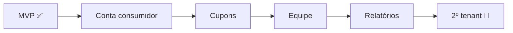
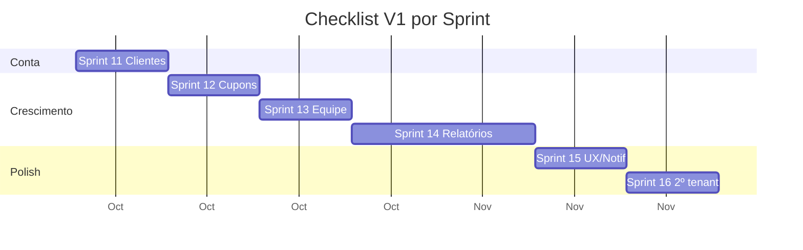
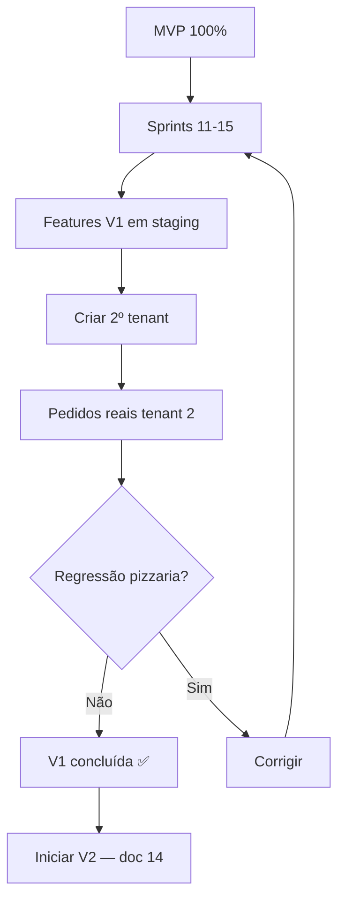

# 13 — Checklist V1

> **Documento:** Checklist de Escopo Fechado da V1  
> **Produto:** Food Service *(nome comercial provisório)*  
> **Versão:** 1.0  
> **Status:** Aprovado  
> **Última atualização:** Julho/2026  
> **Depende de:** `12-checklist-mvp.md` (aprovado), documentos 01–11

---

## Sumário

1. [Visão Geral](#1-visão-geral)
2. [Critérios de Sucesso](#2-critérios-de-sucesso)
3. [Como Usar Este Checklist](#3-como-usar-este-checklist)
4. [Pré-requisito: MVP Completo](#4-pré-requisito-mvp-completo)
5. [Fora do Escopo V1](#5-fora-do-escopo-v1)
6. [Banco de Dados — Novas Tabelas](#6-banco-de-dados--novas-tabelas)
7. [Backend — Módulos e Services](#7-backend--módulos-e-services)
8. [API REST — Novos Endpoints](#8-api-rest--novos-endpoints)
9. [Frontend — Novas Features](#9-frontend--novas-features)
10. [Telas — Novas Screens](#10-telas--novas-screens)
11. [Regras de Negócio Obrigatórias](#11-regras-de-negócio-obrigatórias)
12. [UX e Qualidade](#12-ux-e-qualidade)
13. [Testes Mínimos](#13-testes-mínimos)
14. [Infraestrutura e Documentação](#14-infraestrutura-e-documentação)
15. [Validação com Segundo Cliente](#15-validação-com-segundo-cliente)
16. [Definição de Pronto (DoD)](#16-definição-de-pronto-dod)
17. [Mapa Sprint → Checklist](#17-mapa-sprint--checklist)
18. [Próximos Documentos](#18-próximos-documentos)

---

## 1. Visão Geral

### 1.1 Objetivo

Este documento define o **escopo fechado da V1** do Food Service — tudo que deve existir **após o MVP** e **antes da V2**, para que a plataforma onboard o **2º estabelecimento sem código customizado**.

### 1.2 O que a V1 entrega

| Antes (MVP) | Depois (V1) |
|-------------|-------------|
| Checkout guest apenas | Consumidor com conta, histórico e endereços salvos |
| Sem cupons | Cupons de desconto configuráveis |
| Um operador (owner) | Equipe com perfis e permissões |
| Dashboard básico | Relatórios de vendas e produtos |
| 1 tenant em produção | 2 tenants ativos, onboarding repetível |
| API sem documentação interativa | OpenAPI + Swagger/ReDoc |

### 1.3 Referências Cruzadas

| Documento | O que valida |
|-----------|--------------|
| `01-visao-do-produto.md` | Visão de crescimento SaaS |
| `03-modelagem-do-banco.md` | 3 tabelas novas V1 |
| `07-api.md` | Endpoints §19.1–19.4 + OpenAPI |
| `08-regras-de-negocio.md` | PR-01–11, CL-07, CL-12–14 |
| `09-roadmap.md` | Sprints 11–16 |
| `12-checklist-mvp.md` | Base obrigatória |

### 1.4 Resumo Quantitativo

| Área | MVP | V1 (incremento) | Total acumulado |
|------|-----|-----------------|-----------------|
| Tabelas PostgreSQL | 20 | +3 | 23 |
| Endpoints API | 36 | +~28 | ~64 |
| Telas novas | — | +14 | ~30 |
| Regras de negócio novas | — | +14 | ~192 |
| Sprints | 0–10 | 11–16 | — |
| Tenants em produção | 1 | 2 | — |

---

## 2. Critérios de Sucesso

A V1 está **concluída** quando **todos** os critérios abaixo forem atendidos:

| # | Critério | Como validar |
|---|----------|--------------|
| V1-1 | MVP 100% | `12-checklist-mvp.md` completo |
| V1-2 | 2 tenants ativos | Pizzaria + 2º estabelecimento (ex: hamburgueria ou açaiteria) |
| V1-3 | Onboarding sem código | 2º tenant criado via script/wizard, sem alteração de código |
| V1-4 | Conta do consumidor | Login, histórico e endereços salvos funcionando |
| V1-5 | Cupons operacionais | Dono cria cupom; cliente aplica no checkout |
| V1-6 | Equipe operando | ≥ 2 funcionários com roles diferentes |
| V1-7 | Relatórios úteis | Dono exporta vendas da semana em CSV |
| V1-8 | Checklist 100% | Todas as seções 6–15 marcadas |

---

## 3. Como Usar Este Checklist

### 3.1 Convenções

| Símbolo | Significado |
|---------|-------------|
| `- [ ]` | Pendente |
| `- [x]` | Concluído e validado |
| **P0** | Bloqueante para V1 |
| **P1** | Essencial — deve estar no go-live V1 |
| **P2** | Desejável — pode adiar com justificativa |

### 3.2 Regra de Ouro

> A V1 **não reimplementa** o MVP. Ela **estende** o que já existe. Itens do `12-checklist-mvp.md` permanecem obrigatórios.

### 3.3 Escopo vs. Roadmap

Este checklist segue **Sprints 11–16** (`09-roadmap.md`). Itens mencionados em `01-visao-do-produto.md` mas **ausentes** do roadmap (ex: avaliações, promoções avançadas) estão em [Fora do Escopo V1](#5-fora-do-escopo-v1).

---

## 4. Pré-requisito: MVP Completo

Antes de iniciar a V1, confirmar:

- [ ] **P0** `12-checklist-mvp.md` 100% marcado
- [ ] **P0** ≥ 10 pedidos reais no tenant da pizzaria
- [ ] **P0** Dono opera cardápio e pedidos autonomamente
- [ ] **P0** Produção estável (sem regressões conhecidas P0)
- [ ] **P0** `07-api.md` MVP implementado e testado

---

## 5. Fora do Escopo V1

Itens **explicitamente excluídos** da V1. Implementar qualquer um **invalida** o escopo fechado.

### 5.1 Produto e Funcionalidades

| Item | Fase prevista | Motivo |
|------|---------------|--------|
| Pagamento processado (gateway) | V2 | Sprint 19 |
| Entregadores e rastreamento | V2 | Sprints 17–18 |
| Mapas e áreas de entrega | V2 | Sprint 18 |
| Programa de fidelidade / cashback | V2 | Sprint 20 |
| PDV balcão / QR mesa | V2 | Sprint 21 |
| Estoque e caixa | V2 | Sprint 22 |
| Avaliações pós-pedido | V2+ | Não no roadmap 11–16 |
| Promoções avançadas (combo, desconto por categoria) | V2+ | V1 tem apenas cupons |
| Billing / planos SaaS | V3+ | `09-roadmap.md` §9 |
| Super Admin (painel plataforma) | V3+ | `09-roadmap.md` §9 |
| White-label / domínio próprio | V3+ | `09-roadmap.md` §9 |
| Integração iFood/Rappi | V2+ | `01-visao-do-produto.md` §8.2 |
| App nativo | V2+ | `01-visao-do-produto.md` §8.2 |
| Emissão fiscal | V2+ | `01-visao-do-produto.md` §8.2 |
| Multi-loja (um dono, várias unidades) | V3+ | Backlog |

### 5.2 O que permanece do MVP

| Decisão | Valor |
|---------|-------|
| Guest checkout | **Continua** — conta é opcional |
| Pagamento | Manual na entrega (sem gateway) |
| Tenant | Subdomínio |
| Modelagem genérica | Produto + OptionGroups (sem entidades de nicho) |

---

## 6. Banco de Dados — Novas Tabelas

**Sprint:** 12, 15 | **Prioridade:** P0 | **Ref:** `03-modelagem-do-banco.md` §19.2

### 6.1 Tabelas V1 (+3)

- [ ] **P0** `coupons` — cupons de desconto por tenant
- [ ] **P0** `coupon_usages` — rastreamento de uso por pedido/customer
- [ ] **P1** `notification_logs` — log de e-mails enviados (N-05)

### 6.2 Alterações em Tabelas Existentes

- [ ] **P0** `customers.password_hash` — suporta conta com senha (CL-07)
- [ ] **P0** `customers.total_orders`, `total_spent`, `last_order_at` — métricas (CL-12 a CL-14)
- [ ] **P0** `orders.coupon_id` + `discount_amount` — cupom aplicado (snapshot)
- [ ] **P1** Índices em `coupons.code` (unique por tenant)
- [ ] **P1** Índices em `notification_logs` (tenant, created_at)

### 6.3 Tabelas que NÃO devem existir na V1

- [ ] Confirmado: **sem** `drivers`, `deliveries`
- [ ] Confirmado: **sem** `loyalty_programs`, `loyalty_transactions`
- [ ] Confirmado: **sem** `audit_logs`

---

## 7. Backend — Módulos e Services

**Sprint:** 11–16 | **Prioridade:** P0 | **Ref:** `06-backend.md`

### 7.1 App `accounts` — Customer Auth

- [ ] **P0** `CustomerJWTAuthentication` — auth separada de Employee
- [ ] **P0** `CustomerAuthService`: register, login
- [ ] **P0** JWT claims: `customer_id`, `tenant_id`, `type: customer`
- [ ] **P0** Guest checkout continua sem token
- [ ] **P0** Mesmo telefone: guest → conta vincula customer existente (CL-06, CL-07)

### 7.2 App `customers` — Endereços e Perfil

- [ ] **P0** `CustomerAddressService` — CRUD endereços (CL-08 a CL-11)
- [ ] **P0** Apenas um `is_default = true` por customer (CL-09)
- [ ] **P0** `CustomerService` — incrementar métricas (CL-12 a CL-14)
- [ ] **P0** `CustomerSelector` — listagem admin com filtros

### 7.3 App `promotions` (novo)

- [ ] **P0** Models: Coupon, CouponUsage
- [ ] **P0** `CouponService.validate()` — PR-01 a PR-11
- [ ] **P0** `CouponService.apply()` — desconto no checkout
- [ ] **P0** Incremento atômico de `usage_count` (PR-10)
- [ ] **P0** Admin CRUD de cupons

### 7.4 App `accounts` — Equipe

- [ ] **P0** `EmployeeService` — CRUD funcionários
- [ ] **P0** `EmployeeInviteService` — convite por e-mail com token
- [ ] **P0** Atribuição de roles (owner não pode ser removido sem transferência)
- [ ] **P0** Permissões novas: `customers.view`, `promotions.manage`, `employees.manage`, `reports.view`

### 7.5 App `reports` (novo)

- [ ] **P0** `ReportService.sales_by_period()` — vendas por período
- [ ] **P0** `ReportService.top_products()` — produtos mais vendidos
- [ ] **P0** `ReportService.average_ticket()` — ticket médio
- [ ] **P1** Export CSV (`text/csv`)

### 7.6 App `notifications` (expandir)

- [ ] **P1** E-mail em mudança de status (N-02 expandido)
- [ ] **P1** `notification_logs` persiste tentativas (N-05)
- [ ] **P1** Retry 3x com backoff (N-06)

### 7.7 App `companies` — Onboarding SaaS

- [ ] **P0** `OnboardingService` reutilizável para N tenants
- [ ] **P0** Script CLI: `python manage.py create_tenant --subdomain=...`
- [ ] **P1** Validação de subdomain único e reservados (E-02, E-03)

### 7.8 Integração com Pedidos (ajustes)

- [ ] **P0** Checkout aceita `coupon_code` opcional
- [ ] **P0** Checkout aceita `customer_id` quando autenticado
- [ ] **P0** Endereço salvo pré-preenche checkout (sem FK no pedido — CL-10)
- [ ] **P0** Desconto recalculado no servidor (PR-04, P-06)

---

## 8. API REST — Novos Endpoints

**Sprint:** 11–16 | **Prioridade:** P0 | **Ref:** `07-api.md` §19.1–19.4

> Endpoints MVP (36) permanecem inalterados. Abaixo, apenas **novos** endpoints V1.

### 8.1 Auth — Consumidor

- [ ] **P0** `POST /api/v1/auth/customer/register/`
- [ ] **P0** `POST /api/v1/auth/customer/login/`
- [ ] **P1** `POST /api/v1/auth/customer/refresh/`

### 8.2 Conta — Consumidor (JWT customer)

- [ ] **P0** `GET /api/v1/public/account/me/`
- [ ] **P0** `GET /api/v1/public/account/orders/` — histórico paginado
- [ ] **P0** `GET /api/v1/public/account/orders/{id}/` — detalhe
- [ ] **P0** `GET /api/v1/public/account/addresses/`
- [ ] **P0** `POST /api/v1/public/account/addresses/`
- [ ] **P0** `PATCH /api/v1/public/account/addresses/{id}/`
- [ ] **P0** `DELETE /api/v1/public/account/addresses/{id}/`

### 8.3 Pública — Cupons

- [ ] **P0** `POST /api/v1/public/coupons/validate/` — validar sem criar pedido

### 8.4 Admin — Clientes

- [ ] **P0** `GET /api/v1/admin/customers/` — `customers.view`
- [ ] **P0** `GET /api/v1/admin/customers/{id}/` — detalhe + histórico

### 8.5 Admin — Cupons

- [ ] **P0** `GET /api/v1/admin/coupons/` — `promotions.manage`
- [ ] **P0** `POST /api/v1/admin/coupons/`
- [ ] **P0** `GET /api/v1/admin/coupons/{id}/`
- [ ] **P0** `PATCH /api/v1/admin/coupons/{id}/`
- [ ] **P0** `DELETE /api/v1/admin/coupons/{id}/`

### 8.6 Admin — Funcionários

- [ ] **P0** `GET /api/v1/admin/employees/` — `employees.manage`
- [ ] **P0** `POST /api/v1/admin/employees/`
- [ ] **P0** `GET /api/v1/admin/employees/{id}/`
- [ ] **P0** `PATCH /api/v1/admin/employees/{id}/`
- [ ] **P0** `DELETE /api/v1/admin/employees/{id}/` — soft deactivate
- [ ] **P0** `POST /api/v1/admin/employees/invite/`

### 8.7 Admin — Relatórios

- [ ] **P0** `GET /api/v1/admin/reports/sales/` — `reports.view`
- [ ] **P0** `GET /api/v1/admin/reports/products/` — `reports.view`
- [ ] **P1** `GET /api/v1/admin/reports/sales/export/` — CSV

### 8.8 Documentação OpenAPI

- [ ] **P1** `GET /api/v1/schema/` — OpenAPI JSON (`drf-spectacular`)
- [ ] **P1** `GET /api/v1/docs/` — Swagger UI
- [ ] **P1** `GET /api/v1/redoc/` — ReDoc

### 8.9 Comportamento Transversal V1

- [ ] **P0** Checkout guest continua funcionando sem regressão
- [ ] **P0** Erros de cupom: `COUPON_INVALID`, `COUPON_EXPIRED`, `COUPON_LIMIT_REACHED`
- [ ] **P0** Rate limiting em register/login customer
- [ ] **P1** Changelog API v1.1 documentado em `07-api.md`

**Total novos endpoints V1: ~28** | **Total acumulado: ~64**

---

## 9. Frontend — Novas Features

**Sprint:** 11–16 | **Prioridade:** P0 | **Ref:** `05-frontend.md`

### 9.1 Feature: Customer Auth (Storefront)

- [ ] **P0** Páginas login e cadastro consumidor
- [ ] **P0** `CustomerAuthProvider` + `useCustomerAuth`
- [ ] **P0** Link "Entrar" / "Minha conta" no navbar
- [ ] **P0** Checkout: opção "Continuar como visitante" permanece
- [ ] **P0** Checkout logado: pré-preenche nome, telefone, endereço padrão

### 9.2 Feature: Account (Storefront)

- [ ] **P0** Página perfil (nome, telefone, e-mail)
- [ ] **P0** Histórico de pedidos com link para tracking
- [ ] **P0** CRUD endereços com marcação de padrão
- [ ] **P1** Repetir pedido (re-add itens ao carrinho) — atalho UX

### 9.3 Feature: Coupons (Storefront + Admin)

- [ ] **P0** Campo cupom no checkout com validação em tempo real
- [ ] **P0** Exibir desconto no resumo antes de confirmar
- [ ] **P0** Admin: lista + formulário de cupons
- [ ] **P0** Tipos: fixed e percentage; datas de validade; limites de uso

### 9.4 Feature: Customers (Backoffice)

- [ ] **P0** Lista de clientes com busca (nome, telefone)
- [ ] **P0** Detalhe: métricas, histórico de pedidos, endereços

### 9.5 Feature: Employees (Backoffice)

- [ ] **P0** Lista de funcionários
- [ ] **P0** Formulário criar/editar + atribuição de role
- [ ] **P0** Fluxo de convite por e-mail
- [ ] **P0** UI oculta ações conforme `usePermissions`

### 9.6 Feature: Reports (Backoffice)

- [ ] **P0** Página relatórios com filtro de período
- [ ] **P0** Gráfico ou tabela de vendas por dia
- [ ] **P0** Ranking produtos mais vendidos
- [ ] **P0** KPIs: ticket médio, total período
- [ ] **P1** Botão exportar CSV
- [ ] **P1** Dashboard enriquecido (comparativo vs. período anterior)

### 9.7 Feature: Search e Favoritos (Storefront)

- [ ] **P1** Busca no cardápio (debounce, `?search=` na API)
- [ ] **P1** Página ou modal de resultados
- [ ] **P2** Favoritos — localStorage ou backend simples
- [ ] **P2** Atalho `/` para focar busca (`11-guia-ui-ux.md`)

### 9.8 Feature: PWA

- [ ] **P2** `manifest.json` configurado
- [ ] **P2** Ícones e tema para "Adicionar à tela inicial"
- [ ] **P2** Service worker básico (cache estático)

### 9.9 Feature: Onboarding Wizard (Backoffice)

- [ ] **P0** Wizard pós-primeiro-login: dados empresa → horários → primeiro produto
- [ ] **P1** Checklist de configuração no dashboard ("Complete seu setup")

---

## 10. Telas — Novas Screens

**Sprint:** 11–16 | **Prioridade:** P0 | **Ref:** `11-guia-ui-ux.md`

### 10.1 Storefront (+7 telas)

| # | Tela | Checklist |
|---|------|-----------|
| 17 | Login consumidor | - [ ] **P0** E-mail/telefone + senha |
| 18 | Cadastro consumidor | - [ ] **P0** Nome, telefone, senha, opt-in |
| 19 | Minha conta | - [ ] **P0** Perfil + links para pedidos e endereços |
| 20 | Histórico de pedidos | - [ ] **P0** Lista paginada + status |
| 21 | Endereços | - [ ] **P0** Lista + CRUD + padrão |
| 22 | Busca | - [ ] **P1** Input + resultados |
| 23 | Favoritos | - [ ] **P2** Produtos salvos |

### 10.2 Backoffice (+7 telas)

| # | Tela | Checklist |
|---|------|-----------|
| 24 | Lista de clientes | - [ ] **P0** Busca, métricas resumidas |
| 25 | Detalhe do cliente | - [ ] **P0** Histórico + endereços |
| 26 | Lista de cupons | - [ ] **P0** Status ativo/expirado |
| 27 | Formulário de cupom | - [ ] **P0** Criar/editar regras |
| 28 | Lista de funcionários | - [ ] **P0** Roles visíveis |
| 29 | Formulário / convite funcionário | - [ ] **P0** Criar ou convidar |
| 30 | Relatórios | - [ ] **P0** Filtros + gráficos + export |

**Total acumulado: ~30 telas** (16 MVP + 14 V1)

---

## 11. Regras de Negócio Obrigatórias

**Prioridade:** P0 | **Ref:** `08-regras-de-negocio.md` §19.2

### 11.1 Novas Regras V1

| Domínio | IDs | Qtd | Status |
|---------|-----|-----|--------|
| Clientes (conta) | CL-07 | 1 | - [ ] |
| Clientes (métricas) | CL-12 a CL-14 | 3 | - [ ] |
| Cupons | PR-01 a PR-11 | 11 | - [ ] |
| Notificações (expandido) | N-02, N-05, N-06 | 3 | - [ ] |

**Total novas regras V1: ~18** (demais regras MVP permanecem ativas)

### 11.2 Regras Críticas V1

- [ ] **P0** CL-07: Registro define `password_hash`; login valida senha
- [ ] **P0** CL-10: Endereço no pedido é cópia, não FK
- [ ] **P0** PR-04: Desconto nunca excede subtotal
- [ ] **P0** PR-10: `usage_count` incrementado atomicamente
- [ ] **P0** PR-11: Um cupom por pedido
- [ ] **P0** Guest checkout não quebra com cupom ou conta existente
- [ ] **P0** Employee convidado não acessa tenant de outro convite

### 11.3 Códigos de Erro Novos

- [ ] **P0** `COUPON_INVALID`, `COUPON_EXPIRED`, `COUPON_LIMIT_REACHED`
- [ ] **P0** `COUPON_MIN_ORDER_NOT_MET`
- [ ] **P0** `CUSTOMER_ALREADY_EXISTS`, `INVALID_CREDENTIALS`
- [ ] **P0** `EMPLOYEE_INVITE_EXPIRED`

---

## 12. UX e Qualidade

**Prioridade:** P1 | **Ref:** `11-guia-ui-ux.md`

### 12.1 Storefront — Conta

- [ ] **P0** Login em < 30s (fluxo simples)
- [ ] **P0** Guest checkout permanece em 1 clique
- [ ] **P0** Histórico carrega com skeleton
- [ ] **P1** Repetir pedido em ≤ 3 toques

### 12.2 Storefront — Cupons

- [ ] **P0** Feedback imediato ao validar cupom
- [ ] **P0** Desconto visível no resumo antes de confirmar
- [ ] **P0** Mensagem clara quando cupom inválido

### 12.3 Backoffice — Equipe

- [ ] **P0** Operador vê apenas menus permitidos
- [ ] **P0** Convite com instruções claras no e-mail

### 12.4 Backoffice — Relatórios

- [ ] **P0** Filtro de período intuitivo (hoje, 7 dias, 30 dias, custom)
- [ ] **P1** Export CSV em 1 clique
- [ ] **P1** Dados consistentes com dashboard

### 12.5 Notificações

- [ ] **P1** E-mail de status legível em mobile
- [ ] **P1** Cliente pode desabilitar e-mails de status (settings tenant)

### 12.6 Multi-Tenant

- [ ] **P0** Storefront do tenant B não exibe dados do tenant A
- [ ] **P0** Cupom do tenant A inválido no tenant B
- [ ] **P0** Funcionário do tenant A não loga no tenant B

---

## 13. Testes Mínimos

**Prioridade:** P0 | **Ref:** `10-padroes-de-codigo.md` §12

### 13.1 Backend (pytest) — Novos

- [ ] **P0** `CouponService.validate` — válido, expirado, limite atingido, min order
- [ ] **P0** `CouponService.apply` — fixed, percentage, max_discount
- [ ] **P0** `CustomerAuthService` — register, login, telefone duplicado
- [ ] **P0** `CustomerAddressService` — CRUD, único default
- [ ] **P0** Checkout com cupom — desconto correto no total
- [ ] **P0** Checkout guest + cupom — sem regressão
- [ ] **P0** `ReportService` — agregações por período
- [ ] **P0** `EmployeeInviteService` — token expira
- [ ] **P0** Tenant isolation — cupons, customers, employees

### 13.2 Cobertura

- [ ] **P1** pytest-cov ≥ 60% em services (`09-roadmap.md` §10.1)

### 13.3 E2E Manual (Sprint 16)

- [ ] **P0** Cadastro → login → pedido → histórico
- [ ] **P0** Cupom `TESTE10` aplicado com sucesso
- [ ] **P0** Convidar atendente → login com role operator
- [ ] **P0** Relatório semanal bate com pedidos do período
- [ ] **P0** Criar 2º tenant → cardápio independente → pedido isolado

---

## 14. Infraestrutura e Documentação

**Sprint:** 15–16 | **Prioridade:** P1

### 14.1 Infraestrutura

- [ ] **P0** 2º subdomínio em produção (ex: `hamburgueria-maria.foodservice.app`)
- [ ] **P0** Wildcard DNS continua funcionando
- [ ] **P1** E-mail transacional configurado (status + convites)
- [ ] **P1** Storage de uploads isolado por tenant (path prefix)

### 14.2 Documentação

- [ ] **P0** `07-api.md` atualizado com endpoints V1
- [ ] **P1** OpenAPI publicada em `/api/v1/docs/`
- [ ] **P0** README: como criar novo tenant
- [ ] **P1** Runbook: onboarding 2º cliente

### 14.3 CI/CD

- [ ] **P0** Testes V1 no pipeline CI
- [ ] **P1** Deploy staging antes de produção

---

## 15. Validação com Segundo Cliente

**Sprint:** 16 | **Prioridade:** P0

### 15.1 Onboarding do 2º Tenant

- [ ] **P0** Tenant criado via script/wizard (sem código custom)
- [ ] **P0** Cardápio do 2º segmento configurado (não pizza — ex: hambúrguer ou açaí)
- [ ] **P0** Produtos com option groups do novo segmento
- [ ] **P0** ≥ 3 pedidos reais no 2º tenant
- [ ] **P0** Dono do 2º tenant opera autonomamente

### 15.2 Métricas de Validação V1

| Métrica | Meta | Status |
|---------|------|--------|
| Tenants ativos | 2 | - [ ] |
| Pedidos no 2º tenant | ≥ 3 | - [ ] |
| Funcionários com roles distintos | ≥ 2 | - [ ] |
| Cupom usado com sucesso | ≥ 1 | - [ ] |
| Cliente com conta + 2º pedido | ≥ 1 | - [ ] |
| Relatório exportado | ≥ 1 | - [ ] |
| Regressão MVP (pizzaria) | 0 bugs P0 | - [ ] |

### 15.3 Registro dos Tenants V1

| Tenant | Subdomínio | Segmento | Pedidos | Status |
|--------|------------|----------|---------|--------|
| Pizzaria (MVP) | `pizzaria-joao` | Pizza | ≥ 10 | - [ ] Ativo |
| 2º cliente | | Hamburgueria / Açaí / outro | ≥ 3 | - [ ] Ativo |

---

## 16. Definição de Pronto (DoD)

Uma funcionalidade V1 está **pronta** quando:

- [ ] MVP correspondente continua funcionando (sem regressão)
- [ ] Implementada conforme `10-padroes-de-codigo.md`
- [ ] Endpoint documentado em `07-api.md`
- [ ] Regras V1 cobertas no service
- [ ] Testes mínimos passando
- [ ] UI conforme design system e guia UX
- [ ] Item marcado neste checklist
- [ ] Testado em ≥ 1 tenant; multi-tenant validado no Sprint 16

---

## 17. Mapa Sprint → Checklist

| Sprint | Foco | Seções do checklist |
|--------|------|---------------------|
| 11 | Clientes e conta | §7.1–7.2, §8.1–8.2, §8.4, §9.1–9.2, telas 17–21 |
| 12 | Cupons | §6.1, §7.3, §8.3, §8.5, §9.3, telas 26–27 |
| 13 | Funcionários | §7.4, §8.6, §9.5, telas 28–29 |
| 14 | Relatórios | §7.5, §8.7, §9.6, tela 30 |
| 15 | Notificações e polish | §7.6, §9.7–9.8, telas 22–23 |
| 16 | 2º tenant + OpenAPI | §7.7, §8.8, §9.9, §14–15 |

---

## 18. Próximos Documentos

| # | Documento | Relação |
|---|-----------|---------|
| 14 | `14-checklist-v2.md` | Escopo V2 (entrega, pagamento, fidelidade) |
| 15 | `15-futuras-funcionalidades.md` | Backlog V3+ |

---

## Histórico de Revisões

| Versão | Data | Autor | Alterações |
|--------|------|-------|------------|
| 1.0 | Jul/2026 | — | Versão inicial — aprovado |

---

## Apêndice A — Contagem Consolidada

| Categoria | MVP | V1 novo | Total |
|-----------|-----|---------|-------|
| Tabelas | 20 | +3 | 23 |
| Endpoints | 36 | +~28 | ~64 |
| Telas | 16 | +14 | ~30 |
| Regras | ~178 | +~18 | ~196 |
| Tenants produção | 1 | +1 | 2 |

## Apêndice B — Mapa de Endpoints V1 (resumo)

| # | Método | Endpoint | Auth | Permissão |
|---|--------|----------|------|-----------|
| 37 | POST | `/auth/customer/register/` | — | — |
| 38 | POST | `/auth/customer/login/` | — | — |
| 39 | GET | `/public/account/me/` | Customer JWT | — |
| 40 | GET | `/public/account/orders/` | Customer JWT | — |
| 41 | GET | `/public/account/orders/{id}/` | Customer JWT | — |
| 42 | GET | `/public/account/addresses/` | Customer JWT | — |
| 43 | POST | `/public/account/addresses/` | Customer JWT | — |
| 44 | PATCH | `/public/account/addresses/{id}/` | Customer JWT | — |
| 45 | DELETE | `/public/account/addresses/{id}/` | Customer JWT | — |
| 46 | POST | `/public/coupons/validate/` | — | — |
| 47 | GET | `/admin/customers/` | JWT | `customers.view` |
| 48 | GET | `/admin/customers/{id}/` | JWT | `customers.view` |
| 49–53 | CRUD | `/admin/coupons/` | JWT | `promotions.manage` |
| 54–59 | CRUD+ | `/admin/employees/` + invite | JWT | `employees.manage` |
| 60 | GET | `/admin/reports/sales/` | JWT | `reports.view` |
| 61 | GET | `/admin/reports/products/` | JWT | `reports.view` |
| 62 | GET | `/admin/reports/sales/export/` | JWT | `reports.view` |
| 63–65 | GET | `/schema/`, `/docs/`, `/redoc/` | — | — |

## Apêndice C — Fluxo de Validação V1

---

> **Documento aprovado.** Próximo: `14-checklist-v2.md`.
