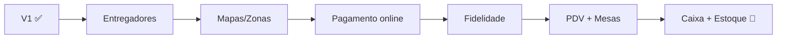
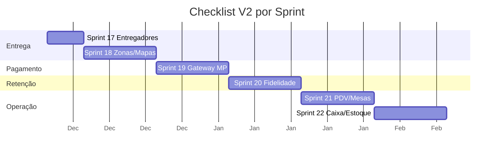
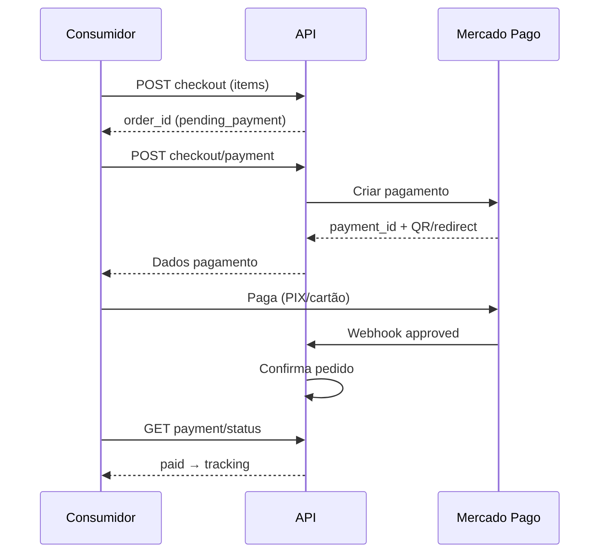
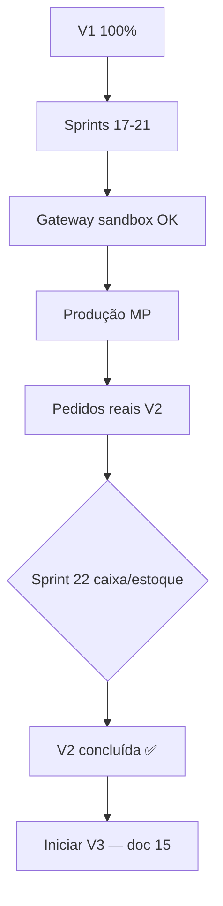

# 14 — Checklist V2

> **Documento:** Checklist de Escopo Fechado da V2  
> **Produto:** Food Service *(nome comercial provisório)*  
> **Versão:** 1.0  
> **Status:** Aprovado  
> **Última atualização:** Julho/2026  
> **Depende de:** `13-checklist-v1.md` (aprovado), documentos 01–11

---

## Sumário

1. [Visão Geral](#1-visão-geral)
2. [Critérios de Sucesso](#2-critérios-de-sucesso)
3. [Como Usar Este Checklist](#3-como-usar-este-checklist)
4. [Pré-requisito: V1 Completa](#4-pré-requisito-v1-completa)
5. [Fora do Escopo V2](#5-fora-do-escopo-v2)
6. [Banco de Dados — Novas Tabelas](#6-banco-de-dados--novas-tabelas)
7. [Backend — Módulos e Services](#7-backend--módulos-e-services)
8. [API REST — Novos Endpoints](#8-api-rest--novos-endpoints)
9. [Frontend — Novas Features](#9-frontend--novas-features)
10. [Telas — Novas Screens](#10-telas--novas-screens)
11. [Regras de Negócio Obrigatórias](#11-regras-de-negócio-obrigatórias)
12. [UX e Qualidade](#12-ux-e-qualidade)
13. [Testes Mínimos](#13-testes-mínimos)
14. [Infraestrutura e Compliance](#14-infraestrutura-e-compliance)
15. [Validação em Produção](#15-validação-em-produção)
16. [Definição de Pronto (DoD)](#16-definição-de-pronto-dod)
17. [Mapa Sprint → Checklist](#17-mapa-sprint--checklist)
18. [Próximos Documentos](#18-próximos-documentos)

---

## 1. Visão Geral

### 1.1 Objetivo

Este documento define o **escopo fechado da V2** do Food Service — tudo que deve existir **após a V1** e **antes da V3**, focado em **ferramentas de crescimento e operação avançada**: entrega, pagamento online, fidelidade, PDV e controle operacional básico.

### 1.2 O que a V2 entrega

| Antes (V1) | Depois (V2) |
|------------|---------------|
| Entrega sem rastreamento | Entregadores, atribuição e status de entrega |
| Taxa de entrega fixa | Áreas de entrega e taxas por zona/distância |
| Pagamento só na entrega | PIX e cartão online (Mercado Pago) |
| Sem retenção | Programa de pontos e resgate no checkout |
| Só pedidos online | PDV balcão + QR Code mesa (`dine_in`) |
| Sem controle de caixa/estoque | Caixa (abertura/fechamento/sangria) + estoque básico |

### 1.3 Referências Cruzadas

| Documento | O que valida |
|-----------|--------------|
| `01-visao-do-produto.md` | Escopo V2+ (§8.2, §9) |
| `03-modelagem-do-banco.md` | Tabelas §10, §13, §19.3 |
| `07-api.md` | Endpoints §19.5–19.6 |
| `08-regras-de-negocio.md` | D-01–05, PG-11–14 |
| `09-roadmap.md` | Sprints 17–22 |
| `13-checklist-v1.md` | Base obrigatória |

### 1.4 Resumo Quantitativo

| Área | V1 acumulado | V2 (incremento) | Total acumulado |
|------|--------------|-----------------|-----------------|
| Tabelas PostgreSQL | 23 | +~10 | ~33 |
| Endpoints API | ~64 | +~35 | ~99 |
| Telas novas | — | +~13 | ~43 |
| Regras novas | — | +~20 | ~216 |
| Sprints | 11–16 | 17–22 | — |

---

## 2. Critérios de Sucesso

A V2 está **concluída** quando **todos** os critérios abaixo forem atendidos:

| # | Critério | Como validar |
|---|----------|--------------|
| V2-1 | V1 100% | `13-checklist-v1.md` completo |
| V2-2 | Pagamento online | ≥ 1 pedido pago via PIX ou cartão (Mercado Pago) |
| V2-3 | Entrega operacional | Entregador atribuído; status até `delivered` |
| V2-4 | Fidelidade ativa | Cliente acumula e resgata pontos em pedido real |
| V2-5 | PDV funcional | Pedido criado no balcão (`source = backoffice`) |
| V2-6 | QR mesa | Pedido `dine_in` via QR de mesa |
| V2-7 | Caixa | Abertura, sangria e fechamento registrados |
| V2-8 | Checklist 100% | Todas as seções 6–15 marcadas |

---

## 3. Como Usar Este Checklist

### 3.1 Convenções

| Símbolo | Significado |
|---------|-------------|
| `- [ ]` | Pendente |
| `- [x]` | Concluído e validado |
| **P0** | Bloqueante para V2 |
| **P1** | Essencial — go-live V2 |
| **P2** | Desejável — pode adiar com justificativa |

### 3.2 Regra de Ouro

> A V2 **estende** MVP + V1. Pagamento manual na entrega **permanece** como opção — gateway é **adicional**, não substituto obrigatório.

### 3.3 Escopo vs. Roadmap

Este checklist segue **Sprints 17–22** (`09-roadmap.md`). Rastreamento GPS em tempo real (D-05 completo) é **P2** — mapa estático e status bastam para go-live.

---

## 4. Pré-requisito: V1 Completa

Antes de iniciar a V2, confirmar:

- [ ] **P0** `13-checklist-v1.md` 100% marcado
- [ ] **P0** 2 tenants ativos em produção
- [ ] **P0** Cupons, conta consumidor e relatórios estáveis
- [ ] **P0** Sem regressões P0 conhecidas em MVP/V1
- [ ] **P0** Conta Mercado Pago (ou sandbox) para desenvolvimento

---

## 5. Fora do Escopo V2

Itens **explicitamente excluídos** da V2.

### 5.1 Produto e Funcionalidades

| Item | Fase prevista | Motivo |
|------|---------------|--------|
| Billing / planos SaaS | V3 | `09-roadmap.md` §9 |
| Super Admin (painel plataforma) | V3 | `09-roadmap.md` §9 |
| White-label / domínio próprio | V3 | `09-roadmap.md` §9 |
| Multi-loja (um dono, N unidades) | V3 | Backlog |
| App nativo iOS/Android | V3–V4 | `09-roadmap.md` §9 |
| Integração iFood/Rappi | V3+ | Contratos de parceiro |
| Emissão fiscal (NF-e/NFC-e) | V3+ | Regulatório |
| Estoque avançado (BOM, receitas) | V3+ | Complexidade |
| Marketplace entre estabelecimentos | Futuro | Modelo diferente |
| Rastreamento GPS ao vivo (motorista) | V3+ | D-05 completo |
| Múltiplos gateways (Stripe, PagSeguro) | V3+ | V2 = Mercado Pago apenas |
| Avaliações pós-pedido | V3+ | Não no roadmap 17–22 |
| WhatsApp/SMS notificações | V3+ | V2 mantém e-mail |

### 5.2 O que permanece

| Decisão | Valor |
|---------|-------|
| Pagamento na entrega | **Continua** disponível |
| Guest checkout | **Continua** |
| Modelagem genérica | Produto + OptionGroups |
| Tenant por subdomínio | **Continua** |

---

## 6. Banco de Dados — Novas Tabelas

**Sprint:** 17–22 | **Prioridade:** P0 | **Ref:** `03-modelagem-do-banco.md` §10, §13, §19.3

### 6.1 Tabelas documentadas (+5)

- [ ] **P0** `drivers` — entregadores por tenant
- [ ] **P0** `deliveries` — vínculo pedido ↔ entregador + status
- [ ] **P0** `loyalty_programs` — configuração do programa
- [ ] **P0** `loyalty_transactions` — earn/redeem/expire
- [ ] **P1** `audit_logs` — auditoria de ações críticas

### 6.2 Tabelas complementares V2 (+~5)

> Não detalhadas no doc 03 — definidas aqui para escopo fechado.

- [ ] **P0** `delivery_zones` — áreas/bairros com taxa e disponibilidade
- [ ] **P0** `dining_tables` — mesas com QR token (`table_number`, `qr_code`)
- [ ] **P1** `inventory_items` — insumos básicos (nome, unidade, quantidade)
- [ ] **P1** `stock_movements` — entrada/saída/ajuste
- [ ] **P1** `cash_sessions` — abertura/fechamento de caixa
- [ ] **P1** `cash_movements` — sangria, suprimento, vendas

### 6.3 Alterações em Tabelas Existentes

- [ ] **P0** `company_settings.accepts_dine_in = true` habilitável
- [ ] **P0** `company_settings.payment_gateway_*` — credenciais Mercado Pago (encrypted)
- [ ] **P0** `company_settings.require_online_payment` — PG-13 (configurável)
- [ ] **P0** `order_payments.gateway_transaction_id`, `gateway_data` — em uso
- [ ] **P0** `orders.source = backoffice` para PDV
- [ ] **P0** `orders.delivery_type = dine_in` + `table_id` (FK opcional)
- [ ] **P0** `orders.loyalty_points_earned`, `loyalty_points_redeemed`
- [ ] **P1** `customers.loyalty_balance` (cache denormalizado)

### 6.4 Enums novos ou expandidos

- [ ] **P0** `payment_method`: adicionar `pix_online`, `credit_card_online`
- [ ] **P0** `delivery_status`: `pending`, `assigned`, `picked_up`, `delivered`
- [ ] **P0** `order_source`: `backoffice` em uso ativo

---

## 7. Backend — Módulos e Services

**Sprint:** 17–22 | **Prioridade:** P0 | **Ref:** `06-backend.md`

### 7.1 App `delivery` (novo)

- [ ] **P0** Models: Driver, Delivery
- [ ] **P0** `DriverService` — CRUD entregadores
- [ ] **P0** `DeliveryService.assign_driver()` — D-02, D-03
- [ ] **P0** `DeliveryService.update_status()` — D-04
- [ ] **P0** Criação automática de `Delivery` em pedidos `delivery_type = delivery`
- [ ] **P1** `DeliveryZoneService` — CRUD zonas, cálculo de taxa

### 7.2 App `delivery` — Zonas e Mapas (Sprint 18)

- [ ] **P0** Model `DeliveryZone` (nome, polígono ou bairros, fee)
- [ ] **P0** Validação: endereço dentro da zona de entrega
- [ ] **P1** Integração geocoding (Google Maps ou Nominatim/OSM)
- [ ] **P2** Cálculo de distância/taxa dinâmica (OSRM)
- [ ] **P1** `DeliveryFeeCalculator` — zona fixa ou distância

### 7.3 App `payments` — Gateway (novo módulo ou expandir)

- [ ] **P0** Port `PaymentGatewayPort` (interface)
- [ ] **P0** Adapter `MercadoPagoGateway` — PIX + cartão
- [ ] **P0** `PaymentService.initiate_online_payment()` — PG-11
- [ ] **P0** `PaymentService.handle_webhook()` — PG-12
- [ ] **P0** Idempotência em webhooks (evitar duplo processamento)
- [ ] **P0** `PaymentService.refund()` — PG-14 (básico)
- [ ] **P0** Fluxo configurável: pagar antes vs. pagar na entrega (PG-13)
- [ ] **P0** Credenciais por tenant (sandbox + produção)

### 7.4 App `loyalty` (novo)

- [ ] **P0** Models: LoyaltyProgram, LoyaltyTransaction
- [ ] **P0** `LoyaltyService.earn_points()` — ao completar pedido
- [ ] **P0** `LoyaltyService.redeem_points()` — no checkout
- [ ] **P0** `LoyaltyService.get_balance()` — saldo do customer
- [ ] **P0** Regras: pontos por R$ gasto, mínimo para resgate, expiração (configurável)
- [ ] **P1** Cashback como alternativa a pontos (settings)

### 7.5 App `orders` — PDV e Dine-in (expandir)

- [ ] **P0** `OrderService.create_from_pdv()` — `source = backoffice`
- [ ] **P0** PDV sem exigir dados completos de customer (balcão rápido)
- [ ] **P0** `OrderService.create_from_table()` — `delivery_type = dine_in`
- [ ] **P0** QR token de mesa valida tenant + mesa ativa
- [ ] **P0** Status flow dine-in: pending → confirmed → preparing → ready → completed

### 7.6 App `inventory` (novo — Sprint 22)

- [ ] **P1** Models: InventoryItem, StockMovement
- [ ] **P1** `InventoryService` — CRUD insumos, ajuste de quantidade
- [ ] **P2** Baixa automática por pedido (receita futura — manual no V2)

### 7.7 App `cash` (novo — Sprint 22)

- [ ] **P1** Models: CashSession, CashMovement
- [ ] **P1** `CashService.open_session()` — abertura com valor inicial
- [ ] **P1** `CashService.register_sangria()` — retirada
- [ ] **P1** `CashService.close_session()` — conferência e fechamento
- [ ] **P1** Vincular pagamentos `cash` à sessão aberta

### 7.8 App `audit` (novo)

- [ ] **P1** Model `AuditLog` — quem, o quê, quando, tenant
- [ ] **P1** Registrar: mudança de status, pagamento, sangria, estorno

### 7.9 Permissões novas

- [ ] **P0** `delivery.manage` — entregadores e atribuição
- [ ] **P0** `payments.gateway` — configurar Mercado Pago
- [ ] **P0** `loyalty.manage` — programa de fidelidade
- [ ] **P0** `pdv.operate` — criar pedidos no balcão
- [ ] **P1** `inventory.manage` — estoque
- [ ] **P1** `cash.manage` — caixa

---

## 8. API REST — Novos Endpoints

**Sprint:** 17–22 | **Prioridade:** P0 | **Ref:** `07-api.md` §19.5–19.6

> Endpoints MVP + V1 permanecem. Abaixo, **novos** endpoints V2.

### 8.1 Admin — Entregadores

- [ ] **P0** `GET /api/v1/admin/drivers/` — `delivery.manage`
- [ ] **P0** `POST /api/v1/admin/drivers/`
- [ ] **P0** `GET /api/v1/admin/drivers/{id}/`
- [ ] **P0** `PATCH /api/v1/admin/drivers/{id}/`
- [ ] **P0** `DELETE /api/v1/admin/drivers/{id}/` — desativar

### 8.2 Admin — Entrega (pedidos)

- [ ] **P0** `PATCH /api/v1/admin/orders/{id}/delivery/` — atribuir entregador / status
- [ ] **P0** `GET /api/v1/admin/deliveries/` — lista entregas ativas

### 8.3 Admin — Zonas de Entrega

- [ ] **P0** `GET /api/v1/admin/delivery-zones/`
- [ ] **P0** `POST /api/v1/admin/delivery-zones/`
- [ ] **P0** `PATCH /api/v1/admin/delivery-zones/{id}/`
- [ ] **P0** `DELETE /api/v1/admin/delivery-zones/{id}/`

### 8.4 Pública — Entrega

- [ ] **P0** `POST /api/v1/public/delivery/quote/` — taxa e disponibilidade por endereço
- [ ] **P1** `GET /api/v1/public/orders/{id}/tracking/` — status + coordenadas (se disponível)

### 8.5 Pública — Pagamento Online

- [ ] **P0** `POST /api/v1/public/orders/checkout/payment/` — iniciar PIX/cartão
- [ ] **P0** `GET /api/v1/public/orders/{id}/payment/status/` — polling status
- [ ] **P0** `POST /api/v1/webhooks/mercadopago/` — webhook (sem auth; validação assinatura)

### 8.6 Admin — Gateway

- [ ] **P0** `GET /api/v1/admin/settings/payment-gateway/`
- [ ] **P0** `PATCH /api/v1/admin/settings/payment-gateway/`
- [ ] **P0** `POST /api/v1/admin/orders/{id}/refund/` — estorno

### 8.7 Admin + Pública — Fidelidade

- [ ] **P0** `GET /api/v1/admin/loyalty/` — configuração
- [ ] **P0** `PATCH /api/v1/admin/loyalty/`
- [ ] **P0** `GET /api/v1/public/account/loyalty/` — saldo (customer JWT)
- [ ] **P0** `POST /api/v1/public/loyalty/quote/` — simular resgate no checkout

### 8.8 Admin — PDV

- [ ] **P0** `POST /api/v1/admin/orders/pdv/` — criar pedido balcão
- [ ] **P0** `GET /api/v1/admin/orders/pdv/quick-products/` — atalhos PDV

### 8.9 Admin + Pública — Mesas (Dine-in)

- [ ] **P0** `GET /api/v1/admin/tables/`
- [ ] **P0** `POST /api/v1/admin/tables/`
- [ ] **P0** `PATCH /api/v1/admin/tables/{id}/`
- [ ] **P0** `DELETE /api/v1/admin/tables/{id}/`
- [ ] **P0** `GET /api/v1/public/tables/{qr_token}/` — contexto da mesa (storefront)

### 8.10 Admin — Estoque

- [ ] **P1** `GET /api/v1/admin/inventory/`
- [ ] **P1** `POST /api/v1/admin/inventory/`
- [ ] **P1** `PATCH /api/v1/admin/inventory/{id}/`
- [ ] **P1** `POST /api/v1/admin/inventory/{id}/movements/`

### 8.11 Admin — Caixa

- [ ] **P1** `GET /api/v1/admin/cash/sessions/current/`
- [ ] **P1** `POST /api/v1/admin/cash/sessions/open/`
- [ ] **P1** `POST /api/v1/admin/cash/sessions/{id}/close/`
- [ ] **P1** `POST /api/v1/admin/cash/sessions/{id}/sangria/`
- [ ] **P1** `GET /api/v1/admin/cash/sessions/` — histórico

**Total novos endpoints V2: ~35** | **Total acumulado: ~99**

---

## 9. Frontend — Novas Features

**Sprint:** 17–22 | **Prioridade:** P0 | **Ref:** `05-frontend.md`, `11-guia-ui-ux.md`

### 9.1 Feature: Delivery (Backoffice)

- [ ] **P0** CRUD entregadores
- [ ] **P0** Atribuir entregador no detalhe do pedido
- [ ] **P0** Lista de entregas em andamento
- [ ] **P0** Status de entrega visível no pedido

### 9.2 Feature: Delivery Zones (Backoffice + Storefront)

- [ ] **P0** Configuração de zonas/bairros e taxas
- [ ] **P0** Checkout: validação de endereço na zona
- [ ] **P0** Exibir taxa calculada antes de confirmar
- [ ] **P1** Mapa de visualização das zonas (admin)

### 9.3 Feature: Online Payment (Storefront)

- [ ] **P0** Opção PIX online e cartão no checkout
- [ ] **P0** Tela/aguardo pagamento PIX (QR code MP)
- [ ] **P0** Redirect ou embedded checkout cartão
- [ ] **P0** Polling até confirmação ou timeout
- [ ] **P0** Fallback claro se pagamento falhar
- [ ] **P0** Pagamento manual continua disponível

### 9.4 Feature: Payment Gateway (Backoffice)

- [ ] **P0** Configurar credenciais Mercado Pago
- [ ] **P0** Toggle: exigir pagamento online vs. opcional
- [ ] **P0** Ação de estorno no detalhe do pedido

### 9.5 Feature: Loyalty

- [ ] **P0** Admin: configurar programa (pontos/R$, mínimo resgate)
- [ ] **P0** Storefront: saldo de pontos na conta
- [ ] **P0** Checkout: resgatar pontos (desconto)
- [ ] **P1** Histórico de transações de pontos

### 9.6 Feature: PDV (Backoffice)

- [ ] **P0** Tela PDV — grid de produtos rápidos
- [ ] **P0** Carrinho simplificado + finalizar
- [ ] **P0** Seleção forma de pagamento
- [ ] **P0** Impressão/comprovante (browser print)
- [ ] **P1** Atalhos de teclado (busca, quantidade)

### 9.7 Feature: Dine-in / QR Mesa

- [ ] **P0** Admin: CRUD mesas + gerar QR
- [ ] **P0** Download/impressão QR por mesa
- [ ] **P0** Storefront: rota `/mesa/{token}` — cardápio com contexto
- [ ] **P0** Pedido dine-in sem endereço de entrega
- [ ] **P0** Admin: pedidos dine-in destacados (número da mesa)

### 9.8 Feature: Tracking Avançado (Storefront)

- [ ] **P0** Status `out_for_delivery` com entregador (nome)
- [ ] **P1** Mapa estático com endereço de entrega
- [ ] **P2** Mapa com posição do entregador (GPS futuro)

### 9.9 Feature: Inventory + Cash (Backoffice)

- [ ] **P1** Lista de insumos + ajuste de estoque
- [ ] **P1** Fluxo abertura de caixa no início do expediente
- [ ] **P1** Sangria com motivo
- [ ] **P1** Fechamento com conferência (esperado vs. contado)

---

## 10. Telas — Novas Screens

**Sprint:** 17–22 | **Prioridade:** P0

### 10.1 Storefront (+4 telas)

| # | Tela | Checklist |
|---|------|-----------|
| 31 | Pagamento online | - [ ] **P0** PIX QR / cartão + aguardo |
| 32 | Tracking avançado | - [ ] **P1** Mapa + entregador |
| 33 | Mesa (QR) | - [ ] **P0** Cardápio com badge da mesa |
| 34 | Fidelidade (conta) | - [ ] **P0** Saldo + histórico de pontos |

### 10.2 Backoffice (+9 telas)

| # | Tela | Checklist |
|---|------|-----------|
| 35 | Entregadores | - [ ] **P0** Lista + CRUD |
| 36 | Zonas de entrega | - [ ] **P0** Mapa/lista + taxas |
| 37 | Config. pagamento | - [ ] **P0** Mercado Pago + toggles |
| 38 | Fidelidade | - [ ] **P0** Regras do programa |
| 39 | PDV | - [ ] **P0** Venda balcão |
| 40 | Mesas / QR | - [ ] **P0** CRUD + impressão QR |
| 41 | Estoque | - [ ] **P1** Insumos + movimentações |
| 42 | Caixa | - [ ] **P1** Sessão aberta + sangria |
| 43 | Fechamento caixa | - [ ] **P1** Conferência final |

**Total acumulado: ~43 telas** (30 V1 + 13 V2)

---

## 11. Regras de Negócio Obrigatórias

**Prioridade:** P0 | **Ref:** `08-regras-de-negocio.md` §10.3, §15, §19.3

### 11.1 Novas Regras V2

| Domínio | IDs | Qtd | Status |
|---------|-----|-----|--------|
| Entrega | D-01 a D-05 | 5 | - [ ] |
| Pagamento gateway | PG-11 a PG-14 | 4 | - [ ] |
| Pedidos (PDV/dine-in) | PD-04 expandido | 1 | - [ ] |
| Fidelidade | LY-01 a LY-10 *(novas)* | ~10 | - [ ] |

### 11.2 Regras de Fidelidade (LY — definidas para V2)

| ID | Regra |
|----|-------|
| LY-01 | Um programa ativo por tenant |
| LY-02 | Pontos ganhos apenas em pedidos `completed` |
| LY-03 | `points = floor(order.total × points_per_currency)` |
| LY-04 | Resgate reduz total antes de taxa de entrega (configurável) |
| LY-05 | Saldo nunca negativo |
| LY-06 | Transação `redeem` registrada antes de confirmar pedido |
| LY-07 | Estorno de pedido reverte pontos ganhos |
| LY-08 | Guest sem conta não acumula pontos |
| LY-09 | Mínimo de pontos para resgate configurável |
| LY-10 | Pontos expiram após N dias (null = sem expiração) |

### 11.3 Regras Críticas V2

- [ ] **P0** D-03: Atribuição só em `ready` ou `out_for_delivery`
- [ ] **P0** D-04: Transições válidas de `delivery.status`
- [ ] **P0** PG-12: Webhook idempotente — mesmo `payment_id` não processa 2x
- [ ] **P0** PG-13: Se `require_online_payment`, pedido não confirma sem `paid`
- [ ] **P0** Endereço fora da zona → `DELIVERY_ZONE_UNAVAILABLE`
- [ ] **P0** PDV: operador com `pdv.operate` apenas
- [ ] **P0** Mesa inativa → QR retorna 404

### 11.4 Códigos de Erro Novos

- [ ] **P0** `DELIVERY_ZONE_UNAVAILABLE`, `DRIVER_UNAVAILABLE`
- [ ] **P0** `PAYMENT_FAILED`, `PAYMENT_EXPIRED`, `PAYMENT_ALREADY_PROCESSED`
- [ ] **P0** `INSUFFICIENT_LOYALTY_POINTS`
- [ ] **P0** `CASH_SESSION_NOT_OPEN`, `CASH_SESSION_ALREADY_OPEN`
- [ ] **P0** `TABLE_NOT_FOUND`, `TABLE_INACTIVE`

---

## 12. UX e Qualidade

**Prioridade:** P1 | **Ref:** `11-guia-ui-ux.md`

### 12.1 Pagamento Online

- [ ] **P0** PIX: QR visível em mobile + copia-e-cola
- [ ] **P0** Feedback claro: aguardando, aprovado, expirado, recusado
- [ ] **P0** Não perder carrinho se pagamento expirar
- [ ] **P1** Tempo restante para pagar PIX visível

### 12.2 Entrega

- [ ] **P0** Cliente vê quando pedido saiu para entrega
- [ ] **P0** Operador atribui entregador em 2 cliques
- [ ] **P1** Mapa legível em mobile (tracking)

### 12.3 PDV

- [ ] **P0** Venda balcão em < 1 min para pedido simples
- [ ] **P0** Touch-friendly (botões grandes)
- [ ] **P1** Teclado numérico para quantidade

### 12.4 QR Mesa

- [ ] **P0** QR abre cardápio em < 3s
- [ ] **P0** Número da mesa sempre visível
- [ ] **P0** Sem confusão com pedido delivery

### 12.5 Fidelidade

- [ ] **P0** Saldo visível antes do resgate
- [ ] **P0** Desconto por pontos claro no resumo

---

## 13. Testes Mínimos

**Prioridade:** P0 | **Ref:** `10-padroes-de-codigo.md` §12

### 13.1 Backend (pytest)

- [ ] **P0** `DeliveryService.assign_driver` — status válidos e inválidos
- [ ] **P0** `DeliveryZoneService` — endereço dentro/fora da zona
- [ ] **P0** `MercadoPagoGateway` — mock de create payment + webhook
- [ ] **P0** Webhook idempotente — mesmo evento 2x
- [ ] **P0** `LoyaltyService.earn` e `redeem` — saldo correto
- [ ] **P0** `OrderService.create_from_pdv` — source backoffice
- [ ] **P0** QR mesa — token válido/inválido
- [ ] **P1** `CashService` — abertura, sangria, fechamento
- [ ] **P1** `InventoryService` — movimentação ajusta quantidade
- [ ] **P0** Regressão: checkout manual + cupom + guest

### 13.2 Integração Mercado Pago

- [ ] **P0** Sandbox: PIX aprovado end-to-end
- [ ] **P0** Sandbox: cartão aprovado e recusado
- [ ] **P0** Webhook com assinatura inválida → 401

### 13.3 E2E Manual (Sprint 22)

- [ ] **P0** Pedido delivery com entregador até `delivered`
- [ ] **P0** Pedido pago via PIX online
- [ ] **P0** Resgate de pontos no checkout
- [ ] **P0** Venda PDV balcão
- [ ] **P0** Pedido via QR de mesa
- [ ] **P1** Sangria + fechamento de caixa
- [ ] **P0** Regressão V1/MVP sem quebra

---

## 14. Infraestrutura e Compliance

**Sprint:** 19, 22 | **Prioridade:** P0

### 14.1 Pagamentos

- [ ] **P0** Webhook URL pública com HTTPS (`api.foodservice.app`)
- [ ] **P0** Credenciais MP em secrets (não em repo)
- [ ] **P0** Logs de transação sem dados de cartão (PCI)
- [ ] **P0** Ambiente sandbox para staging

### 14.2 Mapas (se usado)

- [ ] **P1** API key Google Maps ou OSM em secrets
- [ ] **P1** Rate limit / cache em geocoding

### 14.3 Documentação

- [ ] **P0** `07-api.md` atualizado com endpoints V2
- [ ] **P0** Runbook: configurar Mercado Pago por tenant
- [ ] **P1** `08-regras-de-negocio.md` — regras LY documentadas

### 14.4 Monitoramento

- [ ] **P0** Alerta Sentry em falhas de webhook
- [ ] **P1** Métrica: taxa de conversão pagamento online

---

## 15. Validação em Produção

**Sprint:** 22 | **Prioridade:** P0

### 15.1 Checklist de Go-Live V2

- [ ] **P0** Mercado Pago produção configurado em ≥ 1 tenant
- [ ] **P0** ≥ 1 pedido PIX online real
- [ ] **P0** ≥ 1 pedido com entregador atribuído
- [ ] **P0** ≥ 1 resgate de fidelidade
- [ ] **P0** ≥ 1 pedido PDV
- [ ] **P0** ≥ 1 pedido dine-in via QR
- [ ] **P1** Caixa: 1 ciclo abertura → sangria → fechamento
- [ ] **P0** Zero regressões P0 em fluxos MVP/V1

### 15.2 Métricas de Validação V2

| Métrica | Meta | Status |
|---------|------|--------|
| Pagamento online (produção) | ≥ 1 | - [ ] |
| Pedidos com entregador | ≥ 3 | - [ ] |
| Resgates de fidelidade | ≥ 1 | - [ ] |
| Pedidos PDV | ≥ 5 | - [ ] |
| Pedidos dine-in (QR) | ≥ 3 | - [ ] |
| Taxa sucesso webhook | > 99% | - [ ] |

### 15.3 Registro de Validação

| Feature | Data | Tenant | Resultado | Observação |
|---------|------|--------|-----------|------------|
| PIX online | | | | |
| Cartão online | | | | |
| Entregador | | | | |
| Fidelidade | | | | |
| PDV | | | | |
| QR mesa | | | | |
| Caixa | | | | |

---

## 16. Definição de Pronto (DoD)

Uma funcionalidade V2 está **pronta** quando:

- [ ] MVP + V1 correspondentes continuam funcionando
- [ ] Implementada conforme `10-padroes-de-codigo.md`
- [ ] Ports & Adapters para gateway (não acoplado ao MP no service)
- [ ] Endpoint documentado em `07-api.md`
- [ ] Regras cobertas no service + testes
- [ ] UI conforme design system
- [ ] Item marcado neste checklist
- [ ] Testado em sandbox antes de produção (pagamentos)

---

## 17. Mapa Sprint → Checklist

| Sprint | Foco | Seções do checklist |
|--------|------|---------------------|
| 17 | Entregadores | §6.1, §7.1, §8.1–8.2, §9.1, tela 35 |
| 18 | Zonas e mapas | §6.2, §7.2, §8.3–8.4, §9.2, telas 36, 32 |
| 19 | Pagamento online | §6.3, §7.3, §8.5–8.6, §9.3–9.4, §14.1, tela 31, 37 |
| 20 | Fidelidade | §6.1, §7.4, §8.7, §9.5, telas 34, 38 |
| 21 | PDV e mesas | §6.2–6.3, §7.5, §8.8–8.9, §9.6–9.7, telas 33, 39–40 |
| 22 | Caixa e estoque | §6.2, §7.6–7.8, §8.10–8.11, §9.9, §15, telas 41–43 |

---

## 18. Próximos Documentos

| # | Documento | Relação |
|---|-----------|---------|
| 15 | `15-futuras-funcionalidades.md` | Backlog V3+ (billing, white-label, integrações) |

---

## Histórico de Revisões

| Versão | Data | Autor | Alterações |
|--------|------|-------|------------|
| 1.0 | Jul/2026 | — | Versão inicial — aprovado |

---

## Apêndice A — Contagem Consolidada

| Categoria | V1 | V2 novo | Total |
|-----------|-----|---------|-------|
| Tabelas | 23 | +~10 | ~33 |
| Endpoints | ~64 | +~35 | ~99 |
| Telas | ~30 | +13 | ~43 |
| Regras | ~196 | +~20 | ~216 |

## Apêndice B — Fluxo Pagamento Online

## Apêndice C — Fluxo de Validação V2

---

> **Documento aprovado.** Próximo: `15-futuras-funcionalidades.md`.
