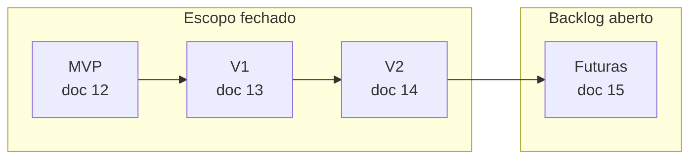
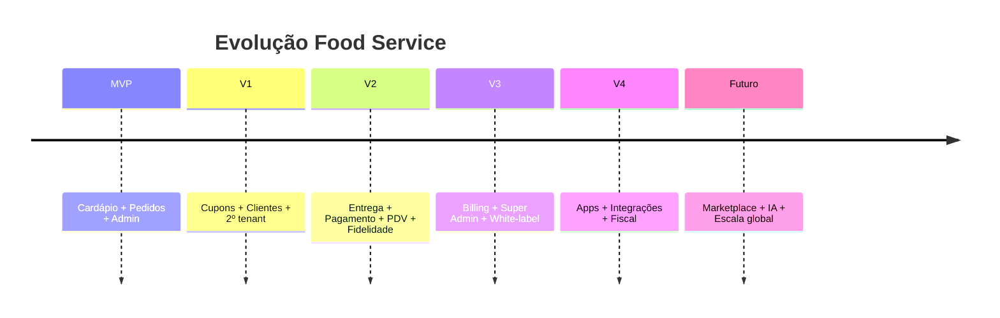
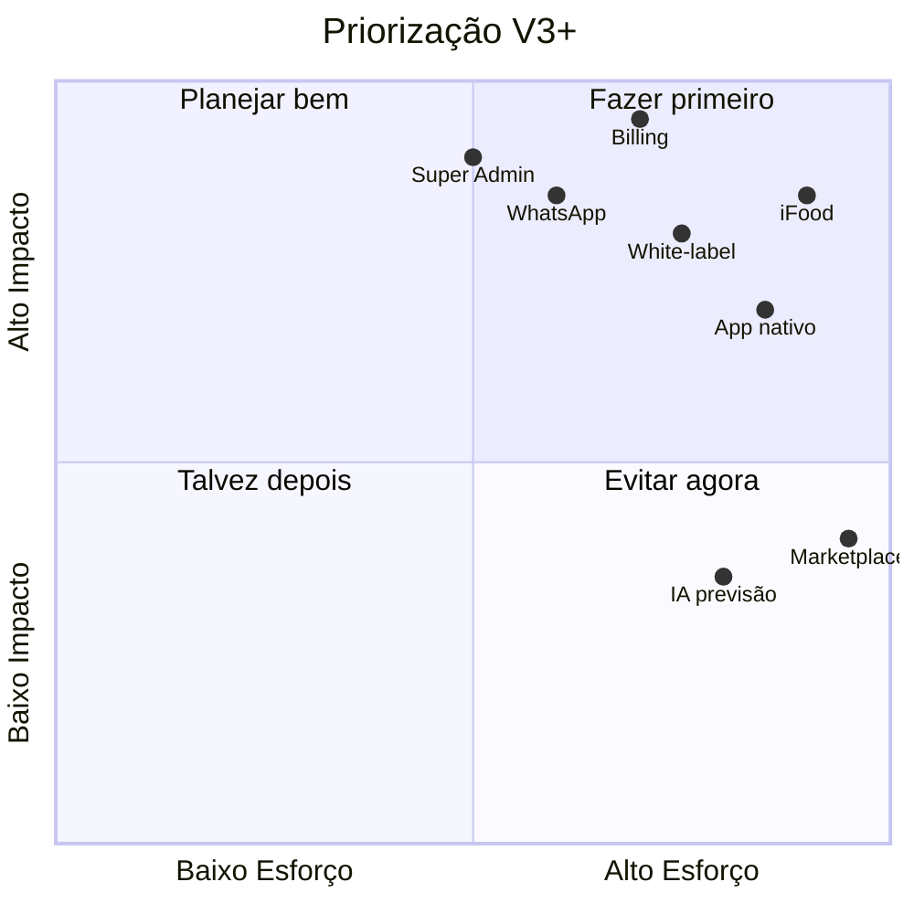
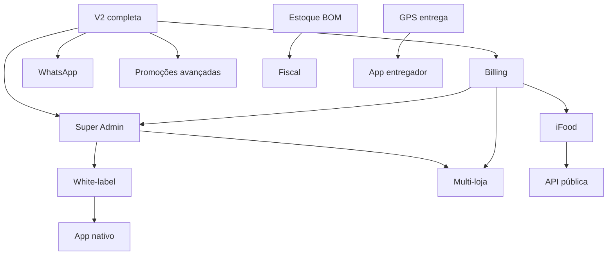
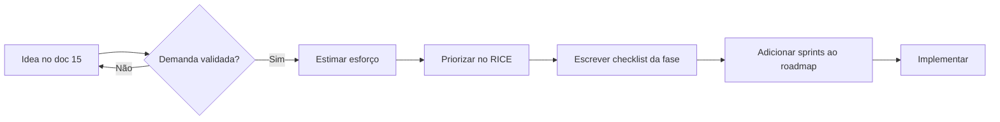
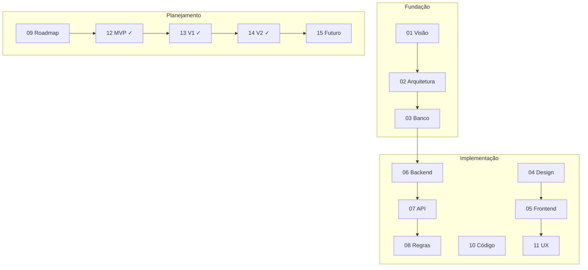

# 15 — Futuras Funcionalidades

> **Documento:** Backlog Estratégico de Longo Prazo  
> **Produto:** Food Service *(nome comercial provisório)*  
> **Versão:** 1.0  
> **Status:** Aprovado  
> **Última atualização:** Julho/2026  
> **Depende de:** Documentos 01–14 (aprovados)

---

## Sumário

1. [Visão Geral](#1-visão-geral)
2. [Relação com os Checklists Fechados](#2-relação-com-os-checklists-fechados)
3. [Horizontes de Produto](#3-horizontes-de-produto)
4. [V3 — Plataforma SaaS Comercial](#4-v3--plataforma-saas-comercial)
5. [V4 — Escala e Canais](#5-v4--escala-e-canais)
6. [Futuro — Visão Estratégica](#6-futuro--visão-estratégica)
7. [Itens Adiados dos Docs Anteriores](#7-itens-adiados-dos-docs-anteriores)
8. [Matriz de Priorização](#8-matriz-de-priorização)
9. [Dependências entre Iniciativas](#9-dependências-entre-iniciativas)
10. [Critérios para Promover ao Roadmap](#10-critérios-para-promover-ao-roadmap)
11. [Roadmap Sugerido V3–V4](#11-roadmap-sugerido-v3v4)
12. [Riscos e Premissas](#12-riscos-e-premissas)
13. [Documentação Completa](#13-documentação-completa)

---

## 1. Visão Geral

### 1.1 Objetivo

Este documento consolida o **backlog estratégico** do Food Service após MVP, V1 e V2 — funcionalidades, iniciativas e evoluções de plataforma que **não têm escopo fechado ainda**, mas orientam decisões de produto, arquitetura e investimento.

### 1.2 O que este documento é — e o que não é

| É | Não é |
|---|-------|
| Visão de longo prazo alinhada ao negócio SaaS | Checklist de implementação com escopo fechado |
| Priorização sugerida para discussão | Compromisso de data ou sprint |
| Referência para não perder ideias | Substituto dos docs 12–14 em produção |
| Guia para arquitetura antecipar extensibilidade | Lista para implementar antes de concluir V2 |

### 1.3 Público

| Público | Uso |
|---------|-----|
| **Produto** | Priorizar o que vem depois da V2 |
| **Engenharia** | Evitar decisões que bloqueiem V3+ |
| **Negócio** | Entender caminho até receita recorrente (billing) |
| **Você (founder-dev)** | Não perder o fio da meada em meses de execução |

### 1.4 KPIs por horizonte

| Fase | KPI norte | Referência |
|------|-----------|------------|
| MVP | 10 pedidos reais | `12-checklist-mvp.md` |
| V1 | 2 tenants ativos | `13-checklist-v1.md` |
| V2 | Pagamento online funcionando | `14-checklist-v2.md` |
| **V3** | **10 tenants pagantes** | `09-roadmap.md` §10.2 |
| **V4** | **100 tenants** + apps/integrações | Este documento |
| Futuro | Referência no segmento BR | `01-visao-do-produto.md` |

---

## 2. Relação com os Checklists Fechados

| Documento | Natureza | Quando usar |
|-----------|----------|-------------|
| `12-checklist-mvp.md` | Escopo fechado | Até go-live pizzaria |
| `13-checklist-v1.md` | Escopo fechado | 2º cliente sem código custom |
| `14-checklist-v2.md` | Escopo fechado | Pagamento, PDV, fidelidade |
| **`15-futuras-funcionalidades.md`** | **Backlog estratégico** | **Após V2 ou em planejamento trimestral** |

> **Regra:** Nada neste documento entra em desenvolvimento até ser promovido a um novo checklist de fase ou sprint planejada (ver [§10](#10-critérios-para-promover-ao-roadmap)).

---

## 3. Horizontes de Produto

### 3.1 Linha do tempo

### 3.2 Definição dos horizontes

| Horizonte | Foco | Resultado esperado |
|-----------|------|-------------------|
| **V3** | Monetizar a plataforma | SaaS que **cobra** e **opera** dezenas de tenants |
| **V4** | Expandir canais | Apps, marketplaces, compliance fiscal |
| **Futuro** | Diferenciação estratégica | Marketplace, IA, expansão internacional |

### 3.3 Princípio de evolução

Cada horizonte deve **adicionar receita ou retenção mensurável** antes de abrir o próximo. V3 (billing) é pré-requisito de negócio para escalar além de clientes piloto.

---

## 4. V3 — Plataforma SaaS Comercial

**Objetivo:** Transformar o Food Service de produto validado em **negócio SaaS recorrente**.

**KPI:** 10 tenants pagantes (`09-roadmap.md`).

### 4.1 Billing e Planos

| ID | Funcionalidade | Descrição | Prioridade | Esforço |
|----|----------------|-----------|------------|---------|
| BIL-01 | Planos Starter / Pro / Enterprise | Limites por features e volume | Alta | G |
| BIL-02 | Assinatura recorrente | Cobrança mensal/anual | Alta | G |
| BIL-03 | Integração gateway de assinatura | Stripe Billing ou Asaas/Pagar.me | Alta | M |
| BIL-04 | Trial period | 14–30 dias com conversão | Alta | P |
| BIL-05 | Limites por plano | Max produtos, funcionários, pedidos/mês | Alta | M |
| BIL-06 | Enforcement de limites | Bloqueio soft/hard ao exceder | Alta | M |
| BIL-07 | Portal do assinante | Fatura, upgrade, cancelamento | Média | M |
| BIL-08 | Cupom de desconto na assinatura | Campanhas de aquisição | Média | P |
| BIL-09 | Métricas MRR / churn | Dashboard interno | Alta | M |
| BIL-10 | Dunning (cobrança falha) | Retry + e-mail + suspensão tenant | Média | M |

**Tabelas prováveis:** `subscription_plans`, `tenant_subscriptions`, `billing_invoices`, `billing_events`

**Nota:** Arquitetura atual (`tenant_id`, settings JSONB) deve permitir `plan_id` e `limits` sem refactor estrutural (`01-visao-do-produto.md` §10.3).

---

### 4.2 Super Admin (Painel da Plataforma)

| ID | Funcionalidade | Descrição | Prioridade | Esforço |
|----|----------------|-----------|------------|---------|
| SA-01 | App separada ou área `/platform` | Isolamento total do backoffice tenant | Alta | M |
| SA-02 | CRUD de tenants | Criar, suspender, reativar | Alta | P |
| SA-03 | Impersonate (login como tenant) | Suporte com auditoria | Alta | M |
| SA-04 | Métricas globais | Tenants ativos, pedidos/dia, GMV | Alta | M |
| SA-05 | Health por tenant | Último pedido, erros, uso de storage | Média | M |
| SA-06 | Gestão de planos | CRUD planos e preços | Alta | P |
| SA-07 | Feature flags por tenant | Habilitar V2 features gradualmente | Média | M |
| SA-08 | Logs centralizados | Busca por tenant/request | Média | G |
| SA-09 | Suporte: resetar senha owner | Sem acessar dados sensíveis | Média | P |
| SA-10 | Onboarding assistido | Wizard operado pelo SA | Alta | M |

**Persona:** Super Admin (`01-visao-do-produto.md` §6.4).

---

### 4.3 White-label e Branding Avançado

| ID | Funcionalidade | Descrição | Prioridade | Esforço |
|----|----------------|-----------|------------|---------|
| WL-01 | Domínio customizado | `pedidos.cliente.com.br` | Alta | G |
| WL-02 | TLS automático por domínio | Caddy/Let's Encrypt wildcard por host | Alta | G |
| WL-03 | Cores e fontes por tenant | Além de logo (design tokens) | Alta | M |
| WL-04 | CSS variables injetáveis | Storefront temático sem rebuild | Média | M |
| WL-05 | Remover "Powered by Food Service" | Plano Enterprise | Média | P |
| WL-06 | E-mail transacional com domínio do cliente | SPF/DKIM por tenant | Média | G |
| WL-07 | Favicon e meta tags SEO | Por tenant | Baixa | P |
| WL-08 | Página de login branded | Backoffice com identidade | Baixa | P |

**Estratégia atual:** Subdomínio MVP → domínio customizado V3 (`01-visao-do-produto.md` §10.2).

---

### 4.4 Multi-loja (Um dono, vários estabelecimentos)

| ID | Funcionalidade | Descrição | Prioridade | Esforço |
|----|----------------|-----------|------------|---------|
| ML-01 | Organização (holding) acima de tenant | Um login, N lojas | Alta | G |
| ML-02 | Seletor de loja no backoffice | Troca de contexto | Alta | M |
| ML-03 | Cardápio compartilhado opcional | Franquia copia catálogo | Média | G |
| ML-04 | Relatórios consolidados | Vendas de todas as lojas | Alta | M |
| ML-05 | Permissões por loja | Gerente vê só sua unidade | Alta | M |
| ML-06 | Subdomínio por loja | Mantém isolamento atual | Alta | P |
| ML-07 | Billing por organização | Uma fatura, N lojas | Média | G |

**Nota:** Modelagem atual é 1 tenant = 1 estabelecimento. Multi-loja exige camada `organization` sem quebrar isolamento.

---

### 4.5 Marketing e Promoções Avançadas

Itens adiados da visão de produto (`01-visao-do-produto.md` §9) — além dos cupons simples da V1.

| ID | Funcionalidade | Descrição | Prioridade | Esforço |
|----|----------------|-----------|------------|---------|
| MKT-01 | Promoção por categoria | "20% em bebidas hoje" | Média | M |
| MKT-02 | Combos configuráveis | Produto = bundle de itens | Média | G |
| MKT-03 | Happy hour (horário) | Preço dinâmico por período | Média | M |
| MKT-04 | Desconto progressivo | Leve 3 pague 2 | Baixa | M |
| MKT-05 | Campanhas push/e-mail | Segmentação de clientes | Média | G |
| MKT-06 | Avaliações pós-pedido | Nota + comentário | Média | M |
| MKT-07 | Moderação de avaliações | Admin aprova/oculta | Baixa | P |
| MKT-08 | Programa indique e ganhe | Referral code | Baixa | M |

---

### 4.6 Comunicação Omnicanal

| ID | Funcionalidade | Descrição | Prioridade | Esforço |
|----|----------------|-----------|------------|---------|
| COM-01 | WhatsApp Business API | Confirmação e status de pedido | Alta | G |
| COM-02 | SMS (Twilio/Zenvia) | OTP e notificações | Média | M |
| COM-03 | Push notifications (web) | PWA + service worker | Média | M |
| COM-04 | Templates por tenant | Personalização de mensagens | Média | P |
| COM-05 | Opt-in/opt-out LGPD | Consentimento explícito | Alta | M |
| COM-06 | Chat suporte (widget) | Intercom/Crisp ou próprio | Baixa | M |

---

### 4.7 LGPD e Compliance

| ID | Funcionalidade | Descrição | Prioridade | Esforço |
|----|----------------|-----------|------------|---------|
| LGPD-01 | Exportação de dados do customer | Portabilidade | Alta | M |
| LGPD-02 | Exclusão/anonimização | Direito ao esquecimento (CL-15) | Alta | M |
| LGPD-03 | Termos e privacidade por tenant | Links configuráveis | Alta | P |
| LGPD-04 | Registro de consentimento | Cookies, marketing | Média | P |
| LGPD-05 | DPA para tenants B2B | Contrato de tratamento | Média | P |
| LGPD-06 | Audit trail completo | Expandir `audit_logs` V2 | Média | M |

---

## 5. V4 — Escala e Canais

**Objetivo:** Crescer aquisição e retenção por **novos canais** e **compliance operacional**.

**KPI sugerido:** 100 tenants ativos; ≥ 1 integração marketplace em produção.

### 5.1 App Nativo (Consumidor)

| ID | Funcionalidade | Descrição | Prioridade | Esforço |
|----|----------------|-----------|------------|---------|
| APP-01 | App React Native ou Flutter | Reuso de API existente | Média | G |
| APP-02 | Push nativo | Status do pedido | Média | M |
| APP-03 | Login biométrico | Face ID / fingerprint | Baixa | P |
| APP-04 | Deep links | Campanhas marketing | Média | P |
| APP-05 | Publicação App Store / Play Store | CI/CD mobile | Média | G |
| APP-06 | App entregador | Aceitar corrida, navegação | Média | G |

**Premissa:** Web responsiva + PWA cobre até V3; app nativo quando retenção justificar investimento.

---

### 5.2 Integrações com Marketplaces

| ID | Funcionalidade | Descrição | Prioridade | Esforço |
|----|----------------|-----------|------------|---------|
| INT-01 | Receber pedidos iFood | Hub de pedidos unificado | Alta | G |
| INT-02 | Receber pedidos Rappi | Idem | Média | G |
| INT-03 | Sincronizar cardápio → marketplace | Preços e disponibilidade | Média | G |
| INT-04 | Mapear produtos externos ↔ internos | Tabela de equivalência | Alta | M |
| INT-05 | Status bidirecional | Confirmar/preparar no FS reflete no MP | Alta | G |
| INT-06 | Relatório por canal | Storefront vs iFood vs PDV | Média | M |
| INT-07 | Webhooks de saída | Notificar ERP/CRM do cliente | Média | M |

**Risco:** Contratos, APIs instáveis, taxas — priorizar após product-market fit com canal próprio.

---

### 5.3 Emissão Fiscal

| ID | Funcionalidade | Descrição | Prioridade | Esforço |
|----|----------------|-----------|------------|---------|
| FIS-01 | NFC-e (cupom fiscal eletrônico) | Bares/restaurantes | Média | G |
| FIS-02 | Integração Focus NFe / eNotas | Gateway fiscal | Média | G |
| FIS-03 | NF-e para delivery | Conforme regime | Baixa | G |
| FIS-04 | Dados fiscais do tenant | CNPJ, IE, regime tributário | Média | M |
| FIS-05 | Impressão DANFE / cupom | Impressora térmica | Média | M |

---

### 5.4 Estoque e Operação Avançada

Evolução do estoque básico V2 (`14-checklist-v2.md`).

| ID | Funcionalidade | Descrição | Prioridade | Esforço |
|----|----------------|-----------|------------|---------|
| EST-01 | Ficha técnica (BOM) | Produto consome insumos | Média | G |
| EST-02 | Baixa automática por pedido | Ao confirmar pedido | Média | G |
| EST-03 | Alerta estoque mínimo | Notificação admin | Média | P |
| EST-04 | Inventário físico | Contagem periódica | Baixa | M |
| EST-05 | Fornecedores | Cadastro e pedido de compra | Baixa | G |
| EST-06 | Custo e margem | CMV por produto | Média | M |

---

### 5.5 Entrega Avançada

Evolução V2 (`14-checklist-v2.md` — GPS P2).

| ID | Funcionalidade | Descrição | Prioridade | Esforço |
|----|----------------|-----------|------------|---------|
| ENT-01 | Rastreamento GPS ao vivo | Posição do entregador | Média | G |
| ENT-02 | App entregador com navegação | Waze/Google Maps intent | Média | G |
| ENT-03 | Otimização de rotas | Múltiplas entregas | Baixa | G |
| ENT-04 | Entrega terceirizada | Integração Loggi/Mottu | Baixa | G |
| ENT-05 | Proof of delivery | Foto/assinatura | Média | M |
| ENT-06 | Taxa dinâmica por distância real | OSRM/Google Distance Matrix | Média | M |

---

### 5.6 Pagamentos Avançados

Evolução gateway V2 (Mercado Pago único).

| ID | Funcionalidade | Descrição | Prioridade | Esforço |
|----|----------------|-----------|------------|---------|
| PAY-01 | Segundo gateway (Stripe) | Ports & Adapters já previsto | Média | M |
| PAY-02 | Split de pagamento | Marketplace futuro | Baixa | G |
| PAY-03 | Assinatura do consumidor | Clube de benefícios | Baixa | G |
| PAY-04 | Wallet interna | Crédito pré-pago | Baixa | G |
| PAY-05 | Antifraude configurável | Regras por valor/tenant | Média | M |
| PAY-06 | Conciliação financeira | Extrato vs pedidos | Média | M |

---

### 5.7 API Pública e Ecossistema

| ID | Funcionalidade | Descrição | Prioridade | Esforço |
|----|----------------|-----------|------------|---------|
| API-01 | API keys por tenant | Autenticação M2M | Média | M |
| API-02 | Webhooks de saída | `order.created`, `order.completed` | Média | M |
| API-03 | Rate limits por plano | Enterprise = mais quota | Média | P |
| API-04 | Sandbox para desenvolvedores | Tenant de teste | Baixa | M |
| API-05 | SDK JavaScript | Facilitar integrações | Baixa | M |
| API-06 | Documentação pública | Developer portal | Média | M |

---

## 6. Futuro — Visão Estratégica

**Horizonte:** 2–5 anos. Exploratório — validar demanda antes de investir.

### 6.1 Marketplace entre Estabelecimentos

| ID | Funcionalidade | Descrição | Prioridade |
|----|----------------|-----------|------------|
| MP-01 | Vitrine multi-tenant | "Peça na sua região" | Baixa |
| MP-02 | Comissão por pedido | Modelo de receita plataforma | Baixa |
| MP-03 | Busca unificada | Produtos de N restaurantes | Baixa |
| MP-04 | Carrinho multi-loja | Complexo — avaliar necessidade | Baixa |

> Modelo de negócio diferente do SaaS B2B atual (`01-visao-do-produto.md` §8.2).

---

### 6.2 Inteligência e Automação

| ID | Funcionalidade | Descrição | Prioridade |
|----|----------------|-----------|------------|
| IA-01 | Sugestão de produtos | "Quem pediu X também pediu Y" | Baixa |
| IA-02 | Previsão de demanda | Sugerir prep antecipada | Baixa |
| IA-03 | Precificação dinâmica | Surge em pico | Baixa |
| IA-04 | Chatbot de pedido | WhatsApp com NLP | Média |
| IA-05 | Análise de sentimento | Avaliações automáticas | Baixa |
| IA-06 | Detecção de fraude | Pedidos suspeitos | Média |

---

### 6.3 Expansão Internacional

| ID | Funcionalidade | Descrição | Prioridade |
|----|----------------|-----------|------------|
| GLOBAL-01 | Multi-moeda | USD, EUR | Baixa |
| GLOBAL-02 | Multi-idioma (i18n) | es, en | Baixa |
| GLOBAL-03 | Timezone por tenant | Já parcialmente previsto | Média |
| GLOBAL-04 | Gateways locais | Stripe global | Baixa |

---

### 6.4 Hardware e IoT

| ID | Funcionalidade | Descrição | Prioridade |
|----|----------------|-----------|------------|
| HW-01 | Impressora térmica automática | ESC/POS na cozinha | Média |
| HW-02 | Display cozinha (KDS) | Kitchen Display System | Média |
| HW-03 | Balança integrada | PDV a granel | Baixa |
| HW-04 | Totem de autoatendimento | Kiosk mode | Baixa |

---

## 7. Itens Adiados dos Docs Anteriores

Consolidação de features mencionadas em docs anteriores mas **não** nos checklists fechados:

| Item | Mencionado em | Fase sugerida |
|------|---------------|---------------|
| Avaliações pós-pedido | `01` §9.1, adiado em `13` | V3 (MKT-06) |
| Promoções avançadas / combos | `01` §9.2, adiado em `13` | V3 (MKT-01–02) |
| Favoritos (P2 na V1) | `09` Sprint 15, `13` | V3 ou polish contínuo |
| GPS ao vivo entregador | `14` P2, D-05 | V4 (ENT-01) |
| Múltiplos gateways | `14` fora V2 | V4 (PAY-01) |
| Estoque com BOM | `01` §8.2, `14` básico | V4 (EST-01) |
| Super Admin | `01` §6.4, `09` V3 | V3 (SA-*) |
| Billing / planos | `01` §10.3 | V3 (BIL-*) |
| Domínio customizado | `01` §10.2 | V3 (WL-01) |
| iFood / Rappi | `01` §8.2 | V4 (INT-*) |
| NF-e / NFC-e | `01` §8.2 | V4 (FIS-*) |
| Marketplace | `01` §8.2 | Futuro (MP-*) |

---

## 8. Matriz de Priorização

### 8.1 Framework RICE simplificado

| Critério | Peso | Descrição |
|----------|------|-----------|
| **Reach** | 30% | Quantos tenants/clientes impacta |
| **Impact** | 30% | Receita, retenção ou operação |
| **Confidence** | 20% | Certeza da demanda |
| **Effort** | 20% | Esforço inverso (P=3, M=2, G=1) |

### 8.2 Top 10 sugerido (pós-V2)

| Rank | ID | Iniciativa | Horizonte | Por quê |
|------|-----|------------|-----------|---------|
| 1 | BIL-01–06 | Billing + planos | V3 | Sem isso não há SaaS escalável |
| 2 | SA-01–04 | Super Admin básico | V3 | Operar 10+ tenants |
| 3 | WL-01–03 | White-label | V3 | Diferencial Enterprise |
| 4 | COM-01 | WhatsApp | V3 | Demanda BR altíssima |
| 5 | ML-01–02 | Multi-loja | V3 | Franquias pedem cedo |
| 6 | LGPD-01–02 | Compliance | V3 | Obrigatório em escala |
| 7 | INT-01 | iFood inbound | V4 | Aquisição de tenants |
| 8 | APP-01 | App consumidor | V4 | Retenção mobile |
| 9 | FIS-01 | NFC-e | V4 | Barreira entrada restaurantes |
| 10 | MKT-06 | Avaliações | V3 | Confiança do consumidor |

### 8.3 Mapa Impacto × Esforço

---

## 9. Dependências entre Iniciativas

| Iniciativa | Depende de |
|------------|------------|
| Billing | V2, tenant estável |
| Super Admin | Billing (planos) |
| White-label domínio | Infra DNS/TLS madura |
| Multi-loja | Super Admin, modelo org |
| iFood | API estável, fila de pedidos |
| Fiscal | Estoque/cadastro fiscal tenant |
| Marketplace | Escala + billing + split pagamento |

---

## 10. Critérios para Promover ao Roadmap

Um item deste backlog **sai do doc 15** e vira trabalho quando:

| # | Critério |
|---|----------|
| P1 | Fase anterior (MVP/V1/V2) está 100% no checklist |
| P2 | Há demanda validada (≥ 3 tenants pedindo ou KPI bloqueado) |
| P3 | Esforço estimado e dividido em sprints |
| P4 | Impacto em receita ou retenção quantificável |
| P5 | Criado novo checklist (`16-checklist-v3.md`) ou atualizado `09-roadmap.md` |
| P6 | Arquitetura revisada — sem refactor bloqueante |

### 10.1 Processo sugerido

---

## 11. Roadmap Sugerido V3–V4

> Ilustrativo — recalibrar após V2 com velocity real.

### 11.1 V3 — Sprints 23–30 (~8 semanas)

| Sprint | Foco | Entregas principais |
|--------|------|---------------------|
| 23 | Billing core | Planos, assinatura, limites |
| 24 | Billing UX | Portal, trial, dunning |
| 25 | Super Admin | CRUD tenants, métricas |
| 26 | Super Admin | Impersonate, feature flags |
| 27 | White-label | Domínio customizado + TLS |
| 28 | White-label | Theming (cores/fontes) |
| 29 | Multi-loja | Organization + seletor |
| 30 | Polish V3 | WhatsApp + LGPD básico |

**KPI V3:** 10 tenants pagantes.

### 11.2 V4 — Sprints 31–40 (~10 semanas)

| Sprint | Foco | Entregas principais |
|--------|------|---------------------|
| 31–32 | iFood | Receber pedidos |
| 33 | Integrações | Webhooks saída + canal no admin |
| 34–35 | App consumidor | MVP React Native |
| 36 | Fiscal | NFC-e integração |
| 37 | Estoque BOM | Ficha técnica + baixa |
| 38 | Entrega GPS | App entregador |
| 39 | Pagamentos | Segundo gateway |
| 40 | Validação V4 | 100 tenants, checklist novo |

---

## 12. Riscos e Premissas

### 12.1 Riscos

| Risco | Impacto | Mitigação |
|-------|---------|-----------|
| Implementar V3 antes de V2 estável | Dívida técnica | Checklists fechados em ordem |
| Billing errado bloqueia receita | Alto | Usar provedor maduro (Stripe/Asaas) |
| White-label quebra isolamento | Crítico | Testes tenant isolation |
| iFood muda API | Médio | Adapter pattern, monitoramento |
| Scope do backlog infinito | Paralisia | Este doc + priorização trimestral |
| Um desenvolvedor | Bus factor | Documentação (feita), automação |

### 12.2 Premissas

| # | Premissa |
|---|----------|
| PR-01 | MVP → V1 → V2 são concluídos antes de V3 comercial |
| PR-02 | Arquitetura multi-tenant atual suporta billing sem rewrite |
| PR-03 | Mercado BR prioriza WhatsApp sobre SMS |
| PR-04 | Canal próprio continua sendo diferencial vs marketplace |
| PR-05 | Planos Enterprise justificam white-label e multi-loja |

---

## 13. Documentação Completa

Com a aprovação deste documento, a **série de 15 documentos** do Food Service fica completa:

| # | Documento | Tipo |
|---|-----------|------|
| 00 | `00-portas-locais.md` | Referência dev local |
| 01 | `01-visao-do-produto.md` | Visão |
| 02 | `02-arquitetura.md` | Arquitetura |
| 03 | `03-modelagem-do-banco.md` | Dados |
| 04 | `04-design-system.md` | Design |
| 05 | `05-frontend.md` | Frontend |
| 06 | `06-backend.md` | Backend |
| 07 | `07-api.md` | API |
| 08 | `08-regras-de-negocio.md` | Negócio |
| 09 | `09-roadmap.md` | Roadmap |
| 10 | `10-padroes-de-codigo.md` | Código |
| 11 | `11-guia-ui-ux.md` | UX |
| 12 | `12-checklist-mvp.md` | Checklist fechado |
| 13 | `13-checklist-v1.md` | Checklist fechado |
| 14 | `14-checklist-v2.md` | Checklist fechado |
| 15 | `15-futuras-funcionalidades.md` | **Backlog estratégico** |

### 13.1 Próximo passo após documentação

Com os 15 documentos aprovados, o ciclo de **planejamento** está completo. O próximo passo operacional é **execução**: Sprint 0 (`09-roadmap.md` §5).

---

## Histórico de Revisões

| Versão | Data | Autor | Alterações |
|--------|------|-------|------------|
| 1.0 | Jul/2026 | — | Versão inicial — aprovado |

---

## Apêndice A — Contagem do Backlog

| Horizonte | Itens catalogados |
|-----------|-------------------|
| V3 | ~55 |
| V4 | ~45 |
| Futuro | ~25 |
| **Total** | **~125** |

## Apêndice B — Glossário de Esforço

| Sigla | Significado | Sprints típicas |
|-------|-------------|-----------------|
| **P** | Pequeno | 0.5–1 |
| **M** | Médio | 1–2 |
| **G** | Grande | 2–4 |

---

> **Documento aprovado.** Série de documentação completa (15/15). Próximo passo: **Sprint 0 — implementação** (`09-roadmap.md` §5).
