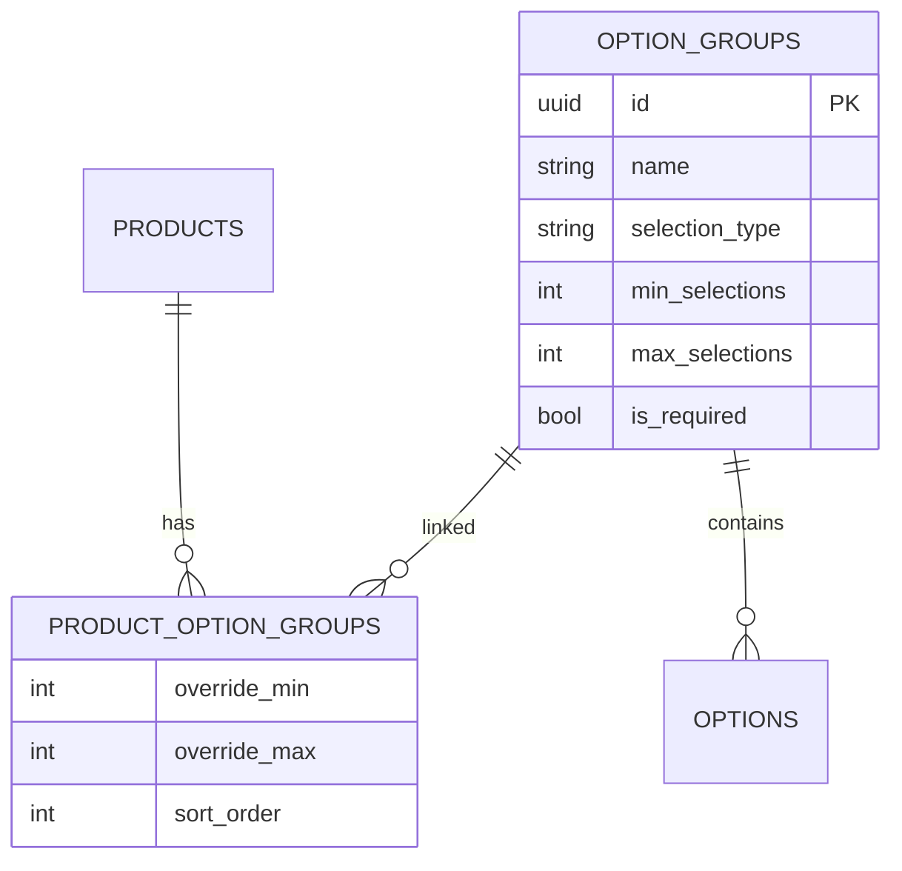
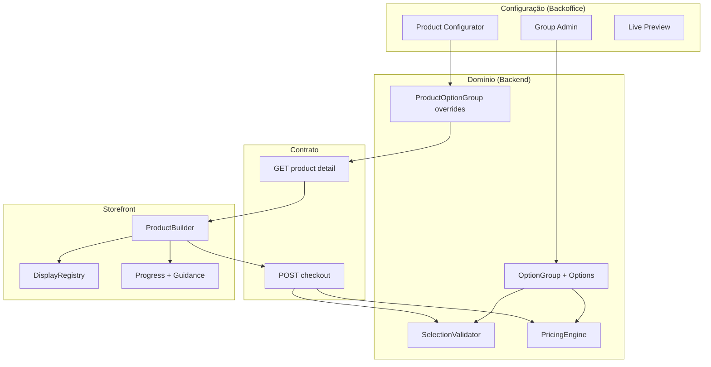
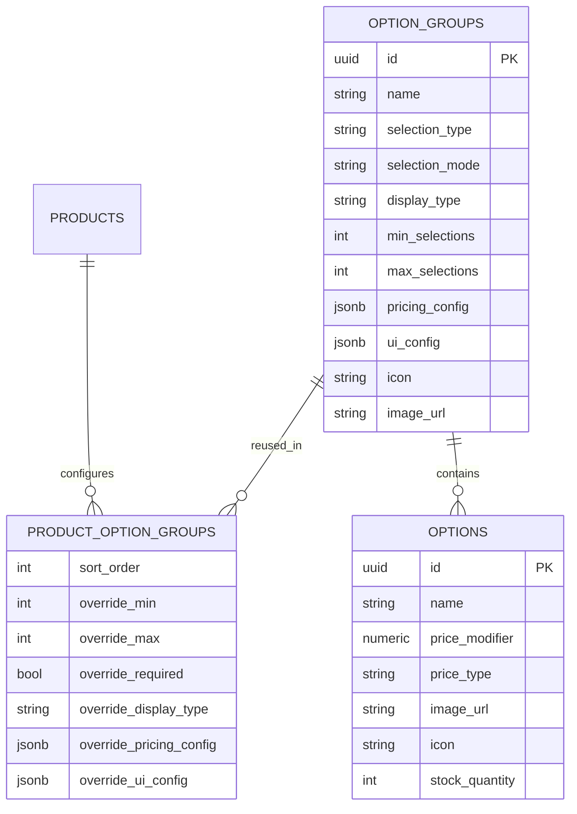

# 16 — Product Builder Engine

> **Documento:** Motor Universal de Configuração de Produtos  
> **Produto:** Food Service *(nome comercial provisório)*  
> **Versão:** 1.0  
> **Status:** Aprovado  
> **Última atualização:** Julho/2026  
> **Depende de:** `02-arquitetura.md`, `03-modelagem-do-banco.md`, `07-api.md`, `08-regras-de-negocio.md`, `11-guia-ui-ux.md` (aprovados)

---

## Sumário

1. [Visão Geral](#1-visão-geral)
2. [Princípios e Decisões Arquiteturais](#2-princípios-e-decisões-arquiteturais)
3. [Estado Atual vs. Objetivo](#3-estado-atual-vs-objetivo)
4. [Arquitetura do Motor](#4-arquitetura-do-motor)
5. [Modelo de Dados](#5-modelo-de-dados)
6. [Enums e Contratos](#6-enums-e-contratos)
7. [Pricing Engine](#7-pricing-engine)
8. [Modelo de Seleção e Payload](#8-modelo-de-seleção-e-payload)
9. [API](#9-api)
10. [Frontend — Product Builder](#10-frontend--product-builder)
11. [UX Premium — Storefront](#11-ux-premium--storefront)
12. [Backoffice — Configurador](#12-backoffice--configurador)
13. [Exemplos de Configuração por Segmento](#13-exemplos-de-configuração-por-segmento)
14. [Migração e Compatibilidade](#14-migração-e-compatibilidade)
15. [Fases de Implementação](#15-fases-de-implementação)
16. [Testes e Definition of Done](#16-testes-e-definition-of-done)
17. [Anti-Padrões](#17-anti-padrões)
18. [Documentos a Atualizar](#18-documentos-a-atualizar)
19. [Histórico de Revisões](#19-histórico-de-revisões)

---

## 1. Visão Geral

### 1.1 Objetivo

Definir o **Product Builder Engine** — motor universal que permite a qualquer estabelecimento de food service montar a lógica de venda dos seus produtos **apenas via configuração no backoffice**, sem alterar código e sem regras específicas por segmento (pizzaria, hamburgueria, pastelaria, etc.).

### 1.2 O que este documento é — e o que não é

| É | Não é |
|---|-------|
| Especificação do motor genérico de opções/modificadores | Implementação de features por segmento |
| Evolução do modelo `option_groups` existente | Motor paralelo ou tabelas `pizza_*` |
| Contrato API + UX + regras de pricing | Checklist com escopo fechado de sprint *(ver §15)* |
| Referência para backend, storefront e backoffice | Substituto dos docs 03, 07 e 08 |

### 1.3 Guiding Principles

| Princípio | Aplicação |
|-----------|-----------|
| **Produtos, nunca pizzas** | Zero código/tabela/componente por segmento |
| **Componentes reutilizáveis** | Display registry, PricingEngine, ProductBuilder |
| **Configuração > código** | Comportamento via `option_groups`, `options`, overrides |
| **Backend = fonte da verdade** | Preço e validação no service; frontend estima |
| **Evoluir, não reescrever** | Manter `Product → ProductOptionGroup → OptionGroup → Option` |

### 1.4 Público

| Público | Uso |
|---------|-----|
| **Produto** | Validar flexibilidade multi-segmento |
| **Backend** | Migrations, services, serializers, testes |
| **Frontend** | ProductBuilder, display registry, backoffice |
| **QA** | Casos de configuração e regressão de checkout |

---

## 2. Princípios e Decisões Arquiteturais

Decisões **aprovadas** para esta iniciativa:

| # | Decisão | Escolha | Justificativa |
|---|---------|---------|---------------|
| D1 | Modelo de dados | **Evoluir** `option_groups` / `options` / `product_option_groups` | Base já genérica e em produção no MVP |
| D2 | Regras de preço avançadas | **`pricing_config` JSONB** na Fase 2 | Flexível sem migrations frequentes; normalizar só se necessário na V2+ |
| D3 | Payload de opções | **`{ option_id, quantity }`** com breaking controlado | Necessário para stepper e adicionais com quantidade |
| D4 | Seleção ilimitada | **`max_selections = 0`** em grupos `multiple` = ilimitado | Convenção explícita, validada no service |
| D5 | Prioridade Fase 1 | **UX premium no storefront primeiro** | Valor imediato ao consumidor; engine estende depois |
| D6 | Apresentação vs. semântica | **`display_type` separado de `selection_type`** | Mesma regra de negócio, UI configurável |

---

## 3. Estado Atual vs. Objetivo

### 3.1 O que já existe (MVP — Sprint 3)



**Implementado hoje:**

- Grupos reutilizáveis entre produtos (`OptionGroup` + `ProductOptionGroup`)
- `selection_type`: `single` | `multiple`
- `min_selections` / `max_selections` + overrides por produto
- Preço `fixed` | `percentage` por opção
- `PriceCalculator` + validação no checkout
- Storefront: `OptionGroupSelector` (lista radio/checkbox)
- Backoffice: `OptionGroupEditor` + vínculo por checkbox no form de produto

### 3.2 Gap para Product Builder completo

| Capacidade | MVP | Product Builder |
|------------|-----|-----------------|
| Tipos visuais configuráveis | ❌ | ✅ `display_type` |
| Imagens/ícones em grupo e opção | ❌ | ✅ |
| Quantidade por opção (stepper) | ❌ | ✅ `selection_mode: quantity` |
| Pricing avançado (N grátis, extras…) | ❌ | ✅ `pricing_config` |
| UX: progresso, guidance, animações | Parcial | ✅ Premium |
| Backoffice: DnD, duplicar, preview builder | Parcial | ✅ |
| Estoque por opção | ❌ | Fase 3 |

### 3.3 Casos que **já funcionam** só com configuração atual

Estes casos **não exigem código novo** — apenas configuração correta:

| Caso | Configuração |
|------|--------------|
| Pizza meio a meio (2 sabores) | `multiple`, `min=2`, `max=2`, `required=true` |
| Pizza 3 sabores | `min=3`, `max=3` |
| 1 a 4 sabores | `min=1`, `max=4` |
| Monte seu hambúrguer | Vários grupos `single` (pão, carne, queijo…) |
| Bebidas reutilizáveis | Mesmo `OptionGroup` em N produtos |
| Adicionais 0–5 | `multiple`, `min=0`, `max=5` |

A evolução entrega **UI premium**, **pricing avançado** e **quantidade por opção** — não novos conceitos de domínio.

---

## 4. Arquitetura do Motor

### 4.1 Camadas



### 4.2 Responsabilidades por camada

| Camada | Responsabilidade | Não faz |
|--------|------------------|---------|
| **Models** | Persistir configuração | Calcular preço |
| **SelectionValidator** | min/max, required, stock, quantity | Renderizar UI |
| **PricingEngine** | Aplicar `pricing_config` | Validar tenant |
| **Serializer** | Formato + merge de overrides | Regra de negócio |
| **ProductBuilder (FE)** | Renderizar grupos, estimar preço, UX | Decidir regra por nome do grupo |
| **DisplayRegistry (FE)** | Mapear `display_type` → componente | Lógica de checkout |

### 4.3 Resolução de configuração efetiva

Para cada `ProductOptionGroup`, o sistema **merge** grupo base + overrides do vínculo:

```
effective.min_selections     = override_min ?? group.min_selections
effective.max_selections     = override_max ?? group.max_selections
effective.is_required          = override_required ?? group.is_required
effective.display_type         = override_display_type ?? group.display_type
effective.pricing_config       = merge(group.pricing_config, override_pricing_config)
effective.ui_config            = merge(group.ui_config, override_ui_config)
```

Ordem de exibição: `product_option_groups.sort_order`.

---

## 5. Modelo de Dados

> **Escopo:** evolução incremental sobre tabelas existentes. Migration sugerida: `catalog/0003_product_builder_fields.py`.

### 5.1 `option_groups` — campos novos

| Coluna | Tipo | Null | Default | Descrição |
|--------|------|------|---------|-----------|
| `display_type` | `option_display_type` | NO | derivado | Componente visual no storefront |
| `selection_mode` | `option_selection_mode` | NO | `'pick'` | Como contar seleções (`pick` \| `quantity`) |
| `icon` | `VARCHAR(16)` | YES | — | Emoji ou identificador curto |
| `image_url` | `VARCHAR(500)` | YES | — | Imagem/banner do grupo |
| `visibility` | `option_group_visibility` | NO | `'always'` | `always` \| `hidden` *(fase 3: `conditional`)* |
| `pricing_config` | `JSONB` | NO | `'{"strategy":"additive"}'` | Regras de precificação |
| `ui_config` | `JSONB` | NO | `'{}'` | Hints, mensagens, emoji guia |
| `default_option_ids` | `JSONB` | NO | `'[]'` | UUIDs pré-selecionados |

**Campos existentes mantidos:** `name`, `description`, `selection_type`, `min_selections`, `max_selections`, `is_required`, `sort_order`, `is_active`.

**Default de `display_type` na migration:**

| `selection_type` | `display_type` default |
|------------------|------------------------|
| `single` | `radio` |
| `multiple` | `checkbox` |

### 5.2 `options` — campos novos

| Coluna | Tipo | Null | Default | Descrição |
|--------|------|------|---------|-----------|
| `image_url` | `VARCHAR(500)` | YES | — | Imagem da opção |
| `icon` | `VARCHAR(16)` | YES | — | Emoji/ícone |
| `stock_quantity` | `INT` | YES | — | `NULL` = sem controle de estoque |
| `metadata` | `JSONB` | YES | — | Extensões futuras (cor hex, SKU…) |

### 5.3 `product_option_groups` — overrides novos

| Coluna | Tipo | Null | Descrição |
|--------|------|------|-----------|
| `override_required` | `BOOLEAN` | YES | Sobrescreve `is_required` |
| `override_display_type` | `option_display_type` | YES | UI diferente neste produto |
| `override_pricing_config` | `JSONB` | YES | Merge parcial sobre `pricing_config` |
| `override_ui_config` | `JSONB` | YES | Copy/hints específicos do produto |

### 5.4 `order_item_options` — evolução (Fase 2)

| Coluna | Tipo | Null | Descrição |
|--------|------|------|-----------|
| `quantity` | `INT` | NO | Default `1` — quantidade desta opção no item |

Snapshot existente (`option_group_name`, `option_name`, `price_modifier`) **mantido**.

### 5.5 Diagrama ER evoluído



---

## 6. Enums e Contratos

### 6.1 `option_display_type`

Componente visual — **independente** do segmento ou nome do grupo.

| Valor | Descrição | Fase |
|-------|-----------|------|
| `list` | Lista simples (fallback) | 1 |
| `radio` | Radio cards | 1 |
| `checkbox` | Checkbox cards | 1 |
| `cards` | Cards texto, grid | 1 |
| `image_cards` | Cards com imagem | 2 |
| `dropdown` | Select nativo/custom | 2 |
| `stepper` | +/- por opção | 2 |
| `icon_chips` | Chips com ícone/emoji | 2 |
| `color_swatch` | Seletor de cor | 3 |

### 6.2 `option_selection_mode`

| Valor | Comportamento | Contagem para min/max |
|-------|---------------|------------------------|
| `pick` | Escolhe opções distintas (atual) | Número de `option_id` distintos (ou soma de `quantity` se sempre 1) |
| `quantity` | Stepper por opção | **Soma** de `quantity` de todas as opções do grupo |

**Compatibilidade:** grupos existentes recebem `selection_mode = pick`.

### 6.3 `option_group_visibility`

| Valor | Fase | Comportamento |
|-------|------|---------------|
| `always` | 1 | Sempre visível |
| `hidden` | 2 | Oculto no storefront (uso interno/admin) |
| `conditional` | 3 | Visível se opção de outro grupo selecionada |

### 6.4 Regras de validação estrutural (`option_groups`)

| Regra | Descrição |
|-------|-----------|
| V1 | `min_selections <= max_selections` **ou** `max_selections = 0` (ilimitado) |
| V2 | Se `is_required = true` → `min_selections >= 1` |
| V3 | Se `selection_type = single` → `max_selections = 1` e `selection_mode = pick` |
| V4 | Se `selection_mode = quantity` → `selection_type` deve ser `multiple` |
| V5 | `display_type = stepper` → `selection_mode = quantity` |
| V6 | `default_option_ids` ⊆ opções ativas do grupo |
| V7 | Soma de defaults não pode violar max (exceto max=0) |

### 6.4 Convenção `max_selections = 0`

| `selection_type` | `max_selections` | Significado |
|------------------|------------------|-------------|
| `multiple` | `0` | **Ilimitado** |
| `multiple` | `N > 0` | No máximo N seleções (ou soma de quantities) |
| `single` | `1` | Única opção (obrigatório) |

---

## 7. Pricing Engine

### 7.1 Localização

- **Backend:** `apps/catalog/services/pricing_engine.py`
- **Frontend:** `src/features/product-builder/pricingEngine.ts` *(espelho para estimativa)*

`PriceCalculator` existente **delega** ao `PricingEngine` — não duplicar lógica.

### 7.2 Schema `pricing_config`

```typescript
type PricingConfig =
  | { strategy: "additive" }
  | { strategy: "charge_extras_only"; included_count: number }
  | { strategy: "first_n_free"; free_count: number }
  | { strategy: "quantity_multiplier" }
  | { strategy: "tiered"; tiers: Array<{ from: number; to?: number; unit_price: number }> };
```

**Default:** `{ "strategy": "additive" }` — comportamento atual (soma de modificadores).

### 7.3 Estratégias — Fase 2

| Strategy | Descrição | Exemplo |
|----------|-----------|---------|
| `additive` | Soma `price_modifier` de cada opção × quantity | Tamanho + borda + adicional |
| `charge_extras_only` | Primeiras `included_count` seleções sem custo; restante cobra | 1 sabor incluído, 2º cobra |
| `first_n_free` | Primeiras N opções (por ordem de seleção ou sort_order) gratuitas | 2 primeiros adicionais grátis |
| `quantity_multiplier` | `price_modifier × quantity` por opção | 3× bacon |
| `tiered` | Preço por faixa de quantidade total no grupo | Fase 3 |

### 7.4 Algoritmo `additive` (referência)

```
unit_price = base_price
for each selected_option in group_selections:
    modifier = fixed(option.price_modifier) 
            OR base_price * (option.price_modifier / 100)
    unit_price += modifier * option.quantity
unit_price = round_money(max(unit_price, 0))
```

### 7.5 Ordem de cálculo

1. Resolver seleções validadas por grupo
2. Por grupo, aplicar `effective.pricing_config`
3. Somar resultados de todos os grupos ao `base_price`
4. Arredondar half-up, 2 casas

**Regra P-06 mantida:** cálculo final **sempre no backend** no checkout.

---

## 8. Modelo de Seleção e Payload

### 8.1 Estado interno (frontend)

```typescript
type OptionSelectionItem = {
  option_id: string;
  quantity: number; // default 1, min 1 por item
};

type ProductBuilderState = Record<string, OptionSelectionItem[]>;
// chave = option_group.id
```

### 8.2 Payload carrinho / checkout

**Novo formato (Fase 2):**

```json
{
  "product_id": "880e8400-e29b-41d4-a716-446655440004",
  "quantity": 1,
  "options": [
    { "option_id": "bb0e8400-e29b-41d4-a716-446655440008", "quantity": 1 },
    { "option_id": "bb0e8400-e29b-41d4-a716-446655440011", "quantity": 2 }
  ]
}
```

**Compatibilidade (breaking controlado):**

| Formato | Suporte |
|---------|---------|
| `{ "option_id": "..." }` sem `quantity` | ✅ Tratado como `quantity: 1` |
| `string[]` legado interno no FE | Migrar para `OptionSelectionItem[]` na Fase 1 |

### 8.3 Validação por `selection_mode`

**`pick`:**

- Contagem = número de entradas distintas (quantity ignorado ou forçado a 1)
- `min_selections <= count <= max_selections` (max=0 → sem teto)

**`quantity`:**

- Contagem = `SUM(item.quantity)` por grupo
- Mesma regra min/max sobre a soma

### 8.4 ID do item no carrinho (K-04)

```
cart_item_key = hash(product_id + sorted(option_id:quantity pairs))
```

Atualizar quando `quantity` por opção for introduzido.

---

## 9. API

> Após aprovação deste doc, atualizar `07-api.md` §11.3, §12.1 e §14 (admin).

### 9.1 Público — `GET /api/v1/public/catalog/products/{slug}/`

**Campos adicionais em `option_groups[]`:**

```json
{
  "id": "aa0e8400-e29b-41d4-a716-446655440006",
  "name": "Sabores",
  "description": "Escolha os sabores da sua pizza",
  "selection_type": "multiple",
  "selection_mode": "pick",
  "display_type": "cards",
  "min_selections": 2,
  "max_selections": 2,
  "is_required": true,
  "sort_order": 1,
  "icon": "🍕",
  "image_url": null,
  "visibility": "always",
  "pricing_config": { "strategy": "charge_extras_only", "included_count": 1 },
  "ui_config": {
    "hint": "Escolha até dois sabores",
    "success_message": "Excelente escolha"
  },
  "default_option_ids": [],
  "options": [
    {
      "id": "bb0e8400-e29b-41d4-a716-446655440007",
      "name": "Calabresa",
      "description": null,
      "price_modifier": 0,
      "price_type": "fixed",
      "is_available": true,
      "image_url": "https://cdn.../calabresa.webp",
      "icon": null,
      "stock_quantity": null
    }
  ]
}
```

Valores **efetivos** (pós-merge com `product_option_groups`) são retornados — o storefront não calcula overrides.

### 9.2 Checkout — `POST /api/v1/public/orders/checkout/`

**`items[].options[]`:**

| Campo | Tipo | Obrigatório | Default |
|-------|------|-------------|---------|
| `option_id` | UUID | Sim | — |
| `quantity` | int | Não | `1` |

Validação: `quantity >= 1` e `<= 99` por opção.

### 9.3 Admin — grupos de opções

Endpoints existentes **estendidos** (não substituídos):

| Método | Path | Novo comportamento |
|--------|------|-------------------|
| `POST` | `/admin/catalog/option-groups/` | Aceita novos campos |
| `PATCH` | `/admin/catalog/option-groups/{id}/` | Idem |
| `POST` | `/admin/catalog/option-groups/{id}/options/` | Imagem, icon, stock |
| `PATCH` | `/admin/catalog/products/{id}/` | Overrides por vínculo |

**Novos endpoints (Fase 3 — backoffice):**

| Método | Path | Descrição |
|--------|------|-----------|
| `PATCH` | `/admin/catalog/option-groups/reorder/` | `{ "ids": ["uuid", ...] }` |
| `PATCH` | `/admin/catalog/option-groups/{id}/options/reorder/` | Reordenar opções |
| `PATCH` | `/admin/catalog/products/{id}/option-groups/reorder/` | Ordem no produto |
| `POST` | `/admin/catalog/option-groups/{id}/duplicate/` | Deep copy |
| `POST` | `/admin/catalog/option-groups/{id}/options/{oid}/duplicate/` | Copiar opção |

Permissão: `catalog.manage`.

---

## 10. Frontend — Product Builder

### 10.1 Estrutura de módulo

```
src/features/product-builder/
├── index.ts
├── types.ts
├── pricingEngine.ts
├── guidance.ts
├── useProductBuilder.ts
├── ProductBuilder.tsx
├── ProductBuilderProgress.tsx
├── GroupGuidance.tsx
├── GroupSection.tsx
├── registry/
│   └── displayRegistry.ts
└── displays/
    ├── ListDisplay.tsx
    ├── RadioDisplay.tsx
    ├── CheckboxDisplay.tsx
    ├── CardGridDisplay.tsx
    ├── ImageCardDisplay.tsx      # Fase 2
    ├── DropdownDisplay.tsx       # Fase 2
    ├── StepperDisplay.tsx        # Fase 2
    └── IconChipDisplay.tsx       # Fase 2
```

### 10.2 Display Registry

```typescript
const displayRegistry: Record<OptionDisplayType, ComponentType<DisplayProps>> = {
  list: ListDisplay,
  radio: RadioDisplay,
  checkbox: CheckboxDisplay,
  cards: CardGridDisplay,
  // ...
};

function resolveDisplay(type: OptionDisplayType): ComponentType<DisplayProps> {
  return displayRegistry[type] ?? displayRegistry.list;
}
```

**Regra:** se `display_type` desconhecido ou não implementado → fallback `list` + log dev.

### 10.3 `ProductBuilder` — props

```typescript
type ProductBuilderProps = {
  product: ProductDetail;
  selections: ProductBuilderState;
  onChange: (groupId: string, items: OptionSelectionItem[]) => void;
  onValidityChange?: (valid: boolean, errors: GroupError[]) => void;
};
```

### 10.4 Integração

| Consumidor | Mudança |
|------------|---------|
| `ProductDetailView` | Substitui `OptionGroupSelector` por `ProductBuilder` |
| `useAddToCart` / cart store | Payload com `{ option_id, quantity }` |
| Backoffice preview | Reutiliza mesmo `ProductBuilder` |

---

## 11. UX Premium — Storefront

> **Prioridade Fase 1.** Entregar experiência premium **antes** de expandir backend — usando campos existentes onde possível; novos campos amplificam na Fase 2.

### 11.1 Objetivos UX

| Meta | Critério |
|------|----------|
| Clareza | Usuário sabe quantas escolhas faltam |
| Confiança | Preço atualiza em tempo real |
| Prazer | Microinterações suaves, cards modernos |
| Mobile first | Grupos legíveis em 320px; CTA sticky |
| Acessibilidade | Fieldset/legend, focus visible, aria |

### 11.2 Barra de progresso

Exibida quando produto tem **≥ 2 grupos** ou **≥ 1 grupo obrigatório**.

```
[████████░░░░] 2 de 4 etapas
```

- **Etapa concluída:** grupo obrigatório satisfeito OU grupo opcional com seleção
- **Etapa pendente:** grupo obrigatório incompleto
- Grupos opcionais vazios não bloqueiam progresso 100%

### 11.3 Mensagens orientativas (`GroupGuidance`)

Geradas por **`guidance.ts`** a partir de config efetiva — sem hardcode por segmento.

| Estado | Template |
|--------|----------|
| Obrigatório, vazio | `{icon} Escolha pelo menos {min} em {name}` |
| Multiple, parcial | `{icon} Escolha mais {remaining} (até {max})` |
| Multiple, max atingido | `Limite atingido ✔` |
| Obrigatório, ok | `Excelente escolha ✔` |
| Custom | `ui_config.hint` / `ui_config.success_message` |

`icon` vem de `option_group.icon` ou `ui_config.emoji`.

### 11.4 Microinterações

| Interação | Comportamento |
|-----------|---------------|
| Selecionar opção | Border/background transition 150ms; scale sutil no card |
| Preço muda | Count-up ou fade no total |
| Grupo inválido no submit | Scroll + shake leve + guidance vermelho |
| Adicionar ao carrinho | `animate-cart-bump` (já existente) |
| Max atingido | Opções não selecionadas disabled + pulse no contador |

### 11.5 Layout por display (Fase 1)

| display_type | Layout mobile | Layout desktop |
|--------------|---------------|----------------|
| `radio` / `cards` | 1 coluna, cards full-width | 2–3 colunas grid |
| `checkbox` | 1 coluna | 2 colunas |
| `list` | Fallback compacto | Idem |

### 11.6 Sticky footer (produto configurável)

```
┌─────────────────────────────────────┐
│  Total: R$ 60,00                    │
│  [ Adicionar ao carrinho ]          │
└─────────────────────────────────────┘
```

- Visível após scroll passar preço base
- Desabilitado se validação falhar
- Safe area iOS

### 11.7 Checklist UX (Fase 1)

- [ ] `ProductBuilder` substitui `OptionGroupSelector`
- [ ] Barra de progresso funcional
- [ ] Guidance dinâmico por grupo
- [ ] Cards com estado selected/hover/disabled
- [ ] Total reativo com animação
- [ ] Scroll até primeiro erro
- [ ] Mobile 320px sem overflow horizontal
- [ ] Touch target ≥ 44px

---

## 12. Backoffice — Configurador

### 12.1 Princípios

- Administrador **nunca escreve código**
- Preview usa o **mesmo** `ProductBuilder` do storefront
- Grupos são **reutilizáveis** — criar uma vez, vincular a N produtos

### 12.2 Telas

| Tela | Fase | Função |
|------|------|--------|
| **Grupos de opções** (evolução) | 2–3 | CRUD + regras + display + pricing + DnD |
| **Form produto — seção Builder** | 2–3 | Vincular, reordenar, overrides, preview |
| **Preview ao vivo** | 2 | `ProductBuilder` embutido |

### 12.3 Formulário de grupo (campos)

| Seção | Campos |
|-------|--------|
| Identidade | Nome, descrição, ícone, imagem |
| Seleção | `selection_type`, `selection_mode`, min, max, required |
| Visual | `display_type` (select com preview miniature) |
| Preço | `pricing_config` (UI amigável por strategy) |
| UX | `ui_config.hint`, emoji guia |
| Opções | Lista com DnD, duplicar, imagem, preço, estoque |

### 12.4 Configurador no produto

Substituir checkbox simples por:

1. **Lista ordenável** de grupos vinculados (drag handle)
2. **Expandir** → overrides (min/max, required, display, pricing, copy)
3. **Adicionar grupo** → modal busca grupos existentes + criar novo
4. **Preview** lateral (desktop) / aba (mobile)

### 12.5 Ações admin

| Ação | Fase |
|------|------|
| Criar / editar grupo e opções | Existe → evoluir |
| Vincular grupo ao produto | Existe → evoluir |
| Reordenar opções (DnD) | 3 |
| Reordenar grupos no produto (DnD) | 3 |
| Duplicar grupo (deep copy) | 3 |
| Duplicar opção | 3 |
| Preview builder ao vivo | 2 |

---

## 13. Exemplos de Configuração por Segmento

> **Atenção:** exemplos ilustrativos de **configuração**, não de código. Mesma estrutura para todos.

### 13.1 Pizza — sabores meio a meio

```yaml
OptionGroup:
  name: Sabores
  selection_type: multiple
  selection_mode: pick
  display_type: cards
  min_selections: 2
  max_selections: 2
  is_required: true
  icon: "🍕"
  pricing_config:
    strategy: charge_extras_only
    included_count: 1
  ui_config:
    hint: "Escolha até dois sabores"
```

### 13.2 Hamburguer — monte seu lanche

```yaml
Product: Monte seu Hambúrguer
ProductOptionGroups:
  - group: Escolha o pão
    display_type: radio
    min: 1
    max: 1
    required: true
  - group: Escolha a carne
    display_type: cards
  - group: Queijo
    display_type: checkbox
    max: 2
  - group: Adicionais
    selection_mode: quantity
    display_type: stepper
    min: 0
    max: 0  # ilimitado
    pricing_config:
      strategy: quantity_multiplier
```

### 13.3 Pastel — recheios extras

```yaml
OptionGroup:
  name: Recheios extras
  selection_type: multiple
  selection_mode: pick
  display_type: checkbox
  min_selections: 0
  max_selections: 3
  pricing_config:
    strategy: additive
```

### 13.4 Açaí — complementos

```yaml
OptionGroup:
  name: Complementos
  selection_type: multiple
  selection_mode: quantity
  display_type: stepper
  min_selections: 0
  max_selections: 10
  pricing_config:
    strategy: first_n_free
    free_count: 2
  ui_config:
    hint: "Escolha seus complementos"
```

### 13.5 Grupo reutilizável — Bebidas

```yaml
OptionGroup:
  name: Bebidas
  display_type: image_cards
ProductOptionGroups:
  - product: Pizza Calabresa
  - product: X-Burger
  - product: Marmita do Dia
```

---

## 14. Migração e Compatibilidade

### 14.1 Migration backend

1. Adicionar colunas com defaults seguros
2. Backfill `display_type` a partir de `selection_type`
3. Backfill `pricing_config = {"strategy": "additive"}`
4. Backfill `selection_mode = "pick"`
5. `order_item_options.quantity = 1` para registros existentes

### 14.2 API — compatibilidade

| Mudança | Estratégia |
|---------|------------|
| Novos campos na response | Aditivo — clientes antigos ignoram |
| `options[].quantity` no request | Opcional — default 1 |
| Carrinho localStorage | Bump versão da chave `cart_v2` |

### 14.3 Frontend

| Componente | Ação |
|------------|------|
| `OptionGroupSelector` | Deprecar após `ProductBuilder` estável |
| `priceCalculator.ts` | Migrar para `product-builder/pricingEngine.ts` |
| Tipos `OptionSelections` | Evoluir para `ProductBuilderState` |

### 14.4 Rollback

Migrations são aditivas (colunas nullable ou com default). Rollback de código pode ignorar novos campos; dados extras permanecem sem efeito.

---

## 15. Fases de Implementação

> Ordem aprovada: **UX premium primeiro**.

### Fase 1 — UX Premium Storefront

**Objetivo:** experiência guiada e visualmente premium usando **modelo atual** (`selection_type`, min/max, description).

| # | Entrega |
|---|---------|
| 1.1 | Módulo `product-builder` (estrutura, types, guidance) |
| 1.2 | `ProductBuilder` + `RadioDisplay`, `CheckboxDisplay`, `CardGridDisplay`, `ListDisplay` |
| 1.3 | Barra de progresso + `GroupGuidance` |
| 1.4 | Microinterações, sticky total, scroll-to-error |
| 1.5 | Integrar em `ProductDetailView` |
| 1.6 | Testes manuais mobile 320px |

**Fora de escopo Fase 1:** migration, pricing avançado, stepper, backoffice DnD.

### Fase 2 — Core Engine

**Objetivo:** evoluir modelo, API, pricing e payload com quantity.

| # | Entrega |
|---|---------|
| 2.1 | Migration campos §5 |
| 2.2 | `PricingEngine` + strategies Fase 2 |
| 2.3 | `SelectionValidator` com quantity + max=0 |
| 2.4 | API pública/admin estendida |
| 2.5 | Checkout/carrinho com `{ option_id, quantity }` |
| 2.6 | `order_item_options.quantity` |
| 2.7 | Displays: `image_cards`, `dropdown`, `stepper`, `icon_chips` |
| 2.8 | `pricingEngine.ts` espelho no FE |
| 2.9 | pytest: pricing + validation + checkout |

### Fase 3 — Backoffice Builder

**Objetivo:** configurador intuitivo completo.

| # | Entrega |
|---|---------|
| 3.1 | Form de grupo enriquecido (display, pricing UI, ui_config) |
| 3.2 | Configurador de produto (DnD, overrides) |
| 3.3 | Preview ao vivo com `ProductBuilder` |
| 3.4 | Duplicar grupo/opção |
| 3.5 | Endpoints reorder |
| 3.6 | Upload imagem opção/grupo |

### Fase 4 — Regras Avançadas

| # | Entrega |
|---|---------|
| 4.1 | `pricing_config.strategy: tiered` |
| 4.2 | `visibility: conditional` |
| 4.3 | `default_option_ids` + pré-seleção |
| 4.4 | `stock_quantity` + decremento opcional |
| 4.5 | `color_swatch` display |

---

## 16. Testes e Definition of Done

### 16.1 Backend (pytest)

| Caso | Fase |
|------|------|
| min/max validation incl. max=0 unlimited | 2 |
| single rejects quantity > 1 | 2 |
| quantity mode sums correctly | 2 |
| pricing: additive, first_n_free, charge_extras_only, quantity_multiplier | 2 |
| checkout aceita option sem quantity (default 1) | 2 |
| override_min/max por produto | 2 |
| tenant isolation em option groups | 2 |

### 16.2 Frontend

| Caso | Fase |
|------|------|
| ProductBuilder renderiza N grupos | 1 |
| Progress bar atualiza | 1 |
| Guidance messages corretas | 1 |
| Preço estimado = backend (smoke E2E) | 2 |
| Stepper respeita max | 2 |
| Cart persiste quantity por opção | 2 |

### 16.3 Definition of Done (por fase)

- [ ] Código segue `10-padroes-de-codigo.md`
- [ ] Regras críticas no service (não só serializer)
- [ ] Testes pytest da fase passando
- [ ] Build frontend sem erro
- [ ] Mobile first verificado (320px)
- [ ] Docs cross-ref §18 atualizados
- [ ] Zero referência a segmento no código

---

## 17. Anti-Padrões

| ❌ Proibido | ✅ Correto |
|------------|-----------|
| `PizzaSelector.tsx` | `CardGridDisplay` + config |
| `if (group.name === 'Sabores')` | Ler `min_selections`, `ui_config` |
| Tabela `pizza_flavors` | `options` no grupo "Sabores" |
| Preço só no frontend | `PricingEngine` no checkout |
| UI diferente por categoria de produto | `display_type` por grupo |
| Hardcode emoji 🍕 no código | `option_group.icon` / `ui_config` |

---

## 18. Documentos a Atualizar

Após aprovação deste documento, revisar:

| Documento | Seção | Mudança |
|-----------|-------|---------|
| `03-modelagem-do-banco.md` | §7.5–7.7 | Novos campos e enums |
| `07-api.md` | §11.3, §12.1, §14 | Contrato Product Builder |
| `08-regras-de-negocio.md` | §6, §7 | Selection mode, pricing engine, max=0 |
| `09-roadmap.md` | Nova sprint | Product Builder Fases 1–3 |
| `11-guia-ui-ux.md` | §8 | Referenciar doc 16 |
| `05-frontend.md` | features | Módulo `product-builder` |

---

## 19. Histórico de Revisões

| Versão | Data | Autor | Mudanças |
|--------|------|-------|----------|
| 1.0 | Jul/2026 | — | Versão inicial |
| 1.0 | Jul/2026 | — | Aprovado — Fase 1 UX premium em implementação |

---

> **Documento aprovado.** Implementação: Fase 1 (UX storefront) → Fase 2 (engine) → Fase 3 (backoffice).
