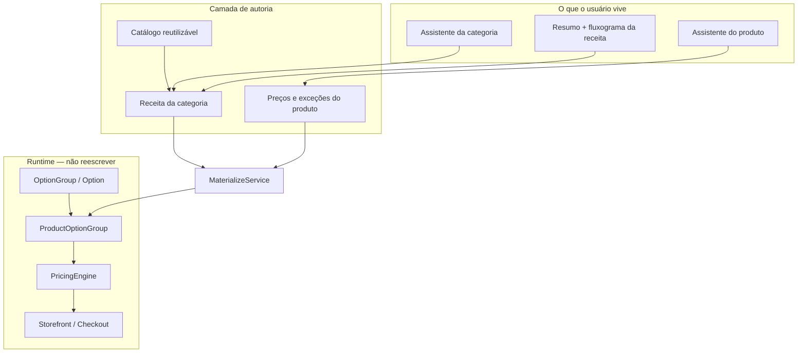

# 17 — Modelo Categoria → Produto (Receita)

> **Documento:** Arquitetura de Autoria — Receita da Categoria, Catálogo Reutilizável e Produto  
> **Produto:** Food Service *(nome comercial provisório)*  
> **Versão:** 1.5  
> **Status:** Aprovado  
> **Última atualização:** Julho/2026  
> **Depende de:** `00-product-philosophy.md`, `02-arquitetura.md`, `03-modelagem-do-banco.md`, `16-product-builder-engine.md`  
> **Filosofia:** Toda UI descrita aqui é **conversacional**. Nomes de tabelas/campos abaixo são **internos** — jamais exibidos ao comerciante.

---

## Sumário

1. [Objetivo](#1-objetivo)
2. [Alinhamento com a filosofia](#2-alinhamento-com-a-filosofia)
3. [Visão em camadas](#3-visão-em-camadas)
4. [Modelo mental do usuário](#4-modelo-mental-do-usuário)
5. [Modelo de dados normalizado](#5-modelo-de-dados-normalizado)
6. [Materialização (runtime intacto)](#6-materialização-runtime-intacto)
7. [Fluxos de UX (assistentes)](#7-fluxos-de-ux-assistentes)
8. [Nomenclatura de produto (UI)](#8-nomenclatura-de-produto-ui)
9. [Alterações na categoria e impacto](#9-alterações-na-categoria-e-impacto)
10. [Inteligência futura (hooks)](#10-inteligência-futura-hooks)
11. [Fases de implementação](#11-fases-de-implementação)
12. [Anti-padrões](#12-anti-padrões)
13. [Documentos a atualizar na implementação](#13-documentos-a-atualizar-na-implementação)
14. [Histórico de Revisões](#14-histórico-de-revisões)

---

## 1. Objetivo

Definir a **camada de autoria** do cardápio:

1. **Catálogo reutilizável** — identidade sem preço (tamanhos, bordas, adicionais…).  
2. **Categoria = Receita (Modelo de Produto)** — comportamento padrão, configurado por **assistente**.  
3. **Produto** — usa a receita; pergunta sobretudo **preços** e **exceções**.

Sem alterar o contrato de runtime do storefront/checkout (`OptionGroup` → `ProductOptionGroup` → Pricing Engine), conforme `16-product-builder-engine.md`.

---

## 2. Alinhamento com a filosofia

| Princípio (`00-product-philosophy`) | Como este doc aplica |
|-------------------------------------|----------------------|
| Esconder arquitetura | Tabelas e “materialização” só no backend |
| Conversação > configuração | Categoria e produto = assistentes |
| Herança > repetição | Produto nasce da receita |
| Exceções > reconfigurar tudo | Subset / exclusões no produto |
| Preço no produto | `product_option_prices` |
| Confirmar mudanças em massa | Prompt de aplicação ao salvar categoria |

**Regra de Ouro:** se a tela da categoria parecer um CRUD de “features”, está errada.

---

## 3. Visão em camadas



---

## 4. Modelo mental do usuário

### 4.1 Receita da categoria

“Como normalmente funciona uma Pizza?” → conversa → resumo → salvar.

Depois: **ver a receita** (fluxograma só leitura).

### 4.2 Produto “mágico”

Escolhe categoria Pizza → animação curta de preparação → “Agora só os preços”.

### 4.3 Segunda pizza

Copiar preços / % / fixo / manual — não repetir a estrutura.

---

## 5. Modelo de dados normalizado

Evitar JSON monolítico de “features” na categoria. Preferir tabelas para BI, API, import/export.

### 5.1 Catálogo reutilizável (evoluir existente)

| Tabela | Evolução |
|--------|----------|
| `option_groups` | `+ kind` (`size`, `crust`, `extras`, `dough`, `volume`, …) |
| `options` | Identidade; `price_modifier` torna-se **legado** (0 na autoria nova) |

Sem preço de venda no cadastro conversacional do catálogo.

### 5.2 Receita da categoria (novas tabelas)

**`category_capabilities`**

| Campo | Papel interno |
|-------|----------------|
| `category_id` | FK |
| `kind` | size, crust, extras, half, … |
| `enabled` | bool |
| `is_required` | bool |
| `sort_order` | ordem na conversa / fluxograma |
| `settings` | JSONB **mínimo** (ex.: half → `max_parts`, `pricing_rule`) |

**`category_libraries`**

| Campo | Papel |
|-------|--------|
| `category_id` | FK |
| `option_group_id` | conjunto reutilizável usado nesta receita |
| `kind` | alinhado à capability |
| `sort_order` | |

**`category_library_items`**

| Campo | Papel |
|-------|--------|
| `category_library_id` | FK |
| `option_id` | item disponível nesta categoria |
| `sort_order` | |

Uma categoria pode usar **vários** conjuntos (ex.: “Bordas Tradicionais” + futuramente outro conjunto).

### 5.3 Produto (preço e exceções)

**`product_option_prices`**

| Campo | Papel |
|-------|--------|
| `product_id` | FK |
| `option_id` | FK |
| `price` | DECIMAL |
| UNIQUE `(product_id, option_id)` | |

**`product_option_exclusions`**

| Campo | Papel |
|-------|--------|
| `product_id` | FK |
| `option_id` | FK |

Ausência de exclusão = **inclui** (herda a receita).  
Padrão: herdar tudo; só gravar exclusão quando o usuário disser “quero escolher”.

### 5.4 O que permanece

- `product_option_groups` — gerado/atualizado pelo MaterializeService  
- `product_compositions` — meio a meio  
- Pedidos com snapshot de preço (já existente)

### 5.5 Resolução de preço (engine)

Ordem sugerida:

1. `product_option_prices.price`  
2. (opcional futuro) default de categoria  
3. `options.price_modifier` legado  

Modo tamanho absoluto: documentar em implementação (ex.: `base_price` 0 + preços absolutos por tamanho, ou strategy no merge) **sem** expor ao usuário.

---

## 6. Materialização (runtime intacto)

**MaterializeService** (nome interno) ao salvar categoria/produto:

1. Lê capabilities + libraries + items (+ composition settings).  
2. Garante `ProductOptionGroup` por library vinculada.  
3. Opções visíveis = items da receita − exclusions do produto.  
4. Preços efetivos via `product_option_prices` (serializados no public API como o storefront já espera).  
5. Meio a meio → `ProductComposition`.

Storefront e checkout **não** precisam conhecer a receita.

---

## 7. Fluxos de UX (assistentes)

### 7.1 Assistente da categoria (não é CRUD)

```text
Vamos configurar como normalmente funciona uma Pizza.
→ Possui tamanhos? → Quais?
→ Possui bordas? → Quais?
→ Meio a meio? → Como calcula?
→ Adicionais? → Quais?
→ Resumo
→ Salvar
```

**Resumo antes de salvar (obrigatório):**

```text
Resumo
✓ Trabalha com tamanhos — 4 tamanhos
✓ Trabalha com bordas — 6 bordas
✓ Permite meio a meio — até 2 sabores · maior preço
✓ Trabalha com adicionais — 12 adicionais
```

### 7.2 Visualização da receita (só leitura)

Fluxograma / árvore da categoria (não edição). Editar = reabrir o assistente.

### 7.3 Assistente do produto

1. Nome, foto, descrição  
2. Momento de preparação (“Carregando tamanhos…”)  
3. Matriz de preços  
4. “Usa todas as bordas da categoria?” → Sim / escolher  
5. Idem adicionais / outros kinds  

**Segunda pizza:** copiar preços / % / fixo / manual.

### 7.4 Criar item no meio do fluxo

“Criar Catupiry agora” → nome (+ ícone) → entra no catálogo → já selecionável — sem sair da conversa.

---

## 8. Nomenclatura de produto (UI)

| Conceito | UI (direção) |
|----------|----------------|
| Catálogo reutilizável | **TBD** — candidatos em `00-product-philosophy.md` §7.1 |
| Category capabilities | Perguntas (“Possui bordas?”) |
| Receita | “Como funciona esta categoria” / fluxograma |
| Materialize | “Preparando o cadastro…” |
| Exclusion | “Quero escolher quais utilizar” |

Decisão do nome do catálogo: **aprovação de produto** antes de gravar no menu.

---

## 9. Alterações na categoria e impacto

Sempre que a receita mudar de forma que afete produtos:

```text
Você alterou: Cream Cheese (borda)

Como deseja aplicar?
( ) Apenas novos produtos
( ) Atualizar todos os produtos
( ) Decidirei depois
```

| Escolha | Comportamento |
|---------|----------------|
| Apenas novos | Materializa só em creates futuros |
| Atualizar todos | Rematerializa produtos da categoria, **preservando** preços e exclusões já definidas |
| Depois | Flag/pendência no produto ou categoria (detalhe na Fase 2+) |

---

## 10. Inteligência futura (hooks)

Prever na API/modelo (sem implementar agora):

| Hook | Uso futuro |
|------|------------|
| Similaridade de produto | “Copiar preços/estrutura desta pizza?” |
| Sugestão de receita por nome/tipo | “Milk Shake → tamanhos + coberturas?” |
| `CompanySettings.setup` | **Fase 4** — assistente de 1ª configuração (presets determinísticos) |
| `GET/POST /admin/ai/suggestions/` | Stub Fase 4 — IA real depois |
| Eventos de autoria | Treino / sugestões |

Ver também `15-futuras-funcionalidades.md` e `19-future-ideas.md`.

---

## 11. Fases de implementação

| Fase | Entrega | Quebra runtime? |
|------|---------|-----------------|
| **0** | Migrations + dual-read de preço + MaterializeService esqueleto + backfill | Não |
| **1** | Catálogo sem preço na autoria + preços no produto (`option_prices` no admin; dual-read público) | Não |
| **2** | Assistente da categoria + resumo + fluxograma + receita normalizada | Não |
| **3** | Produto mágico + exceções + copiar preços + prompt de aplicação | Não |
| **4** | Assistente de 1ª configuração + hooks de IA (opcional) | Não |

**Nenhuma fase** substitui OptionGroup no storefront.

---

## 12. Anti-padrões

| Anti-padrão | Por quê |
|-------------|---------|
| Tela de categoria com grid de “features” | Viola conversação |
| JSON único `categories.features` com tudo | Dificulta BI/API; aceitável só settings pontuais |
| Preço no Option compartilhado como fonte da verdade | Impede pizza A ≠ pizza B |
| Clonar OptionGroup por produto | Quebra reutilização e preço global de identidade |
| Mostrar “Materializar” / “Override” na UI | Viola filosofia |
| Aplicar mudança de categoria em todos sem perguntar | Quebra confiança |

---

## 13. Documentos a atualizar na implementação

Quando iniciar a Fase 0 (após aprovação):

- [ ] `03-modelagem-do-banco.md` — novas tabelas  
- [ ] `07-api.md` — endpoints de receita / preços  
- [ ] `08-regras-de-negocio.md` — herança, exclusões, aplicação  
- [ ] `11-guia-ui-ux.md` — assistentes e resumos  
- [ ] `16-product-builder-engine.md` — ponte autoria → runtime  
- [ ] Checklists da sprint correspondente  

---

## 14. Histórico de Revisões

| Versão | Data | Descrição |
|--------|------|-----------|
| 1.5 | Jul/2026 | Fase 4 — 1ª configuração (presets) + stub `/admin/ai/suggestions/` |
| 1.1 | Jul/2026 | **Aprovado** — Architecture Freeze; Fase 0 liberada |
| 1.2 | Jul/2026 | Fase 1 em código — catálogo sem preço na autoria; `option_prices` no produto |
| 1.3 | Jul/2026 | Fase 2 em código — assistente + árvore + `GET/PUT .../recipe/` |
| 1.4 | Jul/2026 | Fase 3 — materialize no create, exclusões, apply_mode, copiar preços |
| 1.0 | Jul/2026 | Receita normalizada, assistentes, materialização, fases 0–4 |

---

> **Documento aprovado.** Architecture Freeze. Implementação incremental a partir da Fase 0.
