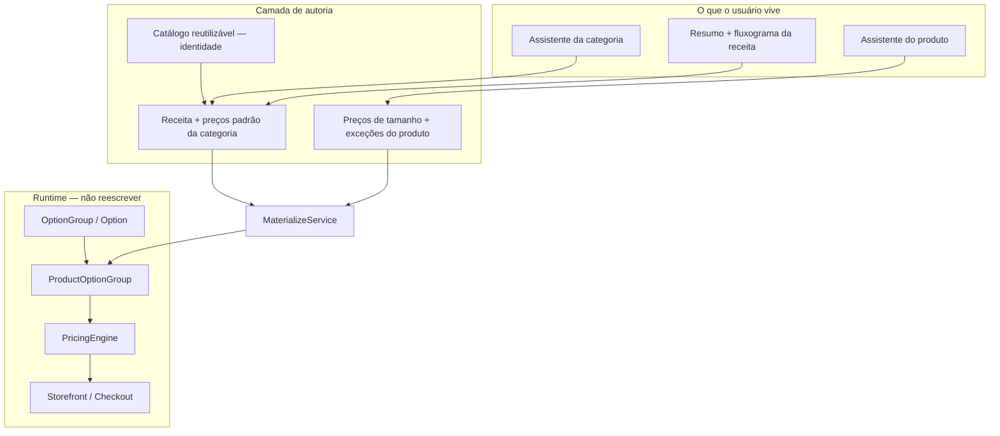

# 17 — Modelo Categoria → Produto (Receita)

> **Documento:** Arquitetura de Autoria — Receita da Categoria, Catálogo Reutilizável e Produto  
> **Produto:** Food Service *(nome comercial provisório)*  
> **Versão:** 1.6  
> **Status:** Aprovado  
> **Última atualização:** Julho/2026  
> **Depende de:** `00-product-philosophy.md`, `02-arquitetura.md`, `03-modelagem-do-banco.md`, `16-product-builder-engine.md`, `18-domain-rules.md`  
> **Filosofia:** Toda UI descrita aqui é **conversacional**. Nomes de tabelas/campos abaixo são **internos** — jamais exibidos ao comerciante.

---

## Sumário

1. [Objetivo](#1-objetivo)
2. [Alinhamento com a filosofia](#2-alinhamento-com-a-filosofia)
3. [Princípio: o que vive onde](#3-princípio-o-que-vive-onde)
4. [Dois tipos de preço](#4-dois-tipos-de-preço)
5. [Visão em camadas](#5-visão-em-camadas)
6. [Modelo mental do usuário](#6-modelo-mental-do-usuário)
7. [Modelo de dados normalizado](#7-modelo-de-dados-normalizado)
8. [Resolução de preço (obrigatória)](#8-resolução-de-preço-obrigatória)
9. [Materialização (runtime intacto)](#9-materialização-runtime-intacto)
10. [Fluxos de UX (assistentes)](#10-fluxos-de-ux-assistentes)
11. [Nomenclatura de produto (UI)](#11-nomenclatura-de-produto-ui)
12. [Alterações na categoria e impacto](#12-alterações-na-categoria-e-impacto)
13. [Inteligência futura (hooks)](#13-inteligência-futura-hooks)
14. [Fases de implementação](#14-fases-de-implementação)
15. [Anti-padrões](#15-anti-padrões)
16. [Documentos a atualizar na implementação](#16-documentos-a-atualizar-na-implementação)
17. [Histórico de Revisões](#17-histórico-de-revisões)

---

## 1. Objetivo

Definir a **camada de autoria** do cardápio:

1. **Catálogo reutilizável** — identidade dos itens (tamanhos, bordas, adicionais…).  
2. **Categoria = Receita** — comportamento padrão **e preços compartilhados** daquele tipo de produto.  
3. **Produto** — preços que **variam por item** (ex.: tamanhos) + **exceções** (exclusões e overrides).

Sem alterar o contrato de runtime do storefront/checkout (`OptionGroup` → `ProductOptionGroup` → Pricing Engine), conforme `16-product-builder-engine.md`.

**Meta de UX:** o comerciante cadastra o **mínimo possível**. O que é igual para quase todos os produtos da categoria pergunta-se **uma vez**. Só exceções pedem configuração individual.

---

## 2. Alinhamento com a filosofia

| Princípio (`00-product-philosophy`) | Como este doc aplica |
|-------------------------------------|----------------------|
| Esconder arquitetura | Tabelas e “materialização” só no backend |
| Conversação > configuração | Categoria e produto = assistentes |
| Herança > repetição | Preços de borda/adicional vêm da categoria |
| Exceções > reconfigurar tudo | Override discreto no produto; exclusões |
| Confirmar mudanças em massa | Prompt ao alterar receita / preços da categoria |
| Sistema trabalha para o comerciante | Não repetir Catupiry em 80 pizzas |

**Regra de Ouro:** se a tela da categoria parecer um CRUD de “features”, está errada.  
**Regra de Ouro (preço):** se o comerciante digita o mesmo valor em todo produto da categoria, esse preço **está no lugar errado**.

---

## 3. Princípio: o que vive onde

Regra arquitetural oficial (pilar do sistema — também em `18-domain-rules.md`):

> **Toda informação que normalmente é compartilhada por todos os produtos de uma categoria existe apenas na categoria.**  
> **Toda informação que varia de produto para produto existe apenas no produto.**

| Vive na **categoria** | Vive no **produto** |
|----------------------|---------------------|
| Quais bordas / adicionais / molhos / massas… | Nome, foto, descrição |
| **Preço padrão** dessas opções compartilhadas | **Preço dos tamanhos** (e kinds equivalentes) |
| Meio a meio e regras de cálculo | Promoções |
| Capacidade (possui X?) | Exclusões (“não usa esta borda”) |
| | **Override** de preço só quando for exceção |

Isso orienta **toda** decisão futura de UX e modelagem.

---

## 4. Dois tipos de preço

### 4.1 Tipo 1 — Preço pertencente ao **produto**

Varia de um item para outro. Continua sendo perguntado **no cadastro do produto**.

Exemplo — tamanhos:

| | Pizza Calabresa | Pizza Frango |
|--|-----------------|--------------|
| Pequena | R$ 35 | R$ 38 |
| Média | R$ 48 | R$ 50 |
| Grande | R$ 60 | R$ 63 |

**Kinds típicos (produto):** `size`, e equivalentes (ex.: `volume` em bebidas quando o preço muda por produto).

### 4.2 Tipo 2 — Preço pertencente à **categoria**

Normalmente **igual** para todos os produtos da categoria. Configurado **uma vez** na receita.

Exemplo — bordas da categoria Pizza:

| Borda | Preço padrão |
|-------|--------------|
| Catupiry | +R$ 10 |
| Cheddar | +R$ 9 |
| Chocolate | +R$ 14 |

**Kinds típicos (categoria):** `crust`, `extras`, `dough`, `sauce`, coberturas, massas, “bebidas extras”, e qualquer opção padrão daquela categoria que não seja tamanho/volume do produto.

### 4.3 Exceção no produto

Por padrão o produto **herda** o preço da categoria.  
Só grava preço próprio quando o comerciante usa a ação discreta:

```text
Catupiry
Preço herdado da categoria (R$ 10)
[ Personalizar somente neste produto ]
→ Novo preço R$ 15
✓ Este produto usa preço próprio
```

Copy de UI: **nunca** “override”, “herança”, “default”. Preferir “herdado da categoria” / “personalizar neste produto”.

---

## 5. Visão em camadas



---

## 6. Modelo mental do usuário

### 6.1 Receita da categoria

“Como normalmente funciona uma Pizza?” → quais opções → **quanto custam as compartilhadas** → resumo → salvar.

### 6.2 Produto “mágico”

Escolhe categoria → preparação → pergunta **só** o que varia (tamanhos) + exclusões se quiser.  
**Não** repete preço de borda/adicional.

### 6.3 Segunda pizza

Copiar preços de tamanho / % / fixo / manual — estrutura e preços de borda já vêm da categoria.

### 6.4 Mudança de preço compartilhado

Catupiry de R$ 10 → R$ 12 **na categoria** → todos os produtos **sem override** passam a usar R$ 12 automaticamente.

---

## 7. Modelo de dados normalizado

Evitar JSON monolítico de “features” na categoria. Preferir tabelas para BI, API, import/export.

### 7.1 Catálogo reutilizável

| Tabela | Evolução |
|--------|----------|
| `option_groups` | `+ kind` (`size`, `crust`, `extras`, `dough`, `volume`, …) |
| `options` | Identidade; `price_modifier` = **legado** (não é fonte da verdade na autoria nova) |

A base reutilizável **não** é o lugar do preço de venda — nem de tamanho, nem de borda.

### 7.2 Receita da categoria

**`category_capabilities`**, **`category_libraries`**, **`category_library_items`** — como já definido (Fases 0–2).

**`category_option_prices`** *(novo — Fase 5)*

| Campo | Papel |
|-------|--------|
| `category_id` | FK |
| `option_id` | FK |
| `price` | DECIMAL — preço padrão da categoria |
| UNIQUE `(category_id, option_id)` | |

Aplica-se a options de kinds **categoria** (`crust`, `extras`, …) vinculadas à receita.  
Não substitui preço de tamanho no produto.

Alternativa aceitável na implementação: coluna `default_price` em `category_library_items` — desde que a resolução e a UX fiquem equivalentes. Preferência: tabela explícita para BI/API.

### 7.3 Produto (preço e exceções)

**`product_option_prices`**

| Campo | Papel |
|-------|--------|
| `product_id` | FK |
| `option_id` | FK |
| `price` | DECIMAL |
| UNIQUE `(product_id, option_id)` | |

**Quando gravar:**

| Situação | Grava em `product_option_prices`? |
|----------|-----------------------------------|
| Preço de tamanho / kind produto | **Sim** (obrigatório na autoria) |
| Preço herdado de borda/adicional | **Não** |
| Personalizar neste produto (override) | **Sim** |
| Remover personalização | **Apaga** a linha → volta a herdar |

**`product_option_exclusions`** — inalterado: ausência = inclui; só grava exclusão quando o usuário escolhe subset.

### 7.4 O que permanece

- `product_option_groups` — MaterializeService  
- `product_compositions` — meio a meio  
- Pedidos com **snapshot** de preço (já existente)

### 7.5 Classificação de kind (orientação)

| Kind | Preço padrão em | No produto pede |
|------|-----------------|-----------------|
| `size`, `volume` (quando preço = o produto) | — | Matriz de preços |
| `crust`, `extras`, `dough`, `sauce`, … | `category_option_prices` | Só se personalizar / excluir |

Kinds novos seguem a pergunta: *“Esse valor costuma ser o mesmo em todos os produtos da categoria?”* → sim = categoria; não = produto.

---

## 8. Resolução de preço (obrigatória)

Ao calcular o preço efetivo de **qualquer** opção (admin preview, storefront, checkout, engine):

```text
Existe preço específico no produto?
        │
       Sim ──► Usa o preço do produto
        │
       Não
        │
Existe preço padrão na categoria?
        │
       Sim ──► Usa o preço da categoria
        │
       Não ──► Preço vazio (tratar como 0 / inválido conforme regra do kind)
```

Ordem canônica (código / dual-read):

1. `product_option_prices.price`  
2. `category_option_prices.price` (da categoria do produto)  
3. `options.price_modifier` **legado** (só compatibilidade)  

Modo tamanho absoluto: preços de tamanho **sempre** no passo 1 (produto). Não misturar com default de categoria.

---

## 9. Materialização (runtime intacto)

**MaterializeService** ao salvar categoria/produto:

1. Lê capabilities + libraries + items (+ composition settings).  
2. Garante `ProductOptionGroup` por library vinculada.  
3. Opções visíveis = items da receita − exclusions do produto.  
4. Preços **efetivos** pela §8 (produto → categoria → legado) e serializados no public API como o storefront já espera.  
5. Meio a meio → `ProductComposition`.

Storefront e checkout **não** precisam conhecer a receita nem a distinção categoria/produto — só o preço efetivo.

---

## 10. Fluxos de UX (assistentes)

### 10.1 Assistente da categoria

```text
Vamos configurar como normalmente funciona uma Pizza.
→ Possui tamanhos? → Quais?          (identidade; sem preço aqui)
→ Possui bordas? → Quais?
→ Quanto custa cada borda normalmente?   ← preços Tipo 2
→ Meio a meio? → Como calcula?
→ Adicionais? → Quais?
→ Quanto custa cada adicional?           ← preços Tipo 2
→ Resumo (inclui valores padrão)
→ Salvar
```

**Resumo antes de salvar (obrigatório)** — incluir preços padrão das opções compartilhadas.

### 10.2 Visualização da receita (só leitura)

Fluxograma / árvore; editar = reabrir o assistente.

### 10.3 Assistente do produto

1. Nome, foto, descrição  
2. Momento de preparação  
3. **Matriz só dos preços Tipo 1** (tamanhos / equivalentes)  
4. “Usa todas as bordas da categoria?” → Sim / escolher  
5. Para cada opção compartilhada visível: mostrar valor herdado + ação discreta **Personalizar somente neste produto**  
6. **Não** listar campos obrigatórios de preço de borda/adicional  

**Segunda pizza:** copiar preços de tamanho / % / fixo / manual.

### 10.4 Criar item no meio do fluxo

“Criar Catupiry agora” → nome → entra no catálogo → se kind for de categoria, **já perguntar o preço padrão** na conversa da categoria (ou no mesmo passo).

---

## 11. Nomenclatura de produto (UI)

| Conceito | UI (direção) |
|----------|----------------|
| Catálogo reutilizável | **TBD** — “Base do cardápio” provisório |
| Category capabilities | Perguntas (“Possui bordas?”) |
| Preço padrão da categoria | “Quanto custa normalmente?” |
| Preço efetivo herdado | “Preço herdado da categoria (R$ X)” |
| Override | “Personalizar somente neste produto” |
| Materialize | “Preparando o cadastro…” |
| Exclusion | “Quero escolher quais utilizar” |

---

## 12. Alterações na categoria e impacto

### 12.1 Mudança de estrutura (itens / capabilities)

```text
Você alterou: Cream Cheese (borda)

Como deseja aplicar?
( ) Apenas novos produtos
( ) Atualizar todos os produtos
( ) Decidirei depois
```

| Escolha | Comportamento |
|---------|----------------|
| Apenas novos | Materializa só em creates futuros |
| Atualizar todos | Rematerializa, **preservando** exclusões e **overrides** de preço do produto |
| Depois | Pendência (já suportada na receita) |

### 12.2 Mudança só de preço padrão (Tipo 2)

Alterar Catupiry R$ 10 → R$ 12 na categoria:

- Produtos **sem** linha em `product_option_prices` para Catupiry → passam a R$ 12 **na hora** (resolução §8).  
- Produtos **com** override → **mantêm** o preço próprio.  
- Não exige rematerializar estrutura; pode invalidar cache do cardápio.

Confirmação amigável recomendada: “Isso vale para todos os produtos que usam o preço padrão. Quem personalizou continua com o valor próprio.”

---

## 13. Inteligência futura (hooks)

| Hook | Uso futuro |
|------|------------|
| Similaridade de produto | “Copiar preços de tamanho desta pizza?” |
| Sugestão de receita por nome/tipo | “Milk Shake → tamanhos + coberturas?” |
| `CompanySettings.setup` | Fase 4 — feito |
| `GET/POST /admin/ai/suggestions/` | Stub Fase 4 |
| Eventos de autoria | Treino / sugestões |

Ver `15-futuras-funcionalidades.md` e `19-future-ideas.md`.

---

## 14. Fases de implementação

| Fase | Entrega | Quebra runtime? |
|------|---------|-----------------|
| **0–4** | Receita, materialize, produto mágico, 1ª config | Não (já em código) |
| **5** | Preços padrão na categoria + herança + override discreto + resolução §8 | Não — **em código** |

**Fase 5 (escopo):**

- Persistência `category_option_prices` (ou equivalente)  
- Assistente da categoria pergunta preços Tipo 2  
- Assistente do produto: matriz só Tipo 1 + herança / personalizar  
- Engine / dual-read / MaterializeService usam §8  
- Migração: preços atuais de borda/adicional no produto → sugerir promover à categoria **ou** manter como override até o comerciante limpar  

**Nenhuma fase** substitui OptionGroup no storefront.

---

## 15. Anti-padrões

| Anti-padrão | Por quê |
|-------------|---------|
| Tela de categoria com grid de “features” | Viola conversação |
| JSON único `categories.features` com tudo | Dificulta BI/API |
| Pedir preço de borda/adicional em **todo** produto | Viola herança; manutenção impossível (80 pizzas) |
| Guardar preço de tamanho **só** na categoria | Tamanho varia por produto |
| Usar `options.price_modifier` como verdade na autoria nova | Mistura identidade com venda; impede herança clara |
| Clonar OptionGroup por produto | Quebra reutilização |
| Mostrar “Materializar” / “Override” na UI | Viola filosofia |
| Aplicar mudança de estrutura em todos sem perguntar | Quebra confiança |
| Apagar override sem avisar ao “atualizar todos” | Perde exceção consciente do comerciante |

---

## 16. Documentos a atualizar na implementação (Fase 5)

- [ ] `03-modelagem-do-banco.md` — `category_option_prices`  
- [ ] `07-api.md` — receita com preços; resolução documentada  
- [ ] `08-regras-de-negocio.md` — herança e override  
- [ ] `11-guia-ui-ux.md` — perguntas de preço na categoria; CTA discreto no produto  
- [ ] `16-product-builder-engine.md` — cascade §8  
- [x] `00-product-philosophy.md` — §6.7 / §6.8 alinhados (v1.2)  
- [ ] Checklist da sprint correspondente  

---

## 17. Histórico de Revisões

| Versão | Data | Descrição |
|--------|------|-----------|
| 1.6 | Jul/2026 | **Aprovado** — herança inteligente de preços; Fase 5 em código |
| 1.5 | Jul/2026 | Fase 4 — 1ª configuração (presets) + stub `/admin/ai/suggestions/` |
| 1.4 | Jul/2026 | Fase 3 — materialize no create, exclusões, apply_mode, copiar preços |
| 1.3 | Jul/2026 | Fase 2 — assistente + árvore + `GET/PUT .../recipe/` |
| 1.2 | Jul/2026 | Fase 1 — catálogo sem preço na autoria; `option_prices` no produto |
| 1.1 | Jul/2026 | **Aprovado** — Architecture Freeze; Fase 0 liberada |
| 1.0 | Jul/2026 | Receita normalizada, assistentes, materialização, fases 0–4 |

---

> **Documento aprovado.** Próximo: implementação da **Fase 5** (preços na categoria + herança + override discreto).
